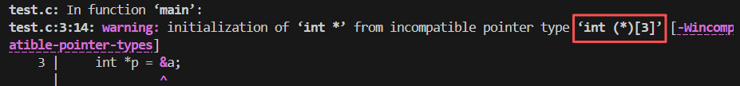

### 1. What is "Array Decay"?

In C, there is a fundamental rule: **"Arrays are not pointers, but they often act like them."**

~~**Array Decay** refers to the automatic (implicit) conversion that occurs when you use an array's name in an expression. The compiler "decays" (downgrades) the array type into a pointer to its first element.~~

- **The Concept:** The array loses its "identity" as a block of memory with a specific size and becomes a simple address.

- **The Formula:**  
    
    `Array Name→&(Array[0])`

~~The array name itself becomes **a const pointer**, which means it is not mutable. The compiler simply treats it as an address of the first element of the array. (The array name is not an L-value.)~~

I've found some confusing and self-contradictory descriptions in the text I added delete lines to. I'll update it based on my new understanding (2026-01-08):

>**ISO C11 (6.3.2.1p3)** "...an expression that has type 'array of type' is converted to an expression with type 'pointer to type' that points to the initial element of the array object and **is not an lvalue**."

An array name itself (before decay) is a **non-modifiable lvalue** (Unlike a const pointer variable, which resides in memory and holds an address, an array name **is** the identity of the memory block itself.) representing the entire array. (**An lvalue is an expression that designates an object.**).  During compilation, the compiler have decided the location of the array, and there's no place in the memory to store the address `n` itself. This is not different from any other variables, since when `int x`, there's a space for the object designated by x in the memory, but no space for x itself.  (The compiler **resolves** the address of `x` — which is the address of the object designated by the identifier — via stack offsets or symbol table entries). The reason why we can modify the value of `x` , but not the value of n, is that `x` represents the contents in the four bytes (usually), while the array name represents the entire array itself. (This also explains why we can't assign value to the array by `Array_name1 = Array_name2`). The C standard defines an array name as a non-modifiable lvalue to prohibit operations like `n = ...` or `n++`, thereby preventing any attempt to rebind the base address of the array (i.e., making the array name refer to a different memory location).

In brief, 

To prove the things mentioned above, we can use `&Array_name` to get the address of the whole array (only lvalue an be the operand of `&` ), and test the properties (it's the address of the array, not the first element).

```c
#include <stdio.h>
int main() {
	int a[3];
	printf("Size of *(&a):    %zu\n", sizeof(*(&a)));
	printf("Size of *(&a[0]): %zu\n", sizeof(*(&a[0])));
	// Through *(&a), we get the whole array(which is equal to the array name).
	// Since sizeof doesn't cause decay(see in subtitle 4),we can reach the goals.
	return 0;
}
```


Another plan:

```c
int main() {
	int a[3];
	int *p = &a; // Write wrong type on purpose, and suppose the compiler to give the true types by warning.
	return 0;
}
```



In most expressions (except some special circumstances in subtitle 4), the array name decays into an rvalue representing the address of the first element. This decayed result is a temporary numerical value that exists only during calculation and has no persistent identity in memory.

We can prove the decayed array name is a rvalue by setting the decayed array name as the operand of `&`:

```c
#include<stdio.h>

int main(){
	int a[5];
	int b[5];
	void *ptr = &(1 ? a : b); // a & b decay into rvalue in the expression
	printf("%p",ptr);
	return 0;
}
```


We can prove the property of the decayed array name by testing the stride of a pointer `int *p = Array_name` (suppose it is an int array).(Omit)


---

### 2. The General Rule

According to the C Standard, whenever an array name appears in an **expression**([[Expressions 表达式#Expressions| Expressions]]), it is automatically converted to a pointer to the first element of that array.

**Example:**

```c
int nums[5] = {10, 20, 30, 40, 50};
int *ptr = nums;
```

Here, `nums` is an array of 5 integers. However, when we assign it to `ptr`, `nums` **decays** into `&nums[0]`.

- The type changes from `int[5]` to `int *`.
    

This allows us to do pointer arithmetic easily:

```c
int x = *(nums + 1); // Exact same as nums[1], which is 20
```

---

### 3. The Major Use Case: Function Arguments

The most common place you see decay is when passing arrays to functions. **In C, you can never pass an entire array by value.** You are always passing a pointer.

Even if you declare the function parameter as an array, the compiler secretly treats it as a pointer.

**This Code:**

```c
void printArray(int arr[]) { ... }
```

**Is interpreted by the compiler as:**

```c
void printArray(int *arr) { ... }
```

This explains why modifying an array inside a function changes the original array in main. You are working with **the address of the original data**, not a copy.

This also explains why the first dimension of the array can be omitted when it is a parameter: the compiler treats it as a pointer pointing to the first element, with no regard to the length of the first dimension.

---

### 4. The Three Exceptions (When Decay Does NOT Happen)

This is the most critical part for advanced understanding. The array name does **not** decay into a pointer in these specific scenarios: (C11)

#### A. The sizeof Operator

If arrays always decayed, sizeof would be useless.

```c
int arr[10];
// If it decayed, this would return 8 (size of a pointer).
// But it does NOT decay here. It returns 40 (10 * 4 bytes).
size_t size = sizeof(arr);
```

#### B. The Address-of Operator (&)

Using & on an array name returns a **pointer to the whole array**, not a pointer to the first element.

- arr (decayed)  --> Type: `int *` (Pointer to an Integer)
    
- &arr (no decay) --> Type: `int (*)[10]` (Pointer to an Array of 10 Integers)
    

While the numerical value of the address is the same, the **type** and **stride** are different.

- arr + 1 jumps **4 bytes** (next integer).
    
- &arr + 1 jumps **40 bytes** (skips the whole array).
    

#### C. String Literal Initialization

When initializing a character array:

```c
char str[] = "Hello";
```

- A string literal always decays into a pointer pointing to the first character (in a read-only part of the memory(text segment)) , but in this case, it doesn't pass the address, but the actual value of all the characters (including `\0`).
- [[Literals 字面量 | About Literals]] [[Memory Allocation 内存分配 | About Memory Allocation]]

- The code above is equal to `char str[] = {'H','e','l','l','o','\0'}`

(D. As the operand of `_Alignof` ?)

Q: Since A string literal decays into a pointer and passes an address, why `printf("Hello")` prints "Hello" in the terminal instead of an address?
	A: This relates to how the function `printf` is coded. In brief, `printf` is designed to **traverse** that address and print the characters it finds there.
	Actually `printf` is defined as: `int printf(const char *format, ...);`
	
	The first argument is always treated as a text string to be read.
	
	1. "Hello" passes the address of 'H'.
	    
	2. printf receives that address as the variable format.
	    
	3. printf begins reading the characters at that address to see if there are any % signs.
	    
	4. It finds 'H', prints it. Finds 'e', prints it...
	    
	5. It finds no % signs, so it just finishes printing the literal text.

	you can use printf("%p", "Hello"); to print the address of 'H' in "Hello".

---

### 5. The "Sizeof" Trap (A Common Bug)

Because of decay, sizeof behaves differently inside a function compared to outside.

```c
#include <stdio.h>

void calculateSize(int arr[]) {
    // TRAP: 'arr' has decayed into a pointer (int *) here!
    // On a 64-bit system, this prints 8.
    printf("Size inside function: %zu\n", sizeof(arr));
}

int main() {
    int myNums[100];
    
    // Here, 'myNums' is still an array. 
    // Prints 400 (100 * 4 bytes).
    printf("Size in main: %zu\n", sizeof(myNums));
    
    calculateSize(myNums);
    return 0;
}
```

**Why?**  
When you passed myNums to the function, it **decayed**. The function calculateSize received a simple pointer. It has lost the information that the array originally had 100 elements.

### 6. Decay of multi-dimensional arrays
We can just start from a 2D array.
```c
int a[10][10];
```
Actually, the computer doesn't regard it as a 2D array, but an array of 10 ints, whose elements are all arrays of 10 ints. For example, `a[0]` is an array of 10 ints.

Then we can simply apply the principle of array-to-pointer decay to this case: the array name decays into the address of the first element, which is an array. (In most cases, we regard it as the first row of the 2D array.)

So the type of the decayed array name should be `int (*)[10]`.

Then we can simply generalize this reasoning process to multi-dimensional arrays: An array of `n` dimensions is actually an array whose elements are all arrays of `n-1` dimensions. The name of an array of `n` dimensions will decay into a pointer pointing to the first array of `n-1` dimensions.