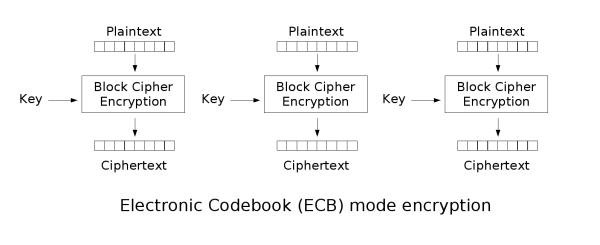
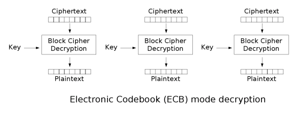
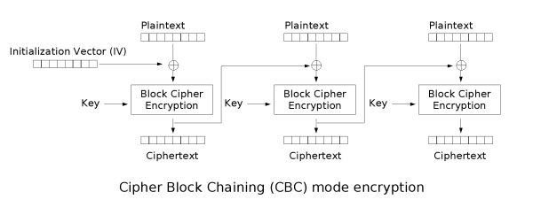
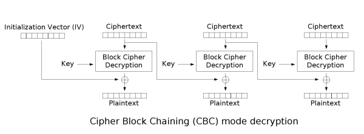
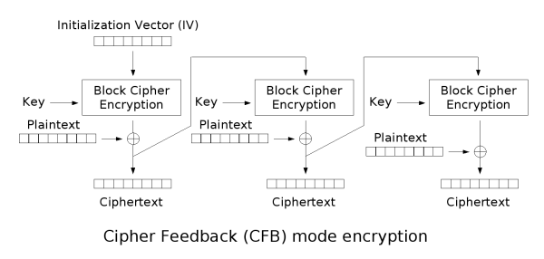
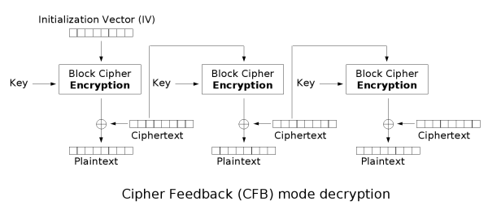

# 04_分组密码与流密码

## 1. 分组密码工作模式 (Block Cipher Modes of Operation)

分组密码每次只能处理固定长度的数据块。为了加密任意长度的明文，需要将明文进行分组，并按照特定的规则（即“工作模式”）进行处理。

### 1.1 电子密码簿模式 (ECB - Electronic Codebook)

ECB 是最自然、最简单的工作模式。它将长明文拆分成合适大小的独立分组，然后对每个分组分别使用相同的密钥独立进行加密或解密。

- **处理过程**：

    - 明文拆分：$P = [P_1, P_2, \dots, P_L]$

    - 密文输出：$C = [C_1, C_2, \dots, C_L]$

- **数学表达式**：

    - 加密：$C_j = E_K(P_j)$

    - 解密：$P_j = D_K(C_j)$

- **优缺点分析**：

    - **优点**：各分组的加密和解密相互独立，**均可进行并行处理**，效率高；没有误差传播（一个密文块损坏只影响一个明文块）。

    - **弱点**：**相同内容的明文段加密后必定得到相同的密文块**。这会导致统计特征的泄漏，无法掩盖数据模式，不适合加密长段高度结构化的数据。

- 以下图片全部来自维基百科 https://zh.wikipedia.org/wiki/%E5%88%86%E7%BB%84%E5%AF%86%E7%A0%81%E5%B7%A5%E4%BD%9C%E6%A8%A1%E5%BC%8F

### 1.2 密文块链接模式 (CBC - Cipher Block Chaining)

为了克服 ECB 模式容易泄露明文模式的缺点，CBC 模式引入了反馈机制，使当前的密文块不仅依赖于当前的明文块，还依赖于前一个密文块。

- **处理过程**：

	需要一个与分组长度相同的初始化向量（IV）。加密时，先将当前明文块与前一个密文块进行异或（XOR）操作，然后再进行加密。

- **数学表达式**：

    - 加密：$C_j = E_K(P_j \oplus C_{j-1})$ （其中 $C_0 = IV$）

    - 解密：$P_j = D_K(C_j) \oplus C_{j-1}$

- **优缺点分析**：

    - **特点**：当前块的密文与前面所有的明文块都有关，隐藏了明文的数据模式。

    - **加密**：当前加密依赖于上一块的密文，因此**只能串行处理**。

    - **解密**：当前块的解密只需要当前的密文块和上一块的密文块，因此**可以并行处理**。

### 1.3 密文反馈模式 (CFB - Cipher Feedback)

CFB 模式将分组密码转化为流密码（Stream Cipher）的工作方式。它不需要等凑齐一个完整的数据块即可进行加密，非常适合处理字符流数据（如 8-bit 数据）。

- **处理过程**：

	设明文被拆分为 8-bit 的小段：$P = [P_1, P_2, \dots]$。使用一个 64 位的移位寄存器（初始值为 $X_1$），每次加密寄存器中的值，取结果的高 8 位与明文异或得到密文。然后将密文追加到寄存器末尾，寄存器整体左移 8 位更新状态。

- **数学表达式**：

    - 初始状态：选择一个 64-bit 的种子数据 $X_1$

    - 加密与解密计算（本质都是产生密钥流与数据异或）：

        $$
C_j = P_j \oplus L_8(E_K(X_j))
        $$

        $$
P_j = C_j \oplus L_8(E_K(X_j))
        $$

    - 寄存器更新机制：

        $$
X_{j+1} = R_{56}(X_j) \parallel C_j
        $$

        _(注：$L_8$ 表示取左侧 8 位，$R_{56}$ 表示取右侧 56 位，$\parallel$ 表示拼接)_

- **错误恢复特性**：

    CFB 模式具有**从密文传输错误中自恢复**的能力。

    - 假设密文 $C_1$ 在传输中发生 1 个字节的错误变为 $C_1'$。

    - 当前解密的 $P_1$ 必定出错。

    - 错误密文 $C_1'$ 会进入 64 位（8 字节）的移位寄存器 $X_2$ 中，因此在接下来解密 $P_2 \dots P_9$ 时，由于寄存器内含有错误数据，解密结果均错误。

    - 当经过 8 轮更新后，错误字节被彻底移出寄存器（$X_{10}$ 恢复正确），从 $P_{10}$ 开始的解密将**全部恢复正确**。

---

## 2. 流密码算法 RC4 (Stream Cipher RC4)

RC4 是一种经典的对称流密码算法，基于非线性伪随机数生成器。其核心逻辑是利用密钥生成一个伪随机的字节流（密钥流），然后将其与明文逐字节进行异或（XOR）完成加解密。

### 2.1 核心数据结构与状态

- **内部状态（State）**：包含一个 256 字节的排列数组 `state[256]`，内部元素始终为 $0 \sim 255$ 的全排列。

- **状态指针**：两个 8 位无符号整数（相当于取模 256 的计数器） `x` 和 `y`。

### 2.2 算法核心流程

#### 步骤一：密钥调度算法 (KSA - Key-Scheduling Algorithm)

`prepare_key` 函数。该过程利用用户提供的种子密钥（`seed_key`）来打乱初始化状态。

1. **线性初始化**：将 `state` 数组初始化为 $0 \sim 255$ 的顺序排列。

2. **置换打乱**：利用密钥循环扰乱数组。

    - 计算新的索引 `index2 = (key[index1] + state[counter] + index2) % 256`。

    - 交换 `state[counter]` 和 `state[index2]` 的值。

    - 此过程仅交换状态值，不改变 $0 \sim 255$ 全排列的性质。

#### 步骤二：伪随机生成算法 (PRGA - Pseudo-Random Generation Algorithm)

对应源码中的 `rc4` 函数。这是加解密的实际执行阶段。

1. **指针更新**：`x = (x + 1) % 256`，`y = (state[x] + y) % 256`。

2. **状态交换**：交换 `state[x]` 与 `state[y]` 的值（确保每一轮状态都在动态变化）。

3. **提取密钥字节**：计算索引 `xorIndex = (state[x] + state[y]) % 256`，取出当前的密钥流字节 `state[xorIndex]`。

4. **异或输出**：将提取出的密钥字节与当前的明文（或密文）字节进行 `^=`（异或）操作，即 `buffer_ptr[counter] ^= state[xorIndex]`。

### 2.3 RC4 的重要特性

- **对称性与对合性**：RC4 的加密和解密使用的是**完全相同的函数**。因为 $A \oplus B \oplus B = A$，密文再次异或相同的密钥流即可还原为明文。

- **状态延续性**：在连续处理一段较长数据时，`x` 和 `y` 的状态必须被保存下来（源码中通过更新 `key->x = x; key->y = y;` 实现），以确保密钥流的连续性。每次全新加解密前，必须重新调用 `prepare_key` 重置并初始化状态。
