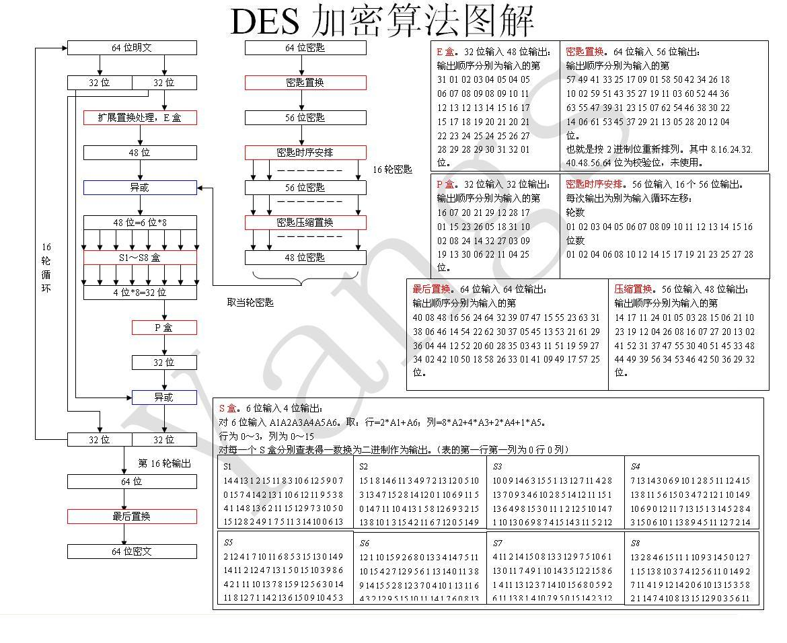
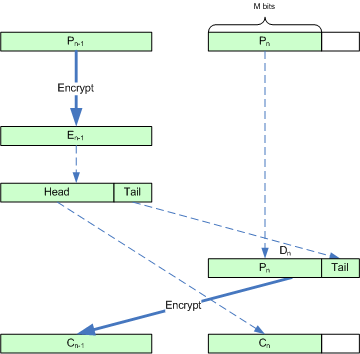

# 05_DES

[优质讲解【DES加密算法｜密码学｜信息安全】](https://www.bilibili.com/video/BV1KQ4y127AT/?share_source=copy_web&vd_source=0ef01121605990d44b8d3543570884c7)

## 1. 算法背景与基本属性

- **历史沿革**：

    - 1973年，NBS（美国国家标准局）公开征集国家标准加密算法。

    - 1974年，IBM 提交了基于 LUCIFER 的算法。

    - 经 NSA（美国国家安全局）评估与修改后，1975年 NBS 公布该算法，定名为 DES（Data Encryption Standard）。

- **基本属性**：

    - **体制**：对称加密体制（加密与解密密钥相同），核心基于 Feistel 网络结构。

    - **明文分组**：64位（8字节）。

    - **密钥长度**：初始输入 64位（8字节）。其中第 8、16、24、32、40、48、56、64 位为奇偶校验位，**实际有效密钥长度为 56位**。

- **安全性争议与缺陷**：

    - **密钥过短**：56位的有效密钥空间仅为 $2^{56}$，在现代算力下极易被暴力破解。

    - **差分分析**：理论上可通过差分分析方法攻击。

    - **S盒未公开**：S盒的设计原理最初未公开，曾被怀疑留有后门（后证明其设计能有效抵抗差分分析）。

## 2. DES 算法核心处理流程

DES 算法整体分为三个大阶段：初始置换、16轮迭代加密、逆初始置换。加密与解密使用相同的算法框架，仅子密钥的使用顺序相反。

[图片来源](https://bbs.kanxue.com/upload/attach/200906/247553_jn7g4b8ddlhehhm.jpg) （图中缺失了“初始置换”步骤）

### 2.1 DES 算法全局执行流程

DES 算法对每个 64 位明文块的处理遵循严格的四阶流水线，其完整数据流向与状态转移步骤如下：

**阶段一：初始置换 (Initial Permutation, IP)**

1. **输入接收**：接收 64 位的明文块 $M$。

2. **物理重排**：将 $M$ 输入 IP 置换矩阵，按固定规则对 64 个数据位进行重新排列。

3. **区块拆分**：将置换后的 64 位数据均分为左右两个 32 位的区块，分别记为 $L_0$（左半区）和 $R_0$（右半区）。

**阶段二：16轮 Feistel 网络迭代 (16-Round Feistel Iteration)**

通过一个循环结构对数据进行 16 次混淆与扩散。对于任意第 $i$ 轮（$1 \le i \le 16$），其状态转移逻辑为：

1. **数据就绪**：接收前一轮生成的 32 位区块 $L_{i-1}$ 与 $R_{i-1}$，并从密钥编排模块获取当前轮的 48 位子密钥 $K_i$。

2. **左半区计算**：不进行任何逻辑运算，直接将上一轮的右半区赋值给本轮的左半区。

    - 公式：$L_i = R_{i-1}$

3. **右半区计算**：将 $R_{i-1}$ 与 $K_i$ 传入核心非线性轮函数 $f$ 进行运算（涵盖扩展置换、S盒替换与P盒置换），输出 32 位结果。随后将该结果与上一轮的左半区 $L_{i-1}$ 进行按位异或操作。

    - 公式：$R_i = L_{i-1} \oplus f(R_{i-1}, K_i)$

**阶段三：预输出交换 (Pre-output Swap)**

1. **数据汇合**：第 16 轮迭代结束后，生成最终的两个 32 位区块 $L_{16}$ 和 $R_{16}$。

2. **位置互换**：将这两个区块进行位置对调，合并为一个 64 位的预输出数据块，记为 $R_{16} \parallel L_{16}$（$\parallel$ 表示位串接）。

    - _注：此交换操作是为了确保加密与解密算法在结构上保持绝对对称，使得解密时直接逆序输入子密钥即可复用加密电路或代码。_

**阶段四：逆初始置换 (Inverse Initial Permutation, $IP^{-1}$)**

1. **最终重排**：将 64 位预输出块 $R_{16} \parallel L_{16}$ 输入 $IP^{-1}$ 置换矩阵（即 IP 矩阵的严格逆矩阵）。

2. **密文输出**：完成物理位置重排后，输出最终的 64 位密文块 $C$。整个单块加密过程终止。

### 2.2 初始置换 (IP) 与逆置换 ($IP^{-1}$)

- **初始置换 (IP)**：明文 64位在进入迭代前，按固定的 IP 表打乱位顺序。这是纯物理位置的映射，不涉及逻辑运算。经过 IP 置换后，数据被拆分为左右两半：$L_0$（32位）和 $R_0$（32位）。

    - _注：置换表中例如 `ip[0]=58`，表示原始数据的第58位（Base 1）转变为目标数据的第1位。_

- **逆初始置换 ($IP^{-1}$ 或 FP)**：经过 16轮迭代后，输出的 64位数据按 FP 表进行 IP 的严格逆运算，生成最终密文。

### 2.3 密钥编排 (Key Schedule)

16轮迭代需要 16个独立的 48位子密钥（$K_1$ 到 $K_{16}$），均由原始 64位密钥生成：

1. **PC-1 压缩置换**：忽略 8个奇偶校验位，将剩余 56位按 PC-1 表重新排列，分为左右两半 $C_0$ 和 $D_0$（各28位）。

2. **循环左移**：每一轮中，$C_{i-1}$ 和 $D_{i-1}$ 分别循环左移。

    - _移位步长_：第 1、2、9、16 轮左移 **1位**；其余各轮左移 **2位**。

3. **PC-2 压缩置换**：拼接移位后的 56位 $(C_i, D_i)$，输入 PC-2 表剔除 8位并打乱，输出当前轮的 48位子密钥 $K_i$。

### 2.4 轮函数 (Round Function) 的内部细节

DES 的 16轮迭代采用 Feistel 结构。数据流向公式为：

- **加密**：$L_i = R_{i-1}$， $R_i = L_{i-1} \oplus f(R_{i-1}, K_i)$

- **解密**：$R_{i-1} = L_i$，$L_{i-1} = R_i \oplus f(L_i, K_i)$ （子密钥逆序 $K_{16} \to K_1$）

**核心非线性函数 $f(R_{i-1}, K_i)$ 包含四个严格步骤：**

1. **扩展置换 (E-box)**：将 32位的 $R_{i-1}$ 扩展为 48位。数据分为 8个 4位块，每块借用相邻块的首尾位扩展为 6位。产生**雪崩效应**。

2. **子密钥异或**：扩展后的 48位数据与本轮 48位子密钥 $K_i$ 进行按位异或（$\oplus$）。

3. **S盒替换 (S-box)**：算法的非线性核心。

    - 异或后的 48位分 8组（每组 6位），分别进入 8个不同的 S盒（$S_1 \to S_8$）。

    - 每个 S盒将 6位映射为 4位（共输出 32位）。

    - **映射规则示例**：若 $S_1$ 输入为 `101101`：

        - 行号：取首尾位 `11` $\to$ 十进制 3（第3行）。

        - 列号：取中间位 `0110` $\to$ 十进制 6（第6列）。

        - 查表得到 0-15 之间的数值，转为 4位二进制输出。

4. **P盒置换 (P-box)**：将 8个 S盒输出的 32位数据进行最后一次线性位打乱，输出最终的 $f$ 函数结果。

## 3. DES 工作模式与 3DES

由于单次只能处理 64位数据，处理长明文需采用分组模式：

### 3.1 分组工作模式 (Block Cipher Modes)

- **ECB (电子密码本模式)**：各明文块独立加密。相同明文生成相同密文，无法隐藏数据模式，安全性差。

- **CBC (密码分组链接模式)**：引入 8字节初始向量（IV）。$C[i] = E(P[i] \oplus C[i-1], Key)$。当前密文依赖于前序所有数据，安全性高，最常用。

- **CFB (密文反馈模式)**：转换为流密码体制。$C[i] = P[i] \oplus E(IV_{current}, Key)$，随后更新 IV。

- **密文窃取 (Ciphertext Stealing)**：用于 ECB 或 CBC 中，处理末尾不足 8字节的数据块而无需标准填充（Padding）的技术。

 密文窃取模式示意图，来自 [wiki](https://en.wikipedia.org/wiki/Ciphertext_stealing)

### 3.2 三重 DES (3DES)

为抵抗暴力破解，使用 2或 3个不同密钥进行三次加解密。

- **加密公式**：$C = E( D( E(P, k_1), k_2), k_3)$

- **解密公式**：$P = D( E( D(C, k_3), k_2), k_1)$

- **为何不用双重 DES (2DES)？**：由于存在 **中间相遇攻击 (Meet-in-the-middle attack)**，通过分别正向加密明文和反向解密密文寻找碰撞，使得 2DES 的安全性几乎等同于单次 DES ($2^{57}$)，并不具备双倍安全性。
