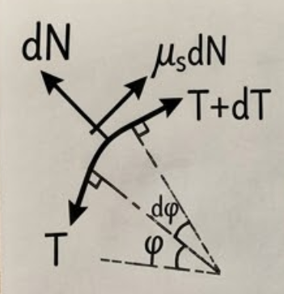
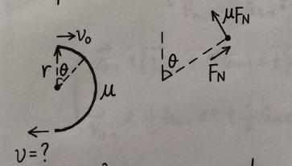

# 03_Newtonian Mechanics

## 1. Overview & Applicability

This section introduces the core focus of Newtonian mechanics and its physical limitations.

- **Core Relation:** Newtonian mechanics primarily studies the relationship between force and acceleration.

- **Applicability (Limits of Newtonian Physics):**

    - **Speed:** It only applies at low speeds ($v \ll c$); at speeds approaching the speed of light, we must use **Relativity**.

    - **Scale:** It only applies at the macroscopic scale; at the atomic or subatomic level, we must use **Quantum Mechanics**.

---

## 2. Newton's Three Laws of Motion

- **Newton's First Law (Law of Inertia):**

    - **Definition:** No force means no velocity change (which means no acceleration).

    - **Types of Force:**

        - _Contact force:_ Arises from physical contact.

        - _Field force:_ Acts over a distance (e.g., gravity, electromagnetism).

- **Newton's Second Law:**

    - **Equation:**

        $$
\vec{F} = m\vec{a}
        $$

    - where $m = \text{mass}$.

- **Newton's Third Law:**

    - **Equation:**

        $$
\vec{F}_{12} = -\vec{F}_{21}
        $$

    - Action and reaction forces are equal in magnitude and opposite in direction.

---

## 3. Reference Frames & Relative Motion

- **Inertial Reference Frame:**

    - **Definition:** A frame of reference where Newton's Laws strictly hold true.

- **Non-Inertial Frame:**

    - **Example:** An accelerating car (with acceleration $\vec{a}$).

- **Relative Motion & Observers:**

    - Projectile motion viewed from a frame moving horizontally with the same initial velocity $\vec{v}_0$ simply looks like free fall (straight down).

    - **Different Inertial Observers:**

        - Will _agree_ on acceleration ($\vec{a}$).

        - Will _disagree_ on position ($\vec{x}$) and velocity ($\vec{v}$).

---

## 4. Galilean Transformation

This part mathematically links the observations between a stationary frame and a frame moving at a constant velocity.

- Assume a frame is moving at a constant velocity $\vec{v}_0$ relative to a stationary frame. The displacement between their origins is $\vec{v}_0t$.

- **Position Transformation:**

    $$
\vec{r}' = \vec{r} - \vec{v}_0t
    $$

- **Velocity Transformation:** Taking the time derivative of the position equation:

    $$
\Rightarrow \frac{d\vec{r}'}{dt} = \frac{d\vec{r}}{dt} - \vec{v}_0
    $$

    $$
\Rightarrow \vec{v}' = \vec{v} - \vec{v}_0
    $$

- **Acceleration Transformation:** Taking the time derivative of the velocity equation (since $\vec{v}_0$ is constant, its derivative is zero):

    $$
\Rightarrow \frac{d\vec{v}'}{dt} = \frac{d\vec{v}}{dt}
    $$

    $$
\Rightarrow \vec{a}' = \vec{a}
    $$

    _(This proves that acceleration is the same in all inertial reference frames)._

---

## 5. Analytical Tools

- **Free-Body Diagram (受力分析图)**

- **Fictitious Force:**

    - A mathematical "correction" force used when analyzing motion inside a non-inertial (accelerating) reference frame so that Newton's Laws can still appear to be applied.

    - **Equation:**

        $$
F_{\text{fictitious}} = -m\vec{a}
        $$

        (pointing in the opposite direction of the frame's acceleration).

---

## 6. Drag (Fluid Resistance)

This section outlines the two primary models for fluid resistance (drag) depending on the object's speed.

- **General Notes:**

    - $\vec{v}$ represents the _relative speed_ between the object and the fluid.

    - $\rho$ is the fluid density.

    - $A$ is the cross-sectional area of the object perpendicular to the motion.

- **Low-Speed Drag Model (Linear):**

    - Valid for low speeds or highly viscous fluids.

    - **Equation:**

        $$
\vec{R} = -b\vec{v}
        $$

    - _(where $b$ is a proportionality constant dependent on the object's shape and fluid properties)._

- **High-Speed Drag Model (Quadratic):**

    - Valid for higher speeds (where air/fluid turbulence becomes a factor).

    - **Equation:**

        $$
\vec{R} = -\frac{1}{2} C \rho A v^2 \hat{v}
        $$

    - _(where $C$ is the drag coefficient, and $\hat{v} = \frac{\vec{v}}{|\vec{v}|}$ is the unit vector representing direction)._

### 6.1 "Free" Fall with Low-Speed Drag

This section analyzes an object falling under gravity while experiencing linear drag.

- **Setup & Differential Equation:**

    - FBD Components: Upward drag $\vec{R} = -b\vec{v}$, downward gravity $m\vec{g}$.

    - Applying Newton's 2nd Law:

        $$
mg - bv = ma \Rightarrow mg - bv = m\frac{dv}{dt}
        $$

- **Definitions:**

    - **Terminal Speed ($v_t$):** The maximum constant speed reached when drag balances gravity (acceleration becomes zero).

        $$
v_t = \frac{mg}{b}
        $$

    - **Characteristic Time ($\tau$):** The time constant of the system.

        $$
\tau = \frac{m}{b} = \frac{v_t}{g}
        $$

- **Kinematic Solutions:**

    - **Velocity:** Solving the differential equation yields:

        $$
v(t) = \frac{mg}{b}\left(1 - e^{-\frac{b}{m}t}\right) \Rightarrow v(t) = v_t(1 - e^{-t/\tau})
        $$

    - **At $t = \tau$:** The speed reaches $v = v_t(1 - e^{-1}) \approx 0.63 v_t$.

    - **Acceleration:** Taking the time derivative of velocity:

        $$
a(t) = \frac{dv}{dt} = \frac{mg}{b} \cdot \frac{b}{m} e^{-\frac{b}{m}t} = g e^{-\frac{b}{m}t}
        $$

### 6.2 "Free" Fall with High-Speed Drag

This section evaluates the non-linear case where drag is proportional to velocity squared.

- **Terminal Speed Evaluation:**

    - At terminal velocity, acceleration is zero: $mg = \frac{1}{2} C \rho A v_t^2$

    - $$\Rightarrow v_t = \sqrt{\frac{2mg}{C \rho A}}$$

- **True Time-Dependent Evaluation:**

    - Differential equation: $mg - \frac{1}{2} C \rho A v^2 = m\frac{dv}{dt}$

    - Solving this non-linear ODE yields a hyperbolic tangent function:

        $$
v(t) = \sqrt{\frac{2mg}{C \rho A}} \tanh\left(\sqrt{\frac{g C \rho A}{2m}} t\right)
        $$

- **Question: How does terminal speed ($v_t$) scale with the size of an object?**

    - Mass is proportional to volume (radius cubed): $m \propto r^3$

    - Cross-sectional area is proportional to radius squared: $A \propto r^2$

    - Substituting these into the terminal speed formula:

        $$
v_t \propto \sqrt{\frac{r^3}{r^2}} \Rightarrow v_t \propto \sqrt{r}
        $$

    - _Conclusion:_ Larger objects have a higher terminal velocity.

---

## 7. Frictional Force

This section covers the mechanics of dry friction between solid surfaces.

- **Graph Analysis ($|\vec{f}|$ vs $|\vec{F}|$):**

    - The friction force increases linearly to match the applied force until it reaches a breaking point ($f_{s,\max}$).

    - Once motion begins, the friction force drops slightly and remains constant at the kinetic friction level ($f_k$).

- **Equations & Coefficients:**

    - **Static Friction ($f_s$):** Prevents motion. Maximum value is $f_{s,\max} = \mu_s F_N$.

    - **Kinetic Friction ($f_k$):** Opposes ongoing motion. $f_k = \mu_k F_N$.

    - $\mu_s$: Coefficient of static friction.

    - $\mu_k$: Coefficient of kinetic friction (typically $\mu_k < \mu_s$).

### 7.1 Example: Static Friction

- **Problem Setup:** A rope is wrapped around a pipe for one full circle ($2\pi$), hangs down holding an object of mass $m$, and is pulled horizontally.

- **Contact Angle:** The total angle the rope wraps around the pipe is $\theta = 2\pi + \frac{\pi}{2} = \frac{5\pi}{2}$ radians. _(Note: Changed "contact area" to the physically accurate term "contact angle")_.

- **Question:** What is the range of horizontal force $F$ required to keep the system in equilibrium (stationary)?

- **Lower Limit Derivation (When the mass is about to fall):**

    - **Setup:** Consider an infinitesimally small segment of the rope over an angle $d\varphi$. The tension on one side is $T$, and on the other is $T+dT$. The normal force is $dN$, and the friction opposing the impending slip is $\mu_s dN$.

		

    - **Radial Force Balance:**

        $$
dN = T\sin\frac{d\varphi}{2} + (T+dT)\sin\frac{d\varphi}{2}
        $$

        _Applying the small-angle approximation ($\sin \theta \approx \theta$):_

        $$
\Rightarrow dN = T d\varphi
        $$

    - **Tangential Force Balance:**

        $$
(T+dT)\cos\frac{d\varphi}{2} + \mu_s dN = T\cos\frac{d\varphi}{2}
        $$

        _Applying the small-angle approximation ($\cos \theta \approx 1$):_

        $$
\Rightarrow dT + \mu_s dN = 0
        $$

    - **Solving the Differential Equation:**

        Substituting $dN$ into the tangential equation gives:

        $$
\frac{dT}{T} = -\mu_s d\varphi
        $$

        Integrating both sides from the weight $mg$ to the applied force $F$, and from angle $0$ to $\frac{5\pi}{2}$:

        $$
\ln T \Big|_{mg}^F = -\mu_s \varphi \Big|_0^{5\pi/2}
        $$

        $$
\Rightarrow F = mg e^{-\frac{5\pi}{2}\mu_s}
        $$

- **Upper Limit Derivation (When the mass is about to be pulled up):**

    - The friction vector reverses direction to oppose the upward pull.

    - This changes the sign in the integration, resulting in $F = mg e^{+\frac{5\pi}{2}\mu_s}$ (where $F > mg$).

- **Conclusion:**

    $$
mg e^{-\frac{5\pi}{2}\mu_s} \le F \le mg e^{\frac{5\pi}{2}\mu_s}
    $$

### 7.2 Example: Kinetic Friction

This section calculates the final velocity of a particle traversing a semi-circular track with friction.

- **Setup:** A particle enters a semi-circular track of radius $r$ with initial velocity $v_0$. The coefficient of kinetic friction is $\mu$. What is the final velocity $v_f$?

	

- **Equations of Motion:**

    - The normal force provides the centripetal acceleration: $F_N = m\frac{v^2}{r}$.

    - Kinetic friction opposes motion: $-\mu F_N = m\frac{dv}{dt}$.

- **Integration:**

    Substituting $F_N$ into the friction equation:

    $$
\Rightarrow -\mu \frac{v^2}{r} = \frac{dv}{dt}
    $$

    Rearranging to separate variables (and utilizing the trick that $v dt$ equals the infinitesimal distance $ds$):

    $$
\Rightarrow -\frac{\mu}{r} (v dt) = \frac{dv}{v}
    $$

    Integrating both sides. The integral of $v dt$ is the total arc length of the semi-circle ($\pi r$):

    $$
-\frac{\mu}{r} \int_{t_0}^{t_f} v dt = \int_{v_0}^{v_f} \frac{dv}{v}
    $$

    $$
\Rightarrow -\frac{\mu}{r} \cdot (\pi r) = \ln v_f - \ln v_0
    $$

    $$
\Rightarrow v_f = v_0 e^{-\pi\mu}
    $$

---

## **8. Numerical Integration Methods**

Solving a general problem: Given $\vec{F}(\vec{r}, \vec{v}, t)$, solve for $\vec{r}(t)$.

### **8.1 Euler Integration**

An iterative method to approximate the state of a system at discrete time steps $t_n = t_{n-1} + \Delta t$.

- **Step 0 (Initial State):** * Time: $t_0$

    - Position: $\vec{r}_0$

    - Velocity: $\vec{v}_0$

    - Acceleration: $\vec{a}_0 = \vec{F}(\vec{r}_0, \vec{v}_0, t_0)/m$

- **Step 1:**

    - $t_1 = t_0 + \Delta t$

    - $\vec{r}_1 = \vec{r}_0 + \vec{v}_0\Delta t$

    - $\vec{v}_1 = \vec{v}_0 + \vec{a}_0\Delta t$

    - $\vec{a}_1 = \vec{F}(\vec{r}_1, \vec{v}_1, t_1)/m$

- **Step n:**

    - $t_n = t_{n-1} + \Delta t$

    - $\vec{r}_n = \vec{r}_{n-1} + \vec{v}_{n-1}\Delta t$

    - $\vec{v}_n = \vec{v}_{n-1} + \vec{a}_{n-1}\Delta t$

    - $\vec{a}_n = \vec{F}(\vec{r}_n, \vec{v}_n, t_n)/m$

**Error and Convergence:**

- The position error for Euler integration is on the order of $O(\Delta t^2)$.

- **Convergence Check:** Halve the time step repeatedly ($\Delta t' = \frac{1}{2}\Delta t, \frac{1}{4}\Delta t, \dots$) to verify numerical stability.

### **8.2 Verlet Integration**

A more accurate integration scheme that does not explicitly require velocity for position updates after the first step.

$$
\vec{r}_{n+1} = 2\vec{r}_n - \vec{r}_{n-1} + \vec{a}_n \Delta t^2
$$

**Proof (using Taylor expansion):**

Let $\vec{b} \equiv \frac{d\vec{a}}{dt}$. Expanding forward and backward in time:

$$
\vec{r}_{n+1} - \vec{r}_n = \vec{v}_n \Delta t + \frac{1}{2}\vec{a}_n \Delta t^2 + \frac{1}{6}\vec{b}_n \Delta t^3 + O(\Delta t^4)
$$

$$
\vec{r}_{n-1} - \vec{r}_n = -\vec{v}_n \Delta t + \frac{1}{2}\vec{a}_n \Delta t^2 - \frac{1}{6}\vec{b}_n \Delta t^3 + O(\Delta t^4)
$$

Adding these two equations cancels out the $\vec{v}_n$ and $\vec{b}_n$ terms, yielding the Verlet formula.

**Key Notes on Verlet Integration:**

- **Error:** The position error is significantly reduced to $O(\Delta t^4)$.

- **Initialization:** $\vec{r}_1$ is required to start the iteration, which can be approximated as:

    $$
\vec{r}_1 \approx \vec{r}_0 + \vec{v}_0 \Delta t + \frac{1}{2}\vec{a}_0 \Delta t^2 \quad (O(\Delta t^3) \text{ error})
    $$

- Velocity $\vec{v}_n$ is not required for calculating steps $n > 1$.

### **8.3 Velocity Verlet Integration**

Assumes the force $\vec{F}(\vec{r}, t)$ has no dependence on velocity $\vec{v}$. This method allows for simultaneous updating of both position and velocity.

1. $\vec{r}_{n+1} = \vec{r}_n + \vec{v}_n \Delta t + \frac{1}{2}\vec{a}_n \Delta t^2$

2. $\vec{a}_{n+1} = \vec{F}(\vec{r}_{n+1}, t_{n+1})/m$

3. $\vec{v}_{n+1} = \vec{v}_n + \frac{1}{2}(\vec{a}_n + \vec{a}_{n+1})\Delta t$

- **Error:** $O(\Delta t^4)$.

- **Advantage:** It only depends on the immediately preceding step.

**Compact Operator Form of Velocity Verlet:**

Define operators for updating velocity ($U_F$) and position ($U_v$):

$$
U_F(\Delta t) \begin{pmatrix} \vec{r} \\ \vec{v} \end{pmatrix} = \begin{pmatrix} \vec{r} \\ \vec{v} + \vec{a}\Delta t \end{pmatrix}
$$

$$
U_v(\Delta t) \begin{pmatrix} \vec{r} \\ \vec{v} \end{pmatrix} = \begin{pmatrix} \vec{r} + \vec{v}\Delta t \\ \vec{v} \end{pmatrix}
$$

The full step can be written as a symmetric application of these operators:

$$
U_F\left(\frac{1}{2}\Delta t\right) U_v(\Delta t) U_F\left(\frac{1}{2}\Delta t\right) \begin{pmatrix} \vec{r}_n \\ \vec{v}_n \end{pmatrix}
$$

Applying sequentially from right to left:

1. $$U_F\left(\frac{1}{2}\Delta t\right) \rightarrow \text{updates } \vec{v}_n \text{ to } \vec{v}_n' = \vec{v}_n + \frac{1}{2}\vec{a}_n\Delta t$$

2. $$U_v(\Delta t) \rightarrow \text{updates } \vec{r}_n \text{ to } \vec{r}_{n+1} = \vec{r}_n + \left(\vec{v}_n + \frac{1}{2}\vec{a}_n\Delta t\right)\Delta t$$

    _With $\vec{r}_{n+1}$ calculated, the new acceleration $\vec{a}_{n+1}$ can now be evaluated._

3. $$U_F\left(\frac{1}{2}\Delta t\right) \rightarrow \text{updates } \vec{v}_n' \text{ to } \vec{v}_{n+1} = \vec{v}_n + \frac{1}{2}\vec{a}_n\Delta t + \frac{1}{2}\vec{a}_{n+1}\Delta t$$
