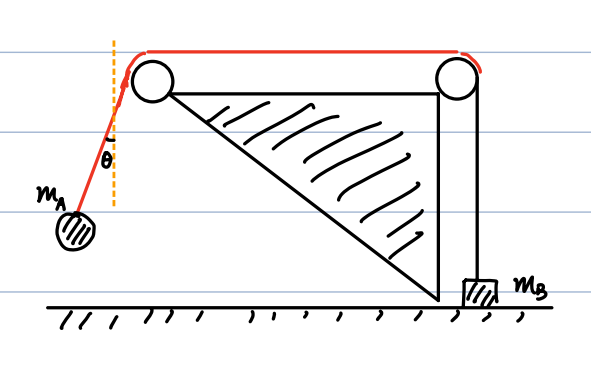

# 05_Energy

## Conservation of Energy

### **1. The Work-Kinetic Energy Theorem**

The fundamental relationship between work and kinetic energy is given by:

$$
K_f - K_i = W
$$

Rewriting this equation:

$$
K_f - K_i - W = 0
$$

We define the negative work done by a conservative force as the change in **potential energy** ($U$):

$$
-W \equiv U_f - U_i
$$

Substituting this back into the theorem yields the **Conservation of Mechanical Energy** ($\text{E}_{\text{mec}}$):

$$
K_f + U_f = K_i + U_i
$$

$$
E_{\text{mec}} \equiv K + U = \text{constant}
$$

### **2. Conservative Forces**

For mechanical energy to be conserved, the force must be **conservative**.

- **Definition:** A force is conservative if the total work done around _any_ closed path (a round trip) is zero.

- **Path Independence:** With a conservative force, the work done depends **ONLY** on the initial and final positions, not on the path taken.

    - If an object moves from point $a$ to point $b$ along two different paths (path-1 and path-2), then $W_{ab, 1} = W_{ab, 2}$.

    - _Proof:_ According to the definition, moving from $a \to b$ along path-1 and returning $b \to a$ along path-2 yields zero net work: $W_{ab, 1} + W_{ba, 2} = 0$. Since work is the integral of force over displacement, reversing the path reverses the sign: $W_{ba, 2} = -W_{ab, 2}$. Therefore, $W_{ab, 1} = W_{ab, 2}$.

---

## **Potential Energy ($\Delta U$)**

### **1. General Computation**

Because $\Delta U$ only depends on the initial and final states, it is consistent with the definition of a conservative force. It is computed as:

$$
\Delta U = U_f - U_i = -W = -\int_{\vec{r}_i}^{\vec{r}_f} \vec{F}(\vec{r}) \cdot d\vec{r}
$$

### **2. Gravitational Potential Energy**

For an object moving vertically near the Earth's surface:

$$
U_f - U_i = \Delta U = -\int_{y_i}^{y_f} (-mg) dy = mg(y_f - y_i)
$$

This gives the general form:

$$
U(y) = mgy + C
$$

**Notes on Gravitational Potential Energy:**

- $C$ is an arbitrary constant that remains fixed during a specific calculation. By convention, it is often set to $C = 0$.

- There is no dependence on horizontal displacement.

- This assumes the Earth is static ($M_{\text{earth}} \gg m_{\text{object}}$) and the object is close to the surface (constant $g$).

**Example (Free Fall):**

An object is dropped from height $H$ at rest.

- **Initial State ($t=0$):** $y_i = H, v_i = 0 \Rightarrow K_i = 0, U_i = mgH$. Initial energy $E_{\text{mec}}^{(i)} = mgH$.

- **Final State (just before impact):** $y_f = 0, v_f = \sqrt{2gH} \Rightarrow K_f = \frac{1}{2}m(\sqrt{2gH})^2 = mgH, U_f = 0$. Final energy $E_{\text{mec}}^{(f)} = mgH$.

- **Result:** $E_{\text{mec}}^{(i)} = E_{\text{mec}}^{(f)}$. Energy simply transforms from potential ($U$) to kinetic ($K$). The opposite process (throwing an object upward) transforms $K$ into $U$.

### **3. Elastic Potential Energy**

For a spring obeying Hooke's Law ($F = -kx$):

$$
U_f - U_i = \Delta U = -\int_{x_i}^{x_f} (-kx) dx = \frac{1}{2}k(x_f^2 - x_i^2)
$$

Assuming $C=0$ convention:

$$
U(x) = \frac{1}{2}kx^2
$$

- $U(0) = 0$ corresponds to the undeformed state.

- $U(x \neq 0) > 0$ corresponds to a deformed state where positive energy is stored.

---

## **Relating Force and Potential Energy**

If the potential energy $U(x)$ is known, the corresponding conservative force can be found by taking the negative derivative:

$$
F(x) = -\frac{dU(x)}{dx}
$$

- _Check 1 (Gravity):_ $U(x) = mgx \Rightarrow F(x) = -\frac{d}{dx}(mgx) = -mg$

- _Check 2 (Spring):_ $U(x) = \frac{1}{2}kx^2 \Rightarrow F(x) = -\frac{d}{dx}(\frac{1}{2}kx^2) = -kx$

**Higher Dimensions:**

In 3D space, force is the negative gradient of potential energy:

$$
\vec{F}(\vec{r}) = -\nabla U(\vec{r})
$$

In Cartesian coordinates, the gradient operator is $\nabla \equiv \frac{\partial}{\partial x}\hat{i} + \frac{\partial}{\partial y}\hat{j} + \frac{\partial}{\partial z}\hat{k}$, so:

$$
\vec{F} = -\frac{\partial U}{\partial x}\hat{i} - \frac{\partial U}{\partial y}\hat{j} - \frac{\partial U}{\partial z}\hat{k}
$$

---

## **Pendulum and Dynamics Example**

Consider a pendulum of mass $m$ and length $L$ released from an angle $\theta$ (Point A) and swinging to the bottom (Point B).

**1. Velocity at Bottom (Point B):**

Using energy conservation from $A$ to $B$:

$$
0 + mg(L - L\cos\theta) = \frac{1}{2}mv_B^2 + 0 \Rightarrow v_B = \sqrt{2gL(1-\cos\theta)}
$$

**2. Dynamics at Point A (Release):**

Analyzing the forces in the frame aligned with the string (y'-axis along string, x'-axis perpendicular):

- Tension: $T_A - mg\cos\theta = m\frac{0^2}{L} = 0 \Rightarrow T_A = mg\cos\theta$

- Tangential Acceleration: $-mg\sin\theta = ma_A \Rightarrow a_A = -g\sin\theta$

    _(Note: In standard horizontal/vertical xy-coordinates, the acceleration components are $a_A^x = -g\sin\theta\cos\theta$ and $a_A^y = -g\sin\theta\sin\theta$.)_

**3. Dynamics at Point B (Bottom):**

- Centripetal Acceleration: $a_B = \frac{v_B^2}{L} = \frac{2gL(1-\cos\theta)}{L} = 2g(1-\cos\theta)$

- Tension: $T_B - mg = ma_B \Rightarrow T_B = mg(3 - 2\cos\theta)$

    _(Note: $T_A < T_B$ for $0 < \theta \leq \frac{\pi}{2}$.)_

**Application (Wedge Problem):**

Suppose the pendulum $m_A$ is attached to a pivot on a block $m_B$ resting on the ground. What is the maximal release angle $\theta$ such that $m_B$ does not lift off the ground?

- The schematic diagram is from the hand-written notes of Mr. ztWang

- The maximal upward tension from the pendulum on the block occurs at the bottom ($T_B$).

- For $m_B$ to stay on the ground, the upward tension must be less than or equal to its weight: $T_B \leq m_Bg$.

    $$
m_Ag(3 - 2\cos\theta) \leq m_Bg \Rightarrow 3 - 2\cos\theta \leq \frac{m_B}{m_A}
    $$

    $$
\Rightarrow \cos\theta \geq \frac{3m_A - m_B}{2m_A}
    $$

---

## **Equilibrium**

Equilibrium occurs where the net force is zero, which corresponds to the extrema of the potential energy curve ($\frac{dU}{dx} = 0$).

### **1. Stable Equilibrium**

- Occurs at a **minimum** of $U(x)$.

- Conditions: $\frac{dU}{dx} = 0$ and $\frac{d^2U}{dx^2} > 0$.

- Example: $U(x) = \frac{1}{2}kx^2$. Near $x=0$, $F(x) = -kx$ (force points _toward_ the equilibrium position, acting as a restoring force).

### **2. Unstable Equilibrium**

- Occurs at a **maximum** of $U(x)$.

- Conditions: $\frac{dU}{dx} = 0$ and $\frac{d^2U}{dx^2} < 0$.

- Example: $U(x) = -\frac{1}{2}kx^2$. Near $x=0$, $F(x) = kx$ (force points _away_ from the equilibrium position).

### **3. Example: Lennard-Jones Potential**

Models the potential energy of two neutral atoms in a molecule:

$$
U(x) = 4\epsilon \left[ \left(\frac{\sigma}{x}\right)^{12} - \left(\frac{\sigma}{x}\right)^6 \right]
$$

- **Finding the stable equilibrium position:**

    $$
\frac{dU}{dx} = 0 \Rightarrow -12\frac{\sigma^{12}}{x^{13}} + 6\frac{\sigma^6}{x^7} = 0 \Rightarrow x = \sqrt[6]{2}\sigma
    $$

- **Verifying stability:** Taking the second derivative $\frac{d^2U}{dx^2}$ and evaluating it at $x = \sqrt[6]{2}\sigma$ yields:

    $$
36\sqrt[3]{4} \frac{\epsilon}{\sigma^2} > 0 \Rightarrow \text{Stable equilibrium}
    $$

---

## **Non-Conservative Forces & Total Energy**

### **1. Non-Conservative Forces**

Forces that do NOT satisfy the definition of a conservative force (e.g., kinetic friction, air drag). Work done by these forces is path-dependent.

- **Friction Example:** A block moves from a high point $a$ to a low point $b$.

    - Path 1 (Free fall straight down): $W_{\text{friction}} = 0$. Mechanical energy is conserved ($E_{\text{mec}}^a = E_{\text{mec}}^b = mgH$).

    - Path 2 (Sliding down a curved rough ramp): $W_{\text{friction}} = \int \vec{f}_k \cdot d\vec{r} \neq 0$. Assuming it stops at $b$, $E_{\text{mec}}^a = mgH$, but $E_{\text{mec}}^b = 0$.

    - Because $W_{ab, 1} \neq W_{ab, 2}$, friction is a non-conservative force, and mechanical energy is _not_ conserved.

### **2. Total Energy Conservation**

While mechanical energy may not be conserved in the presence of friction, **Total Energy** is strictly conserved in the universe:

$$
E_{\text{tot}} = E_{\text{mec}} + E_{\text{thermal}}
$$

- **Thermal Energy (Internal Energy):** The internal kinetic energy of atoms and molecules generated by non-conservative forces like friction.

### **3. Broader Contexts of Energy**

- **Relativity:** Mass itself is a form of energy ($E = mc^2$).

- **Quantum Mechanics:** Energy is discretized on a microscopic scale, rather than being perfectly continuous.
