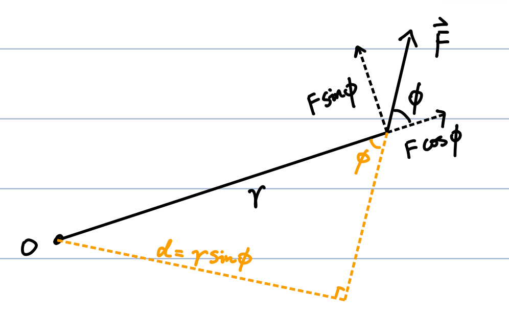
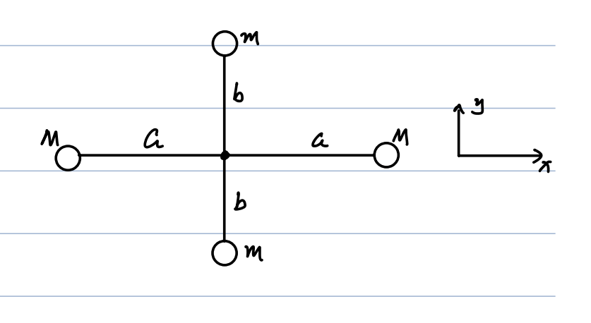
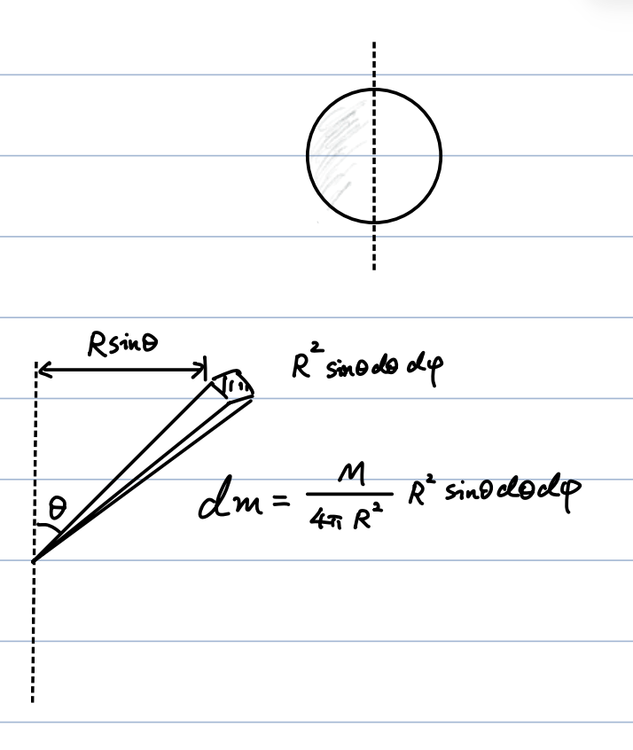
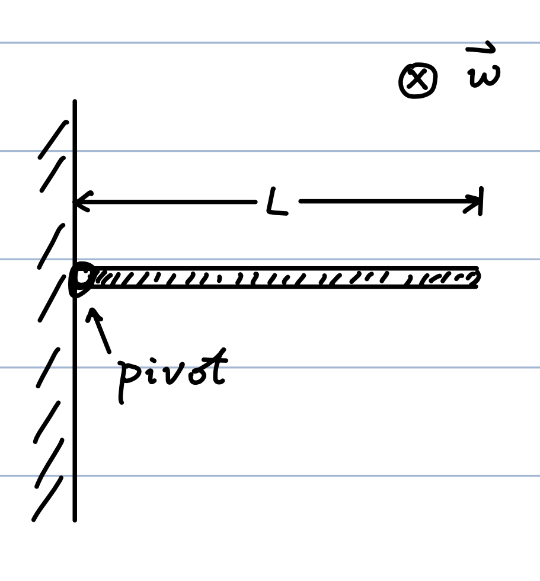

# 01_Rotation

## 1. Introduction: From Point Particle to Rigid Object

When transitioning from point mechanics, we introduce the **extended rigid object**—a non-deformable body. This introduces a new degree of freedom: **Rotation**.

- **Focus**: Rotation of a rigid body about a fixed axis.

### Angular Motion Definitions (Polar Coordinates)

In the plane perpendicular to the rotation axis, we use polar coordinates $(r, \theta)$. The arc length is $s = r\theta$.

- **Angular Displacement**:

    $$
\Delta\theta = \theta_f - \theta_i
    $$

- **Average Angular Speed**:

    $$
\omega_{ave} = \frac{\Delta\theta}{\Delta t}
    $$

- **Instantaneous Angular Speed**:

    $$
\omega \equiv \lim_{\Delta t \to 0} \frac{\Delta\theta}{\Delta t} = \frac{d\theta}{dt}
    $$

    - **Unit**: $\text{rad/s}$ or $\text{s}^{-1}$

    - **Direction**: " $+$ " is defined for counter-clockwise rotation.

- **Average Angular Acceleration**:

    $$
\alpha_{ave} \equiv \frac{\Delta\omega}{\Delta t}
    $$

- **Instantaneous Angular Acceleration**:

    $$
\alpha \equiv \lim_{\Delta t \to 0} \frac{\Delta\omega}{\Delta t} = \frac{d\omega}{dt}
    $$

---

## 2. Rotational Kinematics

### Direction of Angular Velocity

The direction of $\vec{\omega}$ is determined by the **Right-Hand Rule**. If the fingers of your right hand curl in the direction of the rotation, your thumb points in the direction of the vector $\vec{\omega}$.

$$
\vec{\omega} = \omega \hat{w}
$$

### Constant Angular Acceleration

The kinematic equations for rotational motion with constant $\alpha$ perfectly mirror linear motion with constant $a$:

| **Rotation**                                                    | **Linear Motion**                      |
| --------------------------------------------------------------- | -------------------------------------- |
| $\omega_f = \omega_i + \alpha t$                                | $v_f = v_i + at$                       |
| $\theta_f = \theta_i + \omega_i t + \frac{1}{2}\alpha t^2$      | $x_f = x_i + v_i t + \frac{1}{2}at^2$  |
| $\theta_f - \theta_i = \frac{\omega_f^2 - \omega_i^2}{2\alpha}$ | $x_f - x_i = \frac{v_f^2 - v_i^2}{2a}$ |

_Analogy Mapping:_ $x \leftrightarrow \theta$, $v \leftrightarrow \omega$, $a \leftrightarrow \alpha$.

### Relation Between Linear and Angular Variables

- **Velocity**:

    $$
v = \frac{ds}{dt} = \frac{d(r\theta)}{dt} = r \frac{d\theta}{dt} = \omega r
    $$

    **Vector Form**: $\vec{v} = \vec{\omega} \times \vec{r}$

- **Acceleration** ($\vec{a} = \vec{a}_t + \vec{a}_r$):

    - Tangential: $a_t = \frac{dv}{dt} = r \frac{d\omega}{dt} = \alpha r$

    - Radial (Centripetal): $a_r = \frac{v^2}{r} = \omega^2 r$

    - Total Magnitude: $a = \sqrt{a_t^2 + a_r^2} = \sqrt{\alpha^2 r^2 + \omega^4 r^2} = r \sqrt{\alpha^2 + \omega^4}$

---

## 3. Torque and Moment of Inertia

### Torque ($\tau$)

Torque is the rotational analog of force. It is defined **only when a reference axis is defined**.

$$
\tau = (F \sin\phi) r = F d
$$

- schematic diagram from the hand-written notes of Mr. ztWang

Where $d = r \sin\phi$ is the **moment arm**.

- **Total Torque from Multiple Forces**: $\tau_{total} = \sum \tau_i$

- **Vector Form**: $\vec{\tau} = \vec{r} \times \vec{F}$

### Moment of Inertia ($I$) and Newton's Second Law for Rotation

For a point particle:

$$
F_t = m a_t \implies \tau = F_t r = m a_t r = (mr^2) \alpha
$$

Defining the **Moment of Inertia** as $I \equiv mr^2$, we get the rotational analog of $F=ma$:

$$
\tau = I\alpha
$$

**Generalizing to a Rigid Body**:

$$
dF_t = a_t dm \implies d\tau = r dF_t = r a_t dm = r^2 \alpha dm
$$

$$
\tau_{total} = \int d\tau = \left(\int r^2 dm\right) \alpha
$$

Defining $I = \int r^2 dm$, we conclude:

$$
\tau_{total} = I \alpha
$$

> **Notes on Rigid Body Angular Motion:**
>
> 1. $\vec{\omega}$ and $\vec{\alpha}$ are the same at any point on the rigid body, whereas $\vec{v}$ and $\vec{a}$ can vary by location.
>
> 2. The set $\{\vec{\tau}_{total}, \vec{\omega}, \vec{\alpha}\}$ fully characterizes the angular motion of a rigid body.
>

---

## 4. Energy, Work, and Power in Rotation

### Rotational Kinetic Energy

$$
K_R = \int dK = \int \frac{1}{2}v^2 dm = \int \frac{1}{2}\omega^2 r^2 dm = \frac{1}{2}\omega^2 \int r^2 dm = \frac{1}{2}I\omega^2
$$

- For a fixed axis, $K_R$ is the regular total kinetic energy.

- If the axis is moving (e.g., rolling), $K_R$ is only the "rotational" component of the total kinetic energy.

### Work and Power

- **Work**:

    $$
dW = \vec{F} \cdot d\vec{s} = (F_t)(r d\theta) = \tau d\theta
    $$

    **Vector form**: $dW = \vec{\tau} \cdot d\vec{\theta}$ (Note: the radial force component $F_r$ does no work).

- **Instantaneous Power**:

    $$
P = \frac{dW}{dt} = \frac{\tau d\theta}{dt} = \tau \omega
    $$

### Work-Kinetic Energy Theorem

Starting from $\tau_{total} = I\alpha$:

$$
\tau_{total} = I \frac{d\omega}{dt} \implies \tau_{total} d\theta = I \frac{d\omega}{dt} d\theta = I \omega d\omega
$$

Integrating both sides:

$$
W_{total} = \int_{\theta_i}^{\theta_f} \tau_{total} d\theta = \int_{\omega_i}^{\omega_f} I \omega d\omega = \frac{1}{2}I\omega_f^2 - \frac{1}{2}I\omega_i^2
$$

---

## 5. Summary of Analogies: Linear vs. Rotational

| **Concept**        | **Rotation**                                  | **Linear Motion**           |
| ------------------ | --------------------------------------------- | --------------------------- |
| **Velocity**       | $\omega = d\theta/dt$                         | $v = dx/dt$                 |
| **Acceleration**   | $\alpha = d\omega/dt$                         | $a = dv/dt$                 |
| **Inertia**        | $I$ (Depends on axis)                         | $m$ (Intrinsic property)    |
| **Force / Torque** | $\tau_{total} = I\alpha$                      | $F = ma$                    |
| **Work**           | $W = \int_{\theta_i}^{\theta_f} \tau d\theta$ | $W = \int_{x_i}^{x_f} F dx$ |
| **Kinetic Energy** | $K_R = \frac{1}{2}I\omega^2$                  | $K = \frac{1}{2}mv^2$       |
| **Power**          | $P = \tau\omega$                              | $P = Fv$                    |
| **Work-Energy**    | $W = K_{R,f} - K_{R,i}$                       | $W = K_f - K_i$             |

---

## 6. Calculating Moment of Inertia ($I$)

### Example 1: Discrete Point Masses

Four masses on a cross structure (masses $M$ at distance $a$ on x-axis; masses $m$ at distance $b$ on y-axis):

- Axis $\parallel \hat{y}$: $I = Ma^2 + Ma^2 = 2Ma^2$

- Axis $\parallel \hat{x}$: $I = mb^2 + mb^2 = 2mb^2$

- Axis $\parallel \hat{z}$: $I = 2Ma^2 + 2mb^2$

### Example 2: Uniform Rod

Mass $M$, length $L$. Linear mass density $\lambda = M/L$.

- **Axis through center**:

    $$
I = \int_{-L/2}^{L/2} x^2 (\lambda dx) = \lambda \left[ \frac{1}{3}x^3 \right]_{-L/2}^{L/2} = \frac{1}{12}ML^2
    $$

- **Axis at one end**:

    $$
I = \int_{0}^{L} x^2 (\lambda dx) = \lambda \left[ \frac{1}{3}x^3 \right]_{0}^{L} = \frac{1}{3}ML^2
    $$

### Example 3: Spherical Shell (Axis through center)

Mass $M$, Radius $R$. Area density $\sigma = \frac{M}{4\pi R^2}$.

Using spherical coordinates where $dm = \sigma (R^2 \sin\theta d\theta d\phi)$:

$$
I = \int r^2 dm = \frac{M}{4\pi} \int_{0}^{2\pi} d\phi \int_{0}^{\pi} (R\sin\theta)^2 \sin\theta d\theta
$$

$$
I = \frac{M}{4\pi} (2\pi R^2) \int_{1}^{-1} (1 - \cos^2\theta) d(\cos\theta) = \frac{M R^2}{2} \left[ y - \frac{1}{3}y^3 \right]_{-1}^{1} = \frac{2}{3}MR^2
$$

### Other Common Rigid Bodies (Proofs Omitted)

- **Solid Spherical Ball**: $I = \frac{2}{5}MR^2$

- **Cylindrical Shell**: $I = MR^2$

- **Solid Cylinder**: $I = \frac{1}{2}MR^2$

- **Rectangular Plate** (Axis through center, perpendicular to plate sides $a,b$): $I = \frac{1}{12}M(a^2 + b^2)$

---

## 7. Parallel Axis Theorem

**Theorem**:

$$
I = I_{cm} + Mh^2
$$

Where $I_{cm}$ is the moment of inertia through the Center of Mass (CM), and $h$ is the perpendicular displacement of the new axis from the CM axis.

**Proof**:

$$
I = \sum m_i r_i^2 = \sum m_i (\vec{r}_i' + \vec{h})^2
$$

$$
I = \sum m_i (r_i'^2 + 2\vec{r}_i'\cdot\vec{h} + h^2) = \sum m_i r_i'^2 + \left(\sum m_i\right)h^2 + 2\left(\sum m_i\vec{r}_i'\right)\cdot\vec{h}
$$

Since the origin of $\vec{r}_i'$ is the CM, $\sum m_i\vec{r}_i' = 0$. This leaves:

$$
I = I_{cm} + M + 0 = I_{cm} + Mh^2
$$

### Applications of Parallel Axis Theorem

- **Uniform Rod (axis at end)**: $I_{end} = I_{cm} + M\left(\frac{L}{2}\right)^2 = \frac{1}{12}ML^2 + \frac{1}{4}ML^2 = \frac{1}{3}ML^2$

- **Spherical Shell (axis on edge)**: $I_{edge} = I_{cm} + MR^2 = \frac{2}{3}MR^2 + MR^2 = \frac{5}{3}MR^2$

- **Spherical Shell (far-away axis $h \gg R$)**: $I_{far} = I_{cm} + Mh^2 = M\left(h^2 + \frac{2}{3}R^2\right) \approx Mh^2$ (Acts like a point particle).

---

## 8. Comprehensive Example: The Rotating Rod

**Scenario**: A uniform rod of mass $M$ and length $L$ is pivoted at its left end. It is released from a horizontal position.

**Questions**: What is the initial angular acceleration $\alpha$? What is the initial linear acceleration of the right end?

**Solution**:

1. **Find Total Torque**:

        Integrate the torque of infinitesimal mass elements along the rod due to gravity ($g$).

        $$
    \tau_{total} = \int_{0}^{L} \left(\frac{M}{L}dx\right) \cdot g \cdot x = \frac{Mg}{L} \left[ \frac{1}{2}x^2 \right]_{0}^{L} = \frac{1}{2}MgL
        $$

2. **Find Angular Acceleration**:

        Using $I = \frac{1}{3}ML^2$ for a rod pivoted at its end:

        $$
    \tau_{total} = I\alpha \implies \alpha = \frac{\tau_{total}}{I} = \frac{\frac{1}{2}MgL}{\frac{1}{3}ML^2} = \frac{3}{2}\frac{g}{L}
        $$

3. **Find Linear Acceleration at the Right End**:

    $$
a_t = \alpha L = \left(\frac{3}{2}\frac{g}{L}\right) L = \frac{3}{2}g
    $$

    _(Notice that the far end of the rod accelerates faster than gravity initially!)_
