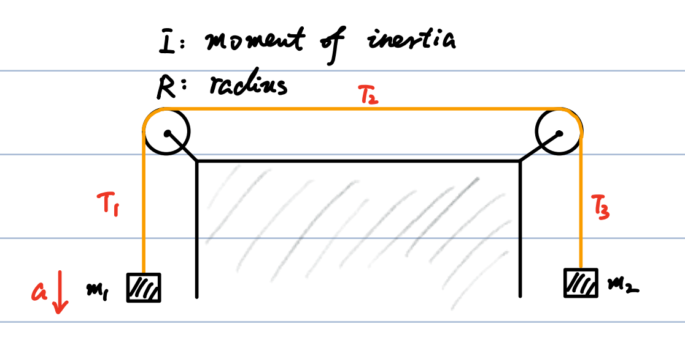
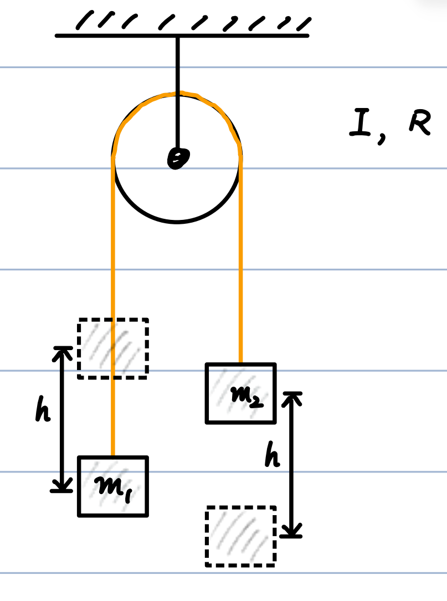

# 02_Crossprod

## 1. Rotational Dynamics: Atwood's Machine Examples

### Example 1: Atwood's Machine with Two Pulleys

**Scenario**: Two masses ($m_1$ and $m_2$, where $m_1 > m_2$) are connected by a string passing over two identical pulleys (radius $R$, moment of inertia $I$). We want to find the accelerations and the three string tensions ($T_1, T_2, T_3$).

- **Assumptions**: Counter-clockwise rotation is defined as positive ($\odot\hat{\omega}$ fixed by hand; choosing the opposite direction simply introduces a "-" sign, but remains physically correct).

**Equations of Motion**:

1. Left Pulley ($n_1$): $T_1 R - T_2 R = I\alpha$

2. Right Pulley ($n_2$): $T_2 R - T_3 R = I\alpha$

3. Mass 1 (moving down): $m_1 g - T_1 = m_1 a$

4. Mass 2 (moving up): $T_3 - m_2 g = m_2 a$

5. Kinematic Constraint: $a = R\alpha$

**Solution**:

Adding equations $(1) + (2) + (3) + (4) + (5)$ to eliminate the tensions:

$$
m_1 g - m_2 g = m_1 a + m_2 a + 2I\left(\frac{a}{R^2}\right)
$$

Solving for linear acceleration $a$ and angular acceleration $\alpha$:

$$
a = \frac{(m_1 - m_2)g}{m_1 + m_2 + 2\frac{I}{R^2}} \quad \text{and} \quad \alpha = \frac{a}{R}
$$

_(Note: If $m_1 = m_2 \implies \alpha = 0$, which is intuitively obvious.)_

### Example 2: Standard Atwood Machine (Energy Method)

**Scenario**: A standard one-pulley Atwood machine (pulley $I, R$) is released from rest. Find the velocity $v$ after mass $m_1$ falls by a displacement $h$.

**Energy Conservation**:

The loss in gravitational potential energy equals the gain in translational and rotational kinetic energy:

$$
(m_1 - m_2)gh = \frac{1}{2}m_1 v^2 + \frac{1}{2}m_2 v^2 + \frac{1}{2}I\omega^2
$$

Using $v = \omega R$:

$$
v^2 = \frac{2(m_1 - m_2)gh}{m_1 + m_2 + I/R^2}
$$

---

## 2. The Vector Cross Product: Mathematical Foundations

### Definition and Properties

For two vectors $\vec{A}$ and $\vec{B}$, the cross product is $\vec{C} = \vec{A} \times \vec{B}$.

- **Orthogonality**: $\vec{C} \perp \vec{A}$ and $\vec{C} \perp \vec{B}$

- **Magnitude**: $C = AB\sin\theta$

- **Direction**: Determined by the Right-Hand Rule.

**Key Rules**:

1. If $\vec{A} \parallel \vec{B}$ ($\theta = 0$ or $\pi$), then $\vec{A} \times \vec{B} = 0$. (Consequently, $\vec{A} \times \vec{A} = 0$).

2. If $\vec{A} \perp \vec{B}$, then $|\vec{A} \times \vec{B}| = AB$.

3. **Non-commutative**: $\vec{A} \times \vec{B} = -\vec{B} \times \vec{A}$

4. **Distributive**: $\vec{A} \times (\vec{B} + \vec{C}) = \vec{A} \times \vec{B} + \vec{A} \times \vec{C}$

### Orthogonal Unit Vectors and Determinant Form

Using Cartesian basis vectors ($\hat{i} \equiv \hat{e}_x$, $\hat{j} \equiv \hat{e}_y$, $\hat{k} \equiv \hat{e}_z$):

- $\hat{i} \times \hat{j} = \hat{k}$

- $\hat{j} \times \hat{k} = \hat{i}$

- $\hat{k} \times \hat{i} = \hat{j}$

Expanding $\vec{A} \times \vec{B}$ component-wise yields the determinant form:

$$
\vec{A} \times \vec{B} = \begin{vmatrix} \hat{i} & \hat{j} & \hat{k} \\ A_x & A_y & A_z \\ B_x & B_y & B_z \end{vmatrix}
$$

### Vector Identities and Calculus

- **Time Derivative**:

    $$
\frac{d}{dt} (\vec{A} \times \vec{B}) = \left(\frac{d\vec{A}}{dt}\right) \times \vec{B} + \vec{A} \times \left(\frac{d\vec{B}}{dt}\right)
    $$

- **Scalar Triple Product**:

    $$
(\vec{A} \times \vec{B}) \cdot \vec{C} = \begin{vmatrix} A_x & A_y & A_z \\ B_x & B_y & B_z \\ C_x & C_y & C_z \end{vmatrix} = (\vec{B} \times \vec{C}) \cdot \vec{A} = (\vec{C} \times \vec{A}) \cdot \vec{B}
    $$

- **Vector Triple Product** (BAC-CAB Rule):

    $$
\vec{A} \times (\vec{B} \times \vec{C}) = (\vec{A} \cdot \vec{C})\vec{B} - (\vec{A} \cdot \vec{B})\vec{C}
    $$

---

## 3. Kinematics of Rigid Body Rotation

### Acceleration in Fixed Axis Rotation

Taking the derivative of linear velocity $\vec{v} = \vec{\omega} \times \vec{r}$:

$$
\vec{a} = \frac{d}{dt}(\vec{\omega} \times \vec{r}) = \frac{d\vec{\omega}}{dt} \times \vec{r} + \vec{\omega} \times \frac{d\vec{r}}{dt}
$$

$$
\vec{a} = \vec{\alpha} \times \vec{r} + \vec{\omega} \times (\vec{\omega} \times \vec{r})
$$

- **Tangential Acceleration**: $\vec{a}_t = \vec{\alpha} \times \vec{r}$ (Magnitude: $a_t = |\vec{\alpha} \times \vec{r}|$)

- **Radial/Centripetal Acceleration**: $\vec{a}_r = \vec{\omega} \times (\vec{\omega} \times \vec{r})$ (Magnitude: $a_r = |\vec{\omega} \times (\vec{\omega} \times \vec{r})|$)

### Rotational Kinetic Energy Derivation

Using the scalar triple product rearrangement where $(\vec{A} \times \vec{B}) \cdot \vec{C} = \vec{B} \cdot (\vec{C} \times \vec{A})$:

$$
K = \frac{1}{2} \sum m_i v_i^2 = \frac{1}{2} \sum m_i (\vec{\omega} \times \vec{r}_i) \cdot (\vec{\omega} \times \vec{r}_i)
$$

$$
K = \frac{1}{2} \sum m_i \left[ \vec{r}_i \times (\vec{\omega} \times \vec{r}_i) \right] \cdot \vec{\omega}
$$

Applying the BAC-CAB rule:

$$
K = \frac{1}{2} \sum m_i \left[ r_i^2 \vec{\omega} - (\vec{r}_i \cdot \vec{\omega})\vec{r}_i \right] \cdot \vec{\omega} = \frac{1}{2} \sum m_i \left[ r_i^2 - (\vec{r}_i \cdot \hat{\omega})^2 \right] \omega^2
$$

$$
K = \frac{1}{2} \left( \sum m_i r_{i\perp}^2 \right) \omega^2 = \frac{1}{2} I \omega^2
$$

_(Where $r_{i\perp}^2 = r_i^2 - (\vec{r}_i \cdot \hat{\omega})^2$ is the perpendicular distance from the axis)._

---

## 4. Fictitious Forces and the Coriolis Effect

### Inertial vs. Rotating Frames

- **Inertial Frame**: Follows Newton's Laws. e.g., A mass moving in a circle requires a normal force $F_N = m\frac{v^2}{r}$.

- **Rotating Frame**: Non-inertial. Fictitious forces appear to explain motion. e.g., If the mass appears at rest in the rotating frame, $F_{\text{fictitious}} - F_N = 0 \implies F_{\text{fictitious}} = m\frac{v^2}{r}$.

### Transformation Between Frames (The Earth)

Define the position vector $\vec{r}$ in both the fixed inertial basis $\{\hat{e}_i\}$ and the rotating basis $\{\hat{e}_i'\}$:

$$
\vec{r} = \sum r_i \hat{e}_i = \sum r_i' \hat{e}_i' = \vec{r}'
$$

Because the basis vectors themselves are rotating with angular velocity $\vec{\omega}$, their derivative is:

$$
\frac{d\hat{e}_i'}{dt} = \vec{\omega} \times \hat{e}_i'
$$

**Velocity Transformation**:

$$
\frac{d\vec{r}}{dt} = \sum \left( \frac{dr_i'}{dt} \hat{e}_i' + r_i' \frac{d\hat{e}_i'}{dt} \right) = \sum v_i' \hat{e}_i' + \vec{\omega} \times \sum r_i' \hat{e}_i'
$$

$$
\vec{v}_{\text{inertial}} = \vec{v}' + \vec{\omega} \times \vec{r}'
$$

_(The $\vec{\omega} \times \vec{r}'$ term is the velocity due to rotation)._

**Acceleration Transformation**:

Differentiating again and applying the same logic:

$$
\frac{d^2\vec{r}}{dt^2} = \sum a_i' \hat{e}_i' + 2\vec{\omega} \times \sum v_i' \hat{e}_i' + \vec{\omega} \times \left[ \vec{\omega} \times \sum r_i' \hat{e}_i' \right]
$$

$$
\vec{a}_{\text{inertial}} = \vec{a}' + 2\vec{\omega} \times \vec{v}' + \vec{\omega} \times (\vec{\omega} \times \vec{r}')
$$

### The Fictitious Forces

In the rotating frame, the apparent acceleration is $\vec{a}'$. The forces that act on an object are the real forces plus two fictitious contributions due to rotation:

$$
\vec{F}_{\text{fictitious}} = - 2m\vec{\omega} \times \vec{v}' - m\vec{\omega} \times (\vec{\omega} \times \vec{r}')
$$

- $- 2m\vec{\omega} \times \vec{v}'$: **Coriolis Force** (depends on the velocity of the object in the rotating frame).

- $- m\vec{\omega} \times (\vec{\omega} \times \vec{r}')$: **Centrifugal Force** (points outward from the rotation axis).

### Application: Typhoons (Cyclones)

When air rushes inward toward a central region of low pressure:

- **Northern Hemisphere**: The Coriolis force deflects the moving air to the right relative to its direction of motion. This forces the air into a **counter-clockwise** spiral.

- **Southern Hemisphere**: The Coriolis force deflects the air to the left, creating a **clockwise** spiral.
