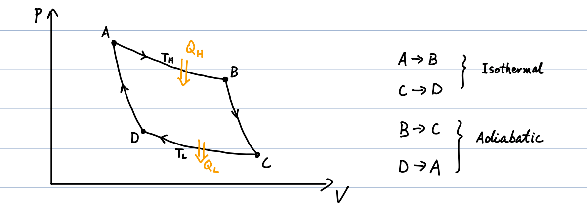
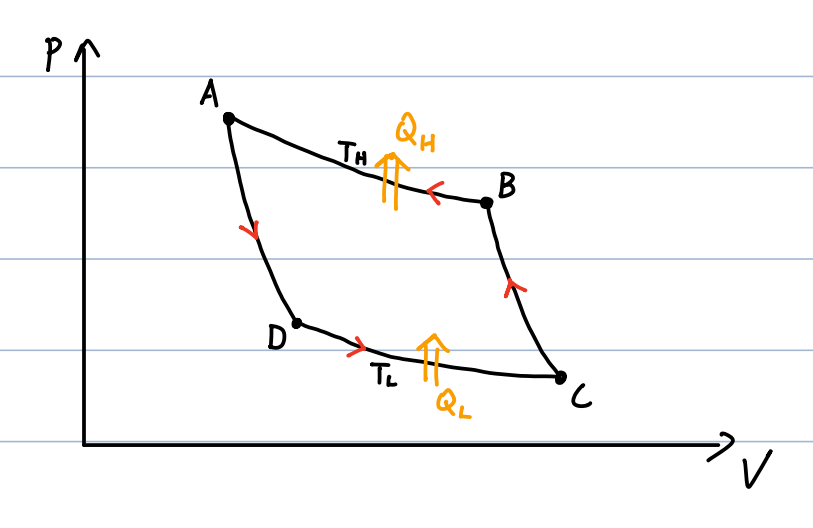

# 05_2nd-law

## 1. The Carnot Cycle (Sadi Carnot, 1824)

The Carnot cycle is an idealized thermodynamic cycle consisting of four reversible processes: two isothermal and two adiabatic.

**Deriving Carnot Efficiency ($\varepsilon_{\text{Carnot}}$):**

For the isothermal expansion ($A \rightarrow B$), the change in internal energy $\Delta U = 0$, so the heat absorbed equals the work done:

$$
Q_H = W = nRT_H \ln\left(\frac{V_B}{V_A}\right)
$$

Similarly, for the isothermal compression ($C \rightarrow D$), the heat released is:

$$
Q_L = nRT_L \ln\left(\frac{V_C}{V_D}\right)
$$

The efficiency of the cycle is defined as:

$$
\varepsilon_{\text{Carnot}} = 1 - \frac{Q_L}{Q_H} = 1 - \frac{T_L \ln(V_C/V_D)}{T_H \ln(V_B/V_A)}
$$

To simplify, we use the adiabatic relations for processes $D \rightarrow A$ and $B \rightarrow C$:

$$
T_L V_D^{\gamma-1} = T_H V_A^{\gamma-1} \Rightarrow \frac{T_L}{T_H} = \left(\frac{V_A}{V_D}\right)^{\gamma-1}
$$

$$
T_H V_B^{\gamma-1} = T_L V_C^{\gamma-1} \Rightarrow \frac{T_L}{T_H} = \left(\frac{V_B}{V_C}\right)^{\gamma-1}
$$

Equating these gives $\frac{V_A}{V_D} = \frac{V_B}{V_C}$, which rearranges to $\frac{V_C}{V_D} = \frac{V_B}{V_A}$. This cancels out the logarithmic terms in the efficiency equation.

**Final Carnot Efficiency:**

$$
\varepsilon_{\text{Carnot}} = 1 - \frac{T_L}{T_H}
$$

_Note: Efficiency depends **only** on the ratio of the reservoir temperatures._

- **Example 1:** If $T_L =$ **303 K (30°C)** and $T_H =$ **503 K (230°C)**, then $\varepsilon_{\text{Carnot}} \approx$ **40%**.

- **Example 2:** If $T_L / T_H \approx$ **0**, then $\varepsilon_{\text{Carnot}} \approx$ **1** (100% efficiency, which is practically unattainable).

## 2. Reverse Carnot Cycle (Refrigerator)

Operating the Carnot cycle in reverse creates an ideal refrigerator.

- Work ($W$) is done **TO** the system.

- The system absorbs heat ($Q_L$) **FROM** the low-$T$ reservoir and releases heat ($Q_H$) **TO** the high-$T$ reservoir.

**Coefficient of Performance (COP / $\varepsilon^{(r)}$):**

$$
\varepsilon^{(r)} \equiv \frac{Q_L}{W} = \frac{Q_L}{Q_H - Q_L} = \frac{1}{1 - Q_L/Q_H} - 1 = \frac{1}{\varepsilon} - 1
$$

For a reverse Carnot cycle specifically:

$$
\varepsilon^{(r)}_{\text{Carnot}} = \frac{1}{1 - T_L/T_H} - 1 = \frac{T_L}{T_H - T_L}
$$

**Reversible vs. Irreversible Processes:**

- **Reversible process:** A process where the direction of both the system and its surroundings can be exactly reversed (e.g., a frictionless quasi-static process).

- **Irreversible process:** All natural processes are irreversible (e.g., quasi-static processes with friction, adiabatic free expansion, a cooling cup of hot water).

## 3. The Second Law of Thermodynamics

The Second Law can be expressed through two functionally equivalent statements:

**1. Clausius Statement (No perfect refrigerator):**

Heat can never pass from a colder to a warmer body without some other change, connected with it, occurring at the same time.

**2. Kelvin-Planck Statement (No perfect heat engine):**

It is impossible to construct a heat engine that, operating in a cycle, produces no effect other than the absorption of energy from a reservoir and the performance of an equal amount of work.

**Equivalence of the Statements:**

- **If Kelvin-Planck is violated:** A "perfect" engine converts heat $Q_0$ entirely into work ($W = Q_0$). This work can be used to drive a regular refrigerator that moves heat $Q$ from $T_L$ and dumps $Q_0 + Q$ into $T_H$. The _net effect_ is heat $Q$ moving from $T_L$ to $T_H$ with no external work input—violating the Clausius statement.

- **If Clausius is violated:** A "perfect" refrigerator moves heat $Q_0$ from $T_L$ to $T_H$ without external work. A regular heat engine can then take $Q_0 + Q$ from $T_H$, do work $W=Q$, and dump $Q_0$ back to $T_L$. The _net effect_ is converting heat $Q$ from $T_H$ entirely into work $W$ without any other effect—violating the Kelvin-Planck statement.

## 4. Carnot's Theorem

Carnot's theorem dictates the upper limits of thermodynamic efficiency based on two core postulates:

1. For heat engines working between two constant-$T$ reservoirs, the efficiency of an **irreversible** engine ($\varepsilon_I$) is always lower than that of a **reversible** engine ($\varepsilon_R$).

2. For all **reversible** engines working between the same two constant-$T$ reservoirs, the efficiencies are identical.

**Proof of Postulate 1 (By Contradiction):**

Assume an irreversible engine ($I$) is more efficient than a reversible engine ($R$), meaning $\varepsilon_I > \varepsilon_R$.

- Given $\varepsilon_I = \frac{W'}{Q_1}$ and $\varepsilon_R = \frac{W}{Q_1}$, this assumption implies $W' > W$.

- Design a combined process: Run engine $I$ forward and run engine $R$ in reverse (as a refrigerator) using a portion of the work from $I$.

- Engine $I$ absorbs $Q_1$ from $T_H$ and produces work $W'$. Engine $R$ uses work $W$ to return $Q_1$ to $T_H$.

- **Net Effect:** The high-temp reservoir ($T_H$) experiences zero net heat change ($Q_1 - Q_1 = 0$). The combined system absorbs net heat ($Q_2 - Q_2'$) from the low-temp reservoir ($T_L$) and converts it entirely into net work ($W' - W$).

- This directly violates the Kelvin-Planck statement of the Second Law. Therefore, the assumption is false, proving that $\varepsilon_I \leq \varepsilon_R$.

_(Postulate 2 is proven using identical logic by pitting two reversible engines against each other, yielding $\varepsilon_{R1} \leq \varepsilon_{R2}$ and $\varepsilon_{R2} \leq \varepsilon_{R1}$, dictating they must be equal)._

**Corollary of Carnot's Theorem:**

For heat engines working between two constant-temperature reservoirs, the efficiency of any irreversible engine is strictly bounded by the Carnot efficiency:

$$
\varepsilon_I \leq \varepsilon_{\text{Carnot}}
$$
