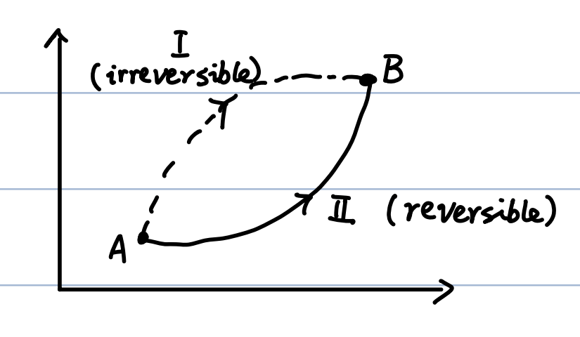
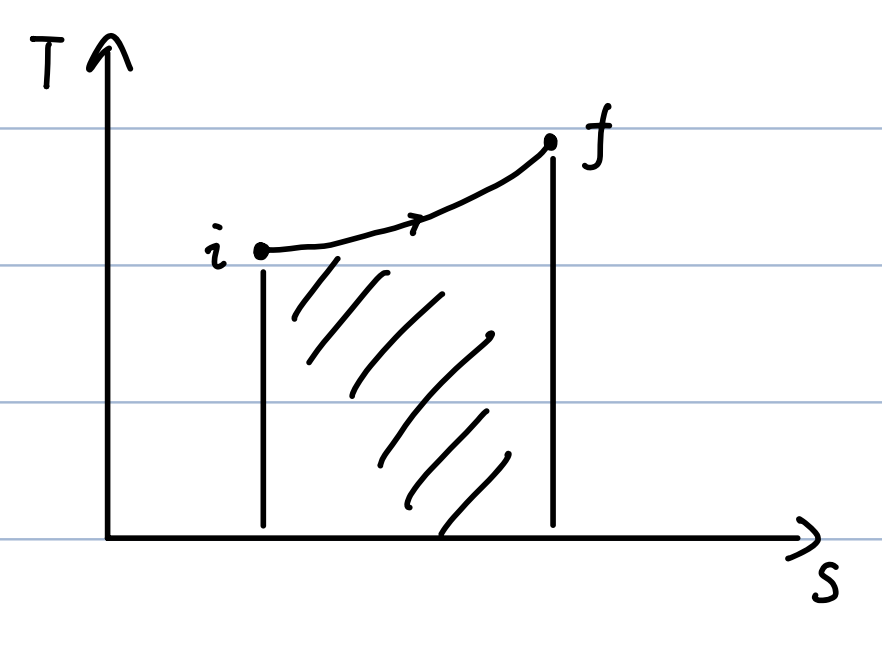
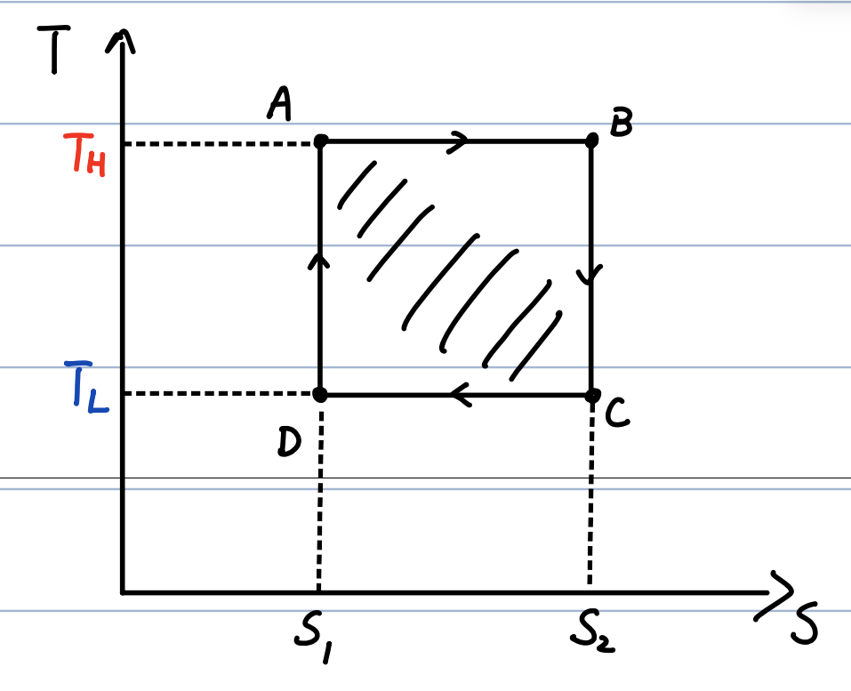

# 06_Entropy

## 1. The Clausius Inequality and Entropy

- **Clausius Inequality:** For any cyclic process, the integral of heat transfer divided by temperature is less than or equal to zero:

    $$
\oint \frac{\delta Q}{T} \leq 0
    $$

    - **Reversible process:** $\oint \frac{\delta Q}{T} = 0$ (Clausius equality)

    - **Irreversible process:** $\oint \frac{\delta Q}{T} < 0$

- **Proof via Heat Engine:** Consider an engine working between two constant-$T$ reservoirs.

    - Efficiency: $\varepsilon = 1 - \frac{Q_L}{Q_H} \leq \varepsilon_{\text{Carnot}} = 1 - \frac{T_L}{T_H}$

    - Rearranging yields: $\frac{Q_L}{Q_H} \geq \frac{T_L}{T_H} \implies \frac{Q_H}{T_H} - \frac{Q_L}{T_L} \leq 0$

    - By formally defining $\Delta Q$ as heat _absorbed_ (so heat released is negative), this becomes $\frac{\Delta Q_H}{T_H} + \frac{\Delta Q_L}{T_L} \leq 0$.

    - Generalizing to an arbitrary quasi-static cyclic process with multiple reservoirs: $\sum_i \left( \frac{\Delta Q_H^{(i)}}{T_H^{(i)}} + \frac{\Delta Q_L^{(i)}}{T_L^{(i)}} \right) \leq 0 \implies \oint \frac{\delta Q}{T} \leq 0$.

- **Definition of Entropy ($S$):** Because $\oint \frac{\delta Q}{T} = 0$ for a reversible cycle, the integral between two states is independent of the path taken. This allows us to define a state function called entropy.

    - **Integral form:** $S_B - S_A = \int_A^B \frac{\delta Q}{T}$

    - **Differential form:** $dS = \frac{\delta Q}{T}$

    - _Note on differentials:_ Heat ($\delta Q$) is an inexact differential (path-dependent), whereas entropy ($dS = \frac{\delta Q}{T}$) is an exact differential (path-independent).

## 2. The Second Law of Thermodynamics (Entropy Statement)

By analyzing a cycle consisting of an irreversible path ($A \xrightarrow{I} B$) and a reversible return path ($B \xrightarrow{II} A$), we apply the Clausius inequality:

$$
\int_{A(I)}^B \frac{\delta Q}{T} + \int_{B(II)}^A \frac{\delta Q}{T} < 0
$$

Since the return path is reversible, $\int_{B(II)}^A \frac{\delta Q}{T} = S_A - S_B$. Substituting this yields the general relation for any path from A to B:

$$
S_B - S_A \geq \int_A^B \frac{\delta Q}{T}
$$

- **Application to Isolated Systems:** An isolated system exchanges no matter or energy (heat) with its surroundings, meaning $\delta Q = 0$ (adiabatic). Therefore:

    $$
\Delta S \geq 0
    $$

- **The Second Law:** The entropy of an isolated system never decreases.

    - $\Delta S = 0 \Leftrightarrow$ Reversible process

    - $\Delta S > 0 \Leftrightarrow$ Irreversible process

    - Consequently, the entropy of the universe is always increasing: $\Delta S_{\text{Universe}} > 0$.

    - _Note: The entropy of a specific non-isolated part of a system can decrease, as long as the total entropy of the isolated whole increases._

- **Consistency with Clausius Statement:** If heat $Q$ spontaneously flowed from a cold reservoir ($T_L$) to a hot reservoir ($T_H$) without work, the entropy change would be $\Delta S = \frac{Q}{T_H} - \frac{Q}{T_L}$. Since $T_H > T_L$, this results in $\Delta S < 0$, which violates the entropy statement.

## 3. Calculating Entropy Changes

Because entropy is a state function, $\Delta S$ for an irreversible process can be calculated by imagining a reversible quasi-static path between the same initial and final equilibrium states.

- **1. Ideal Gas:**

    - First Law: $dU = \delta Q - P dV \implies T dS - P dV$

    - Rearranging for $dS$: $dS = \frac{1}{T}(dU + P dV)$

    - Using $dU = n C_V dT$ and $P/T = nR/V$: $dS = n C_V \frac{dT}{T} + nR \frac{dV}{V}$

    - Integrating yields: **$S = S_0 + n C_V \ln\frac{T}{T_0} + nR \ln\frac{V}{V_0}$**

- **2. Adiabatic Free Expansion (Irreversible):**

    - $\Delta Q = 0$ and $W = 0$, so $\Delta U = 0 \implies T_i = T_f$.

    - Using the ideal gas formula: $\Delta S = nR \ln\frac{V_f}{V_i}$. Since $V_f > V_i$, $\Delta S > 0$.

- **3. Heating Water:**

    - Imagine a quasi-static heating process: $\delta Q = m c_v dT$

    - $dS = m c_v \frac{dT}{T} \implies S = m c_v \ln T + \text{constant}$

- **4. Mixing Water (Irreversible):**

    - Mix mass $m_A$ at $T_A$ with mass $m_B$ at $T_B$ ($T_A < T_B$).

    - The final equilibrium temperature $T$ is found via energy conservation ($\Delta Q_A + \Delta Q_B = 0$): $T = \frac{m_A T_A + m_B T_B}{m_A + m_B}$.

    - Total entropy change: $\Delta S = \Delta S_A + \Delta S_B = m_A c_v \ln\frac{T}{T_A} + m_B c_v \ln\frac{T}{T_B}$

    - _Special Case ($m_A = m_B = m$):_

        $$
\Delta S = m c_v \ln\left[ \frac{(T_A + T_B)^2}{4 T_A T_B} \right]
        $$

        Because $(T_A + T_B)^2 > 4 T_A T_B$ (for $T_A \neq T_B$), $\Delta S > 0$, proving the process is irreversible.

## 4. T-S Diagrams and the Carnot Cycle

A Temperature-Entropy (T-S) diagram plots temperature $T$ against entropy $S$.

- From $dS = \frac{\delta Q}{T}$, we get $\delta Q = T dS$.

- Integrating gives the total heat transfer: $Q = \int_i^f T dS$.

- **Key Concept:** The area under the curve in a T-S diagram represents the heat transferred ($Q$).

**The Carnot Cycle on a T-S Diagram:**

A Carnot cycle operates between $T_H$ and $T_L$. Because it consists of two isothermal processes (constant $T$) and two adiabatic processes ($Q=0 \implies$ constant $S$), it forms a perfect rectangle on a T-S diagram bounded by $T_H$, $T_L$, $S_1$, and $S_2$.

- Total work done equals net heat absorbed (the area of the rectangle): $W = Q_{\text{net}} = \oint T dS = (T_H - T_L)(S_2 - S_1)$

- Heat absorbed from the hot reservoir: $Q_H = T_H (S_2 - S_1)$

- **Carnot Efficiency:**

    $$
\varepsilon_{\text{Carnot}} = \frac{W}{Q_H} = \frac{(T_H - T_L)(S_2 - S_1)}{T_H (S_2 - S_1)} = 1 - \frac{T_L}{T_H}
    $$
