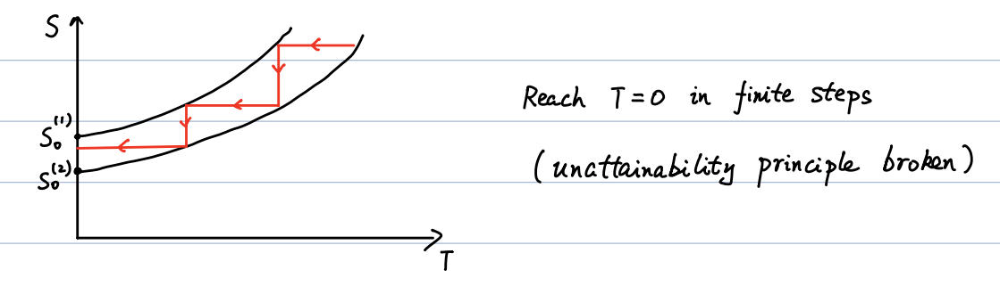
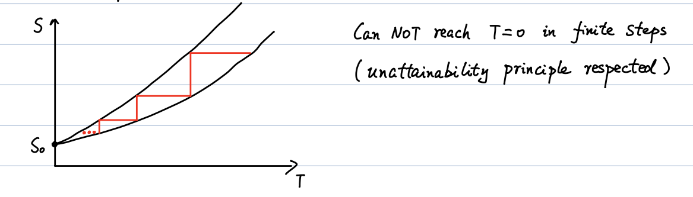

# 07_3rd-law

## 1. The Third Law of Thermodynamics

**Nernst Statement**

For any isothermal process, the change in entropy approaches zero as the temperature approaches absolute zero:

$$
\lim_{T \to 0} \Delta S = 0
$$

Mathematically, for any state variable $x$:

$$
\lim_{T \to 0} |S(T, x) - S(T, x + \Delta x)| \to 0
$$

This implies that as $T \to 0$, the entropy of a system approaches a constant value, $S_0$, regardless of the path taken or the specific values of other state variables.

**The Ideal Gas "Exception"**

For an ideal gas, the entropy change during an isothermal expansion is given by:

$$
S(T, V_1) - S(T, V_2) = nR \ln\frac{V_1}{V_2}
$$

This expression is entirely independent of $T$, which appears to violate the Third Law (since $\Delta S$ does not go to 0 as $T \to 0$). However, this is not a true violation; rather, the "ideal gas model" is simply too "idealized" and physically breaks down before reaching temperatures near absolute zero.

## 2. The Unattainability Principle

**Definition**

It is impossible for any process, no matter how idealized, to reduce the entropy of a system to its absolute-zero value in a finite number of operations.

**Relationship with the Third Law**

The Third Law and the Unattainability Principle are deeply connected. We can visualize this using a $T$-$S$ diagram detailing alternating isothermal and adiabatic steps (a "zigzag" path used to cool a system):

- **If the 3rd Law is Violated:** Entropy at $T=0$ is not a well-defined single constant. Different parameter paths would hit the $T=0$ axis at different entropy values. In this scenario, a system could theoretically reach $T=0$ in a finite number of cooling steps, which directly breaks the Unattainability Principle.

- **If the 3rd Law is Respected:** All parameter paths converge to the exact same entropy value ($S_0$) at $T=0$. Because the curves converge, the alternating cooling steps become infinitely smaller. Consequently, it requires an infinite number of steps to reach $T=0$, strictly upholding the Unattainability Principle.

## 3. Statistical View of Entropy (Ludwig Boltzmann, 1877)

**Boltzmann's Entropy Formula**

Entropy can be defined microscopically by the equation:

$$
S = k_B \ln W
$$

- $k_B$: Boltzmann constant.

- $W$: Multiplicity (the number of microscopic ways/configurations to achieve a specific macroscopic state).

**Calculating Multiplicity ($W$)**

If you have $N$ total particles distributed into two halves of a box, with $n$ particles in the left half and $N-n$ in the right half, the number of possible configurations is:

$$
W = \frac{N!}{n!(N-n)!}
$$

**Example: Adiabatic Free Expansion of a Gas**

If a gas undergoes free expansion to double its initial volume ($V_f / V_i = 2$), the macroscopic thermodynamic calculation gives $\Delta S = nR \ln 2$. We can prove this exactly using the statistical view:

1. **Initial State ($S_i$):** All particles ($N$) are confined to one half of the box.

        $$
    W_i = \frac{N!}{N!0!} = 1 \implies S_i = k_B \ln 1 = 0
        $$

2. **Final State ($S_f$):** Particles are evenly distributed across both halves ($N/2$ per half).

        $$
    W_f = \frac{N!}{(N/2)!(N/2)!}
        $$

        $$
    S_f = k_B \ln N! - 2k_B \ln(N/2)!
        $$

3. **Applying Stirling's Approximation:** For very large numbers ($N \gg 1$), $\ln N! \approx N \ln N - N$.

        $$
    S_f \approx k_B(N \ln N - N) - 2k_B\left(\frac{N}{2} \ln\frac{N}{2} - \frac{N}{2}\right)
        $$

        The $-N$ terms cancel out cleanly:

        $$
    S_f = N k_B \ln N - N k_B \ln\frac{N}{2}
        $$

        $$
    S_f = N k_B \ln 2
        $$

4. **Final Result:** Using the relationship $R = N_A k_B$ (where total particles $N = nN_A$):

    $$
S_f = nR \ln 2
    $$

    Therefore, $\Delta S = S_f - S_i \approx nR \ln 2$. This statistical derivation perfectly matches the macroscopic thermodynamic result.
