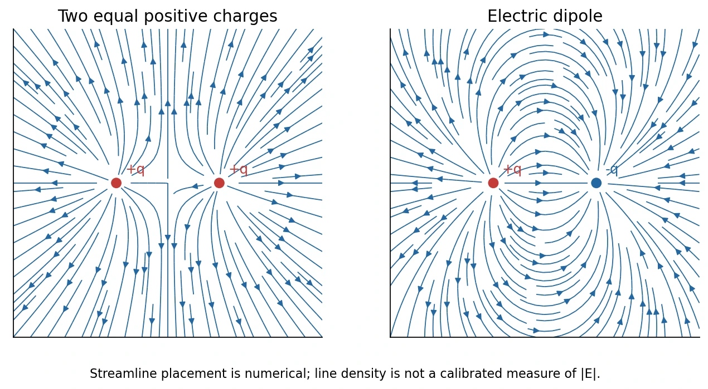
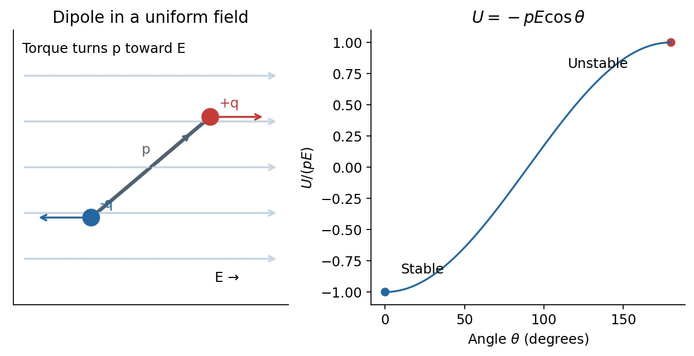

# 1 · Charge, Coulomb's Law, and Electric Fields

[Course index](index.md) · [Next: continuous charge and Gauss's law](02-continuous-charge-and-gauss-law.md)

## Main results（核心结论）

Electric charge is a signed, conserved property of matter. Coulomb's law describes the electrostatic interaction between point charges; the electric field separates the source from the charge used to probe it. Fields add as vectors. A neutral object can still produce a field: an electric dipole is the simplest example.

Prerequisites: vector addition, unit vectors, force and torque, and the meaning of a small-parameter expansion.

## 1. Charge and electrical materials

The two signs of charge are called **positive** and **negative**. Like charges repel and unlike charges attract. A neutral object has zero **net** charge; it generally contains many positive and negative charges rather than no charge at all.

For ordinary isolated bodies, observed net charges occur in integer multiples of the elementary charge:

$$
q=Ne,\qquad N\in\mathbb Z,\qquad e\approx1.602\times10^{-19}\ \mathrm C.
$$

An electron carries $-e$; a proton carries $+e$. Charge is transferred between bodies during charging. The total signed charge of an isolated system is conserved. Pair creation or annihilation, when relevant, preserves total charge; it does not invalidate conservation.

The classroom also stresses **Lorentz invariance of total charge**: changing inertial reference frames does not change an object's total charge. This statement does not imply that charge density or current density is separately invariant.

| Material | Charge mobility | Examples and interpretation |
| --- | --- | --- |
| Conductor（导体） | Some carriers can move through the material | Metals contain mobile conduction electrons; ions can carry current in solutions. |
| Insulator（绝缘体） | Charges are largely bound | Glass, plastic, rubber; bound charges can still shift slightly and polarize. |
| Semiconductor（半导体） | Carrier population is strongly tunable | Silicon; conductivity depends on temperature, doping, and excitation. |
| Superconductor（超导体） | Zero DC resistance in its superconducting regime | Requires an appropriate material and conditions; a distinct quantum phase. |

For a metal, a useful elementary picture is a lattice of positively charged ion cores plus mobile electrons. A full distinction between conducting and insulating solids requires electronic band structure, beyond this first electrostatics discussion.

**中文提示：**“电中性”不等于“没有电荷”；“绝缘”不等于“完全不响应电场”。净电荷、电荷是否能自由移动、电荷能否产生微小位移，是不同问题。

### Millikan's oil-drop experiment（密立根油滴实验）

The experiment infers the charge on small droplets by comparing gravity, buoyancy, viscous drag, and the force from a controlled electric field. For a spherical droplet of radius $a$, define its effective weight

$$
W_{\mathrm{eff}}=\frac43\pi a^3(\rho_{\mathrm{oil}}-\rho_{\mathrm{air}})g.
$$

At terminal falling speed $v_t$ without an electric field, the elementary Stokes model gives $6\pi\eta a v_t=W_{\mathrm{eff}}$. An electric field can then balance the effective weight, $|q|E=W_{\mathrm{eff}}$, or alter the terminal speed. Repeated measurements reveal discrete charge increments. Precision experiments require corrections to this simplified drag model.

The important lesson is the separation of **measurement**, **model**, and **inference**. Historical values printed in the slides are historical measurements, not the constant to use in current calculations.

## 2. Coulomb's law in vector form

Let charges $q_1,q_2$ be located at $\mathbf r_1,\mathbf r_2$. The force **on charge 2 due to charge 1** is

$$
\mathbf F_{2\leftarrow1}
=kq_1q_2\frac{\mathbf r_2-\mathbf r_1}{|\mathbf r_2-\mathbf r_1|^3}
=k\frac{q_1q_2}{r_{21}^2}\widehat{\mathbf r}_{21}.
$$

Here $\widehat{\mathbf r}_{21}$ points from source 1 to receiver 2. Keeping that convention fixed allows the sign of $q_1q_2$ to determine attraction or repulsion. The force magnitude is $k|q_1q_2|/r_{21}^2$.

For multiple fixed sources,

$$
\mathbf F_j=\sum_{i\ne j}\mathbf F_{j\leftarrow i}.
$$

This is **superposition（叠加原理）**. Add Cartesian components, not force magnitudes. Coulomb's law here concerns stationary point charges in vacuum; an extended body requires integration unless symmetry justifies replacing it by an effective point source.

The inverse-square structure resembles Newtonian gravitation. Differences matter: mass sources ordinary gravity with one sign, while electric charge has two signs; a neutral charge distribution can suppress its leading far field by cancellation.

## 3. Why introduce a field?

A field assigns a quantity to each point of space and, in general, time. Temperature is a scalar field $T(\mathbf r,t)$; wind velocity is a vector field $\mathbf v(\mathbf r,t)$. An electric field is a vector field $\mathbf E(\mathbf r,t)$.

Define the external field operationally by a sufficiently small test charge $q_0$:

$$
\mathbf E(\mathbf r)=\lim_{q_0\to0}\frac{\mathbf F_{\mathrm{ext}}(\mathbf r)}{q_0}.
$$

The limit expresses that the probe should not significantly rearrange the sources. The field exists without the probe. A negative probe experiences force opposite to the field, but dividing by its signed charge gives the same field.

For a source charge $q$ at $\mathbf r_0$,

$$
\mathbf E(\mathbf r)
=kq\frac{\mathbf r-\mathbf r_0}{|\mathbf r-\mathbf r_0|^3}.
$$

It points away from a positive source and toward a negative source. For several charges,

$$
\mathbf E(\mathbf r)=k\sum_iq_i
\frac{\mathbf r-\mathbf r_i}{|\mathbf r-\mathbf r_i|^3}.
$$

The field has SI unit N/C, equivalently V/m. The external force on a point charge is $\mathbf F=q\mathbf E_{\mathrm{ext}}$; do not insert the charge's own singular field into this formula.

The classroom emphasizes that the field concept enables a second approach: specify field equations and boundary conditions, then determine the field without explicitly tracking every source charge. [Class 5](05-conductors-and-image-charges.md) makes this idea concrete.

## 4. Electric field lines（电场线）

Field lines are visualization curves whose tangent points along $\mathbf E$ at every regular point. Equivalently, a curve parameterized by $s$ can satisfy $d\mathbf r/ds\parallel\mathbf E$.

- Lines leave positive charges and terminate on negative charges, or extend to/from infinity.
- Lines cannot cross at a point where the field is nonzero and has a unique direction.
- A physically calibrated field-line drawing represents a stronger field by a larger number of lines per perpendicular area.
- Field lines are not physical strings and are not generally particle trajectories. Acceleration is along $q\mathbf E$; velocity depends on initial conditions.

*Original calculation using the same three-dimensional Coulomb kernel as the supplied Python demonstration, sampled in a plane. Numerical streamline density is not an exact field-strength scale.*

For two equal positive charges, the midpoint has $\mathbf E=0$. For two equal opposite charges, the fields at the midpoint point in the same direction and add. Do not confuse **zero total charge** with **zero field everywhere**.

### What the supplied Python demonstration computes

`demo1.zip` contains a notebook and `ElectricFieldLines.py`. Each source contributes components proportional to

$$
E_x\propto q\frac{x-x_0}{[(x-x_0)^2+(y-y_0)^2]^{3/2}},\qquad
E_y\propto q\frac{y-y_0}{[(x-x_0)^2+(y-y_0)^2]^{3/2}}.
$$

The program sets the overall Coulomb scale to one, sums contributions, and uses `streamplot`. Its examples are a dipole $(+q,-q)$ and a linear quadrupole $(+q,-2q,+q)$. Although the function is called `CoulombField2D`, it shows a **planar slice of a 3D point-charge field**, not the field of infinite line charges. Numerical calculations must mask the point-charge singularities.

## 5. Electric dipole（电偶极子）

An idealized finite dipole comprises $-q$ and $+q$ separated by vector $\mathbf d$, directed **from negative to positive**. Its dipole moment is

$$
\mathbf p=q\mathbf d,\qquad [p]=\mathrm{C\,m}.
$$

Its net charge vanishes, yet the separated charges generate a nonzero field. For a general localized distribution, $\mathbf p=\sum_iq_i\mathbf r_i$; this moment is independent of the origin when the total charge is zero.

### Axial field and the far-field expansion

Put $+q$ at $z=d/2$ and $-q$ at $z=-d/2$. At $z>d/2$,

$$
E_z=kq\left[\frac1{(z-d/2)^2}-\frac1{(z+d/2)^2}\right]
=\frac{2kqdz}{(z^2-d^2/4)^2}.
$$

When $z\gg d$, expand in the dimensionless small parameter $d/z$:

$$
E_z\simeq\frac{2kp}{z^3}.
$$

The $1/z^2$ monopole terms cancel; the first surviving term falls as $1/z^3$. At a general far-field point $r\gg d$,

$$
\mathbf E_{\mathrm{dip}}(\mathbf r)
\simeq\frac{k}{r^3}\left[3(\mathbf p\cdot\hat{\mathbf r})\hat{\mathbf r}-\mathbf p\right].
$$

On the axis the field is parallel to $\mathbf p$ with magnitude $2kp/r^3$; in the perpendicular bisector plane it is antiparallel to $\mathbf p$ with magnitude $kp/r^3$. These are far-field formulas, not exact formulas arbitrarily close to either charge.

### Dipole in a uniform external field

The forces on the two charges are equal and opposite, so their net force is zero. Their torques add:

$$
\boldsymbol\tau=\mathbf p\times\mathbf E,\qquad
U=-\mathbf p\cdot\mathbf E=-pE\cos\theta.
$$

Alignment at $\theta=0$ minimizes energy and is stable; anti-alignment at $\theta=\pi$ maximizes energy and is unstable. Both have zero instantaneous torque, so **zero torque alone does not establish stability**.

For a rigid dipole with moment of inertia $I$, small oscillations about alignment obey $I\ddot\theta\simeq-pE\theta$, with angular frequency $\omega=\sqrt{pE/I}$. This follows from the classroom's restoring-torque argument. An undamped dipole oscillates; it does not necessarily settle at the minimum without dissipation.

In a nonuniform external field, the two forces need not cancel. For a fixed small dipole in electrostatics, $\mathbf F=\nabla(\mathbf p\cdot\mathbf E)$. The uniform-field zero-force conclusion has a specific condition.

## 6. Classroom extensions: materials and higher multipoles

Class 2 opens with applications of the dipole concept. Displacing positive and negative charge centers produces polarization even if the material remains neutral. **Ferroelectricity（铁电性）** involves spontaneous polarization that can be switched by an applied field; hysteresis permits remanent polarization after the field is removed. **Piezoelectricity（压电性）** couples mechanical stress to polarization, and the converse effect couples an electric field to strain. Piezoelectric transducers can convert mechanical and electrical signals in either direction. Converse piezoelectric strain does not require a phase transition, and ordinary microphones or earphones need not all use this mechanism.

The class also introduces the hierarchy of far fields:

| Leading nonzero multipole | Potential decay | Field decay |
| --- | --- | --- |
| Monopole（单极）: total charge $Q$ | $r^{-1}$ | $r^{-2}$ |
| Dipole（偶极）: moment $\mathbf p$ | $r^{-2}$ | $r^{-3}$ |
| Quadrupole（四极） | $r^{-3}$ | $r^{-4}$ |
| Octupole（八极） | $r^{-4}$ | $r^{-5}$ |

These scalings apply far from a localized distribution; angular factors may vanish in special directions. Having $Q=0$ and $\mathbf p=0$ does not imply that all higher moments vanish. Formal tensor multipole expansions are outside these classes.

## 7. Checks and common errors

1. **Vector addition:** three equal charges at the vertices of an equilateral triangle give zero field at the center by threefold symmetry, while their potentials add to a nonzero value.
2. **Test-charge sign:** a negative charge moves under a force opposite to the drawn field arrows.
3. **Distance scaling:** doubling far-field distance reduces a point-charge field by four and a dipole field by eight.
4. **Dipole direction:** $\mathbf p$ points from $-q$ to $+q$; reversing it reverses the torque formula's prediction.
5. **Approximation:** use the exact two-charge expression before making $r\gg d$ assumptions.

## References

Lecture 1 PDF pp. 4–32 supplies the core sequence; class 1, 19:09–98:39, supplies the explanations and dipole-energy discussion. Class 2, 03:19–16:36, supplies materials and multipole extensions. The slide reading list points to Halliday, Resnick & Krane, chapters on charge, Coulomb's law, and electric fields. [Source map](source-map.md) records the complete input inventory.
