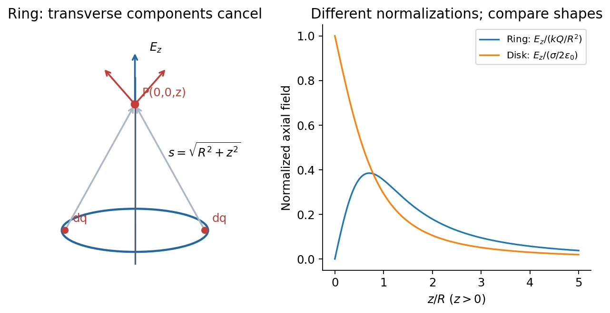
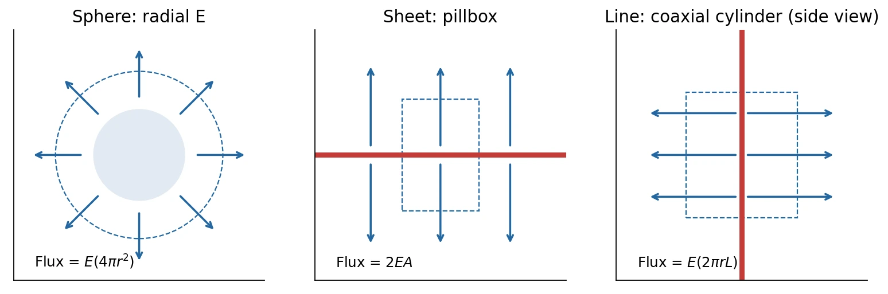

# 2 · Continuous Charge and Gauss's Law

[Course index](index.md) · [Previous: charge and fields](01-charge-and-electric-field.md) · [Next: electric potential](03-electric-potential.md)

## Main results（核心结论）

A continuous source is handled by adding the fields of infinitesimal charge elements. Gauss's law instead relates the **total signed flux through a closed surface** to enclosed charge. It always holds, but determines a field directly only when symmetry sufficiently constrains that field.

The classroom contrasts **化整为零** (divide a source into elements and integrate) with **化零为整** (use a global flux law). Neither method removes the need to reason about symmetry.

## 1. Charge densities and the Coulomb integral

| Distribution | Charge element | Total charge |
| --- | --- | --- |
| Line | $dq=\lambda\,d\ell$ | $Q=\int\lambda\,d\ell$ |
| Surface | $dq=\sigma_s\,dA$ | $Q=\int\sigma_s\,dA$ |
| Volume | $dq=\rho_q\,d\mathcal V$ | $Q=\int\rho_q\,d\mathcal V$ |

Densities are signed and can depend on position. Let $\mathbf r'$ locate a source element and $\mathbf r$ the observation point. Then

$$
d\mathbf E=k\,dq\frac{\mathbf r-\mathbf r'}{|\mathbf r-\mathbf r'|^3},\qquad
\mathbf E(\mathbf r)=k\int\frac{\mathbf r-\mathbf r'}{|\mathbf r-\mathbf r'|^3}\,dq.
$$

Do not mix the source coordinate $\mathbf r'$ with the observation coordinate $\mathbf r$. The separation vector changes as the source element moves through the integral.

A reliable sequence is: choose $dq$ → write the separation vector → project into components → use symmetry → integrate the surviving components → check limits.

## 2. Uniformly charged ring: field on its axis

Consider a ring of radius $R$, lying in the $xy$ plane and carrying total charge $Q$ uniformly. At $P=(0,0,z)$, every element is at the same distance $s=\sqrt{R^2+z^2}$. Opposite elements cancel their transverse contributions. Rotation about the axis also rules out any preferred transverse direction.

The axial component is

$$
dE_z=\frac{k\,dq}{s^2}\frac{z}{s}
=k\frac{z\,dq}{(R^2+z^2)^{3/2}}.
$$

Integrating over the ring gives the exact axial field

$$
\boxed{\mathbf E(0,0,z)=\frac{kQz}{(R^2+z^2)^{3/2}}\,\hat{\mathbf z}.}
$$

For positive $Q$, the sign of $z$ determines which way the field points. At the center, $\mathbf E=0$. Far away, $\mathbf E\simeq kQ\,\mathrm{sgn}(z)\hat{\mathbf z}/z^2$, as expected for a localized source of total charge $Q$.

### A useful extremum check

For $z>0$,

$$
\frac{dE_z}{dz}=kQ\frac{R^2-2z^2}{(R^2+z^2)^{5/2}}.
$$

The maximum occurs at $z=R/\sqrt2$, with $E_{\max}=2kQ/(3\sqrt3R^2)$. The field starts at zero, increases, then decays; it cannot monotonically decrease from the ring center.

*The two curves use different normalizations, as stated in the legend; the graph compares their shapes rather than equal-charge field magnitudes.*

## 3. Uniformly charged disk: build it from rings

A disk of radius $R$ has constant surface charge density $\sigma_s$. A thin ring of radius $s$ and width $ds$ carries

$$
dq=\sigma_s\,2\pi s\,ds.
$$

For $z>0$, insert this element into the ring result:

$$
E_z=2\pi k\sigma_s z\int_0^R\frac{s\,ds}{(z^2+s^2)^{3/2}}
=\frac{\sigma_s}{2\epsilon_0}\left(1-\frac{z}{\sqrt{z^2+R^2}}\right).
$$

For either side of the disk, away from its ideal zero-thickness surface,

$$
\mathbf E(0,0,z)=\frac{\sigma_s}{2\epsilon_0}
\left[\mathrm{sgn}(z)-\frac{z}{\sqrt{z^2+R^2}}\right]\hat{\mathbf z},\qquad z\ne0.
$$

Three essential limits are:

1. **Far field, $|z|\gg R$:** expansion of the square root gives $|E_z|\simeq k|Q|/z^2$, where $Q=\pi R^2\sigma_s$.
2. **Near the center, $z\to0^\pm$:** $E_z\to\pm\sigma_s/(2\epsilon_0)$. These are one-sided limits. Do not assign a unique continuous field to the charged ideal surface itself.
3. **Infinite-sheet limit, $R\to\infty$ at fixed $z$:** the field becomes distance independent, with magnitude $|\sigma_s|/(2\epsilon_0)$ on each side.

The field jump across a charged sheet is consistent with the general normal-boundary condition discussed in [class 5](05-conductors-and-image-charges.md).

## 4. Electric flux（电通量）

An oriented surface element has area vector $d\mathbf A=\hat{\mathbf n}\,dA$. Electric flux is

$$
\Phi_E=\int_S\mathbf E\cdot d\mathbf A.
$$

For a uniform field through a flat area $A$, $\Phi_E=EA\cos\theta$, where $\theta$ is the angle between the field and the **normal**, not the plane. Flux is a scalar and has unit N·m²/C.

For a closed surface, choose the outward normal everywhere:

$$
\Phi_E=\oint_S\mathbf E\cdot d\mathbf A.
$$

Outward contributions are positive and inward contributions negative. A field tangent to a patch contributes zero flux through that patch. A Gaussian surface is an imaginary mathematical surface, not necessarily a physical object.

**中文提示：**“穿过多少电场线”只能帮助理解；精确定义是带方向的点积面积分。通量既可正也可负，不能把每个面的通量绝对值相加。

## 5. Gauss's law and why it works

In vacuum,

$$
\boxed{\oint_S\mathbf E\cdot d\mathbf A=\frac{Q_{\mathrm{enc}}}{\epsilon_0}.}
$$

The field on the left is due to **all** charges, inside and outside. Only the net enclosed charge appears on the right.

For a point charge at the center of a sphere, $E=kq/r^2$ and $\Phi_E=E\,4\pi r^2=q/\epsilon_0$. The shrinking field and growing area cancel. The classroom connects this cancellation to the inverse-square law in three dimensions.

For a general closed surface, a point charge contributes

$$
d\Phi_E=kq\frac{\hat{\mathbf R}\cdot\hat{\mathbf n}}{R^2}\,dA
=kq\,d\Omega,
$$

where $d\Omega$ is the signed solid angle seen from the charge. The net solid angle is $4\pi$ for a charge inside and zero for a charge outside. Superposition extends the result to many charges and continuous distributions. A charge exactly on the chosen surface requires special limiting treatment; choose a surface that avoids it.

### What Gauss's law does not say

- $Q_{\mathrm{enc}}=0$ implies zero **net flux**, not zero field. A uniform field crosses a charge-free box, entering one side and leaving another.
- External charges contribute zero net flux but can change the local field at every point on the surface.
- Knowing one number, the flux, does not determine an arbitrary vector field on a surface.
- Enclosing a dipole gives zero flux even though its surrounding field is nonzero.

## 6. How symmetry makes Gauss's law useful

To extract an unknown $E$ from a flux integral, establish from the **physical source and boundary conditions** that $E$ is constant on the relevant surface patches and has a known orientation. Drawing a symmetric Gaussian surface cannot create symmetry absent from the source.

### Spherical symmetry

If the charge distribution is spherically symmetric, $\mathbf E=E_r(r)\hat{\mathbf r}$. A concentric sphere gives

$$
E_r(r)=\frac{Q_{\mathrm{enc}}(r)}{4\pi\epsilon_0r^2}.
$$

For a uniformly charged **solid insulating ball** of radius $R$ and total charge $Q$,

$$
\rho_q=\frac{3Q}{4\pi R^3},\qquad
\mathbf E(r)=
\begin{cases}
\displaystyle\frac{\rho_qr}{3\epsilon_0}\hat{\mathbf r}
=\frac{kQr}{R^3}\hat{\mathbf r},&r<R,\\[4pt]
\displaystyle\frac{kQ}{r^2}\hat{\mathbf r},&r\ge R.
\end{cases}
$$

Inside, only $Q(r/R)^3$ is enclosed. The field increases linearly and is continuous at $R$. A uniform thin spherical shell instead has zero field inside and the same external point-charge field. A conductor can redistribute charge; it is not the uniformly volume-charged insulating ball.

For a nonuniform spherically symmetric density,

$$
Q_{\mathrm{enc}}(r)=4\pi\int_0^r\rho_q(s)s^2\,ds.
$$

### Planar symmetry: an infinite nonconducting sheet

Uniformity under translations and rotations within the plane implies a perpendicular field of constant magnitude on each side. Reflection symmetry gives equal magnitudes on the two sides. A pillbox of cap area $A$ has flux $2EA$, hence

$$
E=\frac{|\sigma_s|}{2\epsilon_0}.
$$

For sheets at $z=0$ and $z=d$ carrying $+\sigma_s$ and $-\sigma_s$, respectively, superposition gives $\mathbf E=(\sigma_s/\epsilon_0)\hat{\mathbf z}$ between them and zero outside, in the infinite-sheet approximation.

Distinguish the field on one side of a **single prescribed sheet** from the field immediately outside a **conducting surface**: the latter uses $E_n=\sigma_s/\epsilon_0$ because the field inside the metal is zero.

### Cylindrical symmetry: an infinite line of charge

For line density $\lambda$, translation along the axis, rotation about it, and reflection perpendicular to it imply a radial field. A coaxial cylinder of radius $r$ and length $L$ has no flux through its ends:

$$
E_r(2\pi rL)=\frac{\lambda L}{\epsilon_0},\qquad
\boxed{\mathbf E=\frac{\lambda}{2\pi\epsilon_0r}\hat{\mathbf r}.}
$$

The $1/r$ scaling differs from the $1/r^2$ point-charge field because the source is extended indefinitely in one dimension. A finite rod approximates this result only near its central region when the perpendicular distance is much smaller than its length.

As an extension of the same enclosed-charge argument, a uniformly charged infinite solid cylinder of radius $R$ has $E_r=\rho_qr/(2\epsilon_0)$ inside and $E_r=\rho_qR^2/(2\epsilon_0r)$ outside. This is a deduction from the taught method rather than a separate later topic.

## 7. Common errors and self-checks

- **Ring:** every element has the same distance to an axial point, but its field is not entirely axial; project before adding.
- **Disk:** the annulus area is $2\pi s\,ds$, not $\pi(ds)^2$.
- **Sphere:** use enclosed charge, not total charge, for an observation point inside a distributed source.
- **Sheet:** a two-sided pillbox has two flux-producing caps; this creates the factor of two.
- **Line:** a coaxial Gaussian cylinder has lateral area $2\pi rL$, not $\pi r^2$.
- **Symmetry:** an off-axis ring point or a finite sheet edge generally prevents a simple Gauss-law solution.

For a quick dimensional check, $\lambda/(\epsilon_0r)$, $\sigma_s/\epsilon_0$, and $\rho_qr/\epsilon_0$ must all have units of electric field.

## References

Lecture 2 PDF pp. 3–8 covers the ring and disk; pp. 10–24 covers flux and Gauss's law; pp. 25–30 covers spherical, planar, and cylindrical applications. Class 2, 17:12–95:16, adds the symmetry reasoning, solid-angle explanation, and integral/global comparison. Its mathematical appendices are summarized in the [toolkit](mathematical-toolkit.md).
