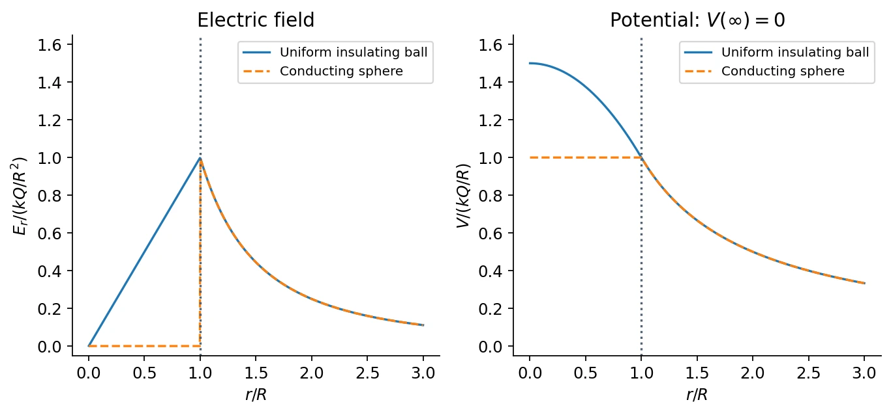

# 3 · Electric Potential and Potential Energy

[Course index](index.md) · [Previous: Gauss's law](02-continuous-charge-and-gauss-law.md) · [Next: the electrostatics triangle](04-triangle-of-electrostatics.md)

## Main results（核心结论）

Electrostatic work is path independent. This allows a potential energy and, after division by the probe charge, an electric potential. Potential is a scalar: sum scalar contributions, then differentiate to obtain the field. Potential differences determine energy changes; the additive zero of potential is a choice.

$$
V_f-V_i=-\int_i^f\mathbf E\cdot d\boldsymbol\ell,\qquad
\mathbf E=-\nabla V,\qquad
\Delta U=q\Delta V.
$$

Prerequisites: work-energy theorem, signed work, line integrals, and elementary partial derivatives.

## 1. Why electrostatic forces are conservative

The work done by a force along a path is $W=\int\mathbf F\cdot d\boldsymbol\ell$. For a test charge $q_0$ in the field of a fixed point charge $Q$,

$$
dW=k\frac{Qq_0}{r^2}\hat{\mathbf r}\cdot d\boldsymbol\ell
=k\frac{Qq_0}{r^2}\,dr.
$$

Only the radial part of displacement contributes. Thus

$$
W_{i\to f}=kQq_0\left(\frac1{r_i}-\frac1{r_f}\right),
$$

which depends only on endpoints. Superposition gives the same path-independence property for any fixed electrostatic source distribution.

Equivalent statements in a suitable simply connected region are:

- Work between two points is independent of path.
- Work around every closed path is zero: $\oint\mathbf E\cdot d\boldsymbol\ell=0$.
- A single-valued scalar potential can be defined.
- The local curl vanishes: $\nabla\times\mathbf E=0$.

The classroom uses circulation in a vortex as a counterexample: a vector field tangent to a circular path can have nonzero closed-loop work and cannot be described by an electrostatic potential. General time-dependent electric fields need not be conservative.

**中文提示：**“保守”说的是做功与路径无关，并不要求轨迹沿径向。验证库仑力时，是把任意路径的位移投影到径向后积分。

## 2. Potential energy, work, and kinetic energy

Define the change of electrostatic potential energy by

$$
\Delta U=U_f-U_i=-W_{\mathrm{field}}.
$$

If the electric force is the only force doing work,

$$
\Delta K=W_{\mathrm{field}}=-\Delta U,\qquad K_i+U_i=K_f+U_f.
$$

For a quasistatic transfer with negligible change of kinetic energy, an external agent does work $W_{\mathrm{ext}}=\Delta U$. The external work and field work have opposite signs.

This distinction matters in charging or bringing particles together. For two like charges, approaching increases $U$, so the external agent must supply positive work against repulsion. For opposite charges, approaching decreases $U$ and the field can release kinetic energy.

## 3. Electric potential（电势）

For fixed sources, define the potential difference per unit probe charge:

$$
\Delta V=\frac{\Delta U}{q_0}=-\int_i^f\mathbf E\cdot d\boldsymbol\ell.
$$

Potential depends on the sources and location, not on the chosen probe. A probe charge $q$ has external potential energy $U=qV$, with a consistent energy reference.

| Quantity | Character | Physical role |
| --- | --- | --- |
| $\mathbf E$ | Vector; N/C or V/m | Force per unit signed charge |
| $V$ | Scalar; J/C = V | Energy per unit signed charge |
| $U$ | Scalar; J | Energy of a specified charge configuration |

The transformation $V\mapsto V+V_0$ changes no field or potential difference. For a finite localized distribution it is often convenient to choose $V(\infty)=0$. For an infinite line or sheet, that reference generally fails because the potential integral to infinity diverges.

For a uniform field,

$$
V_f-V_i=-\mathbf E\cdot(\mathbf r_f-\mathbf r_i).
$$

The field points toward decreasing potential. A positive charge accelerates along the field toward lower $V$; an electron accelerates opposite to it toward higher $V$. Both can decrease their **potential energy**, since $U=qV$.

### Example: acceleration through a potential difference

An electron starting from rest and moving to a potential higher by $\Delta V>0$ gains kinetic energy $e\Delta V$. In the nonrelativistic regime,

$$
\frac12m_ev^2=e\Delta V,\qquad v=\sqrt{\frac{2e\Delta V}{m_e}}.
$$

For $\Delta V=100\ \mathrm V$, $v\approx5.93\times10^6\ \mathrm{m/s}$. An electron-volt (eV) is the energy gained by a charge of magnitude $e$ across 1 V; it is an energy unit, not a potential unit.

## 4. Equipotential surfaces（等势面）

An equipotential surface has constant $V$. Moving a charge along it changes no potential energy, so the electric field does no work along the surface. At regular points with nonzero field, $\mathbf E$ is perpendicular to the surface.

- Uniform field: equally spaced, equal-increment equipotentials are parallel planes.
- Point charge: equipotentials are concentric spheres.
- Dipole: equipotentials have axial symmetry and include a zero-potential perpendicular bisector plane.

For neighboring equipotentials separated normally by $ds$,

$$
E_n=-\frac{dV}{ds}.
$$

Closer spacing indicates a larger field **only when the potential increments are equal**. An equipotential need not have zero field; its tangential field is zero, while the normal field can be large.

## 5. Potential of discrete charges and a dipole

With $V(\infty)=0$, the potential of a point charge is

$$
V(\mathbf r)=\frac{kq}{|\mathbf r-\mathbf r_0|},\qquad
V(\mathbf r)=k\sum_i\frac{q_i}{|\mathbf r-\mathbf r_i|}.
$$

Unlike fields, these signed scalar contributions add without resolving vector components.

For a finite dipole,

$$
V=kq\left(\frac1{r_+}-\frac1{r_-}\right).
$$

Far away, $r\gg d$, its potential becomes

$$
\boxed{V_{\mathrm{dip}}(\mathbf r)\simeq\frac{k\mathbf p\cdot\hat{\mathbf r}}{r^2}
=\frac{kp\cos\theta}{r^2}.}
$$

The potential decreases as $r^{-2}$, and differentiating gives the $r^{-3}$ field from class 1. On the equatorial plane $V=0$, but $\mathbf E$ is generally nonzero: zero value does not imply zero gradient.

## 6. Energy of a system of charges

Bring initially well-separated charges into their final positions while holding the earlier charges fixed. Each new charge interacts with all charges already present. For three charges,

$$
U=k\left(\frac{q_1q_2}{r_{12}}+\frac{q_1q_3}{r_{13}}+\frac{q_2q_3}{r_{23}}\right).
$$

For $N$ point charges,

$$
\boxed{U=\sum_{i<j}\frac{kq_iq_j}{r_{ij}}
=\frac12\sum_iq_iV_{\mathrm{others}}(\mathbf r_i).}
$$

Each unordered pair appears once. The factor $1/2$ corrects the double counting in the second expression. The singular point-charge self-energy is excluded. This energy is for the configuration of charges, not merely the potential at one chosen point.

**Example:** three equal charges $q$ at the vertices of an equilateral triangle of side $a$ have $U=3kq^2/a$. By symmetry the field at the center is zero, but the center's potential is $3\sqrt3kq/a$. These statements concern different quantities and are fully compatible.

## 7. Potentials from continuous sources

For a localized source with the zero at infinity,

$$
V(\mathbf r)=k\int\frac{dq}{|\mathbf r-\mathbf r'|}.
$$

This integral is often simpler than the vector field integral. Once the **full spatial potential** is available, differentiate it to obtain the field.

### Finite rod: point above an endpoint

A uniform rod extends from $x=0$ to $x=L$. Find the potential at $P=(0,z)$ with $z>0$. Set $dq=\lambda\,dx$:

$$
V(P)=k\lambda\int_0^L\frac{dx}{\sqrt{x^2+z^2}}
=k\lambda\ln\left(\frac{L+\sqrt{L^2+z^2}}{z}\right).
$$

The logarithm's argument is dimensionless. For $z\gg L$, the result tends to $k\lambda L/z=kQ/z$.

This one-variable expression gives the derivative along the line $x_P=0$, and hence $E_z$. It does **not** provide $E_x$ by differentiation with respect to the rod's integration variable. Off a symmetry axis, obtain the full observation-coordinate dependence or calculate the missing component separately.

### Infinite line: choose a finite reference radius

For the field $E_r=\lambda/(2\pi\epsilon_0r)$,

$$
V(r)-V(r_0)=-\frac{\lambda}{2\pi\epsilon_0}\ln\frac r{r_0}.
$$

No finite potential can be assigned by integrating from infinity. Only differences relative to a finite $r_0$ are meaningful. The finite-rod and infinite-line formulas concern different geometries and references.

### Ring and disk on their axes

For a ring,

$$
V(z)=\frac{kQ}{\sqrt{R^2+z^2}},\qquad
-\frac{dV}{dz}=\frac{kQz}{(R^2+z^2)^{3/2}}.
$$

For a uniformly charged disk, summing ring potentials gives

$$
V(z)=2\pi k\sigma_s\int_0^R\frac{s\,ds}{\sqrt{s^2+z^2}}
=\frac{\sigma_s}{2\epsilon_0}\left(\sqrt{z^2+R^2}-|z|\right).
$$

Differentiating for $z\ne0$ reproduces the signed disk field in class 2. The potential is continuous across the sheet, while its normal derivative jumps. On these symmetry axes the transverse field components vanish; that is why the axial derivative suffices.

## 8. Field-to-potential example: a uniformly charged ball

Class 4 revisits the class-2 insulating ball to connect its field with its potential. Set $V(\infty)=0$. Outside,

$$
V(r)=\frac{kQ}{r},\qquad r\ge R.
$$

Inside, integrate the known interior field from the surface inward:

$$
V(r)-V(R)=-\int_R^r\frac{kQs}{R^3}\,ds
=\frac{kQ}{2R^3}(R^2-r^2).
$$

Therefore

$$
\boxed{V(r)=
\begin{cases}
\displaystyle\frac{kQ}{2R}\left(3-\frac{r^2}{R^2}\right),&r\le R,\\[4pt]
\displaystyle\frac{kQ}{r},&r\ge R.
\end{cases}}
$$

The potential and first derivative match at $R$; $V(0)=3kQ/(2R)$. Do not independently choose zero potential for the inside and outside formulas: they describe one connected physical solution.

*The conducting-sphere curve anticipates the equilibrium result developed in class 5. Both use the same $Q$, $R$, and zero at infinity.*

## 9. From potential back to field

For an infinitesimal displacement,

$$
dV=-\mathbf E\cdot d\boldsymbol\ell
=\frac{\partial V}{\partial x}dx+\frac{\partial V}{\partial y}dy+\frac{\partial V}{\partial z}dz.
$$

Comparing independent coordinate displacements gives

$$
E_x=-\frac{\partial V}{\partial x},\qquad
E_y=-\frac{\partial V}{\partial y},\qquad
E_z=-\frac{\partial V}{\partial z},\qquad
\mathbf E=-\nabla V.
$$

Example: $V=\alpha x^2-\beta y$ yields $\mathbf E=(-2\alpha x,\beta,0)$. The gradient notation and its connection to divergence and curl are developed next.

## 10. Common errors

- Use $\Delta U=q\Delta V$, including the sign of $q$.
- Distinguish $W_{\mathrm{field}}=-\Delta U$ from quasistatic $W_{\mathrm{ext}}=\Delta U$.
- A zero potential is a reference-dependent value; a zero field is a statement about all spatial derivatives.
- An equipotential surface can have nonzero normal electric field.
- Sum each interaction pair once; omit point-charge self-interactions.
- Differentiate with respect to observation coordinates, not a source integration coordinate.
- Do not use $V(\infty)=0$ for an ideal infinite line or infinite sheet.

## References

Lecture 3 PDF pp. 3–16 gives work, potential, and equipotentials; pp. 17–22 covers charges, dipoles, and assembly energy; pp. 23–32 covers continuous sources and differentiation. Class 3, 13:09–96:44, adds the conservative-force/curl discussion. The uniformly charged ball is a class-4 worked example, approximately 24–29 minutes. The [source map](source-map.md) distinguishes these classroom supplements from slide-only material.
