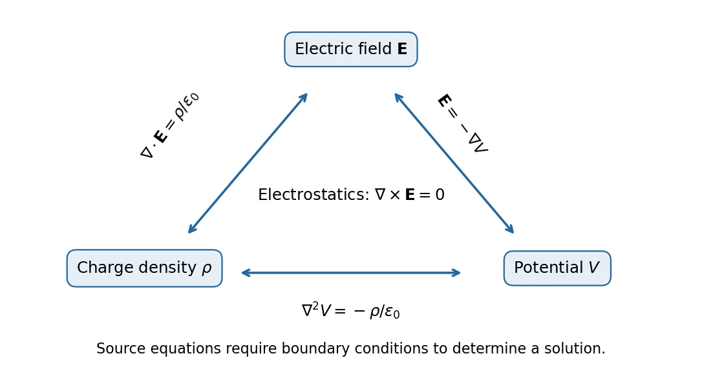

# 4 · The Triangle of Electrostatics

[Course index](index.md) · [Previous: potential](03-electric-potential.md) · [Next: conductors and image charges](05-conductors-and-image-charges.md)

## Main results（核心结论）

Electrostatics can be expressed by three related quantities: charge density $\rho_q$, electric field $\mathbf E$, and potential $V$.

$$
\boxed{\mathbf E=-\nabla V,\qquad
\nabla\times\mathbf E=0,\qquad
\nabla\cdot\mathbf E=\frac{\rho_q}{\epsilon_0},\qquad
\nabla^2V=-\frac{\rho_q}{\epsilon_0}.}
$$

These statements encode direction of potential change, absence of circulation, and local electric sources. Boundary conditions are needed to select a physical solution.

Prerequisites: total differentials, partial derivatives, vector dot/cross products, and surface flux.

## 1. Gradient: local change of a scalar field（梯度）

For a differentiable scalar $V(x,y,z)$,

$$
dV=\frac{\partial V}{\partial x}dx+\frac{\partial V}{\partial y}dy+\frac{\partial V}{\partial z}dz
=\nabla V\cdot d\boldsymbol\ell,
$$

where

$$
\nabla=\hat{\mathbf x}\frac{\partial}{\partial x}
+\hat{\mathbf y}\frac{\partial}{\partial y}
+\hat{\mathbf z}\frac{\partial}{\partial z},\qquad
\nabla V=\left(\frac{\partial V}{\partial x},\frac{\partial V}{\partial y},\frac{\partial V}{\partial z}\right).
$$

Along a unit direction $\hat{\mathbf u}$, the directional derivative is

$$
\frac{dV}{ds}=\nabla V\cdot\hat{\mathbf u}=|\nabla V|\cos\theta.
$$

Thus $\nabla V$ points toward the steepest local increase; $-\nabla V$ points toward the steepest local decrease. Its magnitude is the maximum directional rate of change per unit distance. At a stationary point the gradient vanishes and does not supply a preferred direction.

The classroom relates this to gradient methods in optimization. That analogy is local: following steepest descent need not give the globally shortest path or avoid every local minimum.

For electrostatic potential, comparing $dV=-\mathbf E\cdot d\boldsymbol\ell$ gives $\mathbf E=-\nabla V$.

### Example: recover the point-charge field

With $V=kq/r$ and $r=\sqrt{x^2+y^2+z^2}$,

$$
\frac{\partial}{\partial x}\frac1r=-\frac{x}{r^3},\qquad
\mathbf E=kq\frac{(x,y,z)}{r^3}=\frac{kq}{r^2}\hat{\mathbf r},\qquad r>0.
$$

The three Cartesian components are constrained by their common potential. The electric field is not an arbitrary independent triple of functions.

## 2. Curl: local circulation（旋度）

For a sufficiently smooth vector field $\mathbf A$,

$$
\nabla\times\mathbf A=
\begin{pmatrix}
\partial_y A_z-\partial_z A_y\\
\partial_z A_x-\partial_x A_z\\
\partial_x A_y-\partial_y A_x
\end{pmatrix}.
$$

Stokes's theorem connects the curl to circulation:

$$
\oint_{\partial S}\mathbf A\cdot d\boldsymbol\ell
=\int_S(\nabla\times\mathbf A)\cdot\hat{\mathbf n}\,dA.
$$

The boundary orientation and surface normal follow the right-hand rule. If $V$ has continuous second partial derivatives, their order can be exchanged, so

$$
\nabla\times(\nabla V)=0.
$$

For example, the $x$ component is $\partial_y\partial_zV-\partial_z\partial_yV=0$. Therefore every smooth potential field $\mathbf E=-\nabla V$ has zero curl.

Conversely, zero curl guarantees a global potential on a suitably simply connected region. In a region with holes or singularities, local zero curl alone is insufficient to conclude that every loop integral vanishes. The [toolkit](mathematical-toolkit.md) gives a concrete example.

### A field that fails the electrostatic test

Take $\mathbf A=(-y,x,0)$. Its curl is $(0,0,2)$, and on a circle of radius $a$,

$$
\oint\mathbf A\cdot d\boldsymbol\ell=2\pi a^2\ne0.
$$

This illustrates circulation. It cannot be a static electric field in the region. Field lines that look bent are not by themselves proof of nonzero curl: electrostatic dipole lines are curved but the field is curl-free away from singular sources.

## 3. Deriving local Gauss's law from a small box

Center a small rectangular box at $(x,y,z)$, with side lengths $\Delta x,\Delta y,\Delta z$. Its volume is $\Delta\mathcal V=\Delta x\Delta y\Delta z$.

The flux from the pair of faces normal to $x$ is, to leading order,

$$
\left[E_x\left(x+\frac{\Delta x}{2},y,z\right)
-E_x\left(x-\frac{\Delta x}{2},y,z\right)\right]\Delta y\Delta z
\simeq\frac{\partial E_x}{\partial x}\Delta\mathcal V.
$$

The minus sign on the left face comes from its outward normal $-\hat{\mathbf x}$. Add the $y$ and $z$ face pairs, divide by volume, and shrink the box. Gauss's law yields

$$
\boxed{\nabla\cdot\mathbf E
=\frac{\partial E_x}{\partial x}+\frac{\partial E_y}{\partial y}+\frac{\partial E_z}{\partial z}
=\frac{\rho_q}{\epsilon_0}.}
$$

The divergence has units of field per length. It measures outward flux per unit volume in the infinitesimal limit, rather than the absolute field strength at a point.

### Physical interpretation（物理意义）

- Positive charge density gives positive divergence: a local net source of electric flux.
- Negative charge density gives negative divergence: a local net sink.
- Zero charge density gives zero divergence, but need not give zero field.
- Parallel lines can have nonzero divergence if their field magnitude changes along them.
- Lines that spread geometrically can still have zero divergence if the field decreases sufficiently fast.

For $\mathbf E=\alpha z\hat{\mathbf z}$, the lines are straight and parallel, but $\nabla\cdot\mathbf E=\alpha$. For the radial inverse-square point-charge field, geometric spreading is exactly balanced by decreasing magnitude at every point with $r>0$.

**中文提示：**散度不是“看起来发散”；旋度也不是“电场线弯曲”。两者都需要结合分量及其空间变化判断。

## 4. Divergence theorem and global/local equivalence

For a smooth vector field on a volume $\mathcal V$ with closed boundary $S$,

$$
\oint_S\mathbf E\cdot d\mathbf A
=\int_{\mathcal V}(\nabla\cdot\mathbf E)\,d\mathcal V
=\frac1{\epsilon_0}\int_{\mathcal V}\rho_q\,d\mathcal V.
$$

This is the divergence theorem（散度定理／高斯公式）. It translates between integrated charge and local charge density. For point or surface charges, the same physics requires limits or distributional source terms rather than assuming an everywhere smooth density.

Gauss's law is useful in at least three ways emphasized by the slides:

1. Given a symmetric source, determine $\mathbf E$.
2. Given flux through a closed surface, determine total enclosed charge.
3. Given the field throughout a region, determine local charge density through its divergence.

The third use does not require global source symmetry.

## 5. Poisson's and Laplace's equations

Substitute $\mathbf E=-\nabla V$ into local Gauss's law:

$$
\boxed{\nabla^2V=-\frac{\rho_q}{\epsilon_0},\qquad
\nabla^2=\frac{\partial^2}{\partial x^2}+\frac{\partial^2}{\partial y^2}+\frac{\partial^2}{\partial z^2}.}
$$

This is **Poisson's equation（泊松方程）**. In a charge-free region it becomes **Laplace's equation（拉普拉斯方程）**, $\nabla^2V=0$. A charge-free region can have a nonzero potential and a nonzero electric field due to sources elsewhere.

### Worked inverse problem

Suppose $V=\alpha(x^2+y^2+z^2)+V_0$ within a specified region. Then

$$
\mathbf E=-2\alpha(x,y,z),\qquad
\rho_q=-\epsilon_0\nabla^2V=-6\epsilon_0\alpha.
$$

The additive $V_0$ changes neither result. Positive $\alpha$ gives inward field and negative charge density. The result determines local volume charge; global boundary surfaces may require additional charges.

### Check against the uniform insulating ball

The interior potential from class 3 can be written $V=3kQ/(2R)-kQr^2/(2R^3)$. Its Laplacian gives

$$
\rho_q=-\epsilon_0\nabla^2V=\frac{3Q}{4\pi R^3},
$$

matching the prescribed volume density. Outside, $V=kQ/r$ has zero Laplacian for $r>R$. The same problem is consistent in its integral, field, and potential descriptions.

## 6. Spherical divergence and the point-charge subtlety

For a radial field $\mathbf A=f(r)\hat{\mathbf r}$,

$$
\nabla\cdot\mathbf A=\frac1{r^2}\frac{d}{dr}[r^2f(r)]
=f'(r)+\frac{2f(r)}r,\qquad r>0.
$$

The area of radial faces changes with $r$; this is why differentiating only $f$ would be wrong. For $f=1/r^2$, the expression is zero away from the origin, yet the flux through every enclosing sphere is $4\pi$.

The point-source contribution is expressed by a Dirac delta distribution:

$$
\nabla\cdot\frac{\hat{\mathbf r}}{r^2}=4\pi\delta^{(3)}(\mathbf r),\qquad
\rho_q(\mathbf r)=q\delta^{(3)}(\mathbf r-\mathbf r_0).
$$

This is a distributional identity, not a statement that an ordinary finite derivative exists at $r=0$. The full spherical-coordinate expression and delta normalization are in the [mathematical toolkit](mathematical-toolkit.md), based on the supplied appendices.

## 7. Why boundary conditions matter

Knowing $\rho_q$ in a region alone does not fix the potential. If $V$ solves Poisson's equation, $V+h$ also solves it whenever $\nabla^2h=0$. For example, adding $h=-E_0z$ introduces a uniform field without changing the local charge density.

One must also prescribe appropriate conductor potentials, total conductor charges, behavior at infinity, or other boundary data. This leads directly to the uniqueness argument and image method in class 5.

## 8. Common errors

- In $\mathbf E=-\nabla V$, keep the minus sign.
- The gradient is a vector; the divergence is a scalar; the curl is a vector; the Laplacian of $V$ is a scalar.
- Exchange mixed partial derivatives only under suitable regularity assumptions.
- Do not conclude that $\rho_q=0$ means $\mathbf E=0$.
- Do not evaluate the point-charge field or ordinary derivatives at its singularity.
- Use curvilinear formulas when working with spherical components; basis vectors depend on angle.

## References

Lecture 4 PDF pp. 4–13 develops gradient and curl; pp. 14–26 develops the electrostatics triangle, divergence, and Poisson's equation. Class 4 additionally derives the uniformly charged ball's potential and discusses sources/sinks and the spherical divergence formula. PDF pp. 29–33 supply the coordinate and delta-function support. The screened-potential exercise on PDF p. 27 is not treated as completed classroom material here.
