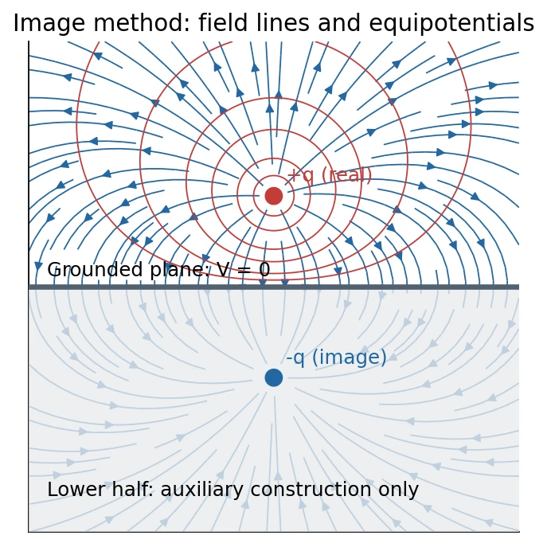
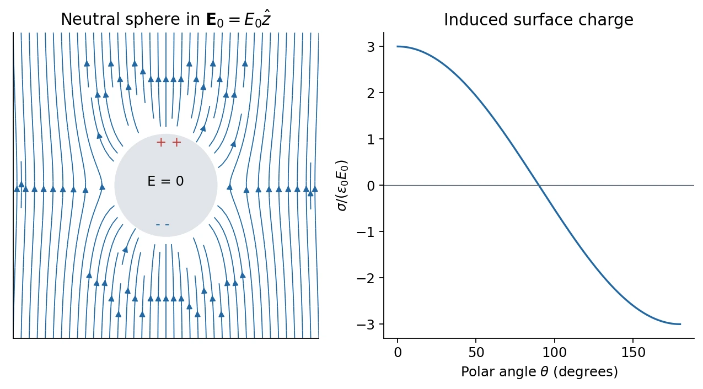
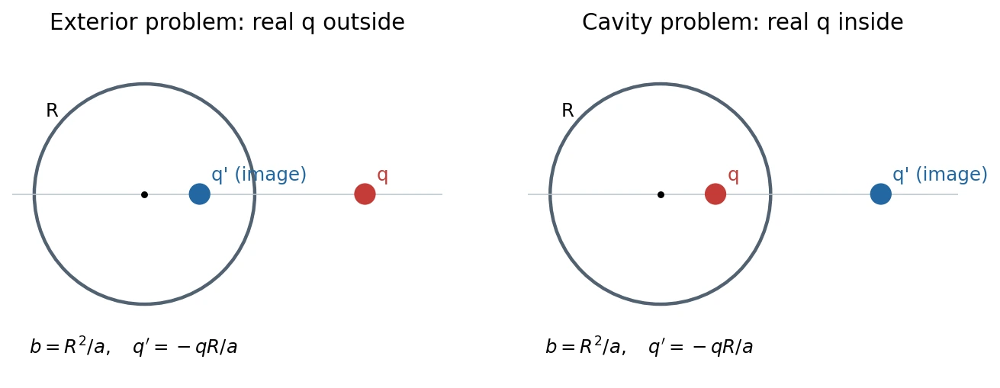

# 5 · Conductors, Electrostatic Shielding, and Image Charges

[Course index](index.md) · [Previous: the electrostatics triangle](04-triangle-of-electrostatics.md) · [Next: current, resistance, and capacitance](06-current-resistance-and-capacitance.md)

## Main results（核心结论）

An ideal conductor in electrostatic equilibrium has zero electric field in its material, constant potential throughout each connected conductor, and excess charge on its surfaces. Its external field is normal to the surface. Unknown induced charge can sometimes be replaced mathematically by image charges that reproduce the correct source equation and boundary conditions in the physical region.

**Every result in this chapter has a region:** conductor material, empty cavity, charged cavity, or exterior. These regions must not be interchanged.

## 1. Electrostatic equilibrium of a conductor

Conduction electrons can move through a metal. If a persistent macroscopic electric field existed in its bulk, they would respond and rearrange; that would contradict electrostatic equilibrium. Therefore

$$
\mathbf E_{\mathrm{metal}}=0,\qquad
\rho_{q,\mathrm{bulk}}=\epsilon_0\nabla\cdot\mathbf E=0,\qquad
V_{\mathrm{metal}}=V_c.
$$

Here zero bulk charge density means no net macroscopic **excess** volume charge. Metal still contains positively charged ion cores and electrons. Surface charge supplies the equilibrium boundary conditions.

A Gaussian surface entirely within the metal encloses zero net charge. This gives a powerful constraint on a cavity, but by itself only determines the **total** inner-wall charge, not its spatial distribution.

The constant $V_c$ is not automatically zero. Grounding fixes the conductor's potential to the chosen reference and allows charge exchange with a reservoir. An isolated conductor instead has a specified conserved net charge and an initially unknown potential.

**中文提示：**“导体内部电场为零”是静电平衡条件。下一课有稳恒电流的真实电阻导线内部需要非零电场，不能把本课条件机械套用到那里。

## 2. Boundary fields and surface charge

The tangential field just outside an equilibrium conductor must vanish; otherwise carriers would move along its surface. Let $\hat{\mathbf n}$ point **out of the metal into vacuum**. A small pillbox straddling the surface gives

$$
(\mathbf E_{\mathrm{out}}-\mathbf E_{\mathrm{in}})\cdot\hat{\mathbf n}
=\frac{\sigma_s}{\epsilon_0}.
$$

Since $\mathbf E_{\mathrm{in}}=0$,

$$
\boxed{\mathbf E_{\mathrm{out}}=\frac{\sigma_s}{\epsilon_0}\hat{\mathbf n},\qquad
\sigma_s=-\epsilon_0\frac{\partial V}{\partial n}\bigg|_{\mathrm{vacuum}}.}
$$

For a negative surface charge, the vector points into the metal. At an **inner cavity wall**, the normal out of the metal points into the cavity, opposite to the radial outward direction of a spherical cavity.

### Why this differs from a prescribed sheet

A single infinite nonconducting sheet produces fields $\pm\sigma_s/(2\epsilon_0)$ on its two sides. At a conductor, the field from all charges has been arranged to cancel on the metal side and add on the vacuum side. Its boundary value is therefore $\sigma_s/\epsilon_0$. Do not mix an individual sheet's contribution with the total field at a conducting boundary.

## 3. Isolated spherical conductor

For a spherical conductor of radius $R$ and net charge $Q$, with no external sources or internal cavity charges, symmetry gives uniform surface charge:

$$
\sigma_s=\frac{Q}{4\pi R^2},\qquad
\mathbf E=
\begin{cases}
0,&r<R,\\
\displaystyle\frac{kQ}{r^2}\hat{\mathbf r},&r>R,
\end{cases}
$$

and with the zero at infinity,

$$
V(r)=
\begin{cases}
kQ/R,&r\le R,\\
kQ/r,&r\ge R.
\end{cases}
$$

The potential is continuous; its derivative jumps because of surface charge. Compare this with the [uniformly volume-charged insulating ball](03-electric-potential.md): same outside field, different inside field and potential.

For a nonspherical conductor, surface charge is generally nonuniform. Sharper exposed regions can have larger field enhancement. This is a global boundary-value problem; there is no universal local rule $\sigma_s\propto1/R_{\mathrm{curvature}}$ for every geometry and environment.

## 4. Cavities and electrostatic shielding（静电屏蔽）

### Empty closed cavity

If a cavity contains no charge, its boundary is one equipotential surface. The charge-free interior obeys Laplace's equation. The constant solution meets the boundary data and is unique, so the cavity field is zero. External electrostatic sources can redistribute outer-surface charges and change the common potential, but cannot create a field in the empty closed cavity of an ideal equilibrium conductor.

This conclusion does not follow solely from zero enclosed charge: zero net flux alone is insufficient. The equipotential boundary and uniqueness are essential for a general cavity shape.

### Cavity containing charge

If a cavity contains total charge $q$, choose a Gaussian surface in the surrounding metal. Then

$$
q+Q_{\mathrm{inner}}=0,\qquad Q_{\mathrm{inner}}=-q.
$$

If the conductor is isolated with net charge $Q_c$,

$$
Q_{\mathrm{outer}}=Q_c+q.
$$

For a neutral shell and an internal charge $-Q$, the inner wall carries $+Q$ and the outer wall $-Q$, as in the slides. An off-center internal charge produces a nonuniform inner-wall density. A spherical outer boundary with no external sources has a uniform outer density, even if the internal charge is off center.

For fixed cavity sources, external sources change the cavity potential by at most a constant, leaving its field unchanged. Conversely, moving internal charges while keeping their total charge and the exterior conditions fixed does not change the exterior field of the closed equilibrium conductor. **Adding** internal net charge to an isolated shell changes its outer charge and can change the exterior field; shielding does not erase total-charge accounting.

### Grounded versus isolated shell

With no external sources, a grounded shell has zero exterior potential and field. The earth can supply or remove charge; the shell need not remain neutral. For an isolated neutral spherical shell, an internal charge $q$ leaves outer charge $+q$, so its exterior field is nonzero.

The classroom's car/Faraday-cage illustration motivates shielding. The mathematical treatment here is electrostatic; time-dependent shielding requires additional material, frequency, and geometry considerations.

## 5. Uniqueness and the method of images（唯一性与镜像法）

For a specified charge density in a region and specified potential on its boundary, Poisson's equation has at most one solution, with appropriate behavior at infinity in unbounded problems.

To see the idea, let two solutions differ by $w$. They obey $\nabla^2w=0$ and $w=0$ on the boundary. Green's identity gives

$$
\int_{\mathcal V}|\nabla w|^2\,d\mathcal V
=\oint_Sw\frac{\partial w}{\partial n}\,dA-\int_{\mathcal V}w\nabla^2w\,d\mathcal V=0.
$$

Thus $\nabla w=0$ and the boundary fixes the remaining constant. This elementary proof assumes suitable regularity; singular real charges can be handled by subtracting their identical singular parts.

The image method constructs a simpler auxiliary source system with:

1. The same **real** charges in the physical region.
2. The same boundary potentials and far-field conditions.
3. Image charges placed **outside that physical solution region**.

Uniqueness then guarantees the correct potential and field in that region. Images are mathematical replacements for induced charges, not real extra particles. The auxiliary solution is not generally valid inside the metal.

## 6. Point charge above a grounded plane

Let the conductor occupy $z\le0$, with $V=0$ at $z=0$. Place a real charge $q$ at $(0,0,d)$, $d>0$. Replace the conductor by an image $-q$ at $(0,0,-d)$. In the physical upper half-space,

$$
V(x,y,z)=kq\left[
\frac1{\sqrt{x^2+y^2+(z-d)^2}}
-\frac1{\sqrt{x^2+y^2+(z+d)^2}}\right].
$$

The distances agree on $z=0$, so the boundary potential is zero. The solution tends to zero at infinity and has only the real charge singularity in $z>0$.

### Induced surface density

Let $s=\sqrt{x^2+y^2}$ measure distance along the plane from the foot of the charge. At $z=0^+$,

$$
\boxed{\sigma_s(s)=-\epsilon_0\frac{\partial V}{\partial z}
=-\frac{qd}{2\pi(s^2+d^2)^{3/2}}.}
$$

For $q>0$ the density is negative everywhere and largest in magnitude below the charge. Integration confirms

$$
Q_{\mathrm{ind}}=\int_0^\infty\sigma_s(s)2\pi s\,ds=-q.
$$

### Force and the energy factor of one half

The induced-charge force on the real charge equals the image's Coulomb force:

$$
\mathbf F_{\mathrm{ind}}=-\frac{kq^2}{(2d)^2}\hat{\mathbf z}
=-\frac{q^2}{16\pi\epsilon_0d^2}\hat{\mathbf z}.
$$

With the configuration energy defined as zero at $d\to\infty$, integrate $F_z=-dU/dd$:

$$
\boxed{U(d)=-\frac{kq^2}{4d}=-\frac{q^2}{16\pi\epsilon_0d}.}
$$

This is the quasistatic external work required to bring $q$ from infinity. It is half the energy $-kq^2/(2d)$ of **two real fixed charges** separated by $2d$. The image location changes as the real charge moves; counting it as an independent real charge gives the wrong work. Equivalently, $U=\tfrac12qV_{\mathrm{ind}}$ for this grounded linear response.

## 7. Classroom supplement: neutral sphere in a uniform field

Class 5, approximately 60:47–70:40, constructs an equivalent dipole to solve this problem. A neutral conducting sphere of radius $R$ is placed in $\mathbf E_0=E_0\hat{\mathbf z}$. Choose its constant potential as zero. Outside,

$$
\boxed{V(r,\theta)=-E_0r\cos\theta+E_0\frac{R^3}{r^2}\cos\theta,\qquad r\ge R.}
$$

The first term is the applied uniform field; the second is an induced dipole potential. At $r=R$ they cancel, and far away the dipole correction vanishes. Thus

$$
\mathbf p_{\mathrm{ind}}=4\pi\epsilon_0R^3\mathbf E_0.
$$

The full exterior field is

$$
E_r=E_0\left(1+\frac{2R^3}{r^3}\right)\cos\theta,\qquad
E_\theta=-E_0\left(1-\frac{R^3}{r^3}\right)\sin\theta.
$$

At the surface, $E_\theta=0$ and $E_r=3E_0\cos\theta$, giving

$$
\boxed{\sigma_s(\theta)=3\epsilon_0E_0\cos\theta.}
$$

Its integral is zero, as required for a neutral sphere. The positive and negative ends have opposite induced charge. **The field is normal at the conducting surface; it is not generally purely radial everywhere outside.** Inside the material, both components vanish.

This construction illustrates the principle that a fictitious interior dipole may reproduce the **exterior** response without reproducing the physical interior field. The sphere-in-uniform-field and external-sphere image constructions are also discussed in [Feynman, Vol. II, chapter 6](https://www.feynmanlectures.caltech.edu/II_06.html).

## 8. Classroom supplement: spherical image construction

Class 5, approximately 71:27–90:28, develops a nonplanar image. The transcript shifts between a charge in a cavity and a charge outside a sphere. The geometry determines which solution is physical, so both cases are written explicitly below.

Let a spherical boundary have radius $R$. A real charge $q$ lies on the positive $z$ axis at $z=a$, with $a\ne R$ and $a>0$. Seek an image $q'$ at $z=b$ such that the boundary potential vanishes. For a point on the sphere,

$$
s_a^2=R^2+a^2-2Ra\cos\theta,\qquad
s_b^2=R^2+b^2-2Rb\cos\theta.
$$

Setting

$$
\boxed{b=\frac{R^2}{a},\qquad q'=-\frac{R}{a}q}
$$

gives $s_b=(R/a)s_a$, so $q/s_a+q'/s_b=0$ at every boundary point. This verifies the boundary for all angles, not just on the symmetry axis.

### Case A: real charge outside a grounded sphere, $a>R$

The physical region is $r>R$; the image lies inside the sphere. The exterior potential is

$$
V(\mathbf r)=k\left[\frac q{|\mathbf r-a\hat{\mathbf z}|}
+\frac{q'}{|\mathbf r-b\hat{\mathbf z}|}\right],\qquad r>R.
$$

Differentiation at the outer surface yields

$$
\sigma_s(\theta)=-\frac{q}{4\pi R}
\frac{a^2-R^2}{(R^2+a^2-2Ra\cos\theta)^{3/2}},\qquad
Q_{\mathrm{ind}}=-\frac{qR}{a}=q'.
$$

The attraction is toward the sphere:

$$
\mathbf F=-\frac{kq^2Ra}{(a^2-R^2)^2}\hat{\mathbf z}.
$$

If the sphere is **isolated and neutral**, this grounded solution has the wrong total sphere charge. Add a central image $q_0=-q'=qR/a$. It changes the surface potential by a constant and makes the net auxiliary sphere charge zero. Thus grounding and neutrality are different boundary conditions. [Feynman's image-method discussion](https://www.feynmanlectures.caltech.edu/II_06.html) gives this distinction.

### Case B: real charge inside a grounded spherical cavity, $0<a<R$

The physical region is $r<R$; the image lies **outside the cavity**. The same potential expression is valid only inside the cavity. Because the normal from metal into the cavity is $-\hat{\mathbf r}$, its wall density is

$$
\boxed{\sigma_{\mathrm{inner}}(\theta)
=-\frac{q}{4\pi R}
\frac{R^2-a^2}{(R^2+a^2-2Ra\cos\theta)^{3/2}},\qquad
Q_{\mathrm{inner}}=-q.}
$$

The real charge is attracted toward the nearer wall:

$$
\mathbf F=\frac{kq^2Ra}{(R^2-a^2)^2}\hat{\mathbf z}.
$$

Here the inner-wall total charge is **not** the image charge $q'=-qR/a$. Gauss's law requires $-q$. The exterior grounded-sphere identity $Q_{\mathrm{ind}}=q'$ cannot be carried into the cavity problem.

At $a=0$, treat the limit separately:

$$
V(r)=kq\left(\frac1r-\frac1R\right),\qquad
\sigma_{\mathrm{inner}}=-\frac q{4\pi R^2}.
$$

For an isolated shell with this cavity, adding the shell's constant $V_c$ changes no cavity field or wall density. If the outer surface is a sphere of radius $B$, no exterior sources exist, and the shell is neutral, then $Q_{\mathrm{outer}}=q$ and $V_c=kq/B$. Use the **outer** radius for this potential, not automatically the cavity radius $R$.

## 9. Checks and common errors

- **Regions:** zero field in metal does not mean zero field in a charged cavity or outside the conductor.
- **Normals:** the normal out of metal at a spherical cavity points toward the center.
- **Grounding:** fixed zero potential permits charge transfer; it does not require zero net charge.
- **Image location:** keep images out of the physical region where you claim the solution.
- **Boundary test:** verify potential at every boundary point, source singularities, and far-field behavior.
- **Charge check:** integrate the predicted surface density and compare with the physical charge constraint.
- **Force:** evaluate the field of induced charges at the real charge, excluding its own field.
- **Energy:** do not compute physical work by treating image charges as independent real charges.

## References

Lecture 5 PDF pp. 5–24 covers equilibrium, surface fields, and shielding; pp. 25–30 covers the grounded plane and energy exercise. The uniform-field sphere and spherical images come from class-5 explanations rather than separate pages in the supplied PDF. The [source map](source-map.md) records the classroom/transcript ambiguities and their resolution.
