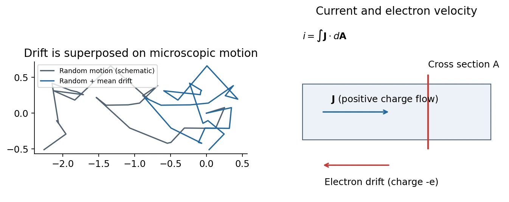
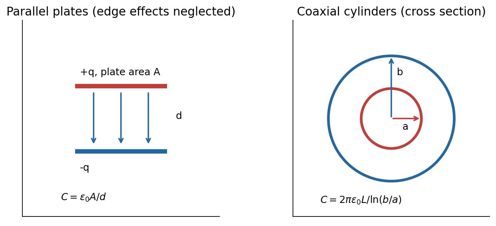

# 6 · Current, Resistance, and Capacitance

[Course index](index.md) · [Previous: conductors and images](05-conductors-and-image-charges.md) · [Formula sheet](quick-reference.md)

## Main results（核心结论）

Current measures charge crossing a surface per unit time. Current density links it to carrier motion. Resistance depends on material and geometry; the Drude model connects material conductivity to carrier density and momentum relaxation. Charge conservation gives the continuity equation. Capacitance relates separated charge to potential difference and, for fixed linear media, is determined by geometry and the surrounding dielectric response.

Prerequisites: electric field and potential difference, charge density, flux, divergence, and the microscopic meaning of an average.

## 1. Electric current（电流）

The signed current through a chosen cross section is

$$
i(t)=\frac{dq_{\mathrm{crossed}}}{dt},\qquad
q_{\mathrm{crossed}}(t_2)-q_{\mathrm{crossed}}(t_1)=\int_{t_1}^{t_2}i(t)\,dt.
$$

Here $q_{\mathrm{crossed}}$ is cumulative charge crossing the section in the chosen positive direction, not necessarily charge stored in a fixed volume. Current has unit C/s = A. It is a signed scalar associated with an oriented cross section; current density is the spatial vector field.

**Conventional current** follows positive-charge motion. In a metal, electrons drift in the opposite direction. A negative carrier moving toward $-x$ contributes positive current toward $+x$.

For a steady current through an unbranched wire, the same current passes through every cross section because charge does not accumulate between them. At a steady junction,

$$
\sum i_{\mathrm{in}}=\sum i_{\mathrm{out}}.
$$

This is charge conservation, not ordinary geometric vector addition of current arrows. During a transient, net current into a region can change its stored charge.

## 2. Current density and drift velocity

Define $\mathbf J$ so that

$$
\boxed{i=\int_S\mathbf J\cdot d\mathbf A.}
$$

For uniform $\mathbf J$ normal to a cross section of area $A$, $i=JA$. For carriers with number density $n$, signed charge $q_c$, and mean drift velocity $\mathbf v_d$,

$$
\boxed{\mathbf J=nq_c\mathbf v_d.}
$$

Derivation: in time $dt$, carriers in a swept cylinder of volume $A v_d dt$ cross a perpendicular section. Their charge is $nq_cAv_d dt$. For multiple carrier species, sum $\mathbf J=\sum_sn_sq_s\mathbf v_{d,s}$.

For electrons,

$$
\mathbf J=-ne\mathbf v_d,\qquad |v_d|=\frac{|i|}{neA}.
$$

### Drift speed is not microscopic speed or signal speed

Without an applied field, electrons still have microscopic motion but zero mean drift. An applied field introduces a small nonzero mean superposed on that motion. For $i=1\ \mathrm A$, $A=1\ \mathrm{mm^2}$, and $n=8.47\times10^{28}\ \mathrm{m^{-3}}$,

$$
|v_d|\approx7.37\times10^{-5}\ \mathrm{m/s}.
$$

This small speed does not mean an electrical signal waits for one electron to traverse the whole wire. The electromagnetic response propagates through the circuit much faster; its propagation speed depends on the transmission environment.

## 3. Resistance, resistivity, and conductivity

Let $\Delta V$ denote a voltage drop in the direction of positive current through a passive element. Define its operating-point resistance by

$$
R=\frac{\Delta V}{i},\qquad [R]=\Omega.
$$

For an isotropic material in its linear-response regime,

$$
\mathbf J=\sigma_{\mathrm{cond}}\mathbf E,\qquad
\mathbf E=\rho_{\mathrm{res}}\mathbf J,\qquad
\rho_{\mathrm{res}}=\frac1{\sigma_{\mathrm{cond}}}.
$$

Conductivity has unit S/m; resistivity has unit Ω·m. These are material properties under specified temperature and other conditions. Resistance is a property of the whole object, including its geometry.

For a uniform straight wire of length $L$, area $A$, and constant material resistivity,

$$
\Delta V=EL,\qquad i=JA,\qquad
\boxed{R=\rho_{\mathrm{res}}\frac LA.}
$$

Assumptions include approximately uniform longitudinal field/current density and negligible contact/end corrections. A varying-area wire can be treated by $R=\int\rho_{\mathrm{res}}(x)\,dx/A(x)$ when one-dimensional current flow remains a suitable approximation.

### What Ohm's law asserts

Ohm's law means voltage and current are proportional while relevant physical conditions remain fixed. Defining $R=\Delta V/i$ at a point does **not** prove that $R$ is independent of voltage or current.

A diode or tunneling junction may have a nonlinear $i$–$\Delta V$ curve; a heated metallic wire can change its resistance as temperature changes. The small-signal differential resistance $d(\Delta V)/di$ need not equal the ratio $\Delta V/i$.

**中文提示：**电阻 $R$ 与电阻率 $\rho_{\mathrm{res}}$ 不是同一量；“写成 $R=V/i$”是定义，“同一条件下 $R$ 为常数”才是欧姆行为。

## 4. Drude model（德鲁德模型）

The slides use a free-electron picture with randomizing collisions. Between scattering events an electron accelerates according to

$$
\mathbf a=-\frac e{m_e}\mathbf E.
$$

Introduce a momentum-relaxation time $\tau$. A useful averaged equation is

$$
m_e\frac{d\mathbf v_d}{dt}=-e\mathbf E-\frac{m_e\mathbf v_d}{\tau}.
$$

For a constant field after the mean drift reaches steady state,

$$
\mathbf v_d=-\frac{e\tau}{m_e}\mathbf E,
$$

so

$$
\boxed{\mathbf J=\frac{ne^2\tau}{m_e}\mathbf E,\qquad
\sigma_{\mathrm{cond}}=\frac{ne^2\tau}{m_e},\qquad
\rho_{\mathrm{res}}=\frac{m_e}{ne^2\tau}.}
$$

The direction reversal between electron charge and electron drift cancels, so conventional current is along $\mathbf E$. The factor is $\tau$, not $\tau/2$: $\tau$ is the relaxation time of the ensemble, not a stipulated identical flight interval for every particle.

The model predicts Ohmic response when $n$ and $\tau$ are approximately independent of the applied field. Real solids may require effective masses, energy-dependent relaxation, multiple bands, and anisotropic conductivity. A perfect periodic lattice is not simply a collection of independent classical hard obstacles: phonons, impurities, and defects are important scattering mechanisms.

### Copper example: density and relaxation time

Assuming approximately one conduction electron per copper atom,

$$
n\simeq\frac{\rho_{\mathrm{mass}}}{M_{\mathrm{molar}}}N_A
\approx8.47\times10^{28}\ \mathrm{m^{-3}}.
$$

Here the approximately 63.5 g/mol value is copper's **molar mass**, not its atomic number. The lecture input is

$$
\rho_{\mathrm{res}}=1.56\ \mu\Omega\!\cdot\!\mathrm{cm}
=1.56\times10^{-8}\ \Omega\!\cdot\!\mathrm m.
$$

Therefore

$$
\tau=\frac{m_e}{\rho_{\mathrm{res}}ne^2}
\approx2.69\times10^{-14}\ \mathrm s.
$$

In the **classical estimate used in the slide exercise**, equipartition at $T=300\ \mathrm K$ gives

$$
v_{\mathrm{rms}}=\sqrt{\frac{3k_BT}{m_e}}\approx1.17\times10^5\ \mathrm{m/s},\qquad
\ell\sim v_{\mathrm{rms}}\tau\approx3.1\ \mathrm{nm}.
$$

This is an RMS speed, not the drift speed or the Maxwell-distribution mean speed. It is a model estimate, not the best quantum estimate for copper.

### Classroom refinement: Fermi motion and low temperature

The instructor then points out that conduction electrons in a metal are not a dilute classical gas. States are filled up to a Fermi energy, and electrons do not all come to rest as $T\to0$. Relevant microscopic transport speeds are of order the Fermi velocity; the Drude drift formula can remain useful while the classical thermal-speed estimate fails.

For scale, a one-band free-electron estimate based on the same density gives

$$
k_F=(3\pi^2n)^{1/3},\qquad v_F=\frac{\hbar k_F}{m_e}\approx1.57\times10^6\ \mathrm{m/s},\qquad
\ell\sim v_F\tau\approx42\ \mathrm{nm}.
$$

This quantified comparison is an explanatory deduction from the classroom's Fermi-motion discussion. It is not a full theory of electron transport.

Cooling an ordinary metal typically reduces phonon scattering and increases $\tau$. Impurity and defect scattering can leave residual resistivity. For roughly unchanged carrier density and microscopic speed, $\rho_{\mathrm{res}}\propto1/\tau$ and $\ell\propto\tau$. Impurity scattering need not be inelastic; static impurities often produce elastic scattering.

## 5. Classroom application: electrical and thermal transport

Approximately 54–62 minutes of class 6 connects good electrical conduction with good thermal conduction. For ordinary metals in an appropriate regime, electrons transport both charge and heat. The electronic thermal conductivity $\kappa_e$ approximately satisfies the **Wiedemann–Franz law（维德曼–弗兰兹定律）**:

$$
\boxed{\frac{\kappa_e}{\sigma_{\mathrm{cond}}T}\simeq L_0,\qquad
L_0=\frac{\pi^2}{3}\left(\frac{k_B}{e}\right)^2
\approx2.44\times10^{-8}\ \mathrm{W\,\Omega/K^2}.}
$$

At a fixed temperature, reducing electronic conductivity tends to reduce electronic heat conduction in this regime. This does not apply indiscriminately to total thermal conductivity, semiconductors, superconductors, or regimes with substantially different heat and charge relaxation. The formula and Lorenz-number convention are supported by [MIT OCW's transport lecture notes](https://ocw.mit.edu/courses/2-57-nano-to-macro-transport-processes-spring-2012/2e4ecaa5cf55f03bcefbc8ccce79aed6_MIT2_57S12_lec_notes_2004.pdf).

The classroom uses two experimental design examples:

- A high-purity copper sample stage helps reduce temperature gradients. A thin gold coating can protect surfaces from oxidation and help preserve useful contacts.
- Measurement wires between room temperature and a cold stage should limit heat leakage. Suitable resistive alloys trade higher electrical resistance for lower heat conduction; material choice must also meet the signal requirements.

Diamond illustrates why electrical and thermal conduction need not track: it can be electrically insulating while conducting heat well through lattice vibrations. These are qualitative applications, not universal engineering prescriptions.

The teacher briefly mentions Peltier effects (coupled heat and charge transport) and Hall measurements (carrier-sign information in simple cases). Their quantitative theories require later material and are not developed here.

## 6. Continuity equation: local charge conservation

For a fixed volume $\mathcal V$ bounded by outward-oriented $S$,

$$
Q_{\mathcal V}(t)=\int_{\mathcal V}\rho_q(\mathbf r,t)\,d\mathcal V,
\qquad
\frac{dQ_{\mathcal V}}{dt}=-\oint_S\mathbf J\cdot d\mathbf A.
$$

The outward current reduces charge stored inside. For sufficiently regular fields, the divergence theorem gives

$$
\int_{\mathcal V}\left(\frac{\partial\rho_q}{\partial t}+\nabla\cdot\mathbf J\right)d\mathcal V=0.
$$

Since the volume is arbitrary,

$$
\boxed{\frac{\partial\rho_q}{\partial t}+\nabla\cdot\mathbf J=0.}
$$

This is the **continuity equation（连续性方程）**. In steady state, $\partial_t\rho_q=0$ and $\nabla\cdot\mathbf J=0$. Steady flow means a time-independent charge distribution, not motionless individual carriers.

### Classroom preview: displacement current

Combining charge conservation with $\nabla\cdot\mathbf E=\rho_q/\epsilon_0$ gives

$$
\nabla\cdot\left(\mathbf J+\epsilon_0\frac{\partial\mathbf E}{\partial t}\right)=0.
$$

The second term has units of current density and is the vacuum displacement-current term. The instructor introduces this as a consistency clue toward Maxwell's equations. This identity alone does not derive the entire magnetic-field equation, and displacement current is not literal charge conduction through empty space.

## 7. Capacitors and capacitance（电容器与电容）

A two-conductor capacitor separates equal and opposite charges $+q$ and $-q$. The **charge of the capacitor** conventionally means the magnitude $q$ on one plate; its total plate charge is zero.

Each conducting plate is equipotential. Define the positive voltage difference between the positively and negatively charged plates as $\Delta V=V_+-V_-$. For fixed geometry and a linear medium,

$$
\boxed{q=C\Delta V,\qquad C=\frac q{\Delta V}>0.}
$$

The unit is C/V = F (farad). Common scales are $\mu\mathrm F=10^{-6}\ \mathrm F$ and $\mathrm{pF}=10^{-12}\ \mathrm F$.

Why is $C$ independent of $q$ in this model? Multiplying every source charge by a factor multiplies the field and voltage difference by the same factor. Their ratio stays fixed. This assumes unchanged geometry and linear response; it is not a claim about all real devices at arbitrary voltages.

The calculation strategy in the slides is:

1. Assign $\pm q$ to the two conductors.
2. Calculate the field between them, usually using Gauss's law.
3. Integrate the field to obtain $\Delta V$.
4. Form $C=q/\Delta V$ and verify that $q$ cancels.

### Parallel-plate capacitor

For plate area $A$ and separation $d$, ignore fringing when $d$ is much smaller than the lateral plate dimensions. The approximately uniform field is

$$
E=\frac{\sigma_s}{\epsilon_0}=\frac q{\epsilon_0A},\qquad
\Delta V=Ed,\qquad
\boxed{C=\frac{\epsilon_0A}{d}.}
$$

Larger area stores more charge for the same voltage. Smaller separation requires less voltage for the same charge. Edges have nonuniform fringe fields, so the ideal formula is an approximation for finite plates.

As discussed in class, if $A$ remains fixed and $d$ changes slightly, $\Delta C/C\simeq-\Delta d/d$. This motivates capacitive displacement sensing. Under a fixed voltage, $q$ changes with $C$; with isolated plates and fixed $q$, $\Delta V$ changes instead.

### Coaxial cylindrical capacitor

The inner conductor has radius $a$, the inner surface of the outer conductor radius $b>a$, and the overlapping length is $L\gg b$ so end effects can be neglected. A coaxial Gaussian cylinder of radius $r$, $a<r<b$, gives

$$
E_r(r)=\frac q{2\pi\epsilon_0Lr}.
$$

The inner-positive voltage difference is

$$
\Delta V=V(a)-V(b)=\int_a^bE_r\,dr
=\frac q{2\pi\epsilon_0L}\ln\frac ba.
$$

Thus

$$
\boxed{C=\frac{2\pi\epsilon_0L}{\ln(b/a)}.}
$$

The potential varies logarithmically across the radial gap. If $b=a+d$ with $d\ll a$, then $\ln(b/a)\simeq d/a$, and $C\simeq\epsilon_0(2\pi aL)/d$: the local parallel-plate limit.

Although a cylindrical wire's axial resistance and a coaxial capacitor's capacitance both scale with length, their current/field geometries differ. The capacitor field crosses the radial gap; the wire's current travels along its length.

## 8. Series and parallel combinations: classroom extension

Class 6, approximately 88–89 minutes, derives these combinations geometrically using parallel plates. They also follow from equal-voltage and charge-conservation constraints.

| Connection | Constraint | Equivalent capacitance |
| --- | --- | --- |
| Parallel（并联） | Same $\Delta V$; charges add | $C_{\mathrm{eq}}=\sum_iC_i$ |
| Series（串联） | Equal charge magnitudes on capacitors with initially neutral floating intermediate nodes; voltages add | $1/C_{\mathrm{eq}}=\sum_i1/C_i$ |

Parallel plates with the same gap act like added area. Series plate gaps with equal area act like added separation. The circuit formulas assume ideal lumped capacitors and negligible unintended mutual capacitance; a charged intermediate node requires explicit charge accounting.

For two identical capacitors $C$, parallel gives $2C$ and series gives $C/2$. These limiting checks quickly detect an inverted formula.

## 9. Materials supplement: semiconductors and superconductors

The class finishes by discussing the supplied slide appendices rather than proceeding to full circuit dynamics.

### Semiconductors

Their small equilibrium carrier population can be strongly affected by temperature and controlled doping. Thermal excitation can increase carrier density even while scattering becomes stronger. A schematic two-carrier conductivity is

$$
\sigma_{\mathrm{cond}}=e(n_e\mu_e+n_h\mu_h),
$$

where $\mu_e,\mu_h$ are positive mobilities of electrons and holes. This is a clarification of the slide's one-carrier model, not a full band-theory derivation. Material purity and controlled impurity concentration matter because they alter carriers as well as scattering. Temperature dependence is regime dependent; not every semiconductor device is an Ohmic element.

### Superconductors

The main observation is zero DC resistivity below a critical temperature, within the allowed field and current range. A superconductor is not merely an ordinary metal with a very long Drude relaxation time. It is a distinct quantum phase; its Meissner response also distinguishes it from an ideal perfect conductor.

The class introduces the qualitative BCS picture: in conventional superconductors, an effective attraction associated with the lattice permits Cooper pairing, and a coherent superconducting state supports dissipationless response. Individual scattering is not simply eliminated because electrons travel as classical collision-proof pairs. A microscopic derivation and superconducting magnetism lie beyond these lectures. These distinctions are supported by [OpenStax, University Physics, superconductivity](https://openstax.org/books/university-physics-volume-3/pages/9-8-superconductivity).

The John Bardeen slide connects the transistor and BCS theory to electronic materials. Historical anecdotes are background, not assumptions in the calculations above.

## 10. Common errors and self-checks

- $i$ is a signed scalar for a chosen section; $\mathbf J$ is a vector field.
- Use the carrier's signed charge in $\mathbf J=nq_c\mathbf v_d$.
- A steady-current wire does not obey the zero-internal-field condition of electrostatic equilibrium.
- Distinguish drift velocity, microscopic velocity, and signal propagation.
- Convert $\mu\Omega\cdot\mathrm{cm}$ to Ω·m before calculating $\tau$.
- The mean free path uses microscopic speed times relaxation time, not drift speed times relaxation time.
- The continuity equation's minus sign means outward current reduces enclosed charge.
- A capacitor's quoted charge is one plate's magnitude, not the algebraic sum of the two plates.
- Specify what is held fixed when capacitor geometry changes: charge or voltage.
- Capacitance formulas include geometric approximations and a medium assumption.

## References

Lecture 6 PDF pp. 3–18 covers current, drift, resistance, and continuity; pp. 19–28 covers capacitance; pp. 33–38 provides the material appendices. Class 6, 35–64 minutes, supplies the copper-density, Fermi-motion, and thermal-transport extensions; approximately 68–70 minutes previews displacement current; approximately 88–99 minutes covers capacitor combinations and material supplements. Full circuit laws, RC transients, and capacitor energy are reserved for later notes.
