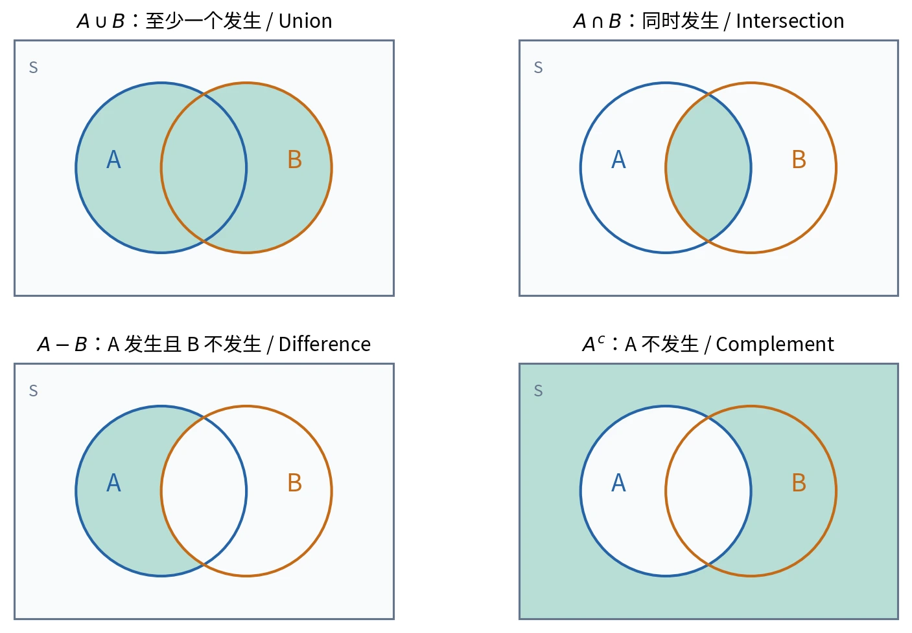

# §1.1 样本空间与随机事件（Sample Space and Events）

## 核心思路

概率建模的第一步是说明“试验产生什么结果”，第二步是把“关心的情况”写成结果的集合。**样本空间是所有可能结果的集合，事件是其中关心的子集；事件发生，指本次结果落入该子集。**

## 随机现象与随机试验

**确定性现象（deterministic phenomenon）**：在给定条件下，结果确定。例如理想条件下向上抛出的物体会下落。

**随机现象（random phenomenon）**：个别试验的结果不确定，但大量重复试验呈现统计规律性（statistical regularity）。例如抛硬币、掷骰子、记录产品寿命。课程关注的是这种数量规律，而非预测每一次具体结果。

对随机现象进行的观察、记录或实验，统称为**随机试验（random experiment）**，记为 $E$。本课程采用的基本描述有三个特征：

1. 可以在相同条件下重复进行。
2. 可能结果不止一个，且事先知道所有可能结果构成的范围。
3. 试验完成前，不能确定具体会出现哪一个结果。

“知道所有可能结果”不要求逐个列出无限多个结果：用集合条件描述也可以。

## 样本空间与样本点

**样本空间（sample space）**是随机试验所有可能结果构成的集合，记作 $S$ 或 $\Omega$。其中一个元素称为**样本点（sample point / outcome）**，记作 $\omega$。

| 试验及观察目标 | 样本空间 | 类型 |
| --- | --- | --- |
| 抛一枚硬币一次，记录正反面 | $S=\{H,T\}$，$H$ 为 heads，$T$ 为 tails | 有限 |
| 掷一枚骰子一次，记录点数 | $S=\{1,2,3,4,5,6\}$ | 有限 |
| 记录某城市一日交通事故次数 | $S=\{0,1,2,\ldots\}$ | 可列无限 |
| 记录产品寿命，以时间连续取值建模 | $S=[0,\infty)$，或按假定界限取 $[a,b]$ | 不可列 |
| 记录一昼夜最高温度 $x$、最低温度 $y$ | $S=\{(x,y):T_0\le y\le x\le T_1\}$ | 不可列，二维区域 |

这里的边界是建模假设，必须与题目条件一致。例如产品可能立即失效时应允许寿命为 $0$；有限寿命上界不是普遍规律。

### 有限、可列与不可列

- **有限集（finite set）**：只有有限个元素。
- **可列无限集（countably infinite set）**：可以与正整数集建立一一对应，即能按 $1,2,3,\ldots$ 编号。整数集、有理数集是典型例子。
- **不可列集（uncountable set）**：不能如此编号，如非退化实数区间。
- **至多可数（at most countable）**：包括有限集与可列无限集。一些英文教材也把两者统称为 countable，阅读时留意约定。

$S=\{s_1,\ldots,s_n\}$ 只表示有限情形，样本空间也可以是无限集。

### 样本空间与观察目标有关

同样是掷骰子，记录点数时可取 $\{1,\ldots,6\}$，只记录奇偶时可取 $\{\text{odd},\text{even}\}$。两者精细程度不同，后者不能再区分“点数为 1”和“点数为 3”。

建模时要保证结果**不重不漏**，且能表达题目所求事件。改变样本空间后，必须重新判断各结果是否等可能，不能只改变结果数量而保留原概率计算方式。

## 事件与“发生”的含义

**事件（event）**用样本空间中的子集 $A$ 表示。若本次结果是 $\omega$，则

$$
A\text{ 发生}\quad\Longleftrightarrow\quad\omega\in A.
$$

一次试验只产生一个样本点，但这个点可以同时属于多个事件。**事件含有多个样本点，不是要求这些样本点同时出现。**

例如掷骰子，$A=\{2,4,6\}$ 表示“出现偶数（an even number is obtained）”；出现 $2$、$4$、$6$ 中任意一个都使 $A$ 发生。

再如抛硬币三次，以结果的先后顺序为样本点：

$$
S=\{HHH,HHT,HTH,THH,HTT,THT,TTH,TTT\}.
$$

“至少出现两次正面（at least two heads）”对应

$$
A=\{HHH,HHT,HTH,THH\}.
$$

对连续空间，事件还需满足可测性要求；这里使用的区间和几何区域均为可测集合。

### 三类特殊事件

| 名称 | 集合表示 | 含义 |
| --- | --- | --- |
| 基本事件（elementary event） | $\{\omega\}$ | 只含一个样本点的单点集 |
| 必然事件（sure / certain event） | $S$ | 每次试验都发生 |
| 不可能事件（impossible event） | $\varnothing$ | 没有任何结果使其发生 |

注意样本点 $\omega$ 是一个元素，基本事件 $\{\omega\}$ 是一个集合。不同的基本事件两两互斥。基本事件也不一定等可能：公平性属于模型的额外条件。

## 事件的关系与运算

以下事件均属于**同一个样本空间**。

### 包含与相等

$A\subseteq B$ 表示 $A$ 发生一定推出 $B$ 发生。例如“至少 10 人候车”推出“至少 5 人候车”。特别地，

$$
\varnothing\subseteq A\subseteq S.
$$

$A=B$ 表示两个事件含有完全相同的结果，等价于 $A\subseteq B$ 且 $B\subseteq A$。

例如：两颗骰子的点数为 $x,y$，“$x+y$ 为奇数”与“$x,y$ 奇偶性不同”是相等的事件。相等强调双向推出；仅有单向推出只能得到包含关系。

### 和、积、补与差

| 运算 | 记号 | 发生条件 | 英文 |
| --- | --- | --- | --- |
| 和事件 | $A\cup B$ | $A,B$ 至少一个发生，允许同时发生 | union; $A$ or $B$ or both |
| 积事件 | $A\cap B=AB$ | $A,B$ 同时发生 | intersection; both $A$ and $B$ |
| 补事件／逆事件 | $A^c=\overline A=S\setminus A$ | $A$ 不发生 | complement; $A$ does not occur |
| 差事件 | $A\setminus B=A-B=A\cap B^c$ | $A$ 发生且 $B$ 不发生 | difference; $A$ but not $B$ |

图 1：阴影用于说明集合归属，**面积不代表一般事件的概率**。来源：根据主课件第 21–29 页概念自绘；许可见[图片说明](../assets/README.md)。

不要把 $A\cup B$ 写成 $A+B$；$AB$ 是集合交，不是数值乘法。一般 $A-B\ne B-A$，差运算有方向。

### 互斥与互逆

**互斥／互不相容（mutually exclusive / disjoint）**的定义是

$$
A\cap B=\varnothing.
$$

即一次试验中不能同时发生。多个事件“两两互斥”要求任意不同的两者都不相交：$A_i\cap A_j=\varnothing$，$i\ne j$。仅有所有事件的共同交集为空，不能推出两两互斥。

**互逆／互为对立事件（complementary events）**同时要求

$$
A\cup B=S,\qquad A\cap B=\varnothing.
$$

因此每次试验恰有一个发生，且 $B=A^c$。互逆一定互斥，互斥不一定互逆。例如骰子的 $\{1\}$ 与 $\{2\}$ 互斥，但其并集没有覆盖 $S$。

### 多个事件的并与交

$$
\bigcup_{i=1}^n A_i=\{\omega:\text{至少一个 }A_i\text{ 包含 }\omega\},
\qquad
\bigcap_{i=1}^n A_i=\{\omega:\text{每个 }A_i\text{ 都包含 }\omega\}.
$$

可列个事件的 $\bigcup_{i=1}^{\infty}A_i$ 和 $\bigcap_{i=1}^{\infty}A_i$ 含义相同：分别是至少一个发生与全部发生。这里是集合运算，不涉及事件之间的概率关系。

## 运算律（Laws of Set Operations）

交换律（commutative laws）：

$$
A\cup B=B\cup A,\qquad A\cap B=B\cap A.
$$

结合律（associative laws）：

$$
(A\cup B)\cup C=A\cup(B\cup C),\qquad
(A\cap B)\cap C=A\cap(B\cap C).
$$

分配律（distributive laws）：

$$
A\cap(B\cup C)=(A\cap B)\cup(A\cap C),
\qquad
A\cup(B\cap C)=(A\cup B)\cap(A\cup C).
$$

德摩根律（De Morgan's laws）：**对整体取补，逐项取补，同时交换并与交。**

$$
(A\cup B)^c=A^c\cap B^c,\qquad
(A\cap B)^c=A^c\cup B^c.
$$

$$
\left(\bigcup_i A_i\right)^c=\bigcap_i A_i^c,
\qquad
\left(\bigcap_i A_i\right)^c=\bigcup_i A_i^c.
$$

这两个推广适用于当前讨论的有限或可列事件族。

## 把文字翻译成事件

设 $A$ 为“甲来听课”，$B$ 为“乙来听课”。

| 文字描述 | 事件表达式 |
| --- | --- |
| 至少一人来（at least one） | $A\cup B$ |
| 两人都来（both） | $AB$ |
| 两人都不来（neither） | $A^cB^c=(A\cup B)^c$ |
| 至少一人不来（not both） | $A^c\cup B^c=(AB)^c$ |
| 恰有一人来（exactly one） | $AB^c\cup A^cB$，两部分互斥 |
| 至多一人来（at most one） | $(AB)^c$ |

“至少一人不来”不等于“两人都不来”。否定“所有”得到“至少一个不”；否定“至少一个”得到“全都不”。

### 串联系统与并联系统

设 $A_i=\{\text{第 }i\text{ 个元件正常}\}$，$A=\{\text{系统正常}\}$。

- **串联系统（series system）**：所有元件正常才正常，$A=\bigcap_{i=1}^nA_i$。
- **并联系统（parallel system）**：至少一个元件正常就正常，$A=\bigcup_{i=1}^nA_i$。

此处只确定系统工作对应的事件，没有给出元件之间的概率关系，不能直接把各元件正常的概率相乘。

## 英文答题表达与易错点

- *Let $A$ denote the event that …*：先定义事件。
- *The event $A$ occurs if and only if the outcome belongs to $A$.*：说明发生条件。
- *Since $A\subseteq B$, the occurrence of $A$ implies the occurrence of $B$.*：说明包含。
- *The two events are mutually exclusive because their intersection is empty.*：证明互斥。
- *By De Morgan's laws, …*：利用德摩根律转换“都不”和“至少一个不”。

维恩图有助于发现关系，但证明时应写出集合等式或包含关系。尤其不要把“至少一个”理解成“恰好一个”，不要把一个事件中的多个结果解释成同时发生。

## 参考资料

主课件第 6–33 页；原始第一章课件第 3–25 页。
