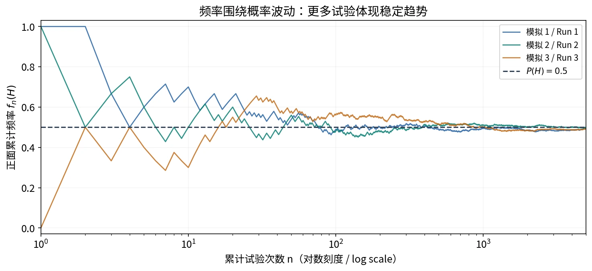

# §1.2 频率与概率（Frequency and Probability）

## 从试验记录到概率模型

前置知识：[样本空间、互斥与事件运算](01-sample-space-and-events.md)。

**频率（frequency）**是具体试验产生的比例；**概率（probability）**是模型中衡量事件发生可能性的数值。大量重复试验中频率的稳定性提供直觉，概率的公理化定义提供计算与证明的依据。

## 频率及其性质

在相同条件下重复进行 $n$ 次试验，事件 $A$ 出现 $n_A$ 次，则

$$
f_n(A)=\frac{n_A}{n}.
$$

$n_A$ 是次数（count），$f_n(A)$ 才是频率。不同批次的试验，即使 $n$ 相同，也可能产生不同频率。

对于同一批试验记录：

$$
0\le f_n(A)\le1,\qquad f_n(S)=1.
$$

若 $A_1,\ldots,A_k$ 两两互斥，则每次试验至多计入其中一个事件，因此

$$
f_n\left(\bigcup_{i=1}^{k}A_i\right)=\sum_{i=1}^{k}f_n(A_i).
$$

### 频率的稳定性（Stability of Relative Frequency）

以公平硬币为例：少量试验时，正面频率可能远离 $0.5$；试验次数增大时，频率通常在 $0.5$ 附近表现出更明显的稳定趋势。

图 2：固定随机种子产生的三组模拟，横轴为试验次数的对数刻度；不是课堂记录。来源：根据主课件第 37–40 页的频率稳定性概念自绘；许可见[图片说明](../assets/README.md)。

这一稳定值称为事件的概率，记为 $P(A)$ 或 $\Pr(A)$，这是概率的**统计性解释（statistical interpretation）**。注意：

- 有限次试验的频率通常不精确等于概率。
- 试验次数增加不意味着频率每一步都更接近概率，也不意味着最后严格固定不动。
- 一次观察到 $f_n(A)=0$，不能推出 $P(A)=0$。
- 稳定性需要合适的重复试验模型。

## 概率的公理化定义（Axiomatic Definition）

在给定样本空间上，概率 $P$ 为事件赋予实数，并满足三条公理。

### 非负性（Non-negativity）

$$
P(A)\ge0\qquad\text{对任意事件 }A.
$$

### 规范性（Normalization）

$$
P(S)=1.
$$

### 可列可加性（Countable Additivity）

若事件 $A_1,A_2,\ldots$ **两两互斥**，即任意 $i\ne j$ 都有 $A_i\cap A_j=\varnothing$，则

$$
P\left(\bigcup_{i=1}^{\infty}A_i\right)
=\sum_{i=1}^{\infty}P(A_i).
$$

第三条中的“可列”与“两两互斥”缺一不可。不能对有重叠的事件直接相加，也不能把可列可加性扩展为不可列个单点的求和。

三条公理限制了合理的概率模型，但没有直接指定某次射击的命中率或某个样本点的概率；这些数值还需要题目条件、建模假设或观测资料。

## 由公理推出的基本性质

### 不可能事件的概率为零

$$
P(\varnothing)=0.
$$

证明可在可列可加性中取 $A_1=S$、其余 $A_i=\varnothing$：左边为 $1$，右边为 $1+\sum_{i=2}^{\infty}P(\varnothing)$；由非负性可得空集的概率为零。

### 有限可加性（Finite Additivity）

若 $A_1,\ldots,A_n$ 两两互斥，则

$$
P\left(\bigcup_{i=1}^{n}A_i\right)=\sum_{i=1}^{n}P(A_i).
$$

证明：在这些事件后补上可列个空集，再应用第三条公理。

### 补事件公式（Complement Rule）

由于 $A\cup A^c=S$ 且 $A\cap A^c=\varnothing$，

$$
P(A^c)=1-P(A).
$$

这常用于“至少一个”的题目：先求“一个都没有”，再用 $1$ 减去。

### 单调性（Monotonicity）与差事件

若 $A\subseteq B$，可以把 $B$ 分成互斥的两部分 $A$ 与 $B-A$，于是

$$
P(B)=P(A)+P(B-A),\qquad P(B-A)=P(B)-P(A)\ge0.
$$

因此 $P(A)\le P(B)$。再由 $\varnothing\subseteq A\subseteq S$ 得到

$$
0\le P(A)\le1.
$$

对**任意**两个事件，正确的差事件公式是

$$
P(B-A)=P(B)-P(AB),\qquad P(A-B)=P(A)-P(AB).
$$

因为 $B=(AB)\cup(B-A)$，两部分互斥。只有在 $A\subseteq B$ 时，才可以把 $P(AB)$ 换成 $P(A)$。

## 加法公式与容斥原理

### 两个事件（Addition Rule）

$$
P(A\cup B)=P(A)+P(B)-P(AB).
$$

证明：$A\cup B=A\cup(B-A)$，右边两部分互斥；再使用差事件公式。直观上，把 $P(A)$ 与 $P(B)$ 相加会把交集计入两次，所以减去一次。

若 $A,B$ 互斥，才简化为 $P(A\cup B)=P(A)+P(B)$。

### 三个事件

$$
\begin{aligned}
P(A\cup B\cup C)
&=P(A)+P(B)+P(C)\\
&\quad-P(AB)-P(AC)-P(BC)+P(ABC).
\end{aligned}
$$

三重交集最初计入三次，又在三个两两交集中减掉三次，因此最后需要补回一次。

### 有限个事件：容斥原理（Inclusion–Exclusion Principle）

$$
P\left(\bigcup_{i=1}^{n}A_i\right)
=\sum_{k=1}^{n}(-1)^{k-1}
\sum_{1\le i_1<\cdots<i_k\le n}
P(A_{i_1}\cap\cdots\cap A_{i_k}).
$$

按单个事件、两重交、三重交等交替加减，即“多还少补”。此公式不要求互斥；[配对问题](03-classical-probability.md)会使用它。

## 概率为零不等于不可能

总有 $P(\varnothing)=0$、$P(S)=1$，但反向推断一般不成立：

$$
P(A)=0\ \not\Rightarrow\ A=\varnothing,
\qquad
P(B)=1\ \not\Rightarrow\ B=S.
$$

反例：在 $[0,1]$ 上均匀取一个数。取

$$
A=\{0.3\},\qquad B=[0,1]\setminus\{0.3\}.
$$

则 $P(A)=0$ 但 $A$ 非空；$P(B)=1$ 但 $B\ne S$。零概率可以对应非空的单点事件，概率为一表示“几乎必然（almost surely）”，不等于集合上绝无例外。

为什么单点概率只能为零？若每个单点的概率都为同一个 $c>0$，任取 $m$ 个不同点，由有限可加性其并集概率为 $mc$。选 $m>1/c$ 就超过 $1$，矛盾。这一论证只用有限个点，避免了错误的“不可列求和”。

具体长度比计算见[几何概型](04-geometric-probability.md)。

## 例题：射击与事件分解

设 $A=\{\text{甲击中}\}$，$B=\{\text{乙击中}\}$，已知

$$
P(A)=0.7,\qquad P(B)=0.6,\qquad P(AB)=0.4.
$$

目标不被击中即两人都没有击中：

$$
P(A^cB^c)=1-P(A\cup B)
=1-[0.7+0.6-0.4]=0.1.
$$

甲击中而乙没有击中：

$$
P(AB^c)=P(A)-P(AB)=0.7-0.4=0.3.
$$

核对四种互斥情形：都击中 $0.4$，仅甲击中 $0.3$，仅乙击中 $0.2$，都未击中 $0.1$，总和为 $1$。这里交集概率由题目给出，应直接使用。

## 例题：至少两人参加与容斥

设 $A,B,C$ 分别表示三人参加，且

$$
P(A)=P(B)=P(C)=0.4,
\quad P(AB\cup AC\cup BC)=0.3,
\quad P(ABC)=0.05.
$$

“至少两人参加”包含三人全参加，不能把它当成“恰有两人”。记两两交集概率和为 $T$。对 $AB,AC,BC$ 使用三事件加法公式，因为其任意两重及三重交集均为 $ABC$，

$$
0.3=T-3P(ABC)+P(ABC)=T-2\times0.05,
\qquad T=0.4.
$$

故至少一人参加的概率为

$$
P(A\cup B\cup C)=1.2-0.4+0.05=0.85.
$$

## 思考题

**题 1：**$P(A\cup B)=0.6$、$P(A)=0.3$，求 $P(A^cB)$。由互斥分解 $A\cup B=A\cup(A^cB)$，答案为 $0.6-0.3=0.3$。

**题 2：**$P(AB)=P(A^cB^c)$，$P(A)=p$，求 $P(B)$。设共同值为 $c$，由德摩根律和加法公式，

$$
c=1-P(A\cup B)=1-p-P(B)+c,
\qquad P(B)=1-p.
$$

这只是两块区域的概率相等，不意味着 $A$ 与 $B$ 互逆。

**题 3：**若“$A,B$ 至少一个发生时 $C$ 必发生”，则 $A\cup B\subseteq C$，所以一定有

$$
P(A\cup B)\le P(C).
$$

等号可能成立，但不是题目保证的结论。应区分“必然正确”“可能正确”和“必然错误”。

## 英文答题与检查清单

- *By finite additivity, since these events are pairwise disjoint, …*
- *By the complement rule / addition rule / inclusion–exclusion principle, …*
- *Since $A\subseteq B$, monotonicity gives $P(A)\le P(B)$.*

计算后检查结果是否在 $[0,1]$ 内、是否符合包含关系；对互斥且覆盖样本空间的分类，概率和必须为 $1$。公式中保留补集标记，尤其 $P(A^cB)$ 与 $P(AB)$ 的含义完全不同。

## 参考资料

主课件第 34–51 页；原始第一章课件第 26–44 页。
