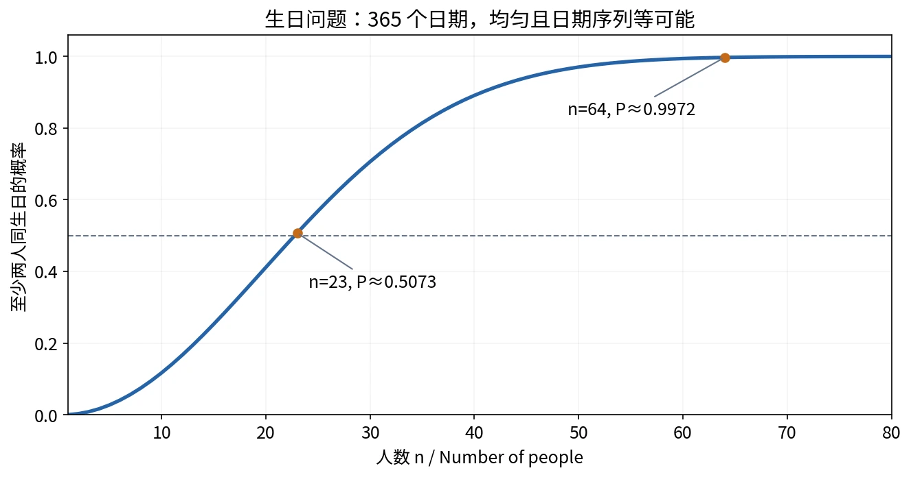

# §1.3 古典概型（Classical Probability）

## 定义与建模条件

**古典概型／等可能概型（classical probability model）**要求同时满足：

1. **有限性（finiteness）**：样本空间只有有限个样本点。
2. **等可能性（equally likely outcomes）**：每个样本点出现的概率相同。

若 $|S|=N$，由规范性及有限可加性，每个样本点的概率为 $1/N$。对任意事件 $A$，

$$
P(A)=\frac{|A|}{|S|}
=\frac{\text{有利结果数（favorable outcomes）}}{\text{全部可能结果数（total outcomes）}}.
$$

英文中也把有限等可能的样本空间称为 **simple sample space**。仅有“结果有限”不能使用个数之比；题目中的“随机”也要落实为对哪些结果均匀选择。

## 排列组合与计数模型

### 排列（Permutation）

从 $n$ 个不同元素中不放回地取 $k$ 个，并记录顺序：

$$
A_n^k=P_{n,k}=\frac{n!}{(n-k)!}
=n(n-1)\cdots(n-k+1),\qquad 0\le k\le n.
$$

若取全部元素，全排列数为 $n!$；规定 $0!=1$。

### 组合（Combination）

从 $n$ 个不同元素中取 $k$ 个，只关心所选的集合，不记录顺序：

$$
C_n^k=\binom nk=\frac{n!}{k!(n-k)!}
=\frac{A_n^k}{k!}.
$$

一个 $k$ 元子集可排成 $k!$ 种顺序，所以组合数比排列数少一个 $k!$ 因子。约定 $k<0$ 或 $k>n$ 时 $\binom nk=0$。

### 先判断“放回”和“顺序”

| 取法 | 样本点 | 总数 |
| --- | --- | --- |
| 不放回，记录顺序（without replacement, ordered） | 互不相同的 $k$ 元序列 | $A_n^k$ |
| 不放回，不记录顺序（without replacement, unordered） | $k$ 元子集 | $\binom nk$ |
| 放回，每次均匀选择且允许任意选择序列（with replacement, ordered） | 可重复的 $k$ 元序列 | $n^k$ |

分子与分母必须来自**同一种样本点定义**。不能分母用无序组合，分子却区分先红后黄和先黄后红。放回抽样若忽略顺序，不同无序结果通常不等可能，宜保留有序样本点。

计数的乘法原理（multiplication principle of counting）用于分步选择：每一步的可选数相乘。它是计数规则，与后面概率的乘法公式是两个不同概念。

## 例 1：放回与不放回摸球

袋中有 3 个红球、5 个黄球，每个球被摸到的可能性相等。即使同色，也先给每个球编号，以保证精细样本点等可能。

一次摸球取到红球：

$$
P(\text{红球})=\frac38.
$$

不放回摸两球，颜色不同。以无序二元子集为样本点：

$$
P(\text{不同色})=\frac{\binom31\binom51}{\binom82}
=\frac{15}{28}.
$$

也可以用有序样本点：$2\times3\times5/[8\times7]=15/28$。多出来的 $2$ 表示红黄与黄红，两种计算不能混用。

**放回抽样：**改为放回抽样，每次放回并重新均匀摸取，取有序球号对，共 $8^2$ 个等可能结果：

$$
P(\text{不同色})=\frac{3\times5+5\times3}{8^2}=\frac{15}{32}.
$$

放回与不放回改变了样本空间，概率也随之改变。

## 例 2：产品抽样中恰有指定数量的次品

$N$ 件产品中有 $D$ 件次品，不放回地均匀抽取 $n$ 件。记 $A_k=\{\text{恰有 }k\text{ 件次品}\}$，则

$$
P(A_k)=\frac{\binom Dk\binom{N-D}{n-k}}{\binom Nn}.
$$

分母选全部 $n$ 件；分子先从次品中选 $k$ 件，再从正品中选 $n-k$ 件。可行的整数范围是

$$
\max\{0,n-(N-D)\}\le k\le\min\{n,D\}.
$$

范围以外的概率为 $0$，也可由组合数的零值约定统一处理。这是**不放回抽样（sampling without replacement）**的计数概率。

## 例 3：球盒模型与生日问题

### 球盒模型（Occupancy Model）

$n$ 个不同的球投入 $N$ 个不同的盒子，$n\le N$；每个球均匀选择盒子，整个盒号序列按 $N^n$ 个等可能结果建模。

记 $A=\{\text{恰有 }n\text{ 个盒子各有一个球}\}$，即没有两个球落入同一盒。全部结果有 $N^n$ 种；有利结果先选 $n$ 个盒子，再把 $n$ 个球一一安排进去，有 $\binom Nn n!=A_N^n$ 种，所以

$$
P(A)=\frac{A_N^n}{N^n}
=\prod_{j=0}^{n-1}\left(1-\frac jN\right).
$$

**模型条件澄清：**仅知道“每个球单独落入各盒的概率相同”不足以保证所有盒号序列等可能；还需采用各球选择不受其他球约束的标准投放模型。本题的 $N^n$ 分母包含了这一假设。

### 生日问题（Birthday Problem）

把人看作不同的球，把 365 个日期看作不同的盒子。采用简化模型：忽略 2 月 29 日，每人生日在 365 天中均匀取值，整个日期序列等可能；现实出生日期并不严格满足这些假设。

对 $n\le365$，先求没有人生日相同，再取补：

$$
P(\text{至少两人同生日})
=1-\frac{A_{365}^n}{365^n}
=1-\prod_{j=0}^{n-1}\left(1-\frac j{365}\right).
$$

$n=64$ 时，结果约为 $0.997$。$n=23$ 时已经约为 $0.507$；$n>365$ 时，由抽屉原理（pigeonhole principle）概率为 $1$。

图 3：按上述理想模型精确计算。来源：主课件第 59–60 页模型与公式；许可见[图片说明](../assets/README.md)。

“至少一对同生日”不等于“有人与某个指定的人同生日”，后者是另一个事件。人数增多时，可比较的两人组合数量迅速增加。

## 例 4：抽签问题与样本空间的选择

袋中 $a$ 个红球、$b$ 个白球，$n=a+b$。$n$ 人依次不放回摸球，每一步对剩余球均匀选择。记 $A_k=\{\text{第 }k\text{ 人摸到红球}\}$。

### 方法一：给全部球编号，观察整个排列

全部 $n!$ 种排列等可能。第 $k$ 个位置先选一个红球，有 $a$ 种；剩余 $n-1$ 个球任意排列，有 $(n-1)!$ 种。因此

$$
P(A_k)=\frac{a(n-1)!}{n!}=\frac an.
$$

### 方法二：只记录红球分配给哪几个人

样本点是大小为 $a$ 的人员子集，共 $\binom na$ 个。每个子集都对应 $a!b!$ 个精细球号排列，所以仍然等可能。

若第 $k$ 人得到红球，则其余 $a-1$ 个红球位置从其他 $n-1$ 人中选择：

$$
P(A_k)=\frac{\binom{n-1}{a-1}}{\binom na}=\frac an.
$$

此写法用于 $a\ge1$；$a=0$ 时答案直接为 $0$。分子不再乘 $a$，因为此模型不区分红球编号。

例如：$n=3,a=2$，样本空间为 $\{\{1,2\},\{1,3\},\{2,3\}\}$，其中含人员 1 的样本点有两个，概率 $2/3$。

### 方法三：只记录第 $k$ 人取得的球号

由球号排列的对称性，每个球号出现在第 $k$ 位的概率均为 $1/n$。取 $S=\{1,\ldots,n\}$，其中有 $a$ 个红球号，答案仍为 $a/n$。

三种方法的样本空间不同，但都保留了所求事件，且对应结果等可能，所以答案一致。**抽签顺序不改变尚未利用前面结果时的无条件概率。**

### 错误方法：按颜色分两类，直接得到一半

取 $S=\{\text{红},\text{白}\}$，就写 $P(\text{红})=1/2$，错误在于两种颜色不一定等可能。实际概率为 $a/n$ 和 $b/n$；只有 $a=b$ 时才均为一半。合并样本点会合并其概率，不能自动均分概率。

### 已知前一人的结果后，概率会变化

设 $0<a<n$，则

$$
P(A_2\mid A_1)=\frac{a-1}{n-1},\qquad
P(A_2\mid A_1^c)=\frac a{n-1}.
$$

这与 $P(A_2)=a/n$ 不矛盾：前两式加入了已知信息。由全概率公式，

$$
P(A_2)=\frac an\frac{a-1}{n-1}
+\frac bn\frac a{n-1}=\frac an.
$$

正式定义与公式见 [§1.4 条件概率](05-conditional-probability.md)。

## 例 5：配对问题与错排（Matching Problem / Derangement）

$n$ 人各准备一件带自己编号的礼物，随后按均匀随机排列分发。求无人拿到自己礼物的概率。

设 $A_i=\{\text{第 }i\text{ 人取得自己的礼物}\}$。对任意指定的 $k$ 个不同人员，固定其礼物不动，其他礼物可任意排列，所以

$$
P(A_{i_1}\cap\cdots\cap A_{i_k})=\frac{(n-k)!}{n!}.
$$

共有 $\binom nk$ 组这样的人员，由容斥原理，

$$
\begin{aligned}
P(\text{无人取得自己的礼物})
&=1-P\left(\bigcup_{i=1}^n A_i\right)\\
&=1-\sum_{k=1}^{n}(-1)^{k-1}\binom nk\frac{(n-k)!}{n!}\\
&=\sum_{k=0}^{n}\frac{(-1)^k}{k!}.
\end{aligned}
$$

关键化简为 $\binom nk(n-k)!/n!=1/k!$。以 $n=3$ 核对：$1-1+1/2!-1/3!=1/3$，对应六种排列中的两种错排。

由指数函数级数可得，

$$
\lim_{n\to\infty}P(\text{无人配对成功})=e^{-1}\approx0.367879.
$$

有限 $n$ 时应使用有限和，而不是直接写 $1/e$。各个 $A_i$ 有重叠，不能只把 $P(A_i)$ 相加，也不能把“各人未取得自己的礼物”的概率直接相乘。

## 英文答题表达与易错点

- *All outcomes in the chosen sample space are equally likely.*
- *We count unordered subsets / ordered sequences.*
- *There are … favorable outcomes out of … possible outcomes.*
- *It is easier to consider the complementary event.*
- *Applying the inclusion–exclusion principle, …*

每次使用个数之比前，先说明等可能性；每次计数前，先说明是否放回、是否记录顺序、对象是否可区分。特别注意“恰有 $k$”（exactly $k$）与“至少 $k$”（at least $k$）是不同事件。

## 参考资料

主课件第 52–67 页；原始第一章课件第 45–59 页。
