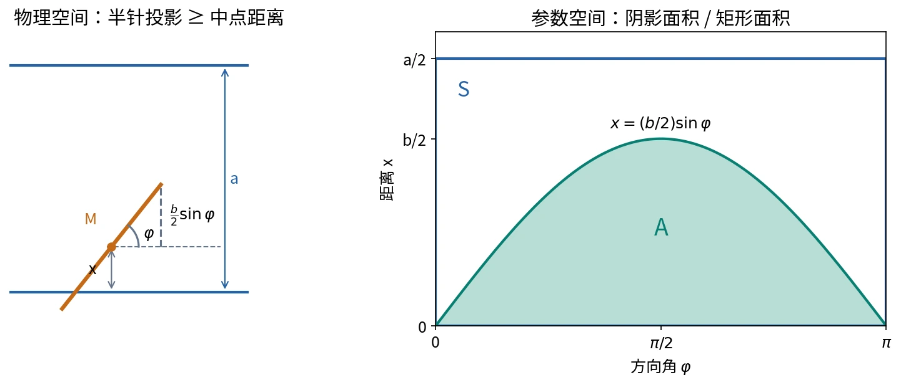

# 几何概型与蒲丰投针（Geometric Probability）

## 前置知识

[古典概型](03-classical-probability.md)、区间长度、平面面积与定积分。

## 从个数比到几何度量比

古典概型使用有限个等可能样本点的个数之比。若试验结果是在某个几何区域 $S$ 中**均匀取点（uniform sampling）**，可使用**几何概型（geometric probability model）**。

设 $m$ 是相应的几何度量（geometric measure），要求

$$
0<m(S)<\infty.
$$

均匀取点的准确含义是：在 $S$ 内，任意可测子区域被选中的概率与其度量成正比；度量相同的区域具有相同概率。于是

$$
P(A)=\frac{m(A)}{m(S)},\qquad A\subseteq S.
$$

| 空间 | 使用的度量 | 英文 |
| --- | --- | --- |
| 线段／区间 | 长度 | length |
| 平面区域 | 面积 | area |
| 空间区域 | 体积 | volume |

分子、分母必须使用同一种度量。零长度、零面积或零体积的边界可以属于事件，但不影响此模型的概率。

均匀取点要求“等度量子区域等可能”，不能仅用“每个点等可能”来判断。连续模型中每个单点的概率都可能为零，这一点本身不足以说明区域内均匀取点。也不能在无限长直线或整个无限平面上直接套用有限区域的均匀概率公式。

## 简单例子与零概率事件

在 $S=[0,1]$ 上均匀取一个数：

$$
P([u,v])=v-u\qquad(0\le u\le v\le1).
$$

单点 $\{0.3\}$ 的长度为零，所以概率为零，但它仍是非空事件。区间 $[u,v]$、$(u,v)$ 等只相差端点，在该模型中具有相同概率。

在 $S=[0,2]\times[0,1]$ 上均匀投点。对其中面积为 $q$ 的区域 $A$，

$$
P(A)=\frac q2.
$$

面积比成立的依据是**均匀投点的模型**，不能把所有维恩图的面积都当作概率。

## 蒲丰投针问题（Buffon's Needle Problem）

### 试验与条件

平面上画有一组平行直线，相邻直线的间距为 $a>0$。随机投下一根长度为 $b$ 的针，设 $0<b<a$。求针与任意一条直线相交的概率。

模型采用均匀的位置和方向分布：针的中点在一个条带中的垂直位置均匀，针的方向角均匀；相应位置与角度构成均匀的联合参数模型。只说明“随手投针”而不指定这些条件，不能保证后面的面积比成立。

### 用两个参数表示位置关系

定义

- $x$：针的中点到最近一条平行线的距离，$0\le x\le a/2$。
- $\varphi$：针与平行线的方向夹角，取 $0\le\varphi<\pi$。

虽然真实针的位置还包含沿平行线的坐标等信息，但是否相交只依赖这两个参数。把与相交判断无关的信息省略后，样本空间为

$$
S=\{(x,\varphi):0\le x\le a/2,\ 0\le\varphi<\pi\}.
$$

该参数空间是一个矩形，面积为 $a\pi/2$。注意它不是无限的物理平面。

图 4：左侧展示针与直线的相交条件；右侧在参数空间中画出满足该条件的阴影区域。来源：第二节课截图 `ppt_035`–`ppt_041` 与约 40:03–46:02 的讲解；自绘，许可见[图片说明](../assets/README.md)。

### 相交条件

半根针在垂直于平行线方向上的投影长度为 $(b/2)\sin\varphi$。针能触及最近直线，当且仅当

$$
x\le\frac b2\sin\varphi.
$$

因此相交事件为

$$
A=\left\{(x,\varphi):0\le\varphi<\pi,\
0\le x\le\frac b2\sin\varphi\right\}.
$$

由于 $b<a$，正弦曲线始终不超过参数矩形的高度 $a/2$。接触直线也可算作相交；将边界改为严格不等号不影响概率。

### 用面积比计算概率

$$
m(A)=\int_0^{\pi}\frac b2\sin\varphi\,\mathrm d\varphi=b.
$$

所以

$$
\boxed{P(A)=\frac{m(A)}{m(S)}=\frac{b}{a\pi/2}=\frac{2b}{a\pi}.}
$$

结果与针的位置无关，只依赖针长与线距的比值。针长增大，相交概率增大；线距增大，相交概率减小。以上公式适用于短针情形 $b<a$。

## 投针与随机模拟（Random Simulation / Monte Carlo Method）

若投针 $n$ 次，其中 $m$ 次相交，则用频率 $m/n$ 近似概率，

$$
\frac mn\approx\frac{2b}{a\pi}
\quad\Longrightarrow\quad
\pi\approx\frac{2bn}{am}\qquad(m>0).
$$

这展示了用随机试验估计数学量的思路，蒲丰投针是**蒙特卡洛方法（Monte Carlo method）**的早期实例。若 $m=0$，上述估计式无法使用；有限次试验只能产生近似结果。

计算机模拟时，应在参数矩形内均匀生成 $(x,\varphi)$，判断 $x\le(b/2)\sin\varphi$，累计相交频率，再代入估计式。不要用“针的两个端点分别在条带中均匀取点”替代，这会改变长度与方向的模型。

模拟中把长度比 $b/a$ 作为已知量即可，不需要先知道 $\pi$ 的数值来物理投针；计算机生成角度也可把均匀变量 $u\in[0,1)$ 转成 $\varphi=\pi u$。后者是演示模拟原理，不能作为不依赖 $\pi$ 的数值算法证明。

## 英文答题表达与易错点

- *Assume the point is uniformly distributed over the region.*
- *The probability is the ratio of the area of the favorable region to that of the sample space.*
- *Let $x$ be the distance from the midpoint of the needle to the nearest line.*
- *The needle intersects a line if and only if $x\le(b/2)\sin\varphi$.*

本题最易出错的是把距离上限写成 $a$、把半针投影写成整针投影、用物理平面而非参数矩形计算面积，以及遗漏位置与方向的均匀性假设。

## 参考资料

第二节课课堂识别约 34:39–52:59；同目录补充截图 `ppt_030`–`ppt_043`。
