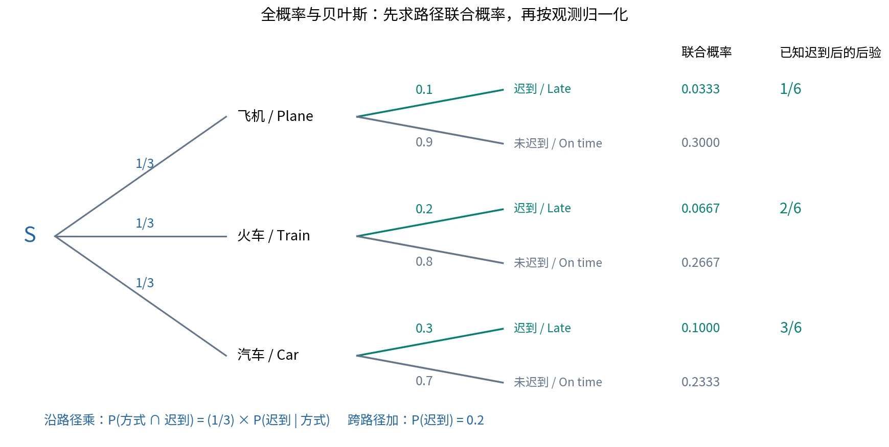
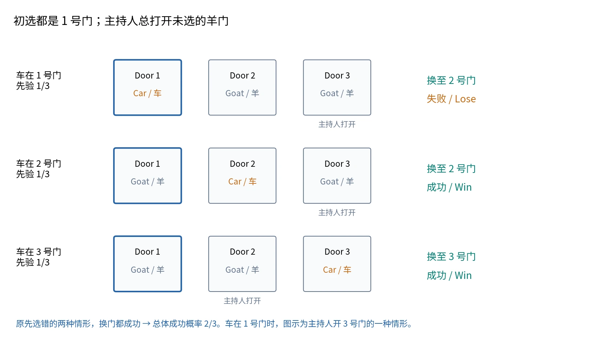

# §1.4 条件概率、全概率与贝叶斯公式（Conditional Probability）

## 一个定义与三个公式

前置知识：[事件的交、并与补](01-sample-space-and-events.md)、[有限可加性与加法公式](02-frequency-and-probability.md)、[古典概型](03-classical-probability.md)。

**看到所求是条件概率，第一反应应是定义；三个公式都可从定义与事件分解推出来。**

| 工具 | 求什么 | 典型用途 |
| --- | --- | --- |
| 条件概率定义（conditional probability） | 已知 $B$ 发生时的 $P(A\mid B)$ | 限制结果范围并重新归一化 |
| 乘法公式（multiplication rule / chain rule） | 交事件 $P(AB)$ 或多个事件共同发生的概率 | 沿一条路径逐步计算 |
| 全概率公式（law of total probability） | 结果 $A$ 的总概率 | 按互斥且穷尽的情况加权求和 |
| 贝叶斯公式（Bayes' formula / Bayes' theorem） | 观察到 $A$ 后的 $P(B_i\mid A)$ | 从结果反推来源，更新概率 |

## 条件概率：限制范围并重新归一化

若 $P(B)>0$，定义

$$
\boxed{P(A\mid B)=\frac{P(A\cap B)}{P(B)}.}
$$

英文读作 **the probability of $A$ given $B$**，其中竖线右边是已知条件。已知结果在 $B$ 内，只考察仍符合 $A$ 的那部分 $A\cap B$；除以 $P(B)$ 把新的总概率归一化为 $1$。

“把 $B$ 的概率看作 $1$”指在新的条件概率度量下 $P(B\mid B)=1$，不是将原模型中的 $P(B)$ 改写成 $1$。

### 掷骰子例

均匀骰子，$A=\{1,2,3\}$ 表示小点数，$B=\{1,3,5\}$ 表示奇数。无条件时

$$
P(A)=\frac36=\frac12.
$$

已知是奇数，只剩三个等可能结果 $1,3,5$，其中 $1,3$ 符合 $A$，故

$$
P(A\mid B)=\frac{2/6}{3/6}=\frac23.
$$

此时 $P(AB)=1/3$、$P(A\mid B)=2/3$、$P(B\mid A)=2/3$；后两者在这个例子中碰巧相等，不能推广为一般规律。

### 必须区分的三个量

| 记号 | 所研究的量 |
| --- | --- |
| $P(AB)$ | 在原模型下，$A,B$ 同时发生的概率 |
| $P(A\mid B)$ | 在已知 $B$ 的条件下，$A$ 发生的概率 |
| $P(B\mid A)$ | 在已知 $A$ 的条件下，$B$ 发生的概率 |

两种条件概率有同一个交集分子，却通常有不同分母。条件中的“已知”是信息顺序，不必是时间顺序：已知第四次摸球的结果，也可以研究第一次摸球的条件概率。

另外，$P(A\mid B)$ 是一个整体的数值记号。这里不把 $A\mid B$ 定义为新的集合事件；应写“设 $A=\{\cdots\}$、$B=\{\cdots\}$，所求为 $P(A\mid B)$”，而不是“设事件 $A\mid B$ 为……”。

当 $P(B)=0$ 时，这个定义不能使用，即使 $B$ 是非空集合也一样。

## 固定条件后，仍满足概率的公理与性质

固定 $P(B)>0$ 的事件，令 $Q(A)=P(A\mid B)$。

- 非负性：$Q(A)\ge0$。
- 规范性：$Q(S)=P(S\cap B)/P(B)=1$，且 $Q(B)=1$。
- 可列可加性：若 $A_i$ 两两互斥，则 $A_i\cap B$ 也两两互斥，故 $Q(\bigcup_iA_i)=\sum_iQ(A_i)$。

因此在**同一个条件**下，基本公式仍然成立：

$$
P(A^c\mid B)=1-P(A\mid B),
$$

$$
P(A\cup C\mid B)=P(A\mid B)+P(C\mid B)-P(AC\mid B).
$$

若 $A\subseteq C$，则 $P(A\mid B)\le P(C\mid B)$；也有 $P(A)=P(A\mid S)$。

不同条件下的概率不能混用同一参照体系的运算规则。这些数值当然可以做算术加法，但一般不能把 $P(A\mid B)+P(C\mid D)$ 解释为某个并事件的概率，也不能在不同条件之间直接套用补事件公式。全概率公式中带权相加则有明确意义。

## 乘法公式（Multiplication Rule）

条件概率定义直接给出：在有关条件概率有定义时，

$$
\boxed{P(AB)=P(A)P(B\mid A)=P(B)P(A\mid B).}
$$

取决于哪种条件概率已知，选择方便的展开方向。推广到三个事件：

$$
P(ABC)=P(A)P(B\mid A)P(C\mid AB).
$$

一般形式为

$$
P\left(\bigcap_{i=1}^{n}A_i\right)
=P(A_1)\prod_{i=2}^{n}
P\left(A_i\mid\bigcap_{j=1}^{i-1}A_j\right).
$$

每一步条件都包含前面事件的**共同发生**，不能删减。若某个前缀交事件概率为零，后面的条件概率可能无定义，但整个交事件概率已可由包含关系判断为零，不必强行展开。

### 例：合格品中的优质品

设 $A=\{\text{合格品}\}$，$B=\{\text{优质品}\}$。已知 $P(A)=0.90$，$P(B\mid A)=0.95$。因为优质品必为合格品，$B\subseteq A$，故

$$
P(B)=P(AB)=0.90\times0.95=0.855.
$$

“合格品中有 95% 是优质品”描述的是条件比例，不是全体产品的优质率。

### 例：调试与报废

设 $B=\{\text{产品需要调试}\}$，$A=\{\text{产品报废}\}$。题意为

$$
P(B^c)=0.7,\quad P(B)=0.3,\quad
P(A^c\mid B)=0.8,\quad P(A\mid B)=0.2.
$$

只有需要调试的产品才可能报废，$A\subseteq B$，所以

$$
P(A)=P(AB)=P(B)P(A\mid B)=0.3\times0.2=0.06.
$$

注意 $0.8$ 对应“不报废”的条件概率 $P(A^c\mid B)$。

### 例：最多参加三次考核

第一轮通过率为 $0.6$；第一轮未通过后，第二轮通过的条件概率为 $0.8$；前两轮均未通过后，第三轮通过的条件概率为 $0.9$。通过后停止参加。

记 $F_i$ 为“前 $i$ 轮均未通过”，则

$$
P(F_1)=0.4,\qquad
P(F_2\mid F_1)=0.2,\qquad
P(F_3\mid F_2)=0.1.
$$

三次都未通过的概率为 $0.4\times0.2\times0.1$，于是

$$
P(\text{最终通过})=1-0.4\times0.2\times0.1=0.992.
$$

也可按“首次通过的轮次”作互斥分解：

$$
P(\text{最终通过})=0.6+0.4\times0.8+0.4\times0.2\times0.9=0.992.
$$

三个乘积对应三条不同路径。$0.8$ 和 $0.9$ 不是第二、三轮无条件的通过概率。本写法只定义实际进行的轮次，避免为已经停止考试的人假设后续成绩。

### 例：由两个条件概率还原交集

已知

$$
P(A)=\frac14,\quad P(B\mid A)=\frac13,\quad
P(A\mid B)=\frac12.
$$

先求交集，再求 $B$：

$$
P(AB)=\frac14\times\frac13=\frac1{12},
\qquad P(B)=\frac{P(AB)}{P(A\mid B)}=\frac16.
$$

所以

$$
P(A\cup B)=\frac14+\frac16-\frac1{12}=\frac13.
$$

再求 $P(A^c\mid A\cup B)$：

$$
P(A^c\mid A\cup B)
=\frac{P(A^cB)}{P(A\cup B)}
=\frac{1/6-1/12}{1/3}=\frac14.
$$

若求没有补集标记的 $P(A\mid A\cup B)$，答案才是 $3/4$。

## 划分／完备事件组（Partition）

$B_1,\ldots,B_n$ 构成样本空间的一个**划分（partition）**，要求：

$$
\bigcup_{i=1}^{n}B_i=S,\qquad B_i\cap B_j=\varnothing\quad(i\ne j).
$$

即**不漏（collectively exhaustive）**且**不重（pairwise disjoint）**：每个样本点恰好属于一个部分，一次试验恰有一个 $B_i$ 发生。最简单的二分为 $B,B^c$。

英文术语 collectively exhaustive 本身只表示并集覆盖 $S$；用它描述完整的 partition 时，还必须同时说明互斥条件。通常划分取非空的部分；应用后面的条件概率公式时再要求有关部分概率为正。

## 全概率公式（Law of Total Probability）

设 $B_1,\ldots,B_n$ 是划分，且各 $P(B_i)>0$。则

$$
\boxed{P(A)=\sum_{i=1}^{n}P(B_i)P(A\mid B_i).}
$$

**推导：**把 $A$ 按来源分成互斥部分：

$$
A=A\cap S=\bigcup_{i=1}^{n}(A\cap B_i).
$$

用有限可加性，再用乘法公式：

$$
P(A)=\sum_iP(AB_i)=\sum_iP(B_i)P(A\mid B_i).
$$

关键不是背公式，而是选对划分。常见选择是产品来源、箱子编号、交通方式、某件事发生与否。若某部分概率为零，其交事件也为零，可以直接略去该部分，避免写无定义的条件概率。

### 条件概率下的全概率公式

若已知事件 $C$，$P(C)>0$，且各 $P(B_iC)>0$，则所有概率换到同一个条件体系：

$$
\boxed{P(A\mid C)
=\sum_{i=1}^{n}P(B_i\mid C)P(A\mid B_iC).}
$$

这里 $B_iC=B_i\cap C$。加权项要用 $P(B_i\mid C)$，而不是仍用 $P(B_i)$；下一步条件要同时保留 $B_i$ 与 $C$。

## 贝叶斯公式（Bayes' Formula）

在相同划分条件下，再要求 $P(A)>0$，则

$$
\boxed{P(B_i\mid A)
=\frac{P(B_i)P(A\mid B_i)}
{\sum_{j=1}^{n}P(B_j)P(A\mid B_j)}.}
$$

推导只有两步：先用定义 $P(B_i\mid A)=P(AB_i)/P(A)$；分子用乘法公式，分母用全概率公式。

| 概念 | 记号 | 解释 |
| --- | --- | --- |
| 先验概率（prior probability） | $P(B_i)$ | 未利用这次观测 $A$ 前，对 $B_i$ 的概率判断 |
| 似然项（likelihood） | $P(A\mid B_i)$ | 若处在情况 $B_i$，观测到 $A$ 的可能性 |
| 证据概率／归一化项（evidence / normalizing constant） | $P(A)$ | 对所有情况加权后的观测概率 |
| 后验概率（posterior probability） | $P(B_i\mid A)$ | 利用观测 $A$ 后更新的概率 |

贝叶斯公式可概括为“已知结果，求原因”。“原因”也可以只是来源或分类，贝叶斯公式本身不证明因果关系。

## 概率树：沿路径乘，跨互斥路径加

图 5：示例来自每条完整路径的概率为沿途分支概率的乘积；多个互斥路径通向同一结果时相加。自绘，许可见[图片说明](../assets/README.md)。

概率树每个节点的出边概率应相加为 $1$。在给定结果后重新比较路径时，需要把各路径联合概率除以该结果的总概率，不能把原分支概率直接反向使用。

## 例题：甲乙出差

设 $A=\{\text{甲出差}\}$，$B=\{\text{乙出差}\}$。已知

$$
P(A)=0.7,\quad P(B\mid A)=0.1,\quad P(B\mid A^c)=0.6.
$$

用划分 $A,A^c$：

$$
P(B)=0.7\times0.1+0.3\times0.6=0.25.
$$

已知乙出差，甲出差的后验概率为

$$
P(A\mid B)=\frac{P(AB)}{P(B)}
=\frac{0.7\times0.1}{0.25}=0.28.
$$

$P(B\mid A)=0.1$ 与 $P(A\mid B)=0.28$ 不相等，不能调换条件。

## 综合例题：三个箱子中不放回摸球

三个箱子等可能选一个，再在选定箱子中不放回摸两球。定义 $H_i=\{\text{选中第 }i\text{ 箱}\}$，$W_j=\{\text{第 }j\text{ 次摸到白球}\}$。

| 箱子 | 白球 | 红球 | 总数 | $P(H_i)$ | $P(W_1\mid H_i)$ |
| --- | --- | --- | --- | --- | --- |
| 1 | 3 | 5 | 8 | $1/3$ | $3/8$ |
| 2 | 2 | 2 | 4 | $1/3$ | $1/2$ |
| 3 | 5 | 2 | 7 | $1/3$ | $5/7$ |

**第一问：第一次白球的概率。**按箱子编号作划分：

$$
P(W_1)=\frac13\left(\frac38+\frac12+\frac57\right)=\frac{89}{168}.
$$

不能把所有箱子混合，直接写白球总数除以球总数 $10/19$；“先均匀选箱，再在箱中均匀选球”与“从全部球中均匀选球”是不同试验。

**第二问：已知第一次白球，选中一号箱的概率。**

$$
P(H_1\mid W_1)=\frac{(1/3)(3/8)}{89/168}=\frac{21}{89}.
$$

类似得到二、三号箱的后验概率为 $28/89$、$40/89$，三者之和为 $1$。

**第三问：已知第一次白球，第二次仍白球的概率。**先算两次白球的联合概率：

$$
\begin{aligned}
P(W_1W_2)
&=\sum_{i=1}^{3}P(H_i)P(W_1W_2\mid H_i)\\
&=\frac13\left(
\frac{\binom32}{\binom82}
+\frac{\binom22}{\binom42}
+\frac{\binom52}{\binom72}\right)=\frac14.
\end{aligned}
$$

因此

$$
P(W_2\mid W_1)=\frac{P(W_1W_2)}{P(W_1)}
=\frac{1/4}{89/168}=\frac{42}{89}.
$$

也可在 $W_1$ 条件下用全概率公式核对：

$$
P(W_2\mid W_1)
=\frac{21}{89}\frac27+\frac{28}{89}\frac13+\frac{40}{89}\frac46
=\frac{42}{89}.
$$

第一次抽到白球既减少了所选箱中的白球数，也更新了“选中了哪个箱”的概率。不能保留原先的 $1/3$ 权重。

不利用第一次结果时，由抽样位置的对称性，$P(W_2\mid H_i)=P(W_1\mid H_i)$，所以 $P(W_2)=89/168$；这并不等于已经知道第一次白球后的 $42/89$。

## 例题：迟到后的交通方式

飞机、火车、汽车等可能选择，各自迟到的条件概率为 $0.1,0.2,0.3$。设 $L=\{\text{迟到}\}$，$H_1,H_2,H_3$ 分别为三种交通方式，则

$$
P(L)=\frac13(0.1+0.2+0.3)=0.2.
$$

贝叶斯公式给出

$$
P(H_1\mid L)=\frac16,\qquad
P(H_2\mid L)=\frac26,\qquad
P(H_3\mid L)=\frac36.
$$

先验相同，但更容易迟到的方式，在已知迟到后获得更高的后验权重。

## 三门问题（Monty Hall Problem）

### 游戏规则与信息

三扇门后，一扇藏车（car）、两扇藏羊（goats）；车的位置先验均为 $1/3$。你先选 1 号门。主持人知道车的位置，在未选的门中打开一扇有羊的门，并提供换门机会。

假设当两个未选门都有羊时，主持人以相同概率选择其中一扇。这一规则用于计算“具体观察到开 3 号门”后的条件概率。

定义 $H_i=\{\text{车在 }i\text{ 号门}\}$，$O=\{\text{主持人打开 3 号门并展示羊}\}$。

| 车的位置 | 先验 $P(H_i)$ | $P(O\mid H_i)$ | 联合概率 $P(H_iO)$ |
| --- | --- | --- | --- |
| 1 号门 | $1/3$ | $1/2$，2、3 号门都可打开 | $1/6$ |
| 2 号门 | $1/3$ | $1$，只能打开 3 号门 | $1/3$ |
| 3 号门 | $1/3$ | $0$，不能展示车 | $0$ |

所以

$$
P(O)=\frac16+\frac13=\frac12,
$$

$$
P(H_1\mid O)=\frac{1/6}{1/2}=\frac13,
\qquad
P(H_2\mid O)=\frac{1/3}{1/2}=\frac23.
$$

**应换到 2 号门：换门的获胜概率为 $2/3$，坚持原门为 $1/3$。**

图 6：对“始终换门”策略按初始车位置分类。来源：主课件第 92 页与第二节课约 127:42–141:38 的讲解；自绘，许可见[图片说明](../assets/README.md)。

### 为什么不是一半？

“剩两扇门”只说明结果类别少了，不说明它们等可能。主持人有意识地避开车门，他的行为包含信息；$O$ 在不同车位置下出现的概率不同，所以要按贝叶斯公式更新。

从策略角度看，原先选中车的概率是 $1/3$，此时换门失败；原先选中羊的概率是 $2/3$，主持人必须打开另一扇羊门，此时换门成功。

推广到一万扇门：在主持人知情且总打开所有其他羊门、只留下一个未选门的规则下，坚持最初门的成功率是 $1/10000$，始终换门是 $9999/10000$。

### 主持人的选择规则不能省略

“具体开 3 号门后”的 $1/3,2/3$ 使用了等概率选羊门的规则。如果车在 1 号门时，主持人以概率 $q$ 开 3 号门，则同样推导得到

$$
P(H_1\mid O)=\frac q{q+1},\qquad
P(H_2\mid O)=\frac1{q+1}.
$$

$q=1/2$ 时得到上述 $1/3$ 与 $2/3$。另一方面，只要主持人总展示未选羊门并始终给出换门机会，**不指定具体开哪扇门**时，始终换门策略的总体成功率仍是 $2/3$。这是总体策略概率与特定观测后的条件概率的区别。

## 解题流程与英文表达

1. 定义事件：*Let $A$ denote … and let $B_i$ denote …*。
2. 翻译已知条件：辨认“其中”“已知”“若……则……”描述的是哪一个条件概率。
3. 写出所求：普通概率、交事件概率还是条件概率。
4. 若按情况求和，说明：*The events $B_1,\ldots,B_n$ form a partition of the sample space.*
5. 写公式：*By the definition of conditional probability / the multiplication rule / the law of total probability / Bayes' theorem, …*。
6. 核对：结果在 $[0,1]$ 内；后验概率对整个划分求和为 $1$；所有条件概率的分母为正。

最常见错误是把 $P(A\mid B)$ 当成 $P(AB)$、交换条件、遗漏链式公式中的历史条件、混用不同条件体系，以及在观察后仍使用未更新的分类权重。

## 参考资料

主课件第 67–92 页；原始第一章课件第 68–77、80–92 页；第二节课识别文本补充三门问题的黑板推导与主持人规则。

返回[课程目录](../index.md)。
