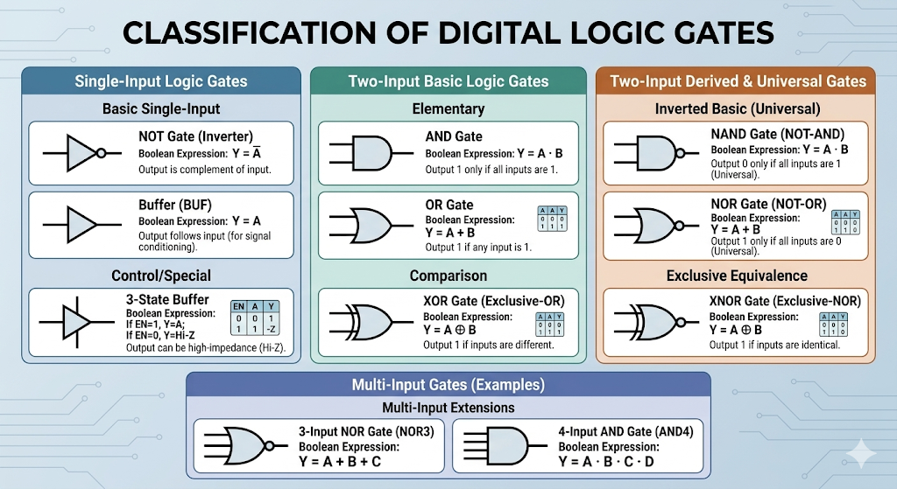
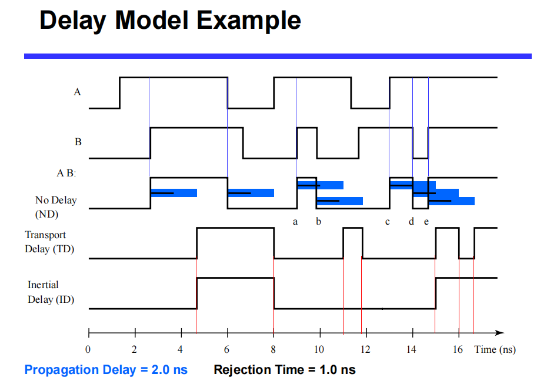
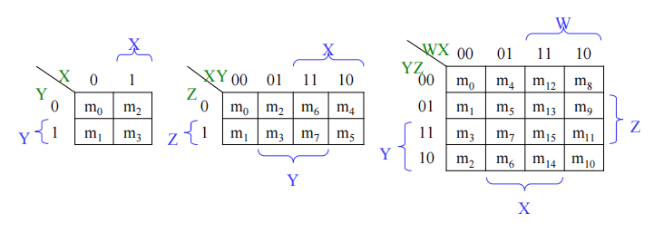

# Introduction to Digital Systems

- **System Conversion:** Real-world analog signals are captured (e.g., by a microphone) and converted to digital via an **ADC** (Analog-to-Digital Converter) for processing. After digital processing, a **DAC** (Digital-to-Analog Converter) translates the signals back to analog for output (e.g., to a speaker).

---

## Binary Logic and Gates

## 1. Core Concepts

- **Binary Variables:** same in discrete mathematics.

- **Logical Operators:** same in discrete mathematics. The basic operators are **AND**, **OR**, and **NOT**.

- **Boolean Algebra:** same in discrete mathematics.

- **Logic Gates:** Physical electronic devices that implement these logic functions.

## 2. The Basic Logical Operations

- **AND:** Denoted by a dot ( $\cdot$ ) or implied multiplication (e.g., $X \cdot Y$ or $XY$). Output is 1 _only_ if all inputs are 1.

- **OR:** Denoted by a plus sign ( $+$ ) (e.g., $X + Y$). Output is 1 if _any_ input is 1.

- **NOT (Inversion):** Denoted by an overbar, a single quote, or a tilde (e.g., $\overline{X}$, $X'$, or $\sim X$). Output is the exact opposite of the input.

## 3. Truth Tables

- same in discrete mathematics

## 4. Physical Modeling of Logic Functions (Switch Model)

Logic functions can be intuitively modeled using electrical switches:

- **Inputs:** Logic 1 = Switch Closed; Logic 0 = Switch Open.

- **Outputs:** Logic 1 = Light On; Logic 0 = Light Off.

- **Logic mapping to circuits:**

    - **OR Function:** Switches connected in **parallel**. (Closing either switch completes the circuit).

    - **AND Function:** Switches connected in **series**. (Both switches must be closed to complete the circuit).

    - **NOT Function:** Represented by a **normally-closed** switch. (Applying logic 1 opens the switch, breaking the circuit).

- _Note:_ This switch model is the foundational concept for relay circuits and modern CMOS gate circuits used in digital technology.

## 5. Logic Gates Overview

Logic gates are categorized by the number of inputs they accept:

### 5.1 Single-Input Gates

- **NOT Gate (Inverter):** Equation: $Y = \overline{A}$. Reverses the input.

- **Buffer (BUF):** Equation: $Y = A$. Output matches the input. (Used practically for signal amplification/delay).

### 5.2 Two-Input Gates

- **AND:** Equation: $Y = AB$

- **OR:** Equation: $Y = A + B$

- **XOR (Exclusive-OR):** Equation: $Y = A \oplus B$. Output is 1 if inputs are _different_ (01 or 10).

- **NAND (NOT-AND):** Equation: $Y = \overline{AB}$. The inverse of AND. Output is 0 only when both inputs are 1.

- **NOR (NOT-OR):** Equation: $Y = \overline{A+B}$. The inverse of OR. Output is 1 only when both inputs are 0.

- **XNOR (Exclusive-NOR):** Equation: $Y = \overline{A \oplus B}$. Output is 1 if inputs are the _same_ (00 or 11).

_Note: Primitive gates (AND, OR, NOT, NAND, NOR) are simple and fast. Complex circuits use combinations of these to lower cost and transmission time._

### 5.3 Multiple-Input Gates

Gates can be scaled to accept multiple inputs while following the same underlying logical rules.

- **NOR3:** A 3-input NOR gate. Equation: $Y = \overline{A+B+C}$. Output is 1 only if A, B, and C are all 0.

- **AND4:** A 4-input AND gate. Equation: $Y = ABCD$. Output is 1 only if A, B, C, and D are all 1.

---

## Transistors

## 1. Evolution of Electronic Switches

- **Relays:** Operated mechanically by magnetic fields via energizing coils.

- **Vacuum Tubes:** Replaced relays, allowing paths to be opened and closed electronically rather than mechanically.

- **Transistors:** The modern standard. They act as miniature electronic switches that control current paths and are the fundamental building blocks of today's digital systems.

## 2. Silicon and Semiconductors`(*)`

Transistors are primarily built from silicon.

- **Pure Silicon:** Acts as a poor conductor because it lacks free electrical charges.

- **Doped Silicon:** Impurities are intentionally added to create free charges, turning it into a good conductor.

    - **n-type:** Doped to have free _negative_ charges (electrons).

    - **p-type:** Doped to have free _positive_ charges (holes).

## 3. Integrated Circuits (ICs) and Transistor Families

ICs combine millions of transistors onto a single chip. There are two primary logic families:

- **TTL (Transistor-Transistor Logic):** Utilizes Bipolar Junction Transistors (BJTs).

- **CMOS (Complementary Metal-Oxide Semiconductor):** Utilizes Field Effect Transistors (FETs). This is the **dominant** technology today.

    - **CMOS Transistors** consist of three main terminals: **Gate**, **Source**, and **Drain**.

    - They come in two complementary types: **NMOS** and **PMOS**.

---

## Integrated Circuit (IC) Parameters

## 1. Power Supply Voltage ($V_{CC}$ / $V_{DD}$)

- Logic families require a standard operating voltage (e.g., $5\text{V}$ for older TTL, $3.3\text{V}$ or lower for modern CMOS).

- The high voltage is typically denoted as $V_{CC}$ or $V_{DD}$, and the ground reference ($0\text{V}$) is denoted as $\text{GND}$ or $V_{SS}$. These are commonly called "power supply rails."

## 2. Logic Levels and Noise Margins

Digital systems use discrete voltage ranges rather than exact single voltages to represent $1$ and $0$. This makes them robust against **noise**.

- **Key Voltage Thresholds:**

    - $V_{OH}$: Minimum voltage a gate will output for Logic $1$ (High).

    - $V_{OL}$: Maximum voltage a gate will output for Logic $0$ (Low).

    - $V_{IH}$: Minimum voltage a gate requires at its input to recognize a Logic $1$.

    - $V_{IL}$: Maximum voltage a gate requires at its input to recognize a Logic $0$.

- **Forbidden Zone:** The voltage range between $V_{IL}$ and $V_{IH}$ where the logic value is undefined/unpredictable.

- **Noise Margins ($NM$):** The buffer zone that absorbs signal noise without causing logic errors.

	* **High Noise Margin:**

    $$
NM_H = V_{OH} - V_{IH}
    $$

    - **Low Noise Margin:**

        $$
NM_L = V_{IL} - V_{OL}
        $$

## 3. Timing and Delays

- **Transition Time (Rise/Fall Time):** Also known as _slew rate_. The time it takes for a signal to transition between states, typically measured between the $10\%$ and $90\%$ marks of the full voltage swing.

    - $t_r$: Rise time (Low to High).

    - $t_f$: Fall time (High to Low).

- **Propagation Delay ($T_{pd}$):** The time delay between an input changing and the corresponding output changing.

    - $t_{pLH}$: Delay when output switches from Low to High.

    - $t_{pHL}$: Delay when output switches from High to Low.

- **Delay Models:**

    - _Transport Delay:_ A fixed, absolute time shift of the signal.

    - _Inertial Delay:_ Accounts for the fact that a circuit requires an input to be held for a minimum duration to register. It rejects very narrow voltage spikes ("pulses") shorter than a specified _rejection time_.

- 图片来自刘海风老师的课件

## 4. Power Dissipation

The total power a logic gate consumes is the sum of static and dynamic power.

- **Static ("Quiescent") Power ($P_S$):** Power consumed when the circuit is idle (inputs/outputs are not changing). Caused by leakage current ($I_{DD}$). Very low in CMOS devices.

    - $$P_S = I_{DD} \cdot V_{CC}$$

- **Dynamic Power ($P_D$):** Power consumed during switching, primarily due to charging and discharging internal and external capacitances.

    - $$P_D = (C_{PD} + C_L) \cdot V_{CC}^2 \cdot f$$

    - Where $C_{PD}$ is internal capacitance, $C_L$ is load capacitance, and $f$ is the switching frequency.

## 5. Fan-in and Fan-out

- **Fan-in:** The maximum number of input signals a single logic gate can accept.

- **Fan-out:** The maximum number of standard inputs (loads) that a single gate's output can drive without degrading its normal operation (i.e., without exceeding its maximum specified transition time).

    - _Note:_ Fan-out loading directly affects propagation delay. The more gates a driver is connected to, the higher the capacitance, and the slower the delay (e.g., $t_{pd} = 0.07 + 0.021 \cdot \text{SL ns}$, where $\text{SL}$ is Standard Loads).

## 6. Gate Cost

In integrated circuit design, the "cost" of a gate is generally proportional to the **chip area** it occupies.

- Area is determined by the number and size of transistors + the amount of wiring connecting them.

- As a rough, quick metric, gate cost is often approximated by the **gate input count**. Actual physical layout area remains the most accurate measure.

---

## Boolean Algebra Fundamentals

## 1. Introduction to Boolean Algebra

- Discrete mathematics

## 2. Boolean Functions

- **Definition:** A Boolean function, $F = f(X_1, X_2, \dots, X_n)$, is an algebraic expression formed by binary variables ($X_i$), constants ($0$ and $1$), logic operation symbols, and parentheses.

    - Once the input signals are fixed, the output signal is fixed.

    - _Caution:_ Standard algebraic rules do not always apply. For example, if $X + Y = X + Z$, it does **not** mean $Y = Z$ in Boolean algebra.

- **Representations of Logic Functions:**

    1. **Algebraic Expression:** e.g., $F(X,Y,Z) = X + \overline{Y}Z$. (Note: Expressions are **not unique** for a given function).

    2. **Logic Gate Diagram:** A physical/schematic drawing using logic gates.

    3. **Truth Table:** Same in discrete mathematics.

    4. **Waveforms (Timing Diagrams):** Graphical representation of inputs and outputs over time.

- **Equivalence:** Same in discrete mathematics.

## 3. Operator Precedence

When evaluating a Boolean expression, the order of operations is strictly:

1. **Parentheses** `()`

2. **NOT** `¯` or `'`

3. **AND** `·`

4. **OR** `+`

    _(Consequence: Parentheses are almost always required around OR expressions if they need to be evaluated before an AND operation, e.g., $F = A(B + C)$)._

---

## Properties, Identities, and Theorems

## 1. Basic Identities

- **Including Law (Consensus Theorem):** $AB + \overline{A}C + BC = AB + \overline{A}C \quad | \quad (A+B)(\overline{A}+C)(B+C) = (A+B)(\overline{A}+C)$

- Others: see in Discrete mathematics

## 2. Core Theorems

- **DeMorgan’s Theorem:** Inverts an entire expression by breaking the bar and changing the sign.

    - Generalized: $\overline{F(X_1, X_2, \dots, +, \cdot)} = F(\overline{X_1}, \overline{X_2}, \dots, \cdot, +)$

- **Shannon’s Theorem (Expansion):**

	* $F(X_1, X_2, \dots, X_n) = X_1 \cdot F(1, X_2, \dots, X_n) + \overline{X_1} \cdot F(0, X_2, \dots, X_n)$

## 3. Complement vs. Duality

- **Complement ($\overline{F}$):** Represents the exact opposite output of the function. Derived by interchanging $(\cdot \leftrightarrow +)$, interchanging $(1 \leftrightarrow 0)$, **AND complementing each variable** $(X \leftrightarrow \overline{X})$. (Essentially applying DeMorgan's repeatedly).

- **Dual:** Derived by interchanging $(\cdot \leftrightarrow +)$ and interchanging $(1 \leftrightarrow 0)$, but leaving the variables exactly as they are.

    - If a Boolean formula is valid, its dual must also be valid. Proving one formula automatically proves its dual.

---

## Canonical and Standard Forms

To systematically design and simplify circuits, functions are expressed in standard formats.

## 1. Minterms and Maxterms

For a system with $n$ variables, there are $2^n$ possible Minterms and Maxterms.

|**Feature**|**Minterm (mi​)**|**Maxterm (Mi​)**|
|---|---|---|
|**Definition**|An **AND** term where every variable is present exactly once (normal or complemented).|An **OR** term where every variable is present exactly once (normal or complemented).|
|**Logic Mapping**|Corresponds to exactly one combination in a truth table that produces a **1**.|Corresponds to exactly one combination in a truth table that produces a **0**.|
|**Example ($X,Y,Z$)**|For inputs `0 0 0`, the minterm is $m_0 = \overline{X}\overline{Y}\overline{Z}$|For inputs `0 0 0`, the maxterm is $M_0 = X + Y + Z$|
|**Key Property**|Product of any two different Minterms is $0$ ($m_i \cdot m_j = 0$).|Sum of any two different Maxterms is $1$ ($M_i + M_j = 1$).|
|**Sum/Product Rule**|Sum of all possible Minterms is $1$ ($\Sigma m_i = 1$).|Product of all possible Maxterms is $0$ ($\Pi M_i = 0$).|

- **Relationship:** Minterms and Maxterms with the same index are complements of each other: $M_i = \overline{m_i}$ and $m_i = \overline{M_i}$.

- **Function Construction:** Any Boolean function $F$ can be written as the sum of its Minterms ($F = \Sigma m_i$) or the product of its Maxterms ($F = \Pi M_i$).

## 2. Standard Forms

Standard forms are practical simplifications of canonical forms (they don't require _every_ variable to be in _every_ term).

- **Sum-of-Products (SOP)(DNF in discrete math):** Equations written as an OR of AND terms.

    - Example: $F = AB\overline{C} + BC + B$

    - Implementation: Naturally maps to a two-level **AND-OR** gate circuit.

- **Product-of-Sums (POS)(CNF in discrete math):** Equations written as an AND of OR terms.

    - Example: $F = (A + B)(\overline{A} + B + \overline{C})C$

    - Implementation: Naturally maps to a two-level **OR-AND** gate circuit.

## 3. Simplification Goal

The complexity of a standard form (like Sum-of-Minterms) is often very high. By applying Boolean algebra properties (like the Distributive and Absorptive laws), we can manipulate equations into simpler SOP or POS forms.

---

## Simplification of Logic Functions

## 1. Measuring Simplicity (Cost Criteria)

Before we can optimize a circuit, we need formal metrics to measure its "cost."

### 1.1 Literal Cost ($L$)

- **Definition:** The total number of literal appearances in a Boolean expression. (A literal is a variable or its complement, e.g., $A$ or $\overline{A}$).

- **How to count:** Simply count every single letter in the equation.

    - _Example:_ $F = BD + A\overline{B}C + A\overline{C}D$

    - _Calculation:_ $2 + 3 + 3 = 8$. Thus, $L = 8$.

### 1.2 Gate Input Cost ($G$)

- **Definition:** The total number of inputs connected to all the logic gates in the corresponding circuit implementation, **excluding inverters (NOT gates)**.

- How to count from an **SOP/POS** equation:

	1. Count all literal appearances ($L$).

    2. Add the number of terms (excluding single-literal terms, because they don't require an AND/OR gate to combine them).

    - _Example:_ $F = BD + A\overline{B}C + A\overline{C}D$

    - _Calculation:_ $L = 8$. There are 3 terms (all multi-literal), requiring a 3-input OR gate. $G = 8 + 3 = 11$.

### 1.3 Gate Input Cost with NOTs ($GN$)

- **Definition:** The Gate Input Cost ($G$), **plus** the number of inputs to the inverters.

- **How to count:** Take $G$, and add $1$ for each _distinct_ complemented variable in the equation.

    - _Example:_ $F = BD + A\overline{B}C + A\overline{C}D$.

    - _Calculation:_ $G = 11$. We have $\overline{B}$ and $\overline{C}$ (2 distinct inverters needed). $GN = 11 + 2 = 13$

## 2. Karnaugh Maps (K-Maps)

While Boolean algebra is useful, it is often a trial-and-error process. Karnaugh Maps provide a systematic, graphical method for optimizing logic functions (usually up to 4 or 5 variables).

- 图片来自刘海风老师的授课课件

### 2.1 K-Map Structure and Principles

- **Grid Layout:** A 2D matrix with $2^n$ cells for an $n$-variable function. Each cell represents one specific **minterm** (a row in the truth table).

- **Gray Code Adjacency:** The axes are labeled using Gray Code (e.g., $00, 01, 11, 10$). This ensures that any two physically adjacent cells differ by exactly **one variable**.

- **The Core Principle:** Because $AB + A\overline{B} = A$, grouping adjacent cells containing '1's eliminates the variable that changes state between them.

### 2.2 Definitions

- **Implicant:** Any **product term** that can be formed by grouping valid adjacent '1's.

- **Prime Implicant (PI):** An implicant corresponding to the **largest possible** circle in a K-map. (You cannot absorb it into a larger valid group).

- **Essential Prime Implicant (EPI):** A Prime Implicant that covers at least one '1' (minterm) that is **not covered by any other** Prime Implicant.

### 2.3 Rules for Grouping (Drawing Circles)

To find the minimum Sum-of-Products (SOP):

1. **Size:** Circles must cover a number of squares that is a power of 2 ($1, 2, 4, 8, 16\dots$).

2. **Maximization:** Make circles as large as mathematically possible (to eliminate the most variables).

3. **Coverage:** Every '1' in the map must be circled at least once.

4. **Wrapping:** The map wraps around! The top edge is adjacent to the bottom edge, and the left edge is adjacent to the right edge.

5. **Selection Rule:** Start by circling the Essential Prime Implicants (EPIs). Then, select the minimum number of remaining Prime Implicants needed to cover all the leftover '1's.

    - _Note: Final simplified expressions may not always be unique. There can be multiple equally valid, minimal cost solutions._

### 2.4 Don't Cares ($X$)

- "Don't Cares" are input conditions that will never happen, or outputs we simply don't care about.

- **Rule:** You can circle an $X$ (treat it as a $1$) **if and only if** it helps you make a circle larger. Otherwise, leave it uncircled (treat it as a $0$). Never circle a group composed _entirely_ of $X$s.

### 2.5 Examples

#### Example 1: Basic Grouping (Pairs and Quads)

This example demonstrates how to form basic groups of 2 (pairs) and 4 (quads) in a 3-variable map.

**Function:** $F(A, B, C) = \Sigma m(0, 1, 2, 3, 6)$

**Mapping & Grouping:**

1. **Plot the 1s:** Place a `1` in cells $m_0, m_1, m_2, m_3$, and $m_6$.

2. **Find the largest groups:**

    - **Group 1 (Quad):** Cells $m_0, m_1, m_3, m_2$ form a row of four. Looking at the variables, $A$ is strictly $0$, while $B$ and $C$ change across all possible combinations. The changing variables drop out, leaving $\overline{A}$.

    - **Group 2 (Pair):** Cell $m_6$ is left. It can be grouped with $m_2$ (vertical pair). For this column, $B=1$ and $C=0$, while $A$ changes from $0$ to $1$. Variable $A$ drops out, leaving $B\overline{C}$.

**Simplified SOP Expression:**

$$
F = \overline{A} + B\overline{C}
$$

#### Example 2: The "Wrap-Around" Adjacency (Edges and Corners)

K-maps are not flat; they wrap around horizontally and vertically. This example shows how to group the four corners.

**Function:** $F(A, B, C, D) = \Sigma m(0, 2, 8, 10, 13, 15)$

**Mapping & Grouping:**

1. **Plot the 1s:** Place a `1` in the four corners ($m_0, m_2, m_8, m_{10}$) and the middle-right ($m_{13}, m_{15}$).

2. **Find the largest groups:**

    - **Group 1 (Corner Quad):** The four corners are logically adjacent. In all four corners, $B$ is $0$ and $D$ is $0$ ($A$ and $C$ change). This extracts the term $\overline{B}\overline{D}$.

    - **Group 2 (Pair):** Cells $m_{13}$ and $m_{15}$ form a horizontal pair. Here, $A=1$, $B=1$, and $D=1$, while $C$ changes. This extracts the term $ABD$.

**Simplified SOP Expression:**

$$
F = \overline{B}\overline{D} + ABD
$$

#### Example 3: Utilizing "Don't Cares" ($X$)

"Don't Care" conditions ($X$) can be treated as either `0` or `1`. The rule is: only include an $X$ if it helps make a group of `1`s larger.

**Function:** $F(A, B, C, D) = \Sigma m(1, 3, 7, 11, 15) + d(0, 2, 5)$

_(Note: $\Sigma m$ are the required 1s, $d$ are the Don't Cares)._

**Mapping & Grouping:**

1. **Plot the 1s and Xs:** Place `1`s in $m_1, m_3, m_7, m_{11}, m_{15}$. Place `X`s in $m_0, m_2, m_5$.

2. **Find the largest groups:**

    - **Group 1 (Quad):** The `1`s at $m_3, m_7, m_{11}, m_{15}$ form a vertical column. Here, $C=1$ and $D=1$. Term: $CD$.

    - **Group 2 (Quad):** We have a `1` left at $m_1$. By treating the `X`s at $m_0$ and $m_2$ as `1`s, we can combine them with $m_1$ and $m_3$ to form a horizontal row of four. Here, $A=0$ and $B=0$. Term: $\overline{A}\overline{B}$.

    - _Note:_ We leave the `X` at $m_5$ as a `0` because circling it wouldn't help cover any remaining `1`s.

**Simplified SOP Expression:**

$$
F = CD + \overline{A}\overline{B}
$$

#### Example 4: Avoiding Redundant Groups (Non-Essential Prime Implicants)

A common mistake is drawing too many circles. You only need the **Essential Prime Implicants (EPIs)** to cover all the `1`s.

**Function:** $F(A, B, C, D) = \Sigma m(5, 7, 13, 15, 8, 9, 10, 11)$

**Mapping & Grouping:**

1. **Plot the 1s:** Place `1`s in the designated cells.

2. **Find the groups:**

    - **Group 1 (Quad - EPI):** Cells $m_5, m_7, m_{13}, m_{15}$ form a square. Term: $BD$. (This is an EPI because $m_5$ and $m_7$ can _only_ be grouped here).

    - **Group 2 (Quad - EPI):** Cells $m_8, m_9, m_{10}, m_{11}$ form a horizontal row. Term: $A\overline{B}$. (This is an EPI because $m_8$ and $m_{10}$ can _only_ be grouped here).

    - **Group 3 (Redundant Quad):** You _could_ draw a square covering $m_9, m_{11}, m_{13}, m_{15}$ (Term: $AD$). However, all of these `1`s are already covered by Group 1 and Group 2. This group is a Prime Implicant, but it is **not** essential. Including it would waste logic gates.

**Simplified SOP Expression:**

$$
F = BD + A\overline{B}
$$

## 3. Advanced Optimization Techniques

### 3.1 Bubble Pushing

This is a graphical technique based on **DeMorgan's Theorem** ($\overline{A \cdot B} = \overline{A} + \overline{B}$ and $\overline{A+B} = \overline{A} \cdot \overline{B}$). It is used to determine the Boolean expression of complex circuits built with NAND/NOR gates, or to convert circuits into NAND/NOR logic.

- **Pushing Backward:** Move a bubble from the output to the inputs. Change the gate shape (AND $\leftrightarrow$ OR), and add bubbles to all inputs.

- **Pushing Forward:** Move bubbles from all inputs to the output. Change the gate shape (AND $\leftrightarrow$ OR), and add a bubble to the output.

- **Goal:** Draw gates in alternate DeMorgan forms so that bubbles connected by wires "cancel" each other out (an inversion of an inversion is a straight wire).

### 3.2 Multiple-Level Optimization

Standard K-Maps yield optimal **two-level** circuits (SOP or POS, which is an AND-layer followed by an OR-layer). However, we can often reduce the gate cost further by factoring the equation into **multiple levels**.

- _Example Transformation:_

    - Start: $G = ABC + ABD + E + ACF + ADF$ (Cost: 17)

    - Factor $AB$ and $AF$: $G = AB(C+D) + E + AF(C+D)$ (Cost: 13)

    - Factor $(C+D)$: $G = (AB + AF)(C+D) + E$ (Cost: 12)

    - Factor $A$: $G = A(B+F)(C+D) + E$ (Cost: 9)

- By factoring out common terms, we significantly reduced the gate input cost, although we increased the propagation delay by adding more physical layers to the circuit.

---

## Additional Gates and Circuits

## 1. Exclusive OR (XOR) and Exclusive NOR (XNOR)

### 1.1 XOR Identities and Properties

Boolean algebra rules apply uniquely to the XOR operator:

- **Identity / Inverse:**

    - $X \oplus 0 = X$

    - $X \oplus 1 = \overline{X}$ (Acts as a programmable inverter)

    - $X \oplus X = 0$

    - $X \oplus \overline{X} = 1$

- **Commutative and Associative:**

    - $X \oplus Y = Y \oplus X$

    - $(X \oplus Y) \oplus Z = X \oplus (Y \oplus Z)$

- **Multiple Variables (Odd vs. Even Functions):**

    - **Odd Function (XOR):** For 3 or more variables (e.g., $X \oplus Y \oplus Z$), the output is `1` if an **odd** number of inputs are `1`.

    - **Even Function (XNOR):** The complement of the odd function. The output is `1` if an **even** number of inputs are `1` (or if all are zero, depending on the variable count parity).

### 1.2 Implementations and Applications

- **Gate-Level Implementation:** XOR is not always a fundamental physical gate; it is often constructed using interconnected standard gates.

- **Major Applications:** Extensive use in arithmetic logic circuits (Adders, Subtractors, Multipliers), Counters, and Parity Generators/Checkers.

## 2. Parity Generators and Checkers

Parity is a simple error-detection mechanism used in data transmission.

- **Parity Bit:** An extra bit added to an $n$-bit code to produce an $(n+1)$-bit code word.

- **Even Parity:** The parity bit is set so that the total number of `1`s in the transmitted message (including the parity bit) is an **even** number.

- **Odd Parity:** The parity bit is set so that the total number of `1`s is an **odd** number.

- **How it works (Even Parity Example):**

    - **Generator:** Takes the data payload (e.g., $X,Y,Z$) and feeds it through an XOR cascade: $P = X \oplus Y \oplus Z$. If the input has an odd number of `1`s, $P$ becomes `1` to make the total count even.

    - **Checker:** At the receiving end, the data and the parity bit are checked: $E = X \oplus Y \oplus Z \oplus P$. If $E = 0$, the data is accepted (OK). If one bit flipped during transmission causing $E = 1$, an error is flagged.

## 3. High-Impedance (Hi-Z) and 3-State Buffers

### 3.1 The "Cannot Do It!" Rule of Standard Gates

Standard logic gates (AND, OR, NOT) always drive their outputs to a `1` (High Voltage) or a `0` (Low Voltage). We cannot physically connect the outputs of standard gates together. If one tries to output `1` ($V_{CC}$) and the other outputs `0` (GND), it creates a direct short circuit, destroying the chip.

### 3.2 The High-Impedance (Hi-Z) State

To solve this, a third electrical state was introduced:

- `1` — High voltage

- `0` — Low voltage

- **Hi-Z** — **High Impedance**. It means the output is an **open circuit** (physically disconnected). It's as if an internal switch has been flipped open, preventing any current from flowing in or out.

### 3.3 The 3-State Buffer

A special logic gate that provides the Hi-Z state. It has one data input (IN), one data output (OUT), and one control input (EN - Enable).

- **When EN = 1:** The buffer is active. OUT = IN (It passes the `1` or `0` through).

- **When EN = 0:** The buffer is disabled. OUT = **Hi-Z**. The gate completely disconnects itself from the output wire.

- _Variations:_ The enable pin (EN) or the input/output pins can be active-low (indicated by a bubble on the symbol).

### 3.4 Application: Multiplexed Lines

Because 3-state buffers can disconnect themselves, **we CAN tie their outputs together onto a single shared wire (a bus)**, provided we design our control logic so that **only one buffer is Enabled (EN=1) at a time**. All other buffers must be in the Hi-Z state.

## 4. Transmission Gates (TG)

- **Concept:** A transmission gate is a specific transistor-level design acting as a bidirectional electronic switch. It can connect or disconnect two points in a circuit.

- **Operation:**

	- It has an input $X$, an output $Y$, and a control signal $C$.

    - If $C = 1$, the switch is **closed**. A direct path exists between $X$ and $Y$ (signals can pass).

    - If $C = 0$, the switch is **open**. No path exists (equivalent to Hi-Z).

- **Usage:** They are frequently used inside CMOS ICs to build highly efficient logic circuits, such as building an XOR gate with fewer transistors than standard NAND/NOR logic.
