# 40_Sequential Logic Design

## 1. Introduction to Sequential Circuits

A sequential circuit's output depends not only on the current inputs but also on the past sequence of inputs (the state of the system).

- **Core Components:**

    - **Combinational Logic:** Computes the next state and outputs.

    - **Storage Elements:** Latches or flip-flops that hold the "state" of the circuit.

- **Key Signals:**

    - **Inputs:** Signals from the outside.

    - **Outputs:** Signals to the outside.

    - **Present State:** Signal from the storage elements into the combinational logic.

    - **Next State:** Function of inputs and present state; feeds into the storage elements.

- **Output Function Models:** The type of output function heavily impacts the design.

    - **Mealy Model:** Output is a function of both Inputs and Present State.

        - $Output = g(\text{Inputs, State})$

    - **Moore Model:** Output is a function of the Present State _only_.

        - $Output = h(\text{State})$

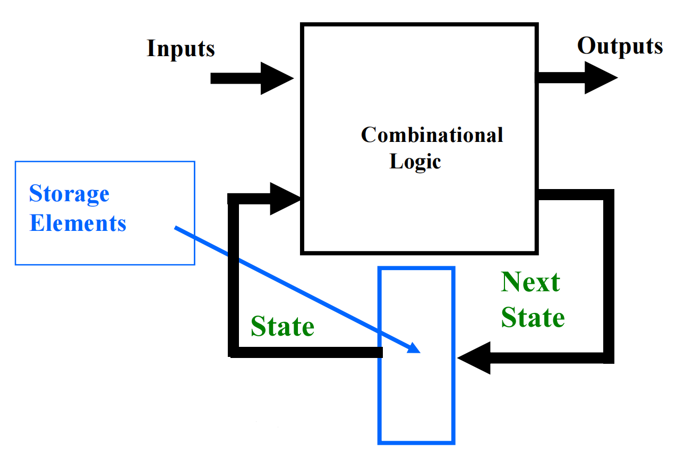

- 图片来自刘海风老师授课课件

## 2. Types of Sequential Circuits

Classified by the timing at which storage elements observe inputs and change states.

- **Synchronous:**

	- Behavior is defined at discrete instances of time.

    - Storage elements observe inputs and change state only in relation to a timing signal (clock pulses from a clock).

    - _Note:_ The synchronous abstraction makes complex designs tractable.

- **Asynchronous:**

	- Behavior is defined by the knowledge of inputs at any continuous instant and the order in which they change.

    - (If the clock is regarded merely as another input, all circuits are fundamentally asynchronous.)

## 3. State Storage and Latches

State is maintained by introducing feedback loops into combinational circuits.

- **Gate Delay & Circuit Delay Models:**

	- Real logic gates have delays.(e.g. A "glitche" caused by the delay of an inverter)

    - Connecting an output back to an input (feedback path) turns a combinational circuit into a sequential one, as the output becomes a function of a time sequence of input signals.

    - **Unstable State / Oscillator:** An inverter placed in a feedback path (e.g., $Y$ connected to an inverter that feeds back into the logic generating $Y$) creates an unstable circuit that continuously toggles. This acts as a crude clock.

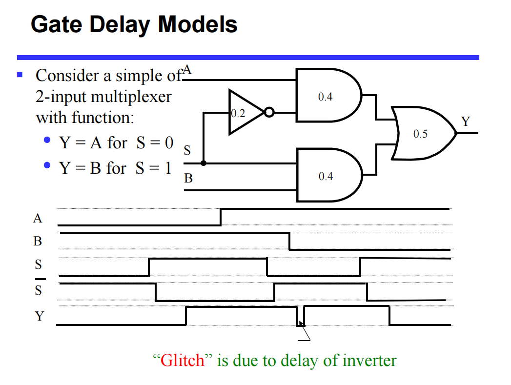

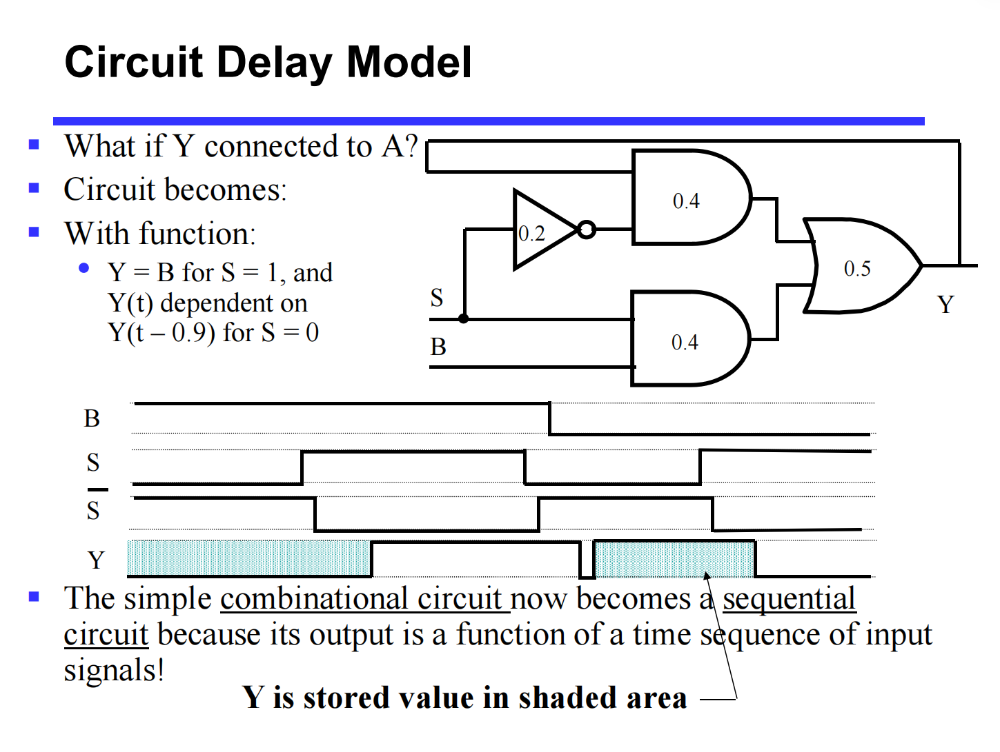

- **Basic $\bar{S}-\bar{R}$ Latch (NAND-based):**

    - **Structure:** Formed by "cross-coupling" two NAND gates.

    - **Active-Low Behavior:** Inputs act as active-low signals ($\bar{S}$ for Set, $\bar{R}$ for Reset).

        - $S = 1, R = 1$: **Hold** (Stored state unchanged).

        - $S = 0, R = 1$: **Set** ($Q \rightarrow 1$, $\bar{Q} \rightarrow 0$).

        - $S = 1, R = 0$: **Reset** ($Q \rightarrow 0$, $\bar{Q} \rightarrow 1$).

        - $S = 0, R = 0$: **Forbidden/Unstable**. Both $Q$ and $\bar{Q}$ go high ($1$), violating the complementary output rule.

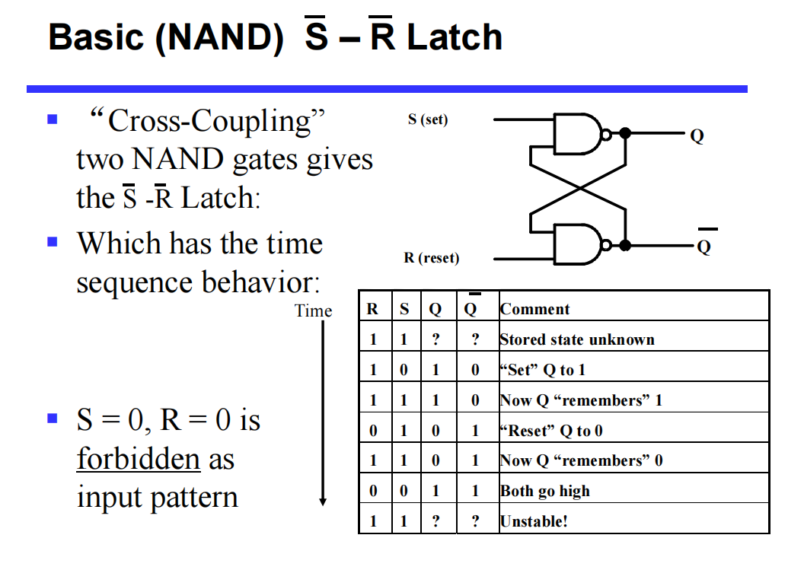

- **Basic $S-R$ Latch (NOR-based):**

    - **Structure:** Formed by "cross-coupling" two NOR gates.

    - **Active-High Behavior:** Inputs act as active-high signals.

        - $S = 0, R = 0$: **Hold** (Stored state unchanged).

        - $S = 1, R = 0$: **Set** ($Q \rightarrow 1$, $\bar{Q} \rightarrow 0$).

        - $S = 0, R = 1$: **Reset** ($Q \rightarrow 0$, $\bar{Q} \rightarrow 1$).

        - $S = 1, R = 1$: **Forbidden/Unstable**. Both $Q$ and $\bar{Q}$ go low ($0$), violating the complementary output rule.

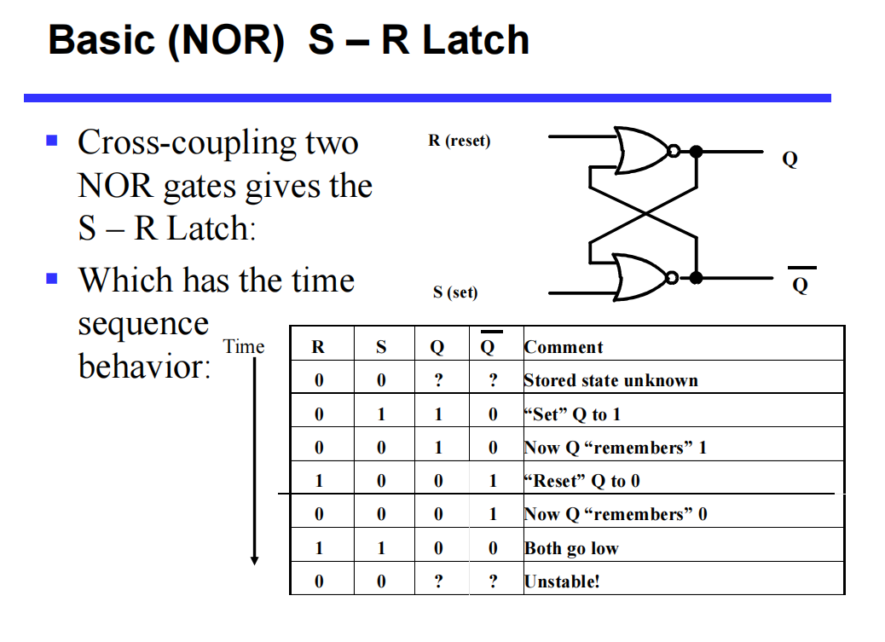

- **Clocked $S-R$ Latch:**

    - **Structure:** Adds two NAND gates to the front of a basic $\bar{S}-\bar{R}$ NAND latch to include a control/clock line ($C$).

    - **Gated Control:** The $S$ and $R$ inputs are only observed (passed to the core latch) when $C$ is high.

        - $C = 0$: **No change** (Opaque). Ignores $S$ and $R$ inputs.

        - $C = 1, S = 0, R = 0$: **No change** (Hold state).

        - $C = 1, S = 0, R = 1$: **Clear/Reset** ($Q \rightarrow 0$).

        - $C = 1, S = 1, R = 0$: **Set** ($Q \rightarrow 1$).

        - $C = 1, S = 1, R = 1$: **Undefined**. The forbidden state issue still exists if both inputs are asserted while the clock is high.

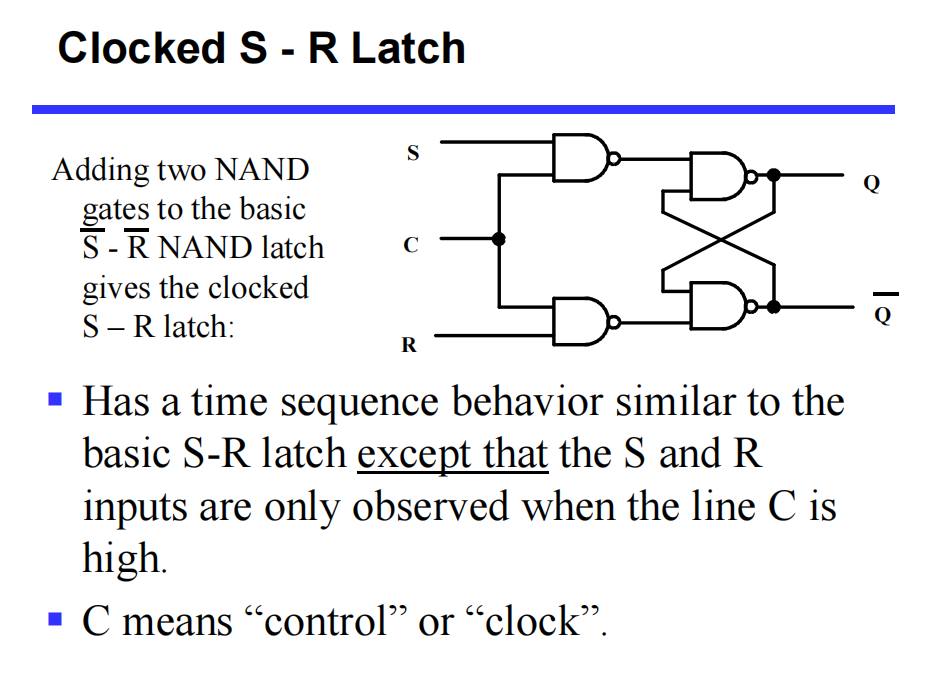

- **D Latch (Data Latch):**

    - **Structure:** Modifies the Clocked $S-R$ Latch by adding an inverter between the $S$ and $R$ inputs, creating a single Data ($D$) input (where $S = D, R = \bar{D}$).

    - **No Indeterminate States:** By strictly enforcing that $S$ and $R$ are always complementary, the problematic $S=1, R=1$ input pattern is entirely eliminated.

    - **Behavior:**

        - $C = 0$: **No change** (Opaque mode, retains previous state).

        - $C = 1$: **Transparent mode**. Output strictly follows the input ($Q(t+1) = D$).

            - If $D = 0 \rightarrow$ Clear $Q$ ($Q=0$).

            - If $D = 1 \rightarrow$ Set $Q$ ($Q=1$).

	    - **Alternative Implementation:** Can also be designed highly efficiently at the transistor level using **Transmission Gates (TG)** instead of standard logic gates.

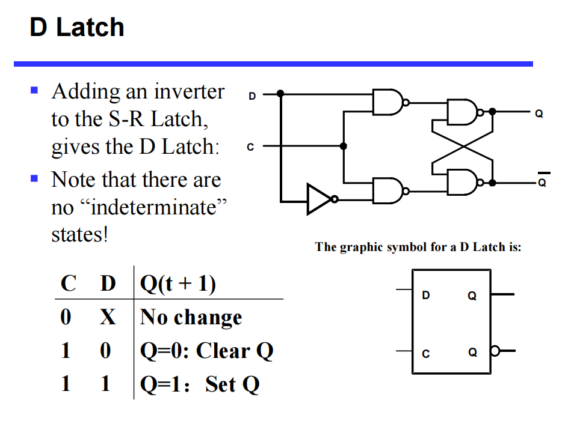

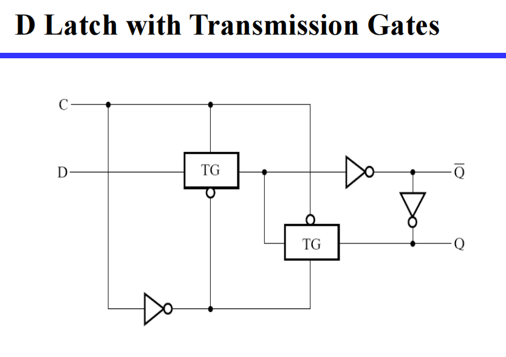

## 4. Flip-Flops and Timing Problems

- **The Latch Timing Problem:** In a standard latch with a feedback loop, if $C=1$ for too long, the output $Y$ can continuously change based on the loop delay. The desired behavior is for $Y$ to change _only once_ per clock pulse.

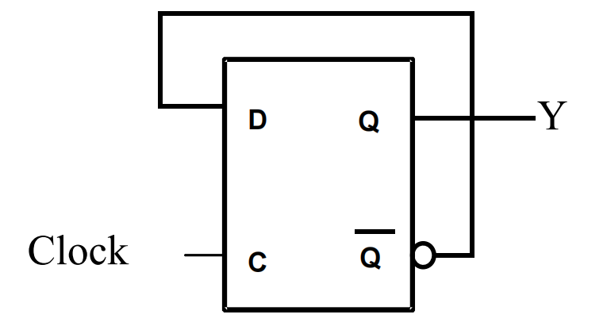

- **Solution:** Break the inner path from input to output within the storage element.

- **Master-Slave S-R Flip-Flop:**

    - Constructed with two clocked $S-R$ latches in series. The clock on the second (slave) latch is inverted.

    - **Operation:** Master observes input when $C=1$. Slave updates output when $C=0$. The input-output path is broken because master and slave are never transparent simultaneously.

	    - **"1s Catching" Problem:** S and/or R are permitted to change while $C=1$. If the master erroneously catches a '1' pulse (e.g., a glitch on S or R), it passes this incorrect state to the slave. This forces the circuit to be slower.

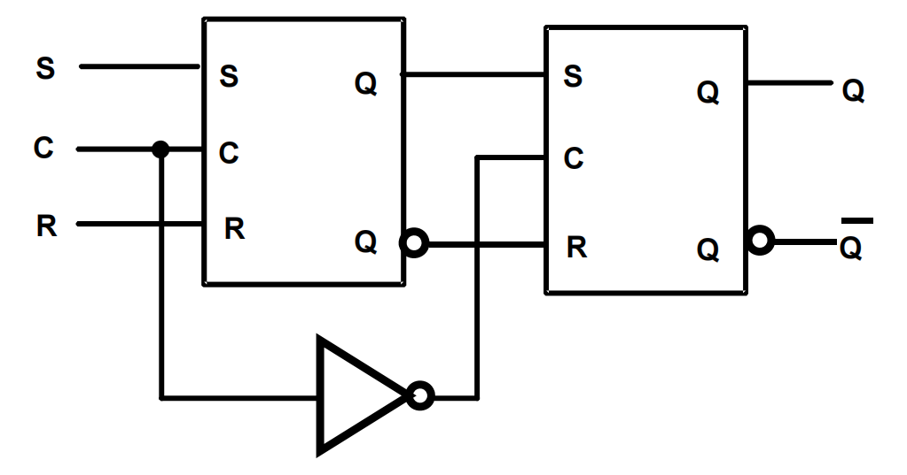

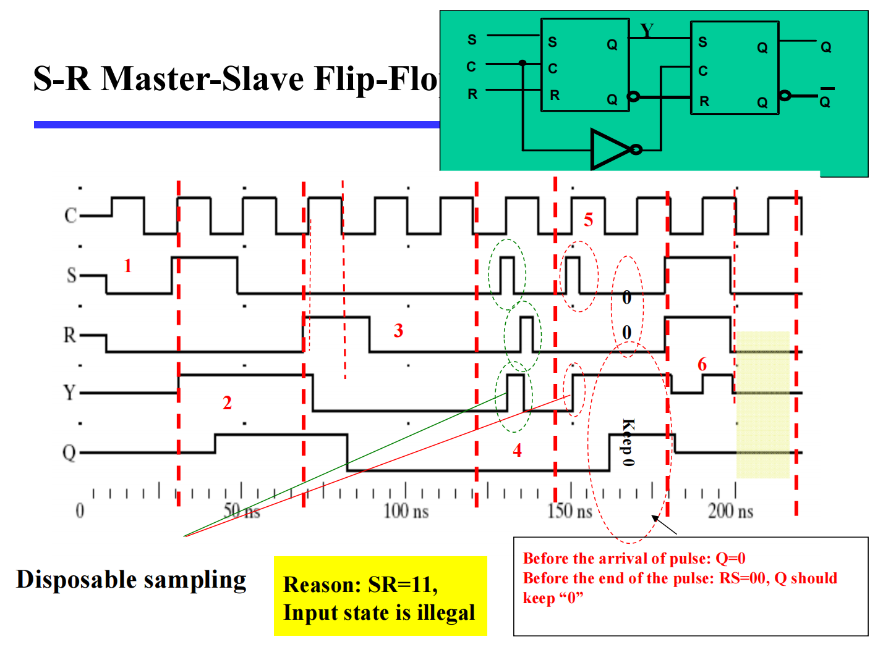

- Another solution is an edge-triggered flip-flop.

## 5. Edge-Triggered Flip-Flops

Edge-triggering solves the "1s catching" problem of the master-slave configuration.

- **Behavior:** Ignores the clock while it is at a constant level. Triggers _only_ during a transition (edge) of the clock signal.

- **Edge-Triggered D Flip-Flop:**

    - Formed by replacing the first clocked S-R latch with a clocked D latch (or adding a D input to a master-slave S-R).

    - Eliminates "1s catching" because D input lacks the separate S and R behaviors (It doesn't have the "Hold" status).

    - **Negative-Edge Triggered:** Output changes on the falling edge of the clock pulse.

    - **Positive-Edge Triggered:** Output changes on the rising edge of the clock pulse (usually formed by adding an inverter to the clock input).

    - Standard equation: $Q(t+1) \text{(the next output)} = D(t) \text{(the current input)}$.

**Negative-Edge Triggered Flip-Flop:**

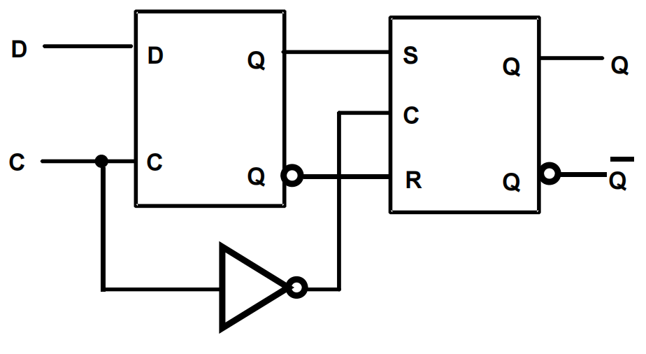

**Positive-Edge Triggered Flip-Flop:**

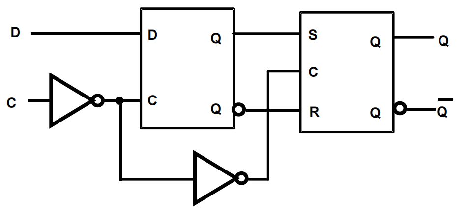

## 6. Other Flip-Flop Types

- **J-K Flip-Flop:**

    - Behavior is similar to S-R ($J \approx S$, $K \approx R$), but $J = K = 1$ is valid.

    - If $J = K = 1$, the state toggles (changes to the opposite state).

    - Implementation: Uses an edge-triggered D flip-flop as its core to avoid 1s catching. $D = J\bar{Q} + \bar{K}Q$.

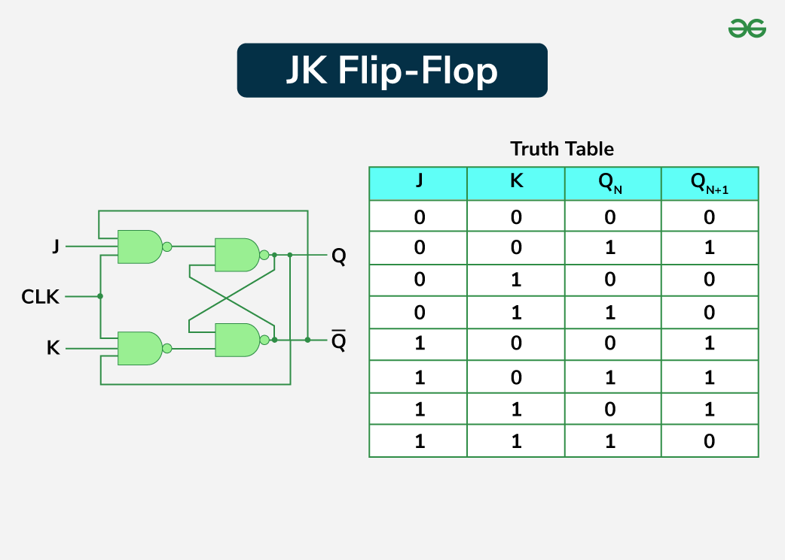

- reference: https://media.geeksforgeeks.org/wp-content/uploads/20240912114055/JK-Flip-Flop.png

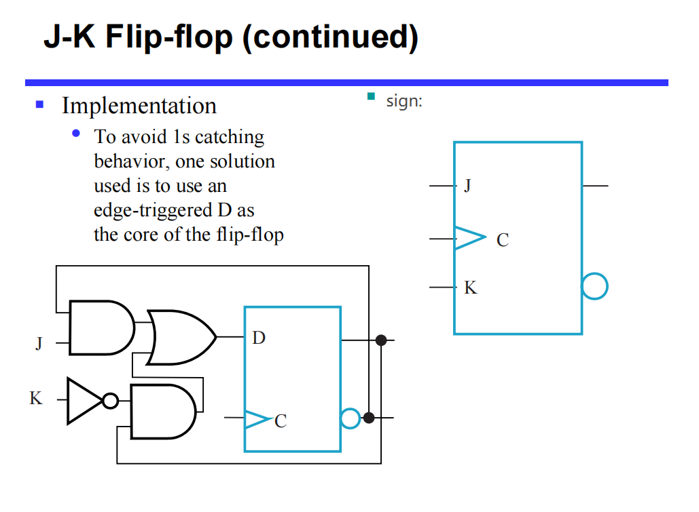

- **T (Toggle) Flip-Flop:**

    - Has a single input $T$.

    - If $T = 0$: No change ($Q(t+1) = Q(t)$).

    - If $T = 1$: State toggles ($Q(t+1) = \bar{Q}(t)$).

    - Equivalent to a J-K flip-flop where $J = K = T$.

    - Implementation: Often built using a D flip-flop and an XOR gate ($D = T \oplus Q$). Cannot be initialized to a known state using the T input alone; requires an asynchronous reset.

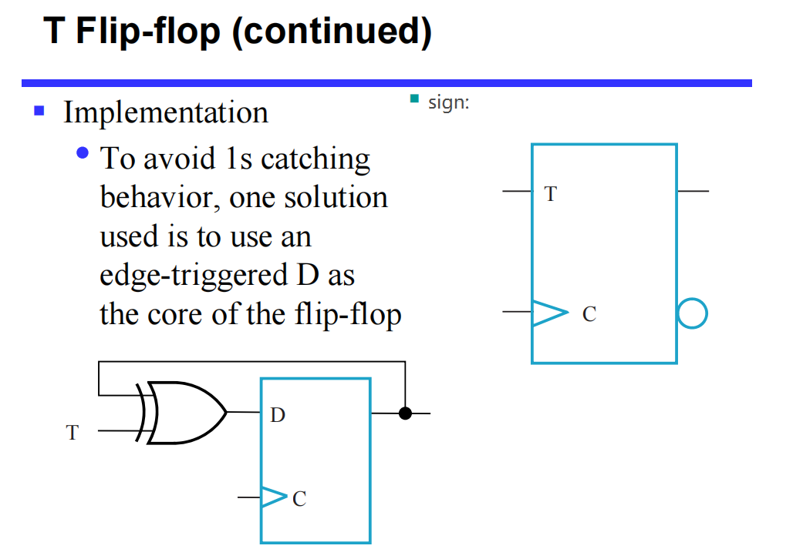

## 7. Direct Inputs and Standard Symbols

- **Direct Inputs (Asynchronous Initialization):**

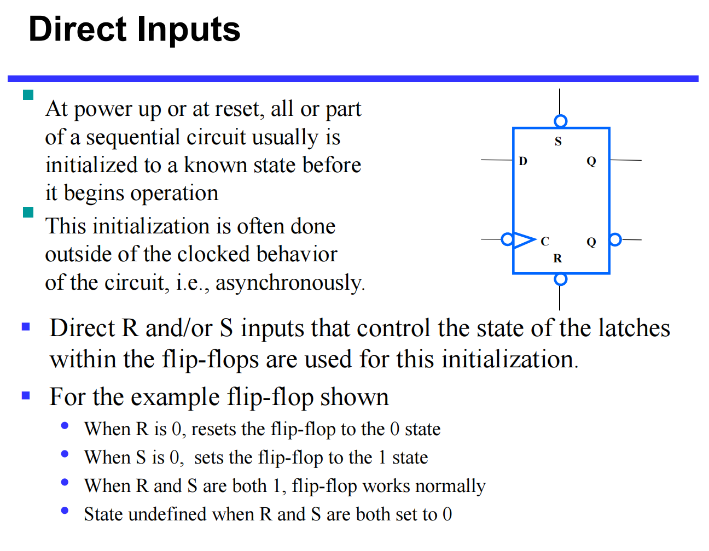

- **Standard Symbols:**

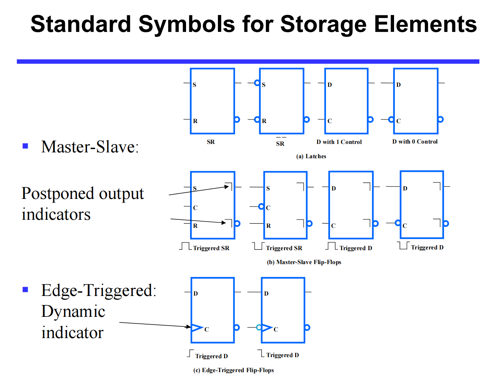

## 8. Synchronous Sequential Circuit Analysis

Sequential circuit analysis is the procedure of determining the behavior of a given logic diagram. This involves representing the circuit's functionality through state tables and state diagrams to illustrate the time sequence of inputs, outputs, and states.

- **General Model Equations:**

    - **Flip-Flop Input Equations:** Boolean expressions for the signals driving the storage elements (e.g., $D_A, D_B$).

    - **Next State Equation:** The state of the system at time $(t+1)$, formulated as a Boolean function of the present state and inputs: $State(t+1) = f(State(t), Inputs(t))$.

    - **Output Equation:** The output at time $(t)$, formulated as a function of the present state and (sometimes) present inputs.

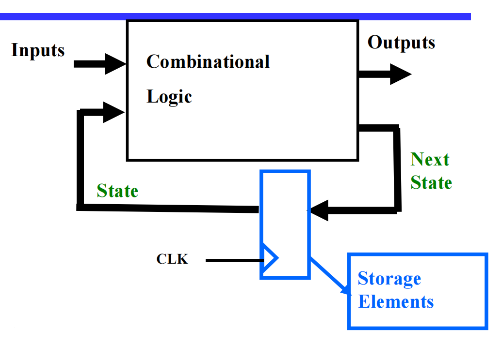

- **Standard Analysis Procedure:**

    1. Derive the output equations, flip-flop input equations, and next-state functions from the logic diagram.

    2. Derive the **State Table**.

    3. List the states of the sequential circuit.

    4. Obtain a **State Diagram**.

    5. Analyze the external performance of the circuit.

    6. Verify correctness, check for **self-recovery capability** (ensuring unused or illegal states naturally transition back into the valid operational sequence), and analyze timing parameters.

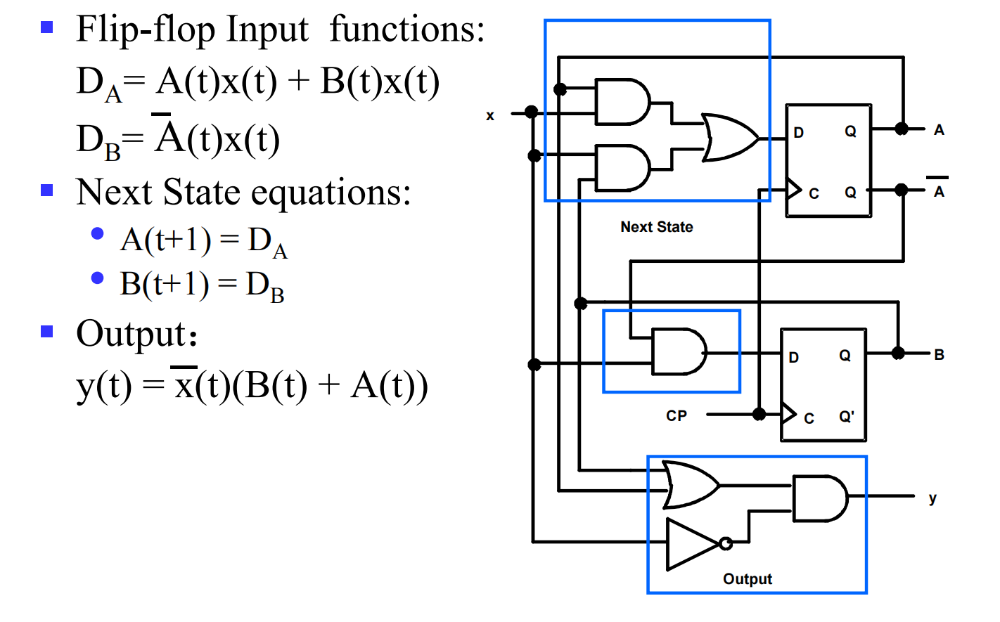

- **State Table Characteristics:**

    - Functions similarly to a truth table for sequential circuits.

    - Consists of four sections: **Present State**, **Input**, **Next State**, and **Output**.

    - _Alternative Format:_ Can be represented as a 2-dimensional table matching a K-map layout (Present state rows and input columns in Gray code order) for easier logic minimization.

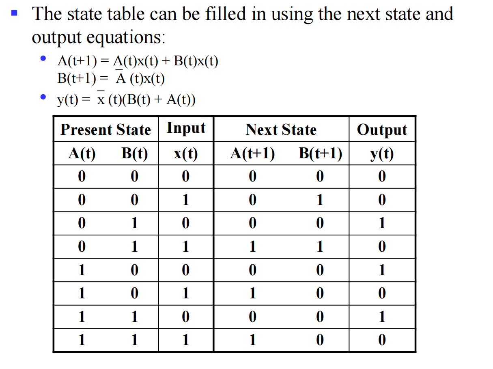

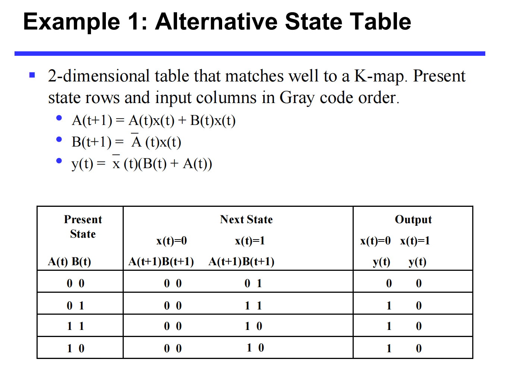

- **State Diagrams:**

    - A graphical representation of the sequential circuit's function.

    - **Circles** represent states (labeled with the state name).

    - **Directed Arcs** represent transitions from the Present State to the Next State.

    - **Arc Labels** denote the Input values that trigger the transition.

    - **Output Labels** are placed either inside the state circle or on the directed arc, depending on the FSM model used.

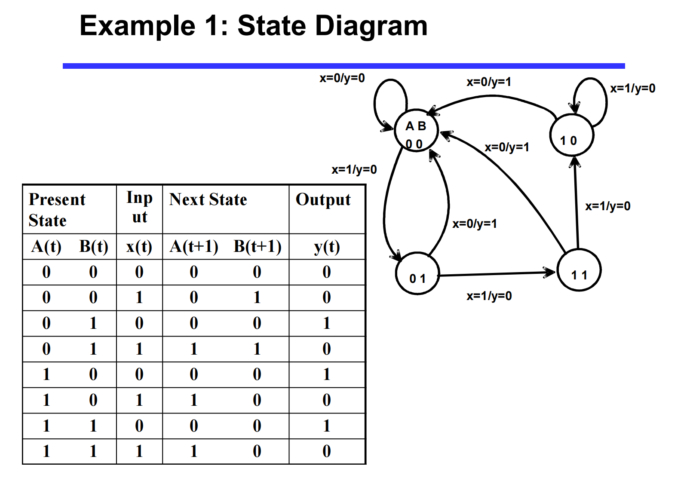

## 9. Finite State Machine (FSM) Models & State Reduction

- **Moore vs. Mealy Models:**

    - **Moore Model (E.F. Moore):** Outputs are a function **ONLY of states**. In state diagrams, the output is specified inside the state circles (e.g., $State/Output$).

    - **Mealy Model (G. Mealy):** Outputs are a function of **inputs AND states**. In state diagrams, the output is specified on the state transition arcs (e.g., $Input/Output$).

    - **Mixed Outputs:** In practical designs, FSMs often use a mixed model where some outputs are Moore-type and others are Mealy-type to simplify output specification.

- Mealy Model has been shown above, a Moore Model is like:

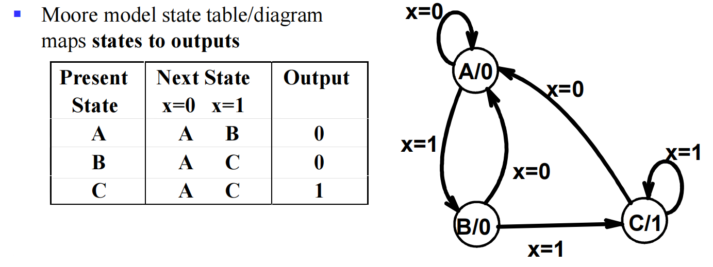

- mixed:

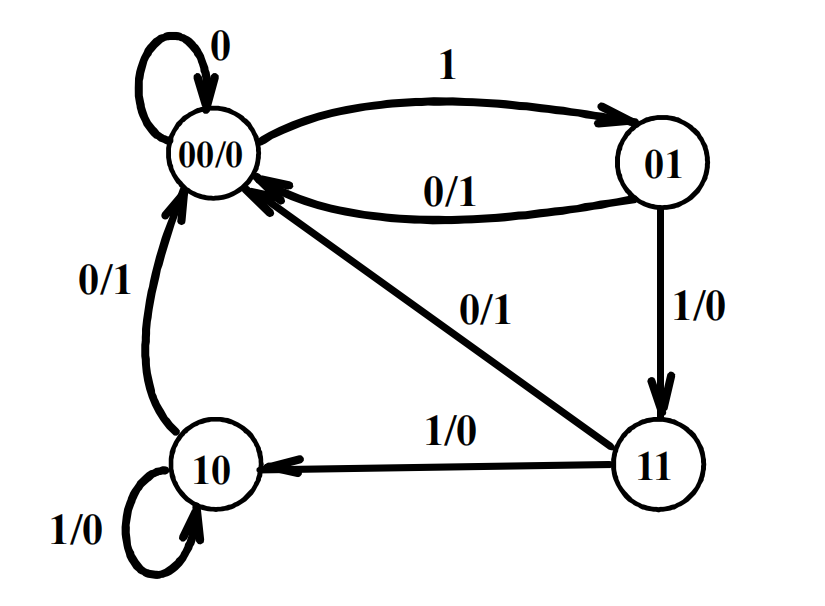

- **Equivalent States & State Reduction:**

    - To simplify logic and reduce hardware, redundant states can be merged.

    - **Definition:** Two states are _equivalent_ if their response (output) for every possible input sequence is identical.

    - _Alternative Definition:_ Two states are equivalent if, for every input symbol, their generated outputs are identical AND their next states are the same (or also equivalent).

    - Equivalent states can be consolidated into a single state in the state diagram without changing the circuit's external behavior.

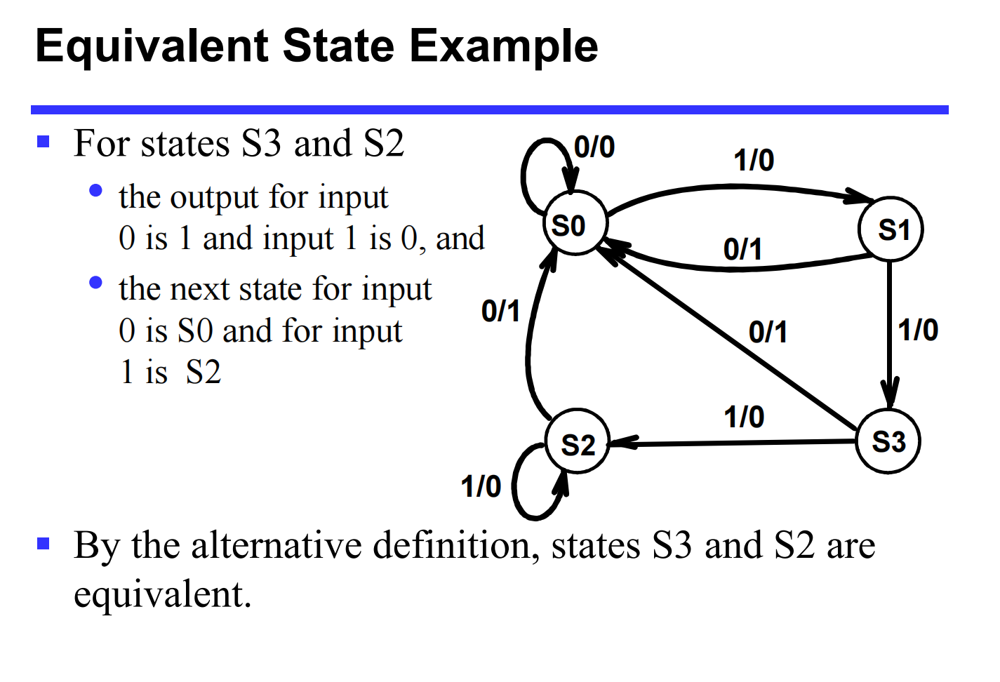

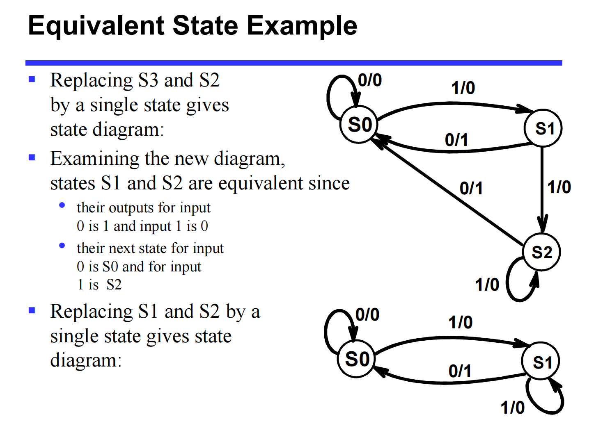

## 10. Circuit and System Level Timing

In synchronous systems, timing is critical. If the clock period is too short, data changes may not have enough time to propagate through the combinational logic to reach the flip-flop inputs before the required setup time interval begins.

- **Flip-Flop Timing Parameters:**

    - $t_s$ **(Setup Time):** The time data must be stable _before_ the triggering clock edge.

        - _Master-Slave:_ Equal to the width of the triggering pulse.

        - _Edge-Triggered:_ A much smaller time interval, generally much less than the pulse width.

    - $t_h$ **(Hold Time):** The time data must remain stable _after_ the clock edge. (Often equal to zero in modern edge-triggered devices).

    - $t_w$ **(Clock Pulse Width):** The duration the clock signal remains high or low.

    - $t_{px}$ or $t_{pd}$ **(Propagation Delay):** Measured from the clock edge that triggers the state change to the actual output change.

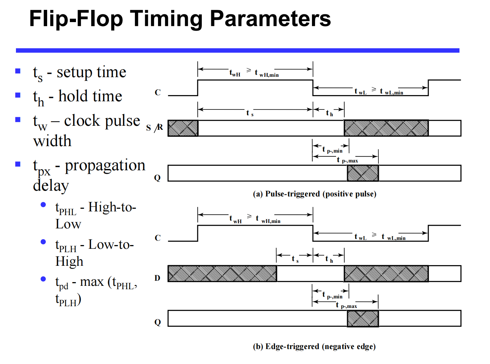

- **System Level Timing Equations:**

    - $t_p$: Clock period (1 / Clock Frequency).

    - $t_{pd,FF}$: Propagation delay of the source flip-flop.

    - $t_{pd,COMB}$: Total delay of the combinational logic along the path.

    - $t_{slack}$: Extra time margin in the clock period. For a circuit to operate correctly, $t_{slack}$ must be $\ge 0$ on all paths.

    - **Fundamental Timing Constraint:**

        $$
t_p = t_{slack} + (t_{pd,FF} + t_{pd,COMB} + t_s)
        $$

        $$
t_p \ge \max(t_{pd,FF} + t_{pd,COMB} + t_s)
        $$

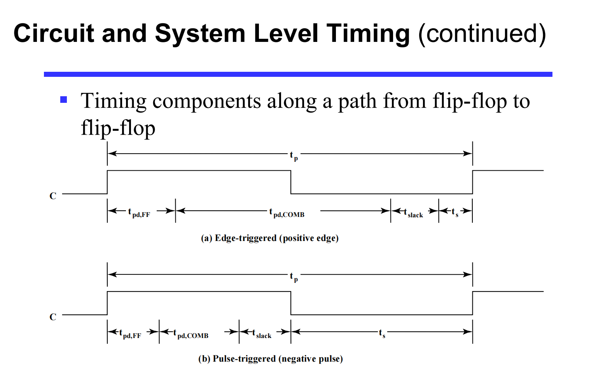

- **Performance Comparison (Edge-Triggered vs. Master-Slave):**

    - Because Master-Slave flip-flops require a setup time ($t_s$) equal to the entire clock pulse width, they severely limit the allowable combinational delay ($t_{pd,COMB}$).

    - Edge-triggered flip-flops have a very small $t_s$, allowing for a significantly larger $t_{pd,COMB}$.

    - _Result:_ At the same clock frequency, edge-triggered designs allow for much deeper combinational logic paths (more gates between flip-flops) compared to master-slave designs.

## 11. Synchronous Sequential Logic Design Procedure

Designing a synchronous sequential circuit involves a structured, step-by-step methodology:

1. **Specification:** Define the exact behavior and constraints of the desired circuit.

2. **Formulation:** Obtain a state diagram and/or state table that abstracts the history of past applied inputs into "states."

3. **State Assignment:** Assign unique binary codes to each state.

4. **Flip-Flop Input Equation Determination:** Select the type of flip-flops to be used (e.g., D, J-K) and derive the input (excitation) equations from the next-state entries in the state table.

5. **Output Equation Determination:** Derive output equations from the output entries in the state table.

6. **Optimization:** Use techniques like Karnaugh maps (K-maps) to minimize the Boolean equations for both flip-flop inputs and outputs.

7. **Technology Mapping:** Draw the final logic circuit diagram mapping the optimized equations to specific gate technologies and flip-flops.

8. **Verification:** Verify the correctness of the final design against the initial specification.

## 12. Formulation: Sequence Recognizers

A common application of sequential logic is a **Sequence Recognizer**, which produces a distinct output value whenever a prescribed pattern of input symbols occurs in sequence.

- **Design Procedure for Sequence Recognizers:**

    1. **Initial State:** Begin with a reset state representing that _none_ of the target sequence has occurred.

    2. **Successive States:** Add a new state for each successive symbol in the sequence that is correctly recognized.

    3. **Final State/Output:** The final state (or final transition) represents the full sequence occurrence and triggers the target output.

    4. **Handling Incorrect Inputs:** Add transition arcs for symbols that break the proper sequence. These arcs must point to the correct state representing the _new_ longest valid subsequence that has occurred.

    5. **Overlapping Sequences:** The recognizer must identify the sequence regardless of where it occurs, meaning the end of one recognized sequence might serve as the beginning of the next (e.g., recognizing "1101" within "1101101").

- **Mealy vs. Moore Implementation:**

    - **Mealy Model:** Outputs are on the transitions. It generally requires fewer states because the final output is triggered immediately upon receiving the final correct input symbol on the arc leading back to a previous state.

    - **Moore Model:** Outputs are bound to the states. "Moore is More"—it typically requires more states. To output a '1' upon recognizing a sequence, a dedicated final state (e.g., State E) must be created whose sole purpose is to hold the output '1', even if its future transitions are identical to an existing state. These represent a _different abstraction_ of the input history.

## 13. State Assignment Strategies

Because digital hardware uses binary signals, the abstract states (e.g., A, B, C, D) must be assigned unique binary codes.

- **Bit Requirements:** For $m$ states, the minimum number of bits $n$ required is the smallest integer such that $n \ge \lceil \log_2 m \rceil$. This leaves $2^n - m$ unused states.

- **Impact on Hardware Cost:** The choice of binary assignment directly impacts the complexity of the combinational logic (excitation and output equations). For example, a **Gray Code assignment** (where adjacent states differ by only one bit) often yields significantly simpler K-map groupings and lower gate counts compared to a simple **Counting Order assignment**.

- **Basic Rules for Optimal State Assignment** (Applied in priority order):

    1. States which have the same next states for a given input should be assigned adjacent binary codes. _(Highest Priority)_

    2. The next states of a present state with adjacent inputs should be assigned adjacent binary codes.

    3. States with the same output should be assigned adjacent binary codes.

    4. The initial state (or the most frequently used state) should be assigned a code of all zeros (e.g., 00 or 000) to simplify reset logic.

## 14. Handling Unused States and Hardware Reliability

When the number of states $m$ is not a perfect power of 2, the system will have unused binary state assignments.

- **The Problem:** Electrical noise, lightning, or bad connections at power-up might force the hardware into an unused state.

- **Freeze-Up:** If the combinational logic dictates that an unused state transitions only to itself or other unused states, the machine will "freeze" and fail permanently.

- **Self-Starting Machines:** A machine is "self-starting" if all unused states eventually transition back into the valid, used state sequence. If a fault occurs, the machine experiences a brief erratic operation but automatically recovers.

- **Design Trade-offs (Don't Cares vs. Forced Resets):**

    - _Optimization:_ During K-map optimization, unused states are typically marked as "Don't Cares" ($X$). This yields the simplest possible logic gates but leaves the behavior of unused states to chance.

    - _Reliability:_ To guarantee a self-starting machine, designers can replace the $X$s in the K-maps with $0$s. This forces any unused state to immediately transition to state 000 (Reset). While this ensures fault tolerance, it requires more complex steering logic and increases the gate count. Alternatively, explicit external RESET logic can be added to detect illegal states and force a system-wide reset.

## 15. Classic Sequential Logic Elements: Registers

While flip-flops are limited to storing only a single bit of information, practical digital systems require the manipulation of multi-bit data (e.g., 32-bit integers or single-precision floating-point numbers).

- **Definition:** A register is a sequential logic device consisting of a collection of binary storage elements (flip-flops) designed to store a vector of binary values.

- **Function in Systems:** Registers are central to the design of modern processors. They act as extremely fast, temporary on-chip storage for data movement and processing operations, offering significantly faster access times than main memory.

- **Load Control:** To prevent a register from capturing new data on every clock cycle, an Enable (EN) or Load signal is used.

    - _Clock Gating:_ Using logic gates (like an AND gate) directly on the clock signal to control loading. (Generally avoided in modern design due to timing issues and clock skew).

    - _Data Recirculation:_ The standard method uses a multiplexer-like structure at the D-input. When $EN=1$, new data is loaded; when $EN=0$, the register's current output is routed back into its input, holding the state.

## 16. Microoperations and Control Expressions

A register performs elementary operations on stored data, referred to as **microoperations**.

- **Categories of Microoperations:**

    - **Transfer:** Move data from one set of registers to another.

    - **Arithmetic:** Perform math (Addition, Subtraction, Multiplication, Division).

    - **Logic:** Bitwise operations (OR, AND, XOR, NOT).

    - **Shift:** Move data laterally within registers.

- **Control Expressions:** Used to mathematically specify the logical condition required for an operation to occur.

    - Format: `Condition : Operation`

    - Example: $X \cdot K1 : R1 \leftarrow R1 + R2$

    - _Interpretation:_ If variable $X=1$ AND $K1=1$, then activate the addition of Register 1 and Register 2, storing the result back in Register 1.

## 17. Register Transfer Structures

When multiple registers need to share data, routing must be optimized to reduce wiring complexity.

- **Dedicated Multiplexers:** Multiple inputs are selected by a dedicated multiplexer situated directly in front of each target register. (Requires more hardware).

- **Multiplexer Bus (Single Bus):** Multiple source outputs are routed into a single, shared multiplexer that drives a common data bus feeding into multiple destination registers.

- **Three-State Bus:** Replaces the shared multiplexer with 3-state (tri-state) buffers. Multiple inputs connect directly to the bus, and control logic ensures only one 3-state driver is active (enabled) at any given time to prevent electrical conflicts.

## 18. Shift Registers

A shift register moves its stored bits laterally in one or both directions (towards the MSB or LSB) on each clock edge.

- **Basic Architecture:** Created by chaining D flip-flops in a row, where the output $Q$ of one flip-flop feeds directly into the input $D$ of the next.

- **Data Access:**

    - _Serial In / Serial Out:_ Data enters one bit at a time and exits one bit at a time.

    - _Parallel In / Parallel Out:_ All bits can be loaded or read simultaneously.

- **Multi-Function Shift Registers:** By placing a 4-input multiplexer in front of each D flip-flop, a universal shift register can be designed to perform multiple operations based on select lines (e.g., $S_1, S_0$):

    1. Hold data (Recirculate)

    2. Shift Right

    3. Shift Left

    4. Parallel Load

## 19. Counters Overview

Counters are sequential circuits that sequence through a specific, predetermined set of states (e.g., count up, count down, or non-linear sequences).

- **Behavior:** The state itself serves as the "output." The sequence typically wraps around to the beginning after reaching its maximum value.

- **Application:** Used to keep track of time, count events (bits sent/received), or sequence operations. A primary example is a processor's **Program Counter (PC)**, which increments to track the address of the next instruction to execute.

## 20. Ripple Counters

Ripple counters operate asynchronously; they do not share a common clock.

- **Mechanism:** The system clock is connected only to the flip-flop representing the Least Significant Bit (LSB). For all subsequent bits, the clock input is driven by the output of the preceding flip-flop.

- **Ripple Effect:** Because each stage is triggered by the previous one, state changes "ripple" through the chain from LSB to MSB.

- **Drawback (Timing Delay):** Each flip-flop introduces a propagation delay ($t_{PHL}$). For an $n$-bit counter, the total worst-case delay before the final output stabilizes is $n \cdot t_{PHL}$. This severely limits the maximum operating frequency.

## 21. Synchronous Counters

To eliminate ripple delays, synchronous counters use a common clock connected directly to every flip-flop. Combinational logic computes the next state.

- **Mechanism (Incrementer):** Uses XOR gates to complement bits and AND gates to determine if a bit should toggle. A bit toggles only if _all_ less significant bits are currently '1'.

- **Carry Chain Architectures:**

    - **Serial Gating:** Uses a series of AND gates where the carry signal ripples through the combinational logic. Reduces flip-flop delay but still suffers from logic path delays.

    - **Parallel Gating (Lookahead):** Replaces the AND chain with parallel AND gates evaluating the direct state of lower bits. This acts similarly to a carry-lookahead adder, drastically reducing path delays and allowing for large, high-speed counters.

## 22. Advanced Counter Design: Modulo-N and BCD

Standard $n$-bit counters naturally count Modulo $2^n$ (e.g., a 4-bit counter wraps at 16). Often, designers need a counter that wraps at an arbitrary value $N$ (Modulo-N).

- **Synchronous BCD Counter (Modulo 10):** * Counts from 0000 to 1001 (0 to 9 decimal). States 1010 through 1111 are treated as "don't cares" during K-map optimization.

    - **Self-Recovery:** After design, the "don't care" states _must_ be analyzed. If noise forces the system into an invalid state (e.g., 1111), the derived logic must guarantee that the counter transitions back to a valid state (0-9) within a few clock cycles.

- **Techniques for Counting Modulo N (Using standard counter ICs):**

    - **The "Suicide" Counter (Bad Practice):** Detecting the terminal count $N$ and using it to trigger an _asynchronous Clear_. **Do not do this.** It creates an incredibly short, unstable glitch (e.g., briefly flashing '7' before resetting to '0') which can cause downstream logic to fail.

    - **Synchronous Load on Terminal Count $(N-1)$:** Detect the count $N-1$ (e.g., detect 6 for a Modulo 7 counter). Use this signal to drive the _Synchronous Load_ pin, loading '0' on the very next clock edge. This ensures clean, fully synchronous state transitions.

    - **Synchronous Preset with Carry-Out:** Preset the counter to an offset value and let it count up to its natural maximum (15). Example for Modulo 6: Load '9'. It counts 9, 10, 11, 12, 13, 14, 15. At 15, the built-in Carry Out (CO) signal naturally triggers the Load pin to reload '9'.
