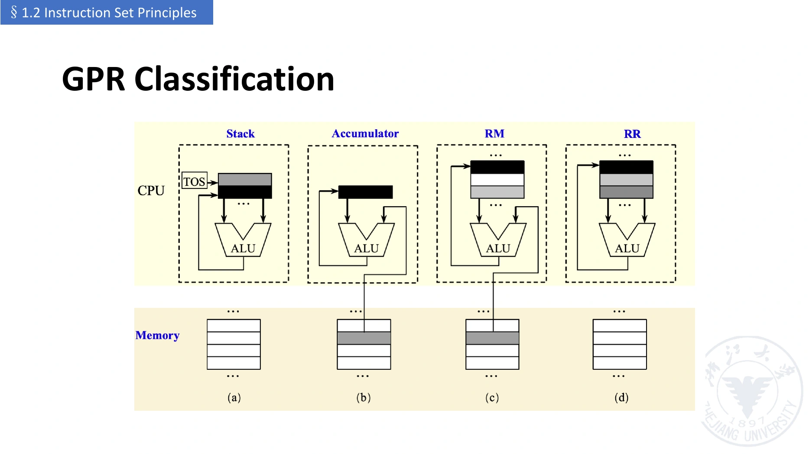

# ISA 分类、设计原则与寻址

[课程目录](../../index.md) · [上一章](01-system-and-cpu-review.md) · [下一章：RISC-V](03-risc-v-instructions.md)

## 1. ISA 要回答的问题

对于 `ADD R3, R1, R2`，ISA 要说明：

- **做什么（Operation）**：加法的语义是什么，数据怎样解释。
- **对谁做（Operands）**：源操作数与目的操作数如何指定。
- **到哪里找（Addressing）**：寄存器、立即数或存储器；若访存，如何构造有效地址。
- **如何编码（Encoding）**：上述信息怎样放入机器指令。

ISA 设计目标包括兼容性（Compatibility）、通用性/多用途性（Versatility）、高效率（Efficiency）与安全性（Security）。兼容性通常要求新实现仍能运行已有程序，但不意味着指令集不能增加新功能。

## 2. 按内部操作数存储方式分类

这里的内部存储（Internal Storage）指运算直接使用的操作数组织方式，不是按 CPU 是否“有缓存”分类。



*图源：`lec01-2026-chang.pdf` 第 64 页，课程课件，整页引用。TOS 为栈顶（Top of Stack），RM 为 register-memory，RR 为 register-register。*

### 2.1 栈架构（Stack Architecture）

运算数隐含位于栈顶，算术指令不必显式给出寄存器编号。将 `C = A + B` 编成教学伪汇编：

```text
PUSH A
PUSH B
ADD
POP C
```

ADD 弹出两个值并压回结果。若约定“次栈顶 op 栈顶”，则 `98 - 12 * 45` 可写为：

```text
PUSH 98
PUSH 12
PUSH 45
MUL           # 栈顶结果为 540
SUB           # 98 - 540
```

加法、乘法的交换律容易掩盖顺序问题；减法、除法必须确认该栈 ISA 的操作数约定。栈能使运算指令短，但随机访问深层值不方便，也限制编译器灵活安排中间结果。

### 2.2 累加器架构（Accumulator Architecture）

累加器（Accumulator, ACC）是隐含源操作数，同时保存结果；另一个源操作数显式指定：

```text
LOAD A        # ACC ← Mem[A]
ADD B         # ACC ← ACC + Mem[B]
STORE C       # Mem[C] ← ACC
```

“一个显式操作数”不代表加法只有一个输入，而是另一个输入和目的地都由架构隐含规定。硬件简单，但单一 ACC 容易成为数据流瓶颈。

### 2.3 通用寄存器架构（General-purpose Register Architecture, GPR）

软件显式选择寄存器存放变量和结果。常见两类如下：

| 类别 | 算术指令的来源 | `C=A+B` 的教学伪汇编 | 主要取舍 |
| --- | --- | --- | --- |
| 寄存器—内存（Register-memory） | 寄存器及内存操作数 | `LOAD R1,A; ADD R1,B; STORE C,R1` | 代码可较短，但取数时间与指令形式更复杂 |
| 寄存器—寄存器（Register-register / Load-store） | 寄存器；常数可用立即数 | `LOAD R1,A; LOAD R2,B; ADD R3,R1,R2; STORE C,R3` | 访存指令较多，但计算路径与编码更规则 |

这些是说明语义的伪汇编，不能直接交给 RISC-V 汇编器。x86 常用 register-memory 形式；RISC-V 基础整数指令采用 load-store 形式。

**内存—内存架构（Memory-memory Architecture）**允许算术操作直接指定多个内存操作数。课件分类表还包含这一类；它不应与“所有操作数都在通用寄存器里”的纯 register-register 架构混淆。

课程这里的“直接以内存作为算术操作数”不应称为 **DMA（Direct Memory Access）**。DMA 通常指外设/控制器进行数据传输的机制；它不是 register-memory 指令的同义词。

### 2.4 两地址与三地址指令

| 形式 | 语义 | 特点 |
| --- | --- | --- |
| 两地址（Two-address） | `ADD R1,R2`：R1 ← R1 + R2 | 一个源与目的重合 |
| 三地址（Three-address） | `ADD R3,R1,R2`：R3 ← R1 + R2 | 两个源与目的可分别指定 |
| 零地址（Zero-address） | 栈式 `ADD` | 运算操作数全部隐含 |

“地址”在这个术语中可以是寄存器编号，不专指内存地址。课件也用“内存地址操作数个数、允许的操作数总数”对 GPR 形式细分，两者必须分别计数。

课件第 62 页以二元组 **(memory operands, total operands)** 分类，目的操作数也计入总数；目的与源重合时只算一个显式位置：

| 类别 | 二元组 | 示例语义 |
| --- | --- | --- |
| register-register / load-store | (0, 3) | R3 ← R1 + R2 |
| register-memory | (1, 2) | R1 ← R1 + M[A] |
| register-memory | (1, 3) | R3 ← R1 + M[A] |
| memory-memory | (2, 2) | M[A] ← M[A] + M[B] |
| memory-memory | (3, 3) | M[C] ← M[A] + M[B] |

这些是架构设计形式，不表示每个现有 ISA 都提供表中全部形式。总操作数数目也不同于实际访问内存的次数：读后写同一个内存目的仍可能产生多次访问。

### 2.5 为什么 GPR 常用

寄存器能以很短的访问路径提供数据；编译器可以把高频使用的变量或中间结果保留在其中，利用**时间局部性（Temporal Locality）**。选择 32 个寄存器中的一个只需要 5 位编号，比编码完整内存地址更紧凑。

容量有限也带来**寄存器溢出到内存（Register Spilling）**：变量过多时，部分值需写回栈或其他内存位置，用时再加载。这是寄存器分配（Register Allocation）需要优化的成本。

## 3. 四条设计原则

| 英文原句 | 中文解释 | 典型体现 |
| --- | --- | --- |
| Simplicity favors regularity | 简单有利于规整 | 统一字段位置、少量指令格式 |
| Smaller is faster | 小通常更快 | 小型寄存器组、短控制与选择路径；同时权衡容量 |
| Make the common case fast | 让常见情况快 | 小常数直接编码为立即数 |
| Good design demands good compromises | 好设计需要合理取舍 | 为大常数增加专门格式；在编码、范围和电路复杂度间权衡 |

这里的原则是设计启发，不是“部件越少性能越好”的定理。例如减少寄存器数量可能导致更多访存，从而降低程序性能。

## 4. 寻址模式（Addressing Modes）

**有效地址（Effective Address, EA）**是 CPU 本次访问存储器使用的地址。下面用 $R[r]$ 表示寄存器值，$M[a]$ 表示地址 $a$ 的内存内容，$d$ 为指令中的位移量。

| 模式 | 英文 | 操作数或 EA 的构造 | 用途 |
| --- | --- | --- | --- |
| 寄存器 | Register | $R[r]$ | 已在寄存器中的变量 |
| 立即数 | Immediate | 指令中的常数 | 小常数 |
| 位移/基址 | Displacement / Base | $EA=R[b]+d$ | 栈帧、结构体成员、常量下标 |
| 寄存器间接 | Register Indirect | $EA=R[b]$ | 指针解引用；基址模式的零位移特例 |
| 索引 | Indexed | $EA=R[b]+R[i]$ | 数组动态下标 |
| 直接/绝对 | Direct / Absolute | $EA=d$ | 直接编码地址 |
| 内存间接 | Memory Indirect | $EA=M[R[b]+d]$ | 从内存取出指针后再访问 |
| 自动增量 | Autoincrement | 访问 $R[b]$ 后增加该寄存器 | 连续扫描 |
| 自动减量 | Autodecrement | 减小寄存器后访问 | 反向扫描、某些栈操作 |
| 比例索引 | Scaled Indexed | $EA=R[b]+R[i]\times s+d$ | 数组元素宽度为 $s$ |
| PC 相对 | PC-relative | $target=PC_{\mathrm{instruction}}+offset$ | 分支、相对跳转 |

前十种体现课件中的一般 ISA 模式；**不表示 RISC-V 基础指令每一种都原生支持**。例如 RISC-V 动态数组下标通常先 shift/add 算地址，再用基址 load/store。

RISC-V 重点掌握寄存器、立即数、基址访存和 PC 相对控制转移。后两者都采用“基准 + 偏移”，但**分支目标不是分支的数据操作数**：分支比较寄存器，目标地址用来选择后续取指位置。

相对寻址的好处是不用在短指令中塞下完整地址，也便于代码整体移动后保持局部相对关系。跳转范围仍受立即数字段限制，超出范围需多条指令或链接器处理。

## 5. 存储单位、字节序与对齐

### 5.1 字节寻址（Byte Addressing）

| 名称 | 英文 | 位数 | 字节数 |
| --- | --- | --- | --- |
| 字节 | Byte | 8 | 1 |
| 半字 | Halfword | 16 | 2 |
| 字 | Word | 32 | 4 |
| 双字 | Doubleword | 64 | 8 |
| 单精度浮点 | Single-precision Floating Point | 32 | 4 |
| 双精度浮点 | Double-precision Floating Point | 64 | 8 |

课件还列出 ASCII 的 8 位存储单元和 80 位扩展浮点（Extended Precision）示例。ASCII 编码本身只需 7 位，通常放在一个字节中；80 位浮点是某些架构的格式，不能当作 RISC-V F/D 扩展的通用数据宽度。

这些 word/doubleword 是 RISC-V 语境中的名称。RV64 的寄存器是 64 位，但 word 仍指 32 位。`int`、`long`、指针的大小还受语言与 ABI 影响。课件列出的“Unicode 字符 16 位”只可作为某种编码单元的例子；Unicode 字符不普遍固定为 16 位。

若 A 是元素宽度为 $s$ 字节的数组：

$$
\operatorname{address}(A[i])=\operatorname{base}(A)+i\times s.
$$

连续 word 首地址递增 4；连续 doubleword 首地址递增 8。地址单位是字节，不能将“第 8 个元素”和“偏移 8 字节”等同。

### 5.2 大端与小端（Big Endian / Little Endian）

把 `0x12345678` 放到起始地址 A：

| 地址 | A | A + 1 | A + 2 | A + 3 |
| --- | --- | --- | --- | --- |
| 小端（Little Endian） | 78 | 56 | 34 | 12 |
| 大端（Big Endian） | 12 | 34 | 56 | 78 |

小端把**最低有效字节（Least Significant Byte）放到最低地址**。字节序改变字节在内存中的排列，不改变寄存器中该数的数学值，也不是把一个字节里的位反转。本课程例子采用小端。

### 5.3 自然对齐（Natural Alignment）

宽度为 $s$ 字节的对象，首地址 A 满足

$$
A\bmod s=0
$$

时自然对齐。4 字节 word 对齐地址如 0、4、8；8 字节 doubleword 如 0、8、16。

在按 4 字节对齐块读取的示意模型中，从地址 3 读取 4 字节，跨越块 `[0,3]` 和 `[4,7]`，可能需要两次块访问。**未对齐访问仍然是从地址 3 开始的那 4 个字节**，不会自动改成读取地址 4 的对象。

未对齐访问的实际代价、是否支持或是否产生异常由实现与执行环境决定。课件“两次访问”描述的是示意模型，不能泛化为所有未对齐访问恰好两次；也不能把“按字节寻址”理解成“每次只能读一个字节”。

## 6. 操作类别与 RISC/CISC

一般 ISA 可提供算术逻辑（Arithmetic and Logic）、数据传送（Data Transfer）、控制流（Control Flow）、系统（System）、浮点（Floating Point）、十进制（Decimal）、字符串（String）、图形（Graphics）等操作。基础 RISC-V 整数教学子集主要涉及前三类。

控制流又分条件分支（Conditional Branch）、无条件跳转（Jump）、过程调用（Procedure Call）和返回（Return）；返回地址常在运行时通过寄存器取得。

| 维度 | RISC：Reduced Instruction Set Computer | CISC：Complex Instruction Set Computer |
| --- | --- | --- |
| 经典思路 | 常用简单操作、规则编码、load-store | 较丰富的操作和寻址形式 |
| 典型优势 | 译码与阶段划分较直接，便于流水化 | 单条指令可做较多工作，代码可能更紧凑 |
| 典型代价 | 同一高级操作可能需要较多指令 | 译码和复杂指令实现可能更复杂 |
| 性能判断 | 要结合 IC、CPI 与时钟 | 同样要结合 IC、CPI 与时钟 |

现代实现会结合多种技术。例如课件指出 x86 实现会将复杂指令译为内部微操作（Micro-operations）。RISC 不意味着“没有扩展指令”，CISC 也不意味着“不能流水化”。

## 7. 易错点

- 指令更强、代码更短，未必执行更快；硬件路径、访存与 CPI 同样重要。
- 手写汇编未必比编译器快；寄存器分配与指令安排需要考虑具体微体系结构。
- 向后兼容（Backward Compatibility）允许增加功能；不能简单断言旧指令必然被淘汰。
- 取指地址在本课程的 32 位指令模型中加 4；这不是所有 RISC-V 指令长度的通用规则。

## 参考资料

- `lec01-2026-chang.pdf`，第 34–84、118–121 页。
- 第 1 份授课文本约 60:32–98:00，第 2 份约 03:32–33:41、89:22–97:23。
- RISC-V 的访存、对齐与基础指令边界：[官方 RV32I 规范](https://docs.riscv.org/reference/isa/v20260120/unpriv/rv32.html)。
