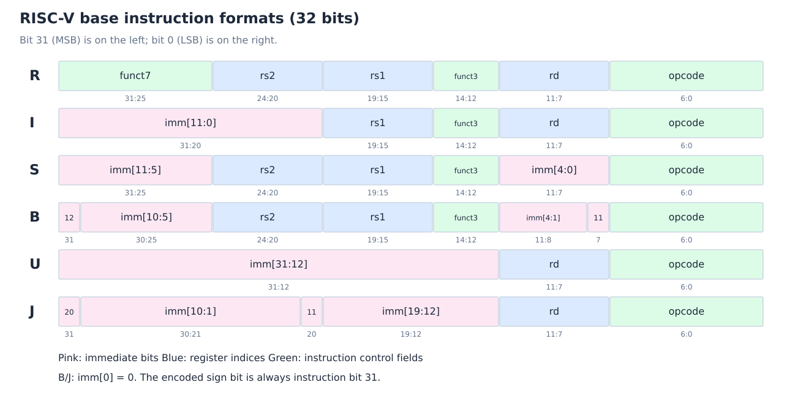

# RISC-V 指令与程序翻译

[课程目录](../../index.md) · [上一章](02-isa-design-and-addressing.md) · [下一章：过程调用](04-procedure-calls.md)

## 1. 基础指令集与扩展

RISC-V 是开放的 ISA，起源于 UC Berkeley 的研究项目。它采用“基础整数 ISA + 可选扩展”的模块化（Modular）组织：

| 标记 | 含义 | 核心能力 |
| --- | --- | --- |
| RV32I / RV64I | Base Integer ISA | 32/64 位整数寄存器、整数计算、load/store、控制流 |
| M | Integer Multiplication and Division | 整数乘除 |
| A | Atomic Instructions | 原子读改写，支持同步 |
| F | Single-precision Floating Point | 单精度浮点 |
| D | Double-precision Floating Point | 双精度浮点 |
| C | Compressed Instructions | 常用指令的 16 位压缩编码 |

I 是基础 ISA，不包括整数乘除的 M 扩展。**ISA 指令的位数与寄存器位数是两件事**：RV64I 的常规指令仍是 32 位，寄存器宽度 XLEN 则是 64。

本课程流水线主要针对不含压缩指令的教学子集，顺序 PC 加 4。包含 C 等扩展时，不能认为所有指令都长 4 字节。RISC-V 也没有架构规定的分支延迟槽（Branch Delay Slot）。

## 2. 寄存器和三种操作数来源

基础整数模型有 `x0–x31` 共 32 个寄存器。`x0` 恒为零，其余可保存位串、有符号整数或无符号整数；相同位串的解释由指令决定。

| 寄存器 | ABI 名称 | 典型用途 |
| --- | --- | --- |
| x0 | zero | 硬件常量零 |
| x1 | ra | 返回地址（Return Address） |
| x2 | sp | 栈指针（Stack Pointer） |
| x3 / x4 | gp / tp | 全局指针 / 线程指针 |
| x5–x7、x28–x31 | t0–t6 | 临时寄存器（Temporary） |
| x8–x9、x18–x27 | s0–s11 | 被调用者保存（Callee-saved） |
| x10–x17 | a0–a7 | 参数；其中 a0/a1 也用于返回值 |

除 x0 的硬件语义外，表中的用途属于软件调用约定，详见[过程调用](04-procedure-calls.md)。

三类常见数据来源：

- **Register operand**：例如 `add x8, x9, x5`。
- **Immediate operand**：例如 `addi x8, x8, 4`，常数直接来自指令。
- **Memory operand**：load/store 的数据来自内存或写入内存；计算前通常先加载。

`addi x8,x9,-1` 可实现减 1，无需额外的 subi。立即数编码有范围限制，并非任何常数都能塞入一条 addi。

## 3. 六种常见指令格式

R、I、S、U 是四种核心格式，B、J 是立即数编码的变体；课程通常合称六种。所有格式的 opcode 固定在 `inst[6:0]`。存在的 rd、rs1、rs2 字段位置分别固定为 `[11:7]`、`[19:15]`、`[24:20]`，有利于译码和寄存器读取。



*自绘，按 RISC-V 基础指令编码整理。框内的 imm 编号表示重建后的立即数位号，不是机器指令位号。*

| 格式 | 从高位到低位的主要字段 | 典型用途 |
| --- | --- | --- |
| R | funct7 / rs2 / rs1 / funct3 / rd / opcode | 寄存器 ALU |
| I | imm[11:0] / rs1 / funct3 / rd / opcode | 立即数 ALU、load、jalr |
| S | imm[11:5] / rs2 / rs1 / funct3 / imm[4:0] / opcode | store |
| B | imm[12,10:5] / rs2 / rs1 / funct3 / imm[4:1,11] / opcode | 条件分支 |
| U | imm[31:12] / rd / opcode | lui、auipc |
| J | imm[20,10:1,11,19:12] / rd / opcode | jal |

**固定位置不意味着字段总是有效。**例如 store 在 `[11:7]` 放的是立即数，不是目的寄存器；load 的 `[24:20]` 是立即数的一部分，不是第二个源寄存器。后续冒险检测必须知道某条指令是否真的读取/写入对应寄存器。

### 3.1 立即数生成（Immediate Generation）

以下 `sext` 表示符号扩展（Sign Extension），花括号表示从高到低拼接：

```text
I: sext(inst[31:20])
S: sext({inst[31:25], inst[11:7]})
B: sext({inst[31], inst[7], inst[30:25], inst[11:8], 0})
U: {inst[31:12], 12'b0}
J: sext({inst[31], inst[19:12], inst[20], inst[30:21], 0})
```

RV64 中 U 型形成的 32 位结果还需要符号扩展到 XLEN。B/J 最低位补零后，已得到**字节偏移**；后续相加时不要再额外乘 2。字段位置的规则优先服务于译码与布线，而非让立即数字段按数字顺序连续排列。[编码依据：官方 RV32I 规范](https://docs.riscv.org/reference/isa/v20260120/unpriv/rv32.html)。

### 3.2 大常数（Large Constants）

I 型普通立即数为有符号 12 位，即 $[-2048,2047]$。U 型的 lui（Load Upper Immediate）将 20 位字段置于高位，低 12 位清零。

例如在 RV32I 中构造 `0x12345678`：

```asm
lui  x5, 0x12345
addi x5, x5, 0x678
```

若常数低 12 位最高位为 1，addi 会把这部分当成负数，需要调整高 20 位。例如 `0x12345abc`：

```asm
lui  x5, 0x12346
addi x5, x5, -1348    # 0x12346000 - 0x544 = 0x12345abc
```

这里是讲解拼接的例子；一般代码可让汇编器的 `li` 伪指令选择序列。不要照抄课件中“16 位立即数、lui 高 16 位 + ori 低 16 位”的 MIPS 规则。

## 4. Load-store 与数组例题

有效地址为

$$
EA=R[rs1]+\operatorname{sext}(imm_{12}).
$$

偏移单位是字节，数据大小由指令决定：

| 指令 | 数据宽度 | 说明 |
| --- | --- | --- |
| lb / lbu | 8 位 | 带符号 / 无符号加载 |
| lh / lhu | 16 位 | 带符号 / 无符号加载 |
| lw | 32 位 | RV64 中符号扩展到 64 位 |
| lwu | 32 位 | RV64 中零扩展到 64 位 |
| ld | 64 位 | RV64 加载双字 |
| sb / sh / sw / sd | 8/16/32/64 位 | 写入源寄存器对应的低位数据；sd 用于 RV64 |

这里“写入低位”是指从寄存器中选择相应数据宽度；内存地址仍由基址加偏移确定。

### 4.1 `g = h + A[8]`

假设 A 的元素为 32 位 word，g 在 x8、h 在 x9、A 的基址在 x18：

```asm
lw  x5, 32(x18)       # 8 × 4 = 32 字节
add x8, x9, x5
```

如果 A 元素为 64 位，才应改为 `ld x5,64(x18)`。**不能仅凭 CPU 是 RV64，就把所有数组元素都算成 8 字节。**

### 4.2 `A[12] = h + A[8]`

假设 h 在 x8，A 的基址在 x9，元素仍为 word：

```asm
lw  x5, 32(x9)
add x5, x8, x5
sw  x5, 48(x9)        # 12 × 4 = 48 字节
```

先 load，后 ALU，再 store。课件用该例强调寄存器分配：尽量让高频值留在寄存器里，减少加载/保存次数。

## 5. 算术、逻辑与有符号比较

| 操作 | 寄存器指令 | 立即数形式/说明 |
| --- | --- | --- |
| 加减 | add / sub | addi；减常数通常用负立即数 |
| 与、或、异或 | and / or / xor | andi / ori / xori |
| 逻辑左移 | sll | slli |
| 逻辑右移 | srl | srli，左端补零 |
| 算术右移 | sra | srai，左端补符号位 |
| 有符号小于 | slt | slti |
| 无符号小于 | sltu | sltiu |

AND 常用于掩码（Masking），OR 常用于设置位（Setting Bits）。基础 ISA 没有课件表中的 `nor`；按位非可以写 `xori rd,rs,-1`（常见伪指令 `not`）。

`sll` 的移位量来自寄存器，常数移位要用 `slli`。因此课件循环例的 `sll x8,x3,2` 应改为 `slli x8,x3,2`。

以 RV32 的位串 `0xffffffff` 和 `0x00000001` 比较：

- slt 将前者解释为 $-1$，所以 $-1<1$，结果为 1。
- sltu 将前者解释为 $2^{32}-1$，所以结果为 0。

寄存器本身没有“有符号类型”标签。另一个细节：sltiu 的立即数仍先符号扩展，再按无符号值参与比较；指令名中的 unsigned 不表示立即数自动零扩展。

## 6. 控制转移与 PC 相对寻址

### 6.1 条件分支（Conditional Branch）

beq/bne 检查相等/不等；blt/bge 检查有符号大小；bltu/bgeu 检查无符号大小。RISC-V 基础 ISA **直接提供大小分支**，课件中“为什么没有 blt/bge”的讨论不能作为 RISC-V 指令列表。

对于分支指令自身所在的地址 $PC_B$：

$$
PC_{\mathrm{next}}=
\begin{cases}
PC_B+\operatorname{sext}(Bimm),&\text{taken}\\
PC_B+4,&\text{not taken}.
\end{cases}
$$

Bimm 已包含末位 0，范围为 $[-4096,4094]$ 字节，步长 2 字节。本章无压缩指令模型仍要求实际执行目标按 4 字节对齐。

### 6.2 jal 与 jalr

| 指令 | 目标 | 链接地址 |
| --- | --- | --- |
| `jal rd,label` | 当前指令 PC + J 型字节偏移 | 当前指令 PC + 4 写入 rd |
| `jalr rd,imm(rs1)` | (R[rs1] + 有符号 12 位立即数) 清除最低位 | 当前指令 PC + 4 写入 rd |

jal（Jump and Link）的直接相对范围约为 ±1 MiB，**并不能直接编码任意 64 位绝对地址**。jalr（Jump and Link Register）用于寄存器间接跳转，立即数不按 2 字节缩放。[指令语义依据：官方 RV32I 规范](https://docs.riscv.org/reference/isa/v20260120/unpriv/rv32.html)。

`jal x0,label` 是普通无条件跳转，丢弃链接地址；`jal x1,procedure` 常用于调用；`jalr x0,0(x1)` 常用于返回。控制流改变并不总意味着函数调用。

### 6.3 If-else 翻译

```c
if (i == j) f = g + h;
else        f = g - h;
```

假设 f/g/h/i/j 分别在 x5/x6/x7/x8/x9：

```asm
    bne x8, x9, Else
    add x5, x6, x7
    jal x0, Exit
Else:
    sub x5, x6, x7
Exit:
```

把条件取反，先跳过 then 分支；执行完 then 后再跳过 else。这里的跳过操作使用 x0，避免无意义地覆盖 ra。

若第一条地址为 P，后续指令地址为 P+4、P+8、P+12，Else 与 Exit 分别为 P+12、P+16，因此两条控制指令的偏移为 12 与 8。偏移相对于各自指令地址，不是相对于已经加 4 的新 PC。

### 6.4 While 翻译

假设 i 在 x3、k 在 x5、save 的基址在 x6，save 元素为 word：

```asm
Loop:
    slli x8, x3, 2       # i × 4
    add  x8, x8, x6      # &save[i]
    lw   x7, 0(x8)
    bne  x7, x5, Exit
    addi x3, x3, 1
    jal  x0, Loop
Exit:
```

这是课件的局部教学寄存器分配；真实 ABI 程序不宜占用 gp（x3）存循环变量。对地址从 P 开始的六条指令，bne 的偏移为 +12，jal 的偏移为 −20。标签由汇编器转换，不需要手工把它写成绝对地址。

## 7. 课件勘误与考试边界

| 课件位置 | 易混淆表述 | 本笔记采用的规则 |
| --- | --- | --- |
| lec01 第 88、96 页 | 普通立即数 16 位、lui 高 16 位 | RISC-V 普通 I 型为 12 位，U 型字段为 20 位 |
| lec01 第 95、98 页 | jal 编码完整地址或直接覆盖 64 位空间 | jal 是有限范围 PC 相对跳转；更远目标用组合序列 |
| lec01 第 97 页 | PC + offset × 4、PC 已加 4 | 当前分支 PC + 重建后的字节偏移 |
| lec01 第 99 页 | nor 对应按位非 | 基础 ISA 用 xori −1 / not 伪指令 |
| lec01 第 105 页 | sll 的第三项为常数 2 | 常数左移用 slli |
| lec01 第 107–108 页 | 先讨论“为什么没有 blt/bge”；sltui | 第 107 页末尾已注明 RISC-V 支持 blt/bge；前面的取舍讨论不能当成 ISA 禁令。无符号立即数比较名称为 sltiu |
| lec02 第 63 页 | RISC-V 所有指令都是 32 位 | 本教学子集为 32 位；扩展可含 16 位等长度 |

题目若指定某个教学子集，按题目允许的指令求解；若问 RISC-V ISA 语义，则采用规范，不把微体系结构简化当成 ISA 禁令。

## 参考资料

- `lec01-2026-chang.pdf`，第 85–108 页；第 2 份识别文本约 33:41–74:34。
- [RISC-V 官方 RV32I 规范](https://docs.riscv.org/reference/isa/v20260120/unpriv/rv32.html)：格式、立即数、基础算术、分支、jal/jalr、load/store。
- [RISC-V 指令编码列表](https://github.com/riscv/riscv-isa-manual/blob/main/src/unpriv/rv-32-64g.adoc)：核对 RV32/RV64 指令与位字段。
