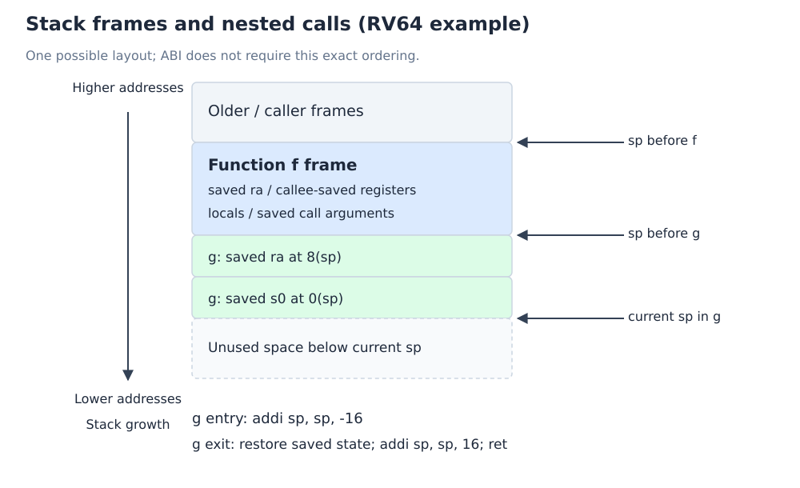

# 过程调用、寄存器保存与栈帧

[课程目录](../../index.md) · [上一章](03-risc-v-instructions.md) · 下一主题：[流水线原理](../20-pipelining/01-principles-and-classification.md)

## 1. 调用为什么不只是跳转

过程（Procedure）或函数（Function）调用需要在转移控制的同时传递参数、保留返回信息，并维持调用前后约定的状态。课程列出六步：

1. 把参数放入双方约定的位置（Pass Arguments）。
2. 将控制转移到被调用过程（Transfer Control）。
3. 为过程分配必要存储（Allocate Storage）。
4. 执行过程的计算（Perform Operations）。
5. 把结果放入调用者可取得的位置（Return Values）。
6. 返回调用点之后（Return to Caller）。

其中**调用者（Caller）**发起调用，**被调用者（Callee）**执行被调用过程。

ISA 定义 jal/jalr 的硬件效果；**应用二进制接口（Application Binary Interface, ABI）**规定参数、返回值、寄存器保存与栈的协作规则。两者不能混为一谈。

## 2. 调用与返回指令

在本章的 32 位指令长度模型中：

```asm
jal  ra, function    # ra ← 调用指令 PC + 4，PC ← function
jalr zero, 0(ra)     # 返回，目标为 ra，链接结果丢弃
```

返回的常见伪指令 `ret` 对应第二条。函数内部也可用 jal 调其他函数，因此仅有一个 ra 无法自动记录任意深度的嵌套返回链。

**叶子过程（Leaf Procedure）**不再调用其他过程；**非叶子过程（Non-leaf Procedure）**会调用其他过程。非叶子函数若之后还要返回，通常必须在覆盖 ra 前保存自己的返回地址。递归调用（Recursive Call）也有相同需求。

## 3. 谁负责保存寄存器

### 3.1 调用者保存（Caller-saved）

如果调用者在调用结束后还需要某个可能被破坏的值，应先保存它。标准整数调用约定中，ra、a0–a7、t0–t6 不保证跨调用保留。

关键是**跨调用仍然活跃（Live Across the Call）**的值才需要保存，不是每次机械保存所有 caller-saved 寄存器。ra 的保存也应结合函数调用位置：某个非叶子函数作为外层的 callee，通常在自己的栈帧中保存自己的 ra。

### 3.2 被调用者保存（Callee-saved）

被调用者若修改 s0–s11，应在进入时保存原值，退出前恢复。sp 也必须恢复至调用前的位置。未修改的 callee-saved 寄存器无须保存。

参数常放 a0–a7；简单返回值常放 a0，较宽的返回值可涉及 a1。这些规则依据[标准 RISC-V psABI](https://riscv-non-isa.github.io/riscv-elf-psabi-doc/)。

### 3.3 为什么采用混合约定

| 方案 | 好处 | 代价 |
| --- | --- | --- |
| 全部 caller-saving | 调用者知道哪些值在返回后仍需要 | 多个调用点可能重复保存 |
| 全部 callee-saving | 调用者可假设原值会恢复 | 被调用者可能保存调用者已不再需要的值 |
| 混合约定 | 给编译器同时提供短期临时与长期保留的寄存器 | 双方必须共同遵守分类 |

课堂用纯 caller-saving / callee-saving 对比设计选择。真实 ABI 不要求“保存全部 32 个寄存器”；应根据寄存器类别与实际使用情况处理。

## 4. 栈与栈帧

**栈（Stack）**提供后进先出（Last In, First Out, LIFO）的调用存储。RISC-V 常用 ABI 中，栈向低地址增长，sp 指向当前栈顶。

**栈帧（Stack Frame）**又称过程帧（Procedure Frame）、活动记录（Activation Record），保存一次调用的局部存储和状态。可以包含：

- 被保存的返回地址与 callee-saved 寄存器；
- 栈上局部变量、数组与寄存器溢出值；
- 无法全放进参数寄存器的参数；
- 对齐填充（Padding）。



*自绘：示意性的 RV64 栈帧。具体布局由编译器和 ABI 决定，不能把图中的顺序当作固定格式。*

**帧指针（Frame Pointer, fp）**是可选的；使用时通常为 s0/x8。sp 可能随分配改变，fp 可作为较稳定的定位基准。标准整数 ABI 通常要求过程执行期间 sp 保持 16 字节对齐。[约定来源：RISC-V psABI](https://riscv-non-isa.github.io/riscv-elf-psabi-doc/)。

`addi sp,sp,-16` 是分配 16 字节帧；`addi sp,sp,16` 是释放。CPU 不会因修改 sp 自动保存所有寄存器，需要显式 store/load。

## 5. 叶子函数例题

目标为计算 `(g+h)-(i+j)`。若四个参数分别在 a0–a3，临时值仅使用 caller-saved 寄存器，一个标准约定下的局部示例是：

```asm
leaf_example:
    add  t0, a0, a1
    add  t1, a2, a3
    sub  a0, t0, t1
    jalr zero, 0(ra)
```

没有调用其他函数，不需覆盖 ra；没有修改 s 寄存器，也没有栈上局部数据，因此此实现无需栈帧。**“叶子函数”不等于“一定不用栈”**：若有局部数组、溢出值或使用了 s 寄存器，仍可能需要栈。

如果有意使用 s0 保存 f，就应保存与恢复原来的 s0。以 RV64 为例：

```asm
leaf_with_saved_register:
    addi sp, sp, -16
    sd   s0, 8(sp)
    add  t0, a0, a1
    add  t1, a2, a3
    sub  s0, t0, t1
    add  a0, s0, zero
    ld   s0, 8(sp)
    addi sp, sp, 16
    jalr zero, 0(ra)
```

若换 RV32，应按 32 位寄存器用 sw/lw 保存，仍需满足相应 ABI 的栈对齐。不能在 RV64 用 sw/lw 保存一个需要完整保留的 64 位寄存器。

## 6. 非叶子函数：保留返回地址和跨调用值

设函数收到整数 n，调用 `helper(n)`，之后返回 `helper(n)+n`，n 在调用后仍需使用：

```asm
non_leaf:
    addi sp, sp, -16
    sd   ra, 8(sp)          # 保留返回外层调用者的位置
    sd   s0, 0(sp)          # 保留原 s0
    add  s0, a0, zero       # n 跨 helper 调用存活
    jal  ra, helper
    add  a0, a0, s0         # helper 返回值在 a0
    ld   s0, 0(sp)
    ld   ra, 8(sp)
    addi sp, sp, 16
    jalr zero, 0(ra)
```

这是自拟的 RV64 理论示例。helper 按 ABI 保留 s0，所以 n 可跨调用保留；本函数又恢复原 s0，因此对外层调用者仍满足约定。每次嵌套各有独立栈帧，ra 的旧值才能按反向顺序恢复。

## 7. 返回后的局部变量指针

```c
int *bad(void) {
    int local = 42;
    return &local;
}
```

函数返回后 local 的生命周期结束；返回的指针成为悬垂指针（Dangling Pointer）。栈上的字节可能暂时仍像原值，但随后的调用可以复用该空间，解引用无效对象不合法。

问题的根因是**对象生命周期（Object Lifetime）**，不能简单归因于“C 没有垃圾回收”。把该指针交还给调用者，也不会延长局部自动对象的生命周期。

## 8. 原课件例子的约定边界

lec01 第 111–112 页为教学目的指定“f 放 x7，结果放 x17”，并演示保存 x7。理解时应分两层：

- 按题目明确给出的约定，可以分析其保存、计算、恢复、返回过程。
- 按标准 psABI，x7 是 t2，属于 caller-saved；常见整数返回值是 a0/x10，不是 a7/x17。课件分配不能当作标准调用约定记忆。

课件中 `sw x7,x2,0` 一类写法应改用标准 `sw x7,0(x2)`。只分配 4 字节也是教学简化，不符合通常的 16 字节栈对齐要求。

**英文简答：**“A non-leaf procedure must preserve its return address before another call overwrites the link register.”

## 参考资料

- `lec01-2026-chang.pdf`，第 109–117、121 页；第 2 份识别文本约 74:34–89:13、96:12–97:23。
- [RISC-V psABI：Register Convention 与 Integer Calling Convention](https://riscv-non-isa.github.io/riscv-elf-psabi-doc/)。
