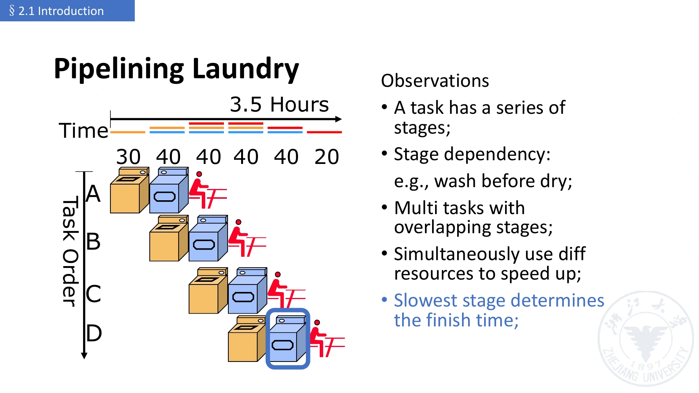

# 流水线基本原理与分类

[课程目录](../../index.md) · [上一主题：过程调用](../10-architecture-and-isa/04-procedure-calls.md) · [下一章：性能](02-performance.md)

## 1. 流水线的核心

**流水线（Pipelining）**是一种微体系结构实现技术：把任务分成若干阶段，让不同任务的不同阶段重叠执行（Overlapped Execution），利用原本闲置的硬件资源。

指令流水线利用**指令级并行性（Instruction-level Parallelism, ILP）**提高程序的执行速率。不同指令不一定完全独立；只要正确处理依赖，前一条的后半部分和后一条的前半部分仍可重叠。

三个关键词是：**Implementation Technique、Overlap、Parallelism**。流水线通常提高吞吐量（Throughput），而不缩短单个任务的延迟（Latency）。

## 2. 从洗衣服理解流水线

课件有四人各洗一批衣物的例子，资源为一台洗衣机、一台烘干机、一个叠衣区：

| 阶段 | Wash | Dry | Fold |
| --- | --- | --- | --- |
| 时间 | 30 min | 40 min | 20 min |

完全串行需要 $4\times(30+40+20)=360$ 分钟。允许不同人的不同阶段重叠：第一批 90 分钟完成，此后每 40 分钟一批，总时间为

$$
T=90+(4-1)\times40=210\ \text{min}.
$$



*图源：`lec02(2).pdf` 第 21 页。洗、烘、叠分工；最慢的烘干阶段限制整体速率。*

第一批仍花 90 分钟，不会变成 $210/4=52.5$ 分钟。52.5 分钟是**总时间除以任务数**的摊销平均，不是每个任务从开始到完成的响应时间。

洗衣例允许不同设备在各自任务完成后工作；CPU 的同步流水线则通常让所有级在统一时钟边沿推进，因此不等长阶段的计算必须另看时钟模型。

## 3. 串行、单重叠与双重叠

课件为了引入重叠，把指令抽象成 IF、ID、EX 三个等长阶段，每阶段 $\Delta t$，其中 EX 暂时统括执行、访存、写回等工作。

| 方式 | 调度 | 完成 n 条指令时间 | n 很大时相对串行 |
| --- | --- | --- | --- |
| 串行（Sequential Execution） | 一条完全结束后开始下一条 | $3n\Delta t$ | 基准 |
| 单重叠（Single Overlapping） | 前一条进入 EX 时，后一条开始 IF | $(2n+1)\Delta t$ | 时间约为 $2/3$，加速比约 1.5 |
| 双重叠（Twice Overlapping） | 前一条进入 ID 时，后一条开始 IF | $(n+2)\Delta t$ | 时间约为 $1/3$，加速比约 3 |

“时间减少约 1/3”不等于“时间变成约 1/3”。“单/双重叠”是此三阶段例子里的课件术语，不是所有 CPU 必须采用的全局分类。

若 IF 很短，课件还将 IF 与 ID 合为一段，形成两阶段重叠模型。阶段应按延迟与资源约束划分，不能仅凭部件名称切割。

如果某一级处理更慢，后续任务必须等待或增加可并行使用的资源；不能在唯一的忙碌单元上同时执行两个任务，画出重叠图就当作已经实现。

## 4. 流水线需要哪些条件

### 4.1 分阶段、分资源

一个阶段（Stage / Segment）完成任务的一部分，通常有相应功能单元（Functional Unit）。阶段数称为流水线深度（Pipeline Depth）。

阶段延迟尽量均衡，否则最慢级成为**瓶颈级（Bottleneck Stage）**，决定时钟周期或可接受新任务的间隔。

课件在某处把流水线定义为 $m>2$ 个子过程，这是该处的扩展性描述；两级流水线同样符合分级、重叠执行的概念。

### 4.2 阶段间寄存器

**流水线寄存器（Pipeline Register）**又称阶段间寄存器，是相邻阶段的边界。它们保存上一级的结果供下一级使用，并阻止新指令输入直接改变当前正在被使用的信息。

它们可能保存数据值、指令字段、PC、寄存器编号和控制信号。不能把它们与软件可见的寄存器组（Register File）混为一谈。

在同步设计中，各级在时钟周期内计算，边沿同时更新寄存器。下一级使用的是本周期开始时保存的旧状态，不是把所有阶段在一个边沿“连续执行完”。

### 4.3 连续输入与正确性

任务越多，启动与收尾开销越容易摊薄。指令间的数据依赖、资源竞争和控制转移会打断理想节奏，必须由冒险处理保证正确性。

流水线对程序员通常透明（Fundamentally Invisible to the Programmer）：程序应保留 ISA 规定的语义，硬件不能要求普通程序“假装依赖不存在”。编译器可以为性能安排指令，但这不意味着 ISA 自动改变。

## 5. 充满、通过和排空的计数

对 m 级、每级 $\Delta t$ 的理想流水线：

- 第一条从进入到完成的**通过时间（Pass Time / First-result Latency）**为 $m\Delta t$。
- 若按“首次所有级都有任务的周期开始”计数，从第一周期开始到该边界是 $(m-1)\Delta t$，称充满过程（Filling）。
- 最后一条进入后到完成仍经过 m 个阶段。若从其 IF 周期结束开始算剩余尾段，则排空（Draining）为 $(m-1)\Delta t$。

课件与授课口语对“充满时间”和“排空时间”的起止点有不同表述，解题应先画时空图确定边界。**不要把两个尾段再同时加到 $m\Delta t+(n-1)\Delta t$ 上**，否则重复计数。

如果任务数小于级数，流水线甚至没有全满的周期，但总时间公式仍可成立。

## 6. 流水线分类

这些是不同的分类维度，可以同时描述一个流水线；例如“处理器级、线性、顺序、标量流水线”。

### 6.1 单功能与多功能

| 类别 | 英文 | 含义 |
| --- | --- | --- |
| 单功能 | Single-function Pipeline | 固定阶段连接完成一种功能，例如专用乘法流水线 |
| 多功能 | Multifunction Pipeline | 通过不同连接/选择完成多种功能，例如浮点加法与乘法 |

### 6.2 静态与动态多功能流水线

- **静态（Static Pipeline）**：同一时间只采用一种功能的连接方式。换功能前通常要排空旧任务，所以最好批量输入同类操作。
- **动态（Dynamic Pipeline）**：允许不同功能的任务同时在途，但必须避免对同一单元产生冲突，调度与控制更复杂。

这里的 static/dynamic 指功能切换方式，**不等于静态/动态分支预测，也不等于顺序/乱序执行**。

### 6.3 按应用层级

| 层级 | 英文 | 例子 |
| --- | --- | --- |
| 部件级 / 运算流水线 | Component-level / Arithmetic Pipeline | 把浮点运算内部拆成求阶差、对阶、运算、规格化等步骤 |
| 处理器级 / 指令流水线 | Processor-level / Instruction Pipeline | 将一条指令分成 IF/ID/EX/MEM/WB |
| 处理器间 / 宏流水线 | Interprocessor / Macro Pipeline | 多个处理器依次承担同一数据流的不同任务 |

本课程的五级 CPU 属于**处理器级指令流水线**，不能因为级内有 ALU 就归成 ALU 内部的部件级流水线。

### 6.4 线性与非线性

**线性流水线（Linear Pipeline）**中，一项任务沿连接方向前进，每个阶段至多经过一次。**非线性流水线（Nonlinear Pipeline）**有反馈路径，同一任务可能多次使用某级。

课件例的执行路径为：

```text
S1 → S2 → S3 → S4 → S2 → S3 → S4 → S3 → Exit
```

非线性流水线不能简单假定每周期都可启动一个新任务：之前任务回访 S2 时，可能与新任务争用 S2。**调度（Scheduling）**需要选择安全的启动间隔（Initiation Interval）。

五级 CPU 的 WB 反馈到寄存器组、分支反馈到 PC，不等于同一条指令重走流水级；不能仅凭数据通路“有向左的线”就称它为非线性流水线。

### 6.5 顺序与乱序

**顺序（In-order）**要求任务完成顺序与输入顺序一致；**乱序（Out-of-order）**允许较晚的独立任务先完成，以减少等待。

必须区分发射（Issue）、执行（Execute）、完成（Complete）和提交（Commit）。较复杂 CPU 可以乱序执行，但仍按顺序提交架构状态。这里只建立概念，不展开乱序处理器实现。

独立指令可以绕过等待中的工作，但移动分支或有副作用的内存操作仍须保证原语义；不能只因“寄存器不重合”就任意重排。

### 6.6 标量与向量

**标量处理器（Scalar Processor）**的相关指令处理标量操作数。**向量流水线处理器（Vector Pipeline Processor）**支持向量数据与指令，可对多个元素形成流水处理。

“程序循环计算一个向量”不等于“硬件使用向量指令”。标量/向量描述数据与指令模型；单发射/多发射描述每周期发射能力，两者不是同一个分类。

## 7. 为什么 RISC-V 便于流水化

课程强调四点：基础 32 位格式便于取指；源/目的寄存器字段规整，便于在 ID 同时译码和读数；load-store 允许 EX 统一算地址、MEM 统一访存；对齐且命中的简单存储模型便于定长访存阶段。

这些是规则编码对实现的帮助，不是保证“每次访存只有一个周期”。缓存失效（Cache Miss）、未对齐访问和可变延迟仍会造成额外处理。

## 参考资料

- `lec02(2).pdf`，第 2–66 页；第 3 份授课识别文本约 01:30–95:59。
- 第 4 份文本约 16:13–29:33，补充阶段信息的保存与传递。
