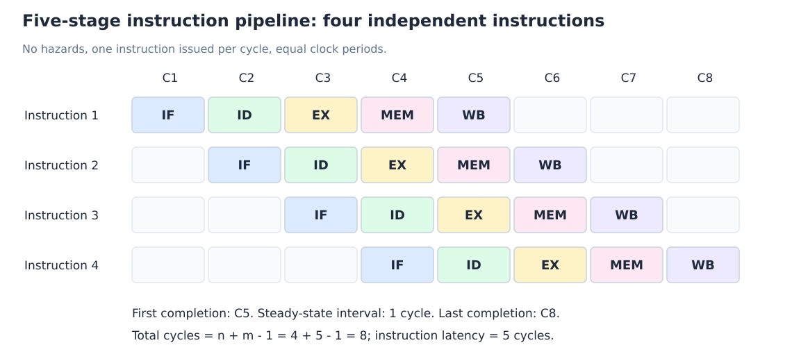
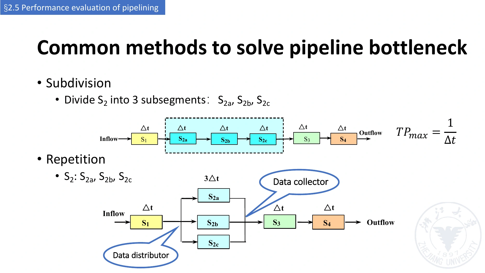
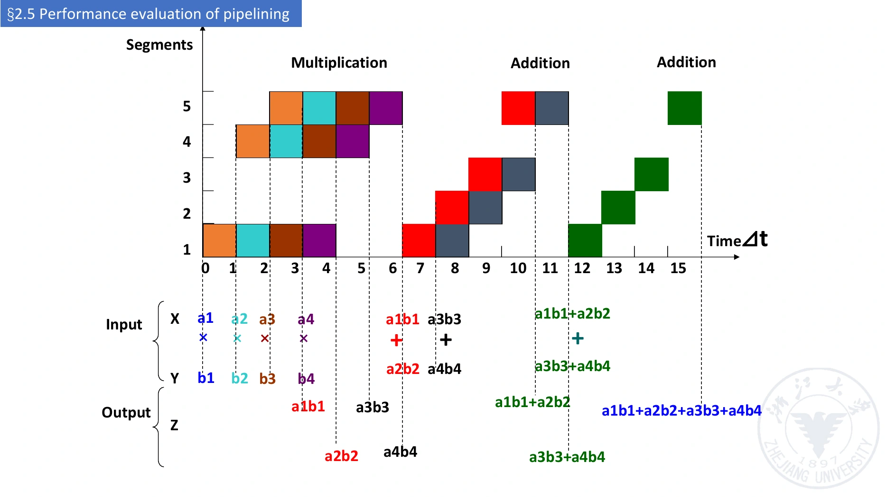

# 流水线性能分析与计算例题

[课程目录](../../index.md) · [上一章：原理](01-principles-and-classification.md) · [下一章：数据通路](03-pipelined-datapath.md)

## 1. 先分清四种“时间”

| 量 | 英文 | 含义 |
| --- | --- | --- |
| 时钟周期 | Clock Period | 相邻时钟边沿的时间间隔 |
| 单条指令延迟 | Instruction Latency | 该指令从进入到完成的时间 |
| 总执行时间 | Total Execution Time | 第一条开始到最后一条完成 |
| 平均完成间隔 / 摊销时间 | Average Completion Interval / Amortized Time | 总执行时间除以完成任务数 |

理想五级流水线中，单条指令仍要经过五个周期，却能在满流水后每周期完成一条。**CPI 约为 1 不表示单条指令延迟只有一个周期。**

本章核心指标为吞吐量（Throughput, TP）、加速比（Speedup, $S_p$）与效率（Efficiency, $\eta$）。任何公式都应先指定基准机器、阶段延迟、寄存器开销、是否有停顿以及任务计数方式。

## 2. 理想均衡线性流水线

假设：

- 共 m 级，每级延迟 $\Delta t$，忽略流水寄存器开销；
- 完成 n 个任务，每个任务经过全部 m 级；
- 每周期启动一个任务，没有资源、数据或控制冲突。

第一条需要 m 个周期；每增加一条，只多一个周期：

$$
T_{\mathrm{pipe}}=(m+n-1)\Delta t.
$$

非流水的对应实现一次完成一条任务：

$$
T_{\mathrm{serial}}=nm\Delta t.
$$

*自绘：m=5、n=4，完成时间为 8 个周期。列为时钟周期，行为指令；空白体现启动和排空开销。*

### 2.1 吞吐量

$$
TP=\frac{n}{T_{\mathrm{pipe}}}
=\frac{n}{(m+n-1)\Delta t}.
$$

$$
TP_{\max}=\frac{1}{\Delta t},\qquad
\frac{TP}{TP_{\max}}=\frac{n}{m+n-1}.
$$

单位为任务/秒或指令/秒。有限 n 下 TP 小于稳态上限；$n\gg m$ 时启动/收尾开销可以忽略。

### 2.2 加速比

$$
S_p=\frac{T_{\mathrm{serial}}}{T_{\mathrm{pipe}}}
=\frac{nm}{m+n-1}.
$$

在本节假设下，$n\to\infty$ 时 $S_p\to m$。**“级数就是加速比”只是理想均衡模型的极限**，不是所有有限程序的精确值。

### 2.3 时空效率

每个任务做 m 个单位工作，总有效面积为 $nm\Delta t$；可用的 m 个单元在总时间内形成面积 $mT_{\mathrm{pipe}}$：

$$
\eta=\frac{nm\Delta t}{mT_{\mathrm{pipe}}}
=\frac{n}{m+n-1}
=\frac{S_p}{m}.
$$

这里效率指**功能单元的时间利用率（Space-time Utilization）**，不是能效、CPU 软件占用率或指令正确率。最后的等式依赖本节模型，多功能或不均衡时不能机械套用。

## 3. 单周期 CPU 与五级流水线的课件例题

使用 [CPU 复习章](../10-architecture-and-isa/01-system-and-cpu-review.md) 的 200/100/200/200/100 ps 阶段延迟，单周期机器的时钟为 800 ps；流水线周期由最慢阶段决定，为 200 ps。

### 3.1 三条独立指令

$$
T_{\mathrm{single}}=3\times800=2400\ \text{ps}.
$$

$$
T_{\mathrm{pipe}}=(5+3-1)\times200=1400\ \text{ps}.
$$

$$
S_p=\frac{2400}{1400}=\frac{12}{7}\approx1.714.
$$

**流水线单条通过延迟是 $5\times200=1000$ ps，比单周期的 800 ps 更长。**同时处理多条才带来总时间优势。

### 3.2 长程序

n 条时：

$$
S_p=\frac{800n}{200(n+4)}=\frac{4n}{n+4}\longrightarrow4.
$$

这里有五级，却只趋近 **4 倍**。因为原单周期延迟总和为 800 ps，并不等于五个 200 ps；ID/WB 各只有 100 ps，阶段不均衡。课件“近五倍”必须理解为理想均衡例的结论，不能套到这组参数。

对课件的 1,000,003 条指令：

$$
T_{\mathrm{single}}=800{,}002{,}400\ \text{ps},
$$

$$
T_{\mathrm{pipe}}=200{,}001{,}400\ \text{ps}.
$$

比值约为 4。按实际做工作的时间计算，不停顿且 n 很大时有效利用率约为 $800/(5\times200)=80\%$；把每一阶段槽位都视为“占用”则是另一种统计口径。

## 4. 不均衡阶段：明确模型再计算

设四段延迟为 $\Delta t,3\Delta t,\Delta t,\Delta t$，S2 为瓶颈。

### 4.1 统一时钟的同步流水线

若所有阶段只在统一边沿推进，忽略寄存器开销：

$$
T_{\mathrm{clk}}=3\Delta t,\qquad
T_{\mathrm{pipe}}=(n+3)\,3\Delta t.
$$

第一条经过四个完整周期，即 $12\Delta t$。其他级虽然计算更快，仍等到时钟边沿。稳态吞吐量为 $1/(3\Delta t)$。

### 4.2 各级按自身时间推进的任务模型

若题目像洗衣一样允许短级立即完成、用缓冲接续，瓶颈每 $3\Delta t$ 接受一个任务，且没有额外等待：

$$
T_{\mathrm{pipe}}=6\Delta t+(n-1)\,3\Delta t.
$$

第一条总工作为 $6\Delta t$。长期吞吐量仍是 $1/(3\Delta t)$，但有限 n 的时间与同步 CPU 模型不同。

课堂关于不等长阶段的时空图采用了按实际占用时间看任务的方式；题目若明确固定时钟，不能把“各级延迟相加”直接当成流水 CPU 的通过时间。

### 4.3 三段重叠的课堂公式

对 IF/ID/EX 的延迟 $a,b,c$，若采用“每一轮所有活跃级同时开始，等本轮最慢级结束后再整体推进”的变长时间槽模型，n≥2 时：

$$
T=a+\max(a,b)+(n-2)\max(a,b,c)+\max(b,c)+c.
$$

这是课堂三段例子的计时方式，等长时化简为 $(n+2)\Delta t$。它不是统一时钟 CPU 的通式，也不是所有异步流水线的通式。对于 n=1，直接为 $a+b+c$。

## 5. 消除瓶颈的两种方法

*图源：`lec02(2).pdf` 第 78 页。上图 subdivision，下图 repetition。*

### 5.1 细分（Subdivision）

把 S2 分成 S2a、S2b、S2c，每段 $\Delta t$，四级变六级：

$$
T_{\mathrm{pipe}}=(n+5)\Delta t,\qquad
TP_{\max}=\frac1{\Delta t}.
$$

前提是原工作能合理分割。代价是增加流水寄存器、阶段数与控制复杂度；考虑寄存器开销后不会恰好每级 $\Delta t$。

### 5.2 重复设置（Repetition / Replication）

复制三个不能再细分的慢单元，每个仍处理 $3\Delta t$，用分配器（Data Distributor）轮流派发任务，再用收集器（Data Collector）合流。任务 1、4、7 用第一份，2、5、8 用第二份，3、6、9 用第三份。

在题设充分资源条件下，可每 $\Delta t$ 启动一项，单个慢单元延迟却没有变短。这属于利用并行硬件提高接受速率。需额外考虑面积、调度、结果顺序及收集带宽。

## 6. 静态双功能流水线：向量点积

课件有 A、B 两个四元素向量，要求

$$
A\cdot B=a_1b_1+a_2b_2+a_3b_3+a_4b_4.
$$

流水线有五个物理段，每段 $\Delta t$：

- 乘法路径：1 → 4 → 5，单项用 3 个周期。
- 加法路径：1 → 2 → 3 → 5，单项用 4 个周期。
- 静态切换：乘法全部结束后，才能启用加法连接。

*图源：`lec02(2).pdf` 第 85 页。对应结果在第 86 页；时间轴的 0–15 标记表示 15 个时间间隔。*

定义 $p_i=a_ib_i$、$s_{12}=p_1+p_2$、$s_{34}=p_3+p_4$，按课件调度：

| 运算 | 启动周期 | 逐级占用 | 完成于周期末 |
| --- | --- | --- | --- |
| $p_1$ | 1 | S1@1、S4@2、S5@3 | 3 |
| $p_2$ | 2 | S1@2、S4@3、S5@4 | 4 |
| $p_3$ | 3 | S1@3、S4@4、S5@5 | 5 |
| $p_4$ | 4 | S1@4、S4@5、S5@6 | 6 |
| $s_{12}$ | 7 | S1@7、S2@8、S3@9、S5@10 | 10 |
| $s_{34}$ | 8 | S1@8、S2@9、S3@10、S5@11 | 11 |
| $s_{12}+s_{34}$ | 12 | S1@12、S2@13、S3@14、S5@15 | 15 |

时间分成乘法批次 6、两次初步加法 5、最后归并 4，共 $15\Delta t$。最后一项必须等待两项中间结果，不能仅因“仍是加法功能”就在它们就绪前启动。

### 6.1 三个性能指标

共完成 4 次乘法 + 3 次加法 = 7 项基本运算：

$$
TP_{\mathrm{operations}}=\frac7{15\Delta t}
\approx\frac{0.467}{\Delta t}.
$$

串行对应时间为 $4\times3\Delta t+3\times4\Delta t=24\Delta t$：

$$
S_p=\frac{24}{15}=1.6.
$$

有效的段时间共 24 格，五个物理段的总时空面积为 75 格：

$$
\eta=\frac{24}{5\times15}=32\%.
$$

若吞吐量统计的是**完整四元素点积**，本次只完成一项，值为 $1/(15\Delta t)$。题目中的“任务”或“运算”必须先确定计数单位，不能把七项基本运算写成七个向量点积。

时间轴的 0–15 是 16 个边界标记，表示 15 个时间间隔。不能把 $n=7,m=5$ 填入理想全级公式，因为两种功能路径不同且存在切换与数据依赖。

## 7. 停顿与实际 CPI

在单发射流水线的简化计数中，设总计额外代价为 B 个周期：

$$
T_{\mathrm{pipe}}=(n+m-1+B)T_{\mathrm{clk}},
$$

$$
CPI_{\mathrm{average}}
=1+\frac{m-1+B}{n}.
$$

B 包括实际增加的停顿或恢复周期；同一周期内多个原因重叠时不能重复相加。长期程序通常忽略充满项，用

$$
CPI\approx1+\text{平均每条指令的额外周期}.
$$

例如分支比例为 20%，错误预测率为 10%，每次错误额外损失 2 周期，在无其他额外代价的自拟例子中：

$$
CPI\approx1+0.2\times0.1\times2=1.04.
$$

## 8. 为什么不能无限加深

考虑阶段组合逻辑延迟 $t_i$，流水寄存器与时钟约束的合计开销 $d_{\mathrm{reg}}$：

$$
T_{\mathrm{clk}}\gtrsim\max_i t_i+d_{\mathrm{reg}}.
$$

$d_{\mathrm{reg}}$ 涉及 clock-to-Q、建立时间（Setup Time）和时钟偏斜（Clock Skew）等预算。进一步细分会减少逻辑延迟，但寄存器开销不会随之消失；更多级也增加面积、时钟功耗、在途指令数和错误预测恢复成本。

多功能流水线效率还受以下因素影响：某功能不使用部分单元、充满/排空、段不均衡、静态切换、结果依赖和额外时序开销。不能只按级数决定设计优劣。

## 9. 解题顺序

1. 指定模型、资源数、功能路径和计时单位。
2. 标出每个结果何时产生、下一项何时可以消费。
3. 画图，从第一项开始数到最后一项完成。
4. TP 的分子数完成的任务；$S_p$ 明确串行基准。
5. 效率用真实有效的段时间除以全部可用段时间。

## 参考资料

- `lec02(2).pdf`，第 67–92 页。
- 第 4 份授课文本约 29:46–76:12；第 5 份约 01:45–10:04。
