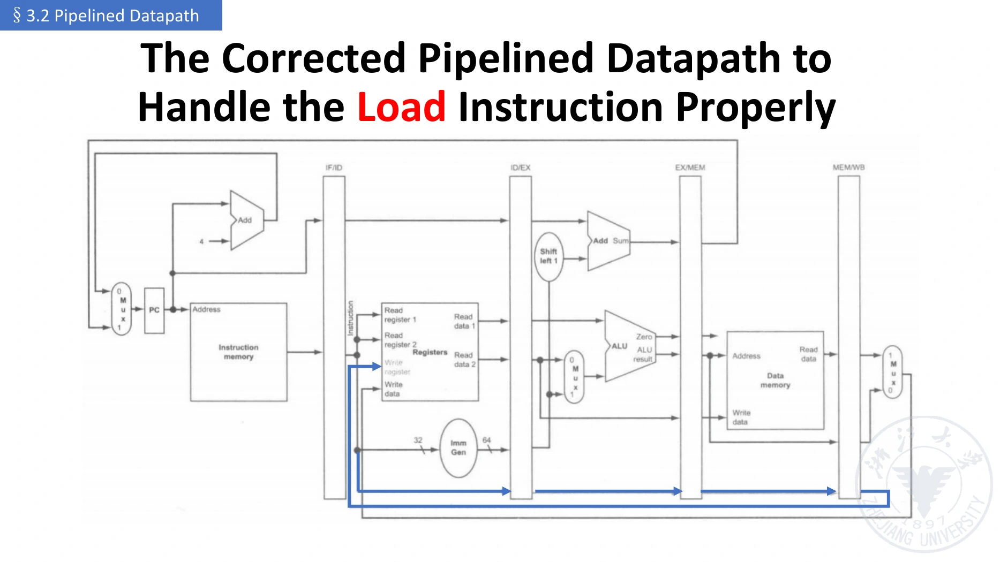
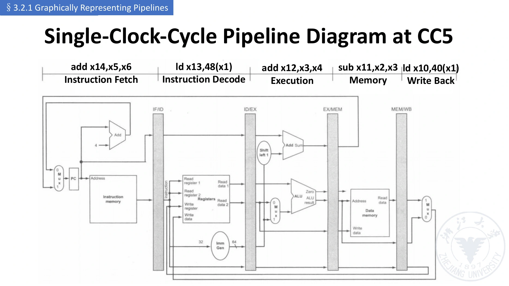

# 五级流水线数据通路

[课程目录](../../index.md) · [上一章：性能](02-performance.md) · [下一章：控制](04-pipelined-control.md)

## 1. 从逻辑划分到物理边界

单周期 CPU 的 IF/ID/EX/MEM/WB 是一个长周期内的逻辑步骤。流水化后，各级由阶段间寄存器物理分隔，各处理不同指令；它们共享一套按阶段分工的数据通路，**不是复制五套完整 CPU**。

对每个阶段，设计者要问：输入从哪里来、本周期做什么、哪些结果还会被后续阶段使用、边沿应该保存什么。



*图源：`lec03-2026.pdf` 第 55 页。蓝色路径突出 rd 的逐级传递。此基础图尚未包含完整的冒险处理电路。*

## 2. 四组阶段间寄存器

名称中的斜线表示所隔开的两级；它是一组寄存器字段的集合，不是仅存一个数。

| 寄存器 | 本周期向哪一级提供输入 | 应保存的典型信息 |
| --- | --- | --- |
| IF/ID | ID | 指令 Inst、该指令 PC；按需求保存 PC+4 |
| ID/EX | EX | 读出的操作数 A/B、立即数、PC、rs1/rs2/rd、功能字段、EX/MEM/WB 控制 |
| EX/MEM | MEM | ALU 结果/有效地址、store 数据、rd、MEM/WB 控制；若分支稍后判定，保存其目标和条件 |
| MEM/WB | WB | load 读取的数据、ALU 结果、rd、WB 控制；若支持链接写回，保存链接值 |

实际实现只需保存后续仍要使用的信息。课件的一版表把整条指令 IR 沿级复制；另一版只保存 rd 和必要功能字段。二者都是**保留足够信息**的方式，不要求每级一定传全 32 位指令。

注意编号（Register Number）与内容（Register Value）：

```text
ID/EX.Rs1 = 5       表示来源是 x5
ID/EX.A   = 100     表示读取的值是 100
```

前者用于选择、依赖比较；后者用于运算，不能互换。

## 3. Load 的逐级执行

以 RV64 的 `ld x10,40(x1)` 为例，暂不考虑冒险。$R$ 表示软件可见寄存器组。

### 3.1 IF：取指

从指令存储器 `IMem[PC]` 得到指令，将其与本条 PC 保存到 IF/ID；准备 PC+4。下一周期 ID 的指令来源是 IF/ID，不是已去取下一条的指令存储器输出。

```text
IF/ID.Inst ← IMem[PC]
IF/ID.PC   ← PC
PC         ← NextPC
```

NextPC 是否选 PC+4，取决于控制转移处理。

### 3.2 ID：译码与读取

识别 load、rs1=x1、rd=x10、立即数 40，读取 x1 的值，保存到 ID/EX。load 不使用 rs2；硬件可以同时读出两个读端口，但第二端口结果在这条指令中无意义。

```text
ID/EX.A   ← R[x1]
ID/EX.Imm ← 40
ID/EX.Rd  ← 10
```

还须保存对应控制信号，后章展开。

### 3.3 EX：算有效地址

ALU 对基址与符号扩展立即数相加：

```text
EX/MEM.ALUResult ← ID/EX.A + ID/EX.Imm
EX/MEM.Rd        ← ID/EX.Rd
```

load 的 EX 结果是地址，**不是最终将写入 x10 的数据**。这是后面 load-use 冒险的核心区别。

### 3.4 MEM：读取数据

```text
MEM/WB.ReadData ← DMem[EX/MEM.ALUResult]
MEM/WB.Rd      ← EX/MEM.Rd
```

必须按 ld 的 64 位数据宽度读取，结果在边沿保存后供 WB 使用。若题目是 lw，则读取 word 并按相应规则扩展。

### 3.5 WB：写回

写回多路选择器选 load 数据，写入由 MEM/WB 保存的目的编号：

```text
R[MEM/WB.Rd] ← MEM/WB.ReadData   # 且 RegWrite 有效，rd≠0
```

不能从当前 ID 的指令再提取 rd；当前 ID 已经处理更晚的指令。

## 4. Store 的逐级执行

以 RV64 的 `sd x12,48(x1)` 为例：

| 阶段 | 工作 |
| --- | --- |
| IF | 取指，保存指令与 PC |
| ID | 读取 x1 作为基址、x12 作为待写数据；生成 S 型立即数 48 |
| EX | ALU 计算 x1 + 48；另将 x12 的数据送入 EX/MEM.StoreData |
| MEM | 按有效地址写入 EX/MEM.StoreData |
| WB | 无寄存器写回 |

**store 的两个源值用途不同**：rs1 用于 EX 的地址加法；rs2 的数据用于 MEM 写内存。即使 rs2 在 EX 中不参加 ALU 运算，也必须穿过 EX/MEM。

ALUSrc 选择立即数作为 ALU 的第二输入时，不能把原来的 store 数据丢掉。在有前递的设计中，地址源与待写数据也要分别考虑正确来源。

## 5. ALU、分支和链接值

| 指令类 | EX | MEM | WB |
| --- | --- | --- | --- |
| R 型 ALU | A op B | 转传 ALU 结果 | 写 rd |
| I 型 ALU | A op Imm | 转传 ALU 结果 | 写 rd |
| load | A + Imm | 读内存 | 写 rd |
| store | A + Imm，并转传 B | 写内存 | 无写回 |
| 条件分支 | 比较源值，计算 PC + 偏移 | 视实现转传/处理分支信息 | 无寄存器写回 |
| jal/jalr | 计算/选择目标 | 转传链接值等 | PC+4 写 rd（若 rd 非零） |

后两类的精确分工由实现决定。分支目标须使用**分支自己的 PC**，不能使用已经在取更晚指令的当前 PC。

本章课件主体四类控制表不完整覆盖 jal/jalr。要支持它们，必须增加相应 NextPC、链接值传递和写回选择；不能仅把 jal 当成“没有 rd 的分支”。

## 6. rd 丢失的经典错误

假设以下指令按每周期一条进入：

```asm
ld  x10, 40(x1)
sub x11, x2, x3
add x12, x3, x4
ld  x13, 48(x1)
add x14, x5, x6
```

第 5 个周期，第一条 load 在 WB，而第四条 load 在 ID。若 WB 的数据来自第一条的 MEM/WB，而 rd 却来自当前 ID，就可能把第一条的数据错误写进 x13。

正确的编号链为：

```text
IF/ID.Inst[11:7]
    → ID/EX.Rd
    → EX/MEM.Rd
    → MEM/WB.Rd
    → Register File 的写地址
```

这通常为后三组流水寄存器各增加 5 位 rd 字段。结果值、目的编号、写入许可必须属于同一条指令，不能把不同指令的信息拼成一次写回。

## 7. 两种图各说明什么

### 7.1 多周期流水线图（Multiple-clock-cycle Pipeline Diagram）

一条指令占一行，时钟周期占一列，适合追踪一条指令的完整经历以及任务重叠：

| 指令 | CC1 | CC2 | CC3 | CC4 | CC5 |
| --- | --- | --- | --- | --- | --- |
| ld x10 | IF | ID | EX | MEM | WB |
| sub x11 | — | IF | ID | EX | MEM |
| add x12 | — | — | IF | ID | EX |
| ld x13 | — | — | — | IF | ID |
| add x14 | — | — | — | — | IF |

此图暂不处理这些指令之间可能的依赖，只展示理想阶段位置。

### 7.2 单周期快照（Single-clock-cycle Pipeline Diagram）

选择一个周期，标出各硬件级当前处理哪条指令：



*图源：`lec03-2026.pdf` 第 62 页。第 5 周期：IF 为第 5 条，ID 为第 4 条，EX 为第 3 条，MEM 为第 2 条，WB 为第 1 条。*

在顺序流水线中，**阶段越靠后，指令越早进入**。数据通路图从左到右是阶段推进方向，不是同一周期里指令由早到晚的排列。

## 8. 两条“回头”的路径

课件单周期图中的大多数数据从左到右传递，两个重要例外是：

- **WB → Register File**：更早指令写回，较晚指令可能已经读数，带来数据冒险。
- **分支结果 → PC**：较后阶段才知道下一个有效取指地址，IF 已经提前取了指令，带来控制冒险。

仅增加四组流水寄存器能实现阶段隔离，但不能自动解决这些反馈的正确时序；还需要控制与冒险处理。

## 参考资料

- `lec02(2).pdf`，第 62–65 页；`lec03-2026.pdf`，第 25–62 页。
- 第 4 份识别文本约 16:13–29:33，第 5 份约 55:33–75:05。
