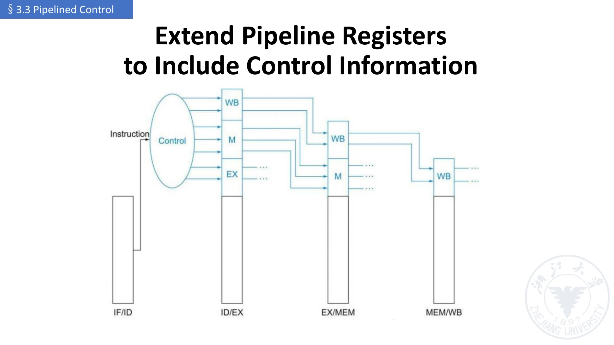
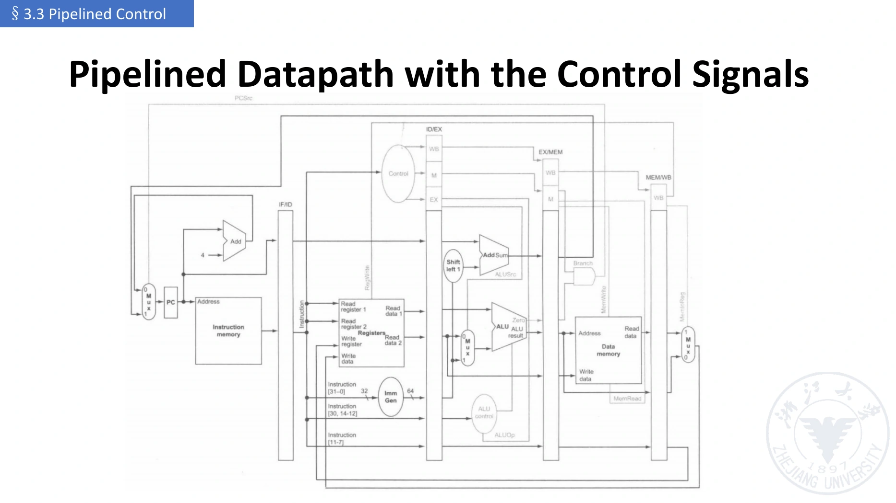

# 流水线控制信号

[课程目录](../../index.md) · [上一章：数据通路](03-pipelined-datapath.md) · [下一章：冒险](05-hazards-and-handling.md)

## 1. 控制语义不变，使用时刻改变

单周期 CPU 的控制信号只服务于当周期唯一的指令。流水 CPU 中，多条指令同时在途，控制器通常在 ID 为一条指令产生主控制，然后把信号和该指令的数据一起保存、向后传递。

控制信号的定义主要仍由 ISA 与数据通路决定；**流水化增加了时间归属问题**：某个 RegWrite=1 必须控制产生该信号的那条指令，而不能写入当时恰好处在另一阶段的指令数据。

课件“IF/ID 不需要控制信号”的含义是：这两级的基本操作固定，七条主控制线按 EX/MEM/WB 分组。PCSource、PCWrite、IF/IDWrite、Flush 等取指选择和使能仍然是控制信号，不能理解为 IF/ID 没有控制逻辑。

## 2. 课件的七条主控制线

ALUOp 是 2 位编码；课件按命名信号称“七条”，不代表物理上恰好七根导线。

| 分组 | 信号 | 作用 | 何时使用 |
| --- | --- | --- | --- |
| EX | ALUOp | 决定 ALU 运算大类，必要时再结合 funct3/funct7 | EX |
| EX | ALUSrc | 选择第二 ALU 输入是寄存器值还是立即数 | EX |
| MEM | Branch | 表明这是需处理的条件分支 | 课件组为 MEM；实际判定可更早 |
| MEM | MemRead | 请求数据存储器读取 | MEM |
| MEM | MemWrite | 允许数据存储器写入 | MEM |
| WB | RegWrite | 允许写目的寄存器 | WB |
| WB | MemtoReg | 选择 load 数据或 ALU 结果作为写回值 | WB |

这里的 MemRead/MemWrite 指**数据存储器**，不能误用来决定该指令是否取指。

Branch 的分组取决于分支决定位置：课件的完整控制图先在 EX 得到比较/目标，再将信息保存进 EX/MEM，在 MEM 一侧形成 PC 选择。后续若改为 EX 当周期决定，则分支选择可以前移，相关罚周期也改变。要按具体图判断。

## 3. 控制真值表（Control Truth Table）

课件四类指令的简化表如下；X 表示 Don't Care，不表示有副作用的使能信号可以随意取值。

| 指令类 | ALUOp | ALUSrc | Branch | MemRead | MemWrite | RegWrite | MemtoReg |
| --- | --- | --- | --- | --- | --- | --- | --- |
| R 型 | 10 | 0 | 0 | 0 | 0 | 1 | 0 |
| load | 00 | 1 | 0 | 1 | 0 | 1 | 1 |
| store | 00 | 1 | 0 | 0 | 1 | 0 | X |
| beq | 01 | 0 | 1 | 0 | 0 | 0 | X |

ALUOp 的教学约定为 00 → 加法计算地址，01 → 减法/比较用于 beq，10 → 进一步译码 R 型功能。具体二进制码不是 RISC-V ISA 固定规定，可以由实现改变。

MemtoReg 对 store/beq 为 X，因为它们不写寄存器；但它们的 RegWrite 必须为 0。对 beq，减法结果是否为零可用于比较；更完整的分支类型还需要有符号/无符号比较逻辑。

立即数 ALU、jal/jalr、不同访存大小等需要进一步扩展表格。不能拿这个四类子集表声称已经支持整个 RV64I。

## 4. 主控制与 ALU 控制

主控制器（Main Control / Main Decoder）读 opcode，产生 ALUOp 以及访存、写回等主控制。

ALU 控制器（ALU Control / ALU Decoder）在执行侧根据保存的 ALUOp 和所需功能字段选择 add、sub、and、or 等具体操作。

因此同一条指令的 funct3/funct7 信息若后续仍要使用，也应保存到 ID/EX，或在 ID 已译码成更完整 ALU 控制值后保存。不能在 EX 重新读取“当前 ID 指令”的功能码。

## 5. 控制信号如何随指令前进



*图源：`lec03-2026.pdf` 第 74 页。已经使用、后续不再需要的分组不必继续传递。*

完整主线为：

```text
ID 产生：EX + MEM + WB
       ↓
ID/EX 保存：EX + MEM + WB
EX 使用 EX；传出 MEM + WB
       ↓
EX/MEM 保存：MEM + WB
MEM 使用 MEM；传出 WB
       ↓
MEM/WB 保存：WB
WB 使用 WB
```

假设 load 后面紧跟 store。load 到 WB 时应使用 load 自己的 RegWrite=1、MemtoReg=1；此时 ID 的另一条指令可能是 store，RegWrite=0。若直接接当前译码输出，load 的写回就会被错误禁止。

这与 [rd 必须逐级保存](03-pipelined-datapath.md) 是同一个原则：**数据、目的标识、控制必须属于同一个在途任务。**

## 6. 完整图的阅读方法



*图源：`lec03-2026.pdf` 第 75 页；这是基础控制图，未包含全部前递、停顿与冲刷逻辑。*

阅读时按三条线追踪，而不是一次看全部连线：

1. **数据线（Data）**：本条指令读取/计算/传递了什么值。
2. **标识线（Identifiers）**：源/目的寄存器号、PC 等如何随指令前进。
3. **控制线（Control）**：谁允许写入，谁选择输入，谁决定 PC。

同一周期的不同阶段可以出现相反的控制值，例如 MEM 中 store 的 MemWrite=1，同时 WB 中 load 的 RegWrite=1。这是不同指令的合法并行行为，不是控制信号相互矛盾。

## 7. 气泡为何可用控制清零表示

**气泡（Bubble）**是没有有效架构操作的流水槽位。若后续不会写寄存器、写内存或改变有效控制流，其中的数据位通常无须全部清零。

关键副作用使能包括：

```text
RegWrite = 0
MemWrite = 0
Branch / Jump / Redirect = 0
```

课堂采用把 EX/MEM/WB 控制组清零的教学方案来传播无操作。更一般的设计可以携带 valid 位，让无效指令无法产生副作用。

“EX、MEM、WB 控制组”与“EX/MEM 流水寄存器”是不同名词。把一个阻塞在 ID 的指令变成气泡，通常是在**下一拍的 ID/EX 控制输入**插入无操作，具体见[冒险检测与停顿](06-hazard-detection-and-stalls.md)。

## 8. 易错点与英文表达

- 不能把当前 opcode 接到整个流水线，让所有阶段听同一条指令。
- 控制器输出是信号值；流水寄存器负责将这些值与所属指令保持同步。
- 主控制信号在 ID 产生，并不意味着它们都在 ID 生效。
- 基础控制图正确传递信息，仍不保证任意有依赖的指令序列可直接执行。

**英文简答：**“Control signals are generated during decoding and carried through pipeline registers with the instruction to the stages where they are needed.”

## 参考资料

- `lec03-2026.pdf`，第 63–75 页；第 5 份授课识别文本约 75:05–86:47。
