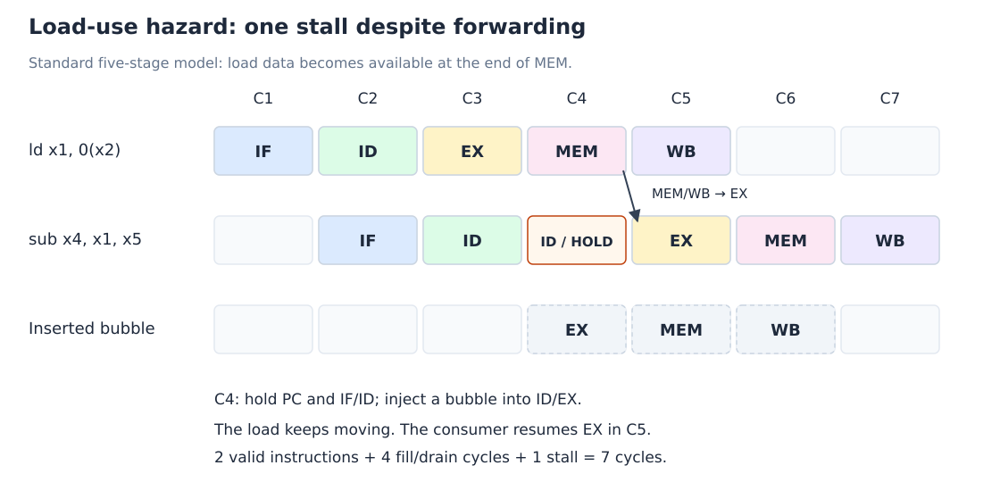

# 结构、数据与控制冒险

[课程目录](../../index.md) · [上一章：控制信号](04-pipelined-control.md) · [下一章：检测与停顿](06-hazard-detection-and-stalls.md)

## 1. 冒险是什么

**流水线冒险（Pipeline Hazard）**是阻止下一条指令在预定时钟周期正常执行的情况。理想时序表默认资源充足、输入及时可得、下一条指令地址已知；真实指令序列可能打破这些假设。

| 类型 | 冲突来源 | 典型例子 | 基本处理 |
| --- | --- | --- | --- |
| 结构冒险（Structural Hazard） | 同时需要同一个容量不足的硬件资源 | IF 与 MEM 共用单端口存储器 | 增加资源、分离资源或停顿 |
| 数据冒险（Data Hazard） | 所需数据尚未能在使用时刻取得 | 后续 ALU 指令读取尚未写回的结果 | 前递、停顿或合法重排 |
| 控制冒险（Control Hazard） | 下一条指令地址尚未确定 | 条件分支尚未判定，却已继续取指 | 停顿、预测、提前判定与冲刷 |

冒险是**实现和时序相关**的：相同程序在单周期机和不同流水线中可能有不同冒险。消除冒险应保持 ISA 定义的程序结果。

## 2. 结构冒险：同一时刻，资源够不够

如果指令与数据共用只有一个访问端口的存储器，那么 load/store 到 MEM 时需要数据访问，同时较新指令的 IF 也要取指，二者不能同时满足。

解决方法有：

- **资源分离（Resource Separation）**：指令存储器/缓存与数据存储器/缓存分开，分别支持 IF 和 MEM。
- **资源复制或多端口（Resource Duplication / Multiporting）**：增加可同时服务的能力，代价是面积、功耗或复杂度。
- **停顿（Stall）**：优先服务一项访问，延后另一项。

课件也提出在取指与译码之间加入**指令缓冲（Instruction Buffer）**，提前取入指令，在共享存储器暂时服务数据访问时消耗已缓冲的指令。这可以吸收短期冲突，但不能凭空提高单端口存储器的长期总带宽；缓冲耗尽后仍可能等待。

课件五级图中的寄存器堆支持两个读端口与一个写端口，让 ID 读源寄存器和 WB 写目的寄存器可以共存。同一地址的同周期读写还需要明确“先写后读”或内部旁路规则。ALU 之外的 PC 加法器、分支目标加法器也可减少资源争用。

**注意：**流水线寄存器只是保存阶段边界的信息，不能使单端口存储器突然拥有两个端口。

## 3. 数据依赖不等于必然停顿

~~~asm
add x1, x2, x3
sub x4, x1, x5
~~~

第二条指令读 x1，第一条指令写 x1，这是**真数据依赖（True Data Dependence）**，也称 **RAW（Read After Write）**。

第一条在 EX 已算出结果，却要到 WB 才写回寄存器堆。第二条若在 ID 直接读 x1，可能读到旧值。因此实现必须让 EX 使用正确的新值，不能因为程序语法合法就假设读数正确。

| 依赖类型 | 含义 | 当前五级模型中的地位 |
| --- | --- | --- |
| RAW：Read After Write | 后读者需要先写者的新结果 | 主要数据冒险 |
| WAR：Write After Read | 后写者不能覆盖先读者尚未读取的值 | 本模型固定在 ID 读、WB 写且顺序前进，不出现这种寄存器冒险 |
| WAW：Write After Write | 两次写的最终次序必须保持 | 本模型固定在 WB 按序写，不出现这种寄存器冒险 |

WAR/WAW 是理解更复杂执行模型的背景术语。内存依赖还要考虑地址别名，不能仅比较寄存器号。

### 3.1 没有前递时要等多久

假设 WB 在周期前半段写寄存器，ID 在后半段读。相邻的 add/sub 若完全没有前递，需要使 sub 的 ID 延迟到 add 的 WB 周期：

| 指令 | C1 | C2 | C3 | C4 | C5 | C6 | C7 | C8 |
| --- | --- | --- | --- | --- | --- | --- | --- | --- |
| add | IF | ID | EX | MEM | WB | — | — | — |
| sub | — | IF | ID 等待 | ID 等待 | ID 读新值 | EX | MEM | WB |

相对原本 C3 的 ID，需要 **2 个停顿周期**。若实现不允许 WB 当周期的写入被 ID 当周期看见，则还要多等一周期。解题必须先注明寄存器读写约定。

### 3.2 前递：绕过尚未完成的写回

**前递（Forwarding）**又称**旁路（Bypassing）**，把较老指令已产生的结果，直接送到较新指令的实际使用位置，而不必等它绕经寄存器堆。

在相邻 add/sub 中，add 的 EX 结束后结果保存在 EX/MEM。下一周期 sub 的 EX 可选择这个值作为 ALU 输入，即使它在先前 ID 读到的 x1 仍然是旧值。于是依赖仍存在，但停顿被消除。

~~~text
EX/MEM.ALUResult ──→ EX 输入选择器
MEM/WB.WritebackValue ──→ EX 输入选择器
~~~

MEM/WB 的前递值应选择**最终写回值**，包括 load 读出的内存数据，而不总是 ALUResult。两条较老指令若都写同一个寄存器，必须选择最近的有效写者，详见[前递检测与优先级](06-hazard-detection-and-stalls.md)。

前递增加数据路径、比较器与多路选择器，可能增加硬件成本和关键路径延迟。它解决部分 RAW 时序问题，不能解决所有冒险。

## 4. Load-use 冒险：有前递仍要等

~~~asm
ld  x1, 0(x2)
sub x4, x1, x5
~~~

load 的 EX 只产生地址，真正加载的值到 MEM 结束才可用。按理想连续执行，下一条 sub 的 EX 与 load 的 MEM 同周期；sub 在 EX 开始时要用值，load 却到该周期末尾才产出。

**前递不能把未来的值送回当前周期开头。** 标准五级模型必须停顿一周期，使 sub 的 EX 推迟，随后从 MEM/WB 得到 load 的数据。

*自绘，依据课程的五级模型。HOLD 表示等待；不是让 load 停止前进。*

| 周期 | load | sub | 后续指令 | 关键动作 |
| --- | --- | --- | --- | --- |
| C3 | EX | ID，发现依赖 | IF | 判定需要停顿 |
| C4 | MEM | 仍在 ID | 取指端保持 | EX 放入气泡 |
| C5 | WB | EX | 继续前进 | MEM/WB → EX 前递正确数据 |

一周期结论以正常单周期 MEM 为前提。如果存储访问本身更慢，还要考虑额外等待，不能套用固定一拍。

## 5. Store 的两个输入，使用时间不同

~~~asm
sd x3, 8(x1)
~~~

- x1 是**基址（Base Address）**，EX 用于地址计算。
- x3 是**存储数据（Store Data）**，最终在 MEM 写内存。

因此处理 store 依赖时要分别追踪基址与数据。ALUSrc 选择立即数计算地址，并不代表 x3 不再重要；x3 仍需要沿流水线保存并获得必要的前递。

~~~asm
add x1, x2, x4
sd  x3, 0(x1)    # 基址需要 EX 前递

add x3, x2, x4
sd  x3, 0(x1)    # 存储数据需要正确旁路或等待
~~~

load 后接使用其结果的 store，是否必须停一拍取决于具体路径：

- 若 load 的结果作为 store **基址**，仍是紧邻 EX 的 load-use，需要停顿。
- 若仅作为 **store data**，且支持 MEM/WB → store 的 MEM 写数据旁路，可以不按普通 EX 使用者停顿。
- 若只在 EX 为 store data 做选择，或根本没有相应旁路，则可能要等待。

考试若只说“有前递”，仍应根据题图确认是否包含存储数据路径。不能默认所有路径都存在。

## 6. 合法重排减少停顿

课件例子计算三个变量，使用 RV64I 的 ld/sd，每个数组元素占 8 字节。设 x31 指向一个不与其他对象重叠的普通内存区域：

~~~asm
ld  x1, 0(x31)     # b
ld  x2, 8(x31)     # e
add x3, x1, x2     # a = b + e
sd  x3, 24(x31)
ld  x4, 16(x31)    # f
add x5, x1, x4     # c = b + f
sd  x5, 32(x31)
~~~

两处紧邻的 load → add 各需一个气泡。把与前面计算独立的 f 加载提前，可填补等待位置：

~~~asm
ld  x1, 0(x31)
ld  x2, 8(x31)
ld  x4, 16(x31)    # 填入 e 的等待位置
add x3, x1, x2
sd  x3, 24(x31)
add x5, x1, x4
sd  x5, 32(x31)
~~~

在完整 ALU/load/store-data 前递且无其他冲突时，原序列 7 条指令用 $7+4+2=13$ 周期，重排后用 $7+4=11$ 周期。

**指令调度（Instruction Scheduling）**必须保持依赖和可观察语义。不能跨越未知别名的 store 随意移动 load；设备访问、volatile、异常顺序等也会限制重排。这里是对明确独立的普通数据进行课堂调度分析。

## 7. 控制冒险：下一条 PC 来不及确定

条件分支至少涉及两个问题：是否跳转（Branch Outcome）与目标地址（Branch Target）。若到较后阶段才得到结果，前端可能已经取到顺序后继。

### 7.1 不同判定阶段，罚周期不同

以预测不跳转、每周期取一条为例：

| 最终决定发生在 | 决定周期中更年轻的指令 | taken 时需取消的槽位 | 基本罚周期 |
| --- | --- | --- | --- |
| ID | IF | 1 个 | 1 |
| EX | ID、IF | 2 个 | 2 |
| MEM | EX、ID、IF | 3 个 | 3 |

这里假设目标在下一周期 IF 开始取，不考虑更早判定、额外目标延迟或特殊旁路。

课件早期冒险例子常按 EX 决定，完整基础控制图却把 Branch 与比较结果经 EX/MEM 送到 MEM 一侧做 PC 选择。因此**不能把所有课件图的 branch penalty 都背成 2**，应看题图的实际重定向时刻。

### 7.2 三种基本处理

**等待（Stall until Resolved）：**在未知时停止取后继指令。正确性简单，但不跳转分支也付出等待代价。

**预测不跳转（Predict Not Taken）：**先继续 PC+4；不跳转时顺序路径正确，跳转时取消错取指令并转向目标。预测正确不意味着分支本身提前完成，只是后继路径无需纠正。

**预测跳转（Predict Taken）：**提前按目标取指，需要及时得到目标；预测错误时恢复顺序路径。不能只有 taken 的猜测却没有可用目标地址。

**分支预测（Branch Prediction）**包括：

- 静态预测（Static Prediction）：固定不跳转，或采用“向后跳转预测 taken，向前跳转预测 not taken”（Backward Taken, Forward Not Taken，BTFNT）等规则。
- 动态预测（Dynamic Prediction）：利用执行历史更新预测状态。最简单的一位预测记录上次结果；循环退出时可能误判，再次进入也可能误判。

### 7.3 冲刷与停顿是两种操作

**冲刷（Flush / Squash）**取消已进入流水线但不应执行的指令。**停顿（Stall）**保留一条有效指令，等待它未来继续执行。

~~~text
stall：这条指令还要执行，保留它
flush：这条指令不应执行，取消它
~~~

对 EX 决定的 taken 分支，须取消当时 ID 和 IF 中的两条错路径指令，保留较老指令与分支自身；设置下一次取指的 PC 为目标。对 MEM 决定的模型，还要取消更年轻的 EX 指令。所有被取消指令都不得写寄存器、写内存或再次重定向。

提前在 ID 判断分支可缩短控制罚周期，但也使比较操作数更早被需要；可能新增数据等待和旁路需求。因此提前判定并非完全没有代价。

## 8. 把冒险纳入性能计算

令基础每条指令平均周期数为 1，额外停顿和预测错误罚周期合计为 $s$，执行 $n$ 条有效指令：

$$
C_{\text{total}}=n+4+s
$$

$$
CPI=\frac{n+4+s}{n}
$$

长程序中，填充/排空开销可忽略；若分支比例为 $f_b$，预测错误率为 $p_m$，每次预测错误平均罚 $k$ 周期，则其平均贡献为：

$$
\Delta CPI_{\text{branch}}=f_b p_m k
$$

例如 $f_b=0.2$、$p_m=0.1$、$k=2$，贡献为 $0.04$，若无其他停顿，稳态 CPI 为 $1.04$。该式是由课件性能定义直接推得的复习应用。

相互重叠的停顿不能重复计数；例如同一周期同时受数据等待与资源阻塞影响，应从实际时序表求总额外周期。

## 9. 检查冒险的顺序

1. 标出每条指令实际读/写的寄存器、内存和 PC。
2. 写出结果最早产生的阶段，以及后续指令真正使用的阶段。
3. 查题图中是否有满足该时间关系的前递路径。
4. 对尚不可用的数据插入最少必要停顿，继续推进较老指令。
5. 对分支看决定阶段，取消错路径，再统计有效指令与总周期。

**英文简答：**“Forwarding can remove many RAW hazards, but an immediately dependent instruction after a load still needs one stall in the standard five-stage pipeline, because the loaded value is produced too late for its EX stage.”

## 参考资料

- `lec03-2026.pdf`，第 9–39 页；第 4、5 份授课文本的冒险部分。
- [Cornell CS 3410 流水线讲义](https://courses.cs.cornell.edu/cs3410/2026sp/notes/pipelining.html)：补充核对时间、CPI 与冒险的关系。
