# Lecture 1: AVL Trees, Splay Trees, and Amortized Analysis

**主线：Dynamic searching（动态查找）→ local restructuring（局部重构）→ complexity guarantees（复杂度保证）。** AVL 保证每次操作都快；Splay 允许个别操作慢，但控制整段操作的总成本。

[Course overview（课程信息）](index.md) · [HW1 C implementation（编程题实现）](hw1-avl-root.md)

## 1. Dynamic searching（动态查找）

### 1.1 BST and tree shape（二叉搜索树与树形）

**Binary search tree, BST（二叉搜索树）：** at every node, all left-subtree keys are smaller and all right-subtree keys are larger; both subtrees satisfy the same rule. Assume distinct keys, or specify a duplicate-key policy（重复键策略）.

- Find / Insert / Delete: $O(h+1)$, following a root-to-node path.
- Complete BST（完全二叉搜索树）: $h=\Theta(\log N)$.
- Sorted insertion（有序插入）into an ordinary BST: a chain with $h=N-1$, hence $O(N)$ operations.
- Dynamic data（动态数据）changes online: future keys are unknown. Sorting once + binary search（排序后二分查找）does not solve updates; ordered-array insertion/deletion may require $O(N)$ shifts.

| Response | Idea | Guarantee / limitation |
| --- | --- | --- |
| Arrange input order（调整输入顺序） | Insert medians first. | Good initial tree, but cannot control unknown future arrivals. |
| Treap（树堆，Tree + Heap） | BST order on keys + heap order on independent random priorities（随机优先级）. | Expected（期望）height $O(\log N)$ under sufficiently random priorities; extra storage/maintenance. |
| AVL: detect and repair（检测并修复） | Maintain a cheap invariant（不变量）; fix violations locally. | Deterministic（确定性）$O(\log N)$ worst-case operations. |

**设计要点：**“平衡”必须有可计算的指标和复杂度证明。Height balance（高度平衡）、black-height balance（黑高平衡）、weight balance（权重平衡）是不同约束。强制保持完全 BST 的固定形状可能造成大量重排；AVL 用少量不平衡换取便宜的更新。

### 1.2 ASL（平均查找长度）· MOOC Definition checkpoints

For equally likely **successful searches（成功查找）**, one comparison per visited node:

$$
\operatorname{ASL}=\frac{1}{N}\sum_v(\operatorname{depth}(v)+1).
$$

Depth（深度）counts edges from the root. ASL here averages over stored keys in one fixed tree; it is **not** amortized analysis（摊还分析）.

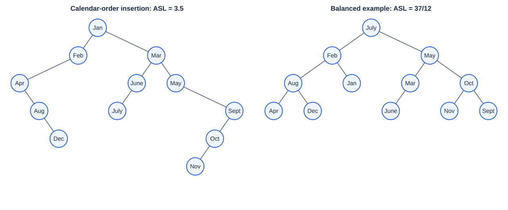

| Example / checkpoint | Calculation | Answer |
| --- | --- | --- |
| Calendar-order insertion, Jan → Dec | Total comparisons / 12 | $42/12=3.5$ |
| Q1: pictured balanced tree, root July | $(1+2\cdot2+4\cdot3+5\cdot4)/12$ | $37/12\approx3.1$ |
| Q2: skewed（退化）12-node tree | $(1+2+\cdots+12)/12$ | $6.5$ |

**注意：**month names are compared alphabetically（按字母顺序）, not by calendar order. Balanced does not mean complete; balanced shapes can have different ASLs.

## 2. AVL trees（AVL 高度平衡树）

### 2.1 Definition and metadata（定义与辅助信息）

AVL = BST + recursive height balance（递归高度平衡）, named after Adelson-Velskii and Landis (1962). Empty trees are balanced; a nonempty tree is balanced iff both subtrees are balanced and their heights differ by at most 1.

$$
h(\varnothing)=-1,\qquad
h(v)=1+\max(h(v_L),h(v_R)),\qquad
BF(v)=h(v_L)-h(v_R)\in\{-1,0,1\}.
$$

**Balance factor, BF（平衡因子）：左高减右高。** A leaf has height 0. Check **every node**: root BF = 0 does not imply AVL; visual asymmetry does not imply imbalance.

Store BF or cached height（缓存高度）per node; update locally in $O(1)$ while recursion unwinds（递归回溯）. Recomputing heights by traversing whole subtrees loses the logarithmic bound.

### 2.2 Insertion and rotations（插入与旋转）

Normal BST insertion → update bottom-up → repair the **lowest unbalanced ancestor（最低失衡祖先）**.

- **Troublemaker（肇因节点）:** inserted key that increases subtree height.
- **Trouble finder（失衡发现者）:** first ancestor with BF = ±2 when moving upward.
- Classify the first **two directions** from the trouble finder toward the inserted key; the key may lie deeper.

| Case（失衡路径） | Repair（修复动作） |
| --- | --- |
| LL | Right rotation（右单旋）at the trouble finder. |
| RR | Left rotation（左单旋）at the trouble finder. |
| LR | Left rotation at its left child, then right rotation at the trouble finder. |
| RL | Right rotation at its right child, then left rotation at the trouble finder. |

**易混点：**RR 描述“右—右”的失衡路径，修复动作却是左旋；LL/RR 不是旋转方向。

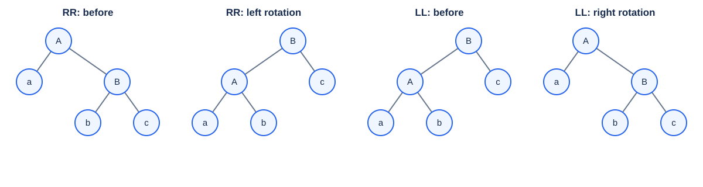

**BST-order invariant（搜索顺序不变量）：** in RR, $a<A<b<B<c$. Promote $B$; its old left subtree $b$ becomes $A$'s right subtree. Inorder order（中序顺序）is unchanged. LL is symmetric.

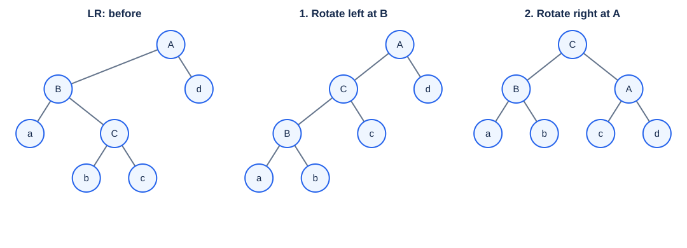

**Double rotation（双旋）：** for LR, promote the middle key $C$ between $B$ and $A$; preserve $a<B<b<C<c<A<d$. $C$'s old left subtree goes to $B$, its right subtree to $A$. RL is symmetric; insertion in either subtree of $C$ gives the same repair pattern.

**Cost and locality（成本与局部性）：** each primitive rotation changes $O(1)$ pointers/metadata. Reconnect the new subtree root to its parent, or replace the tree root. For **insertion**, repair restores the subtree's pre-insertion height（插入前高度）, so ancestors need no further rotations: one repair site, at most two primitive rotations. Update metadata even when no rotation occurs.

**Deletion（删除）区别：** delete by the BST rule; for two children, replace by inorder predecessor/successor（中序前驱／后继）. Update and rebalance upward. Height can decrease after repair, requiring $O(\log N)$ repair sites; a heavy child's BF = 0 uses a single rotation. “一次局部修复即可”只适用于插入。

### 2.3 Month-name trace（月名插入）· rotation checkpoints

```text
Mar, May, Nov, Aug, Apr, Jan, Dec, July, Feb, June, Oct, Sept
```

| Insert | Trouble finder | Case | Promoted root |
| --- | --- | --- | --- |
| Nov | Mar | RR | May |
| Apr | Mar | LL | Aug |
| Jan | May | LR | Mar |
| Feb | Aug | RL | Dec |
| June | Mar | LR | Jan |
| Oct | May | RR | Nov |

Other insertions, including Dec, July and Sept, need metadata updates but no rotations.

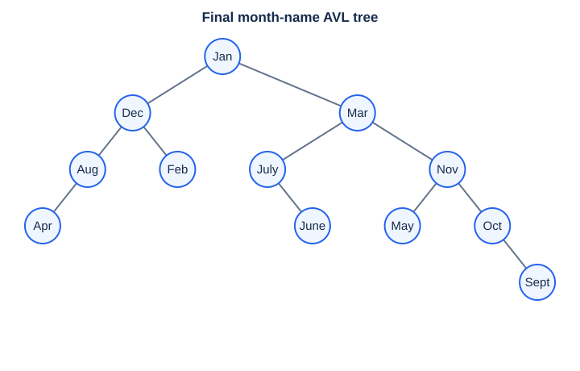

**MOOC Single rotations Q1:** where does $B$'s old left subtree go after RR? **Right subtree of $A$**; its keys satisfy $A<\text{keys}<B$.

**Single rotations Q2:** after inserting Apr, which nodes participate? **Mar, Aug, Apr**; Mar is the lowest trouble finder, repaired by LL. Repair it before considering higher ancestors.

**Double rotations Q1:** after inserting **June**, which statement is false?

- **A.** July is the parent of Jan.
- **B.** Jan is the root.
- **C.** Mar is the parent of May.
- **D.** Aug and Feb are siblings.

**Answer: A.** LR promotes Jan above Dec and Mar; Jan is an ancestor of July. At this stage Dec has children Aug/Feb and Mar still has right child May. 后续 Oct、Sept 会改变树形，不能用最终图判断中间阶段。

### 2.4 Height bound（高度界）· Quiz 1.1 Q2 / HW1 MC1

Let $n_h$ be the **minimum node count（最少节点数）** of a height-$h$ AVL tree. Minimal subtrees have heights $h-1,h-2$:

$$
n_{-1}=0,\qquad n_0=1,\qquad
n_h=1+n_{h-1}+n_{h-2}=F_{h+3}-1,
$$

where $F_0=0,F_1=1$. The bases and recurrence follow by considering $n_h+1$. With $\varphi=(1+\sqrt5)/2$,

$$
F_k=\frac{\varphi^k-(-\varphi)^{-k}}{\sqrt5},\qquad
n_h=\Theta(\varphi^h),\qquad
N\ge n_h\Longrightarrow h=O(\log N).
$$

The leading base-2 coefficient is $1/\log_2\varphi\approx1.44$. AVL may be taller than complete trees by a constant factor; **Find/Insert/Delete are worst-case $O(\log N)$**.

**Question:** minimum nodes at tree depth 6, with empty depth −1? A. 13; B. 17; C. 20; D. 33.

| $h$ | −1 | 0 | 1 | 2 | 3 | 4 | 5 | 6 |
| --- | --- | --- | --- | --- | --- | --- | --- | --- |
| $n_h$ | 0 | 1 | 2 | 4 | 7 | 12 | 20 | 33 |

**Answer: D**, $n_6=1+20+12=33$. Here tree depth means height（最大节点深度）.

**下标警告：**empty height −1 / leaf height 0 → $F_{h+3}-1$; empty height 0 / leaf height 1 → $F_{h+2}-1$. 视频和课件的下标不完全一致，先核对高度约定。

## 3. Splay trees（伸展树）

### 3.1 Target（目标）

**Self-adjusting BST（自调整二叉搜索树）：** splay the accessed node to the root; no BF/height field is needed for balance maintenance. The tree need not remain height-balanced.

For $M$ operations starting **empty**, with at most $N$ keys present:

$$
T(M)=O(M\log(N+1)),\qquad
T_{\mathrm{amortized}}=O(\log(N+1)).
$$

The lecture writes $O(M\log N)$; $+1$ handles empty/singleton sets. A single operation can cost $\Theta(N)$, but the next access to the same root key is $O(1)$.

**MOOC Target T/F: “An AVL tree is a splay tree.”** Course answer: **True**, meaning AVL satisfies the same sequence-cost target. As a data-structure definition: **False**; AVL and splay are different algorithms. **复杂度保证蕴含 ≠ 数据结构等同。**

### 3.2 Move-to-root fails（朴素移至根策略的反例）

Repeatedly rotating the accessed node with its parent is insufficient. Insert $1,\ldots,N$ with this rule: $O(N)$ total, yielding a left chain rooted at $N$. Then access $1,\ldots,N$: the chain returns after each sweep, with $\Theta(N^2)$ total work.

Comparison count: Find(1) costs $N$; Find($i\ge2$) costs $N-i+2$:

$$
N+\sum_{i=2}^{N}(N-i+2)=\frac{N^2+3N-2}{2}=\Theta(N^2).
$$

**MOOC Single rotations checkpoint:** complexity of these $N$ finds? **$\Theta(N^2)$, option C.** Exported option images are blank; the video/slides explicitly state the quadratic result. 只让当前节点变浅，可能把其他节点压深；必须控制旋转顺序。

### 3.3 Splaying steps（伸展步骤）

Let $x$ be accessed, $p$ its parent（父节点）, $g$ its grandparent（祖父节点）. Repeat **bottom-up（自底向上）** until $x$ is root:

| Case | Condition | Rotation order |
| --- | --- | --- |
| Zig（单旋） | $p$ is root | Rotate $x$ with $p$; terminal step（最后一步）. |
| Zig-zag（异向双旋） | $x,p$ on opposite sides | Rotate $x$ with $p$, then $x$ with $g$. |
| Zig-zig（同向双旋） | $x,p$ on the same side | Rotate **$p$ with $g$ first**, then **$x$ with $p$**. |

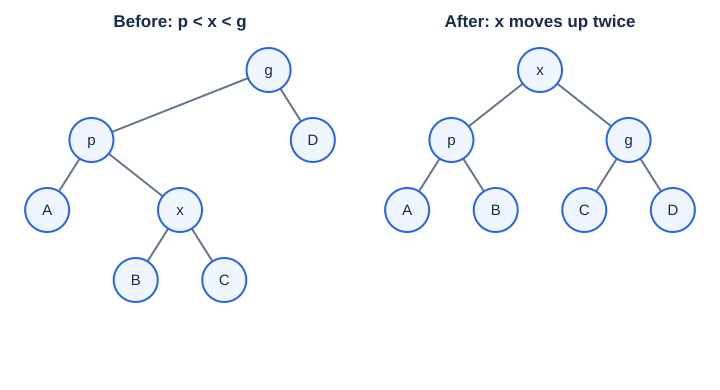

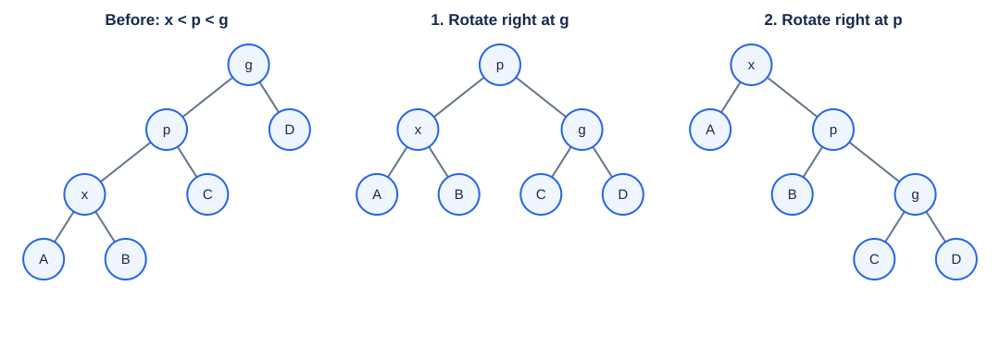

**易错：**Zig-zig 先转父节点与祖父节点，不能先转 $x,p$。Zig-zig 和 zig-zag 都包含 **two primitive rotations（两次基本旋转）**；课件的 “single rotation” 标签不代表 zig-zig 只转一次。

Reconnect hanging subtrees（挂接子树）, the tree root, and parent pointers if used. Parent pointers or an explicit path stack（路径栈）can support bottom-up updates.

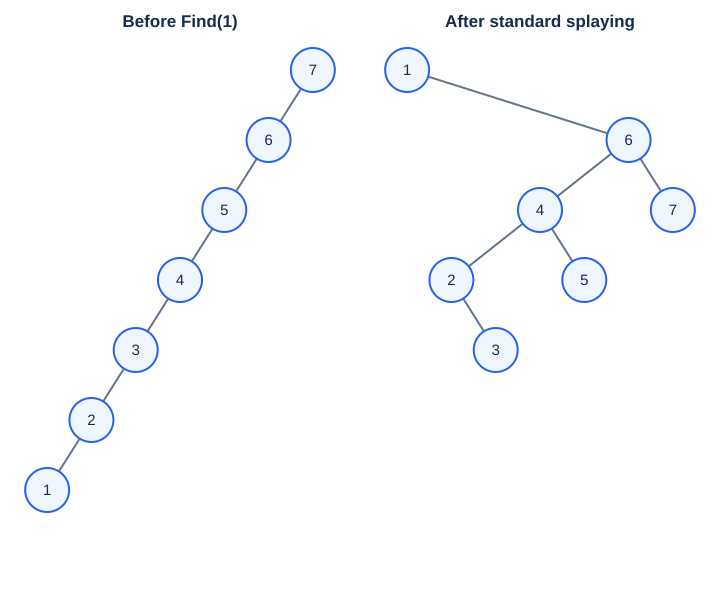

Splaying roughly shortens depths along the access path（访问路径）; the 7-node and textbook 32-node examples illustrate this. **不是每个节点深度或全树高度都必然减半**；保证来自摊还证明。

### 3.4 Operations（操作）

| Operation | Procedure |
| --- | --- |
| Find | BST search, then splay the found node; on failure, splay the **last visited node** if nonempty. |
| FindMin / FindMax | Find and splay the extreme key（最小／最大键）. |
| Insert | BST leaf insertion, then splay the new node; under set semantics, splay an existing duplicate without adding a copy. |
| Delete | Find/splay target → remove root → join remaining subtrees（合并子树）. |

**Deletion/join:** if either subtree is empty, return the other. Otherwise splay $\max(L)$ in the left subtree; it has **no right child**. Attach the old right subtree $R$ there. All $L$ keys are smaller than all $R$ keys, preserving BST order. Symmetrically, splay $\min(R)$ and attach $L$ on the left. Clear/set parent links when detaching/attaching.

**Quiz 1.2 Q2:** “Finding the maximum leaves the root with no right subtree.” **True** when FindMax includes splaying: any right child would contradict maximality（最大性）.

### 3.5 AVL vs. Splay（比较）

| Property | AVL | Splay |
| --- | --- | --- |
| Shape invariant（树形约束） | Recursive height balance | BST order only |
| Balance metadata（平衡辅助信息） | BF / height | None; still needs parent/path machinery |
| Successful find | No restructuring | Splays unless already root |
| Worst case per operation（单次最坏情况） | $O(\log N)$ | $O(N)$ |
| Amortized standard operations（摊还界） | $O(\log N)$ | $O(\log N)$ |
| Tradeoff（取舍） | Predictable latency（延迟） | Access locality（访问局部性）, but more writes/rotations |

Benchmark random/sorted inputs, hot keys（热点键）, failed searches, and mixed updates; measure comparisons, rotations, total time, and maximum latency. Splay is not universally faster; amortized guarantees do not ensure real-time（实时）per-request bounds. 线下“AVL 已不使用”的说法不宜当作普遍事实。

## 4. Amortized analysis（摊还分析）

### 4.1 What is bounded?（保证的对象）

| Bound | Meaning | Probability assumptions（概率假设） |
| --- | --- | --- |
| Worst-case（最坏情况） | Every individual operation | None |
| Amortized（摊还） | Total cost of every valid sequence, divided by its length | None |
| Average-case（平均情况） | Expected cost under a specified distribution（分布） | Required |

For the **same cost model**, worst-case per-operation guarantee → amortized sequence guarantee → expected sequence bound under any distribution. 课件的 “≥” 表示**保证强弱**，不是不同复杂度函数之间的数值比较。

Example: deterministic quicksort averages $O(N\log N)$ over equally likely permutations（等概率排列）, but can take $O(N^2)$. Amortized analysis controls expensive operations through their history, without random-input assumptions.

**Quiz 1.3 Q2:** amortized $O(\log N)$ implies worst-case $O(\log N)$? **False**; a splay access can be linear.

### 4.2 Stack + MultiPop（栈与批量弹出）: three methods

```text
MULTIPOP(S, k):
    while k > 0 and S is not empty:
        POP(S)
        k = k - 1
```

For $k\ge0$, let $k'=\min(k,|S|)$. Count each elementary push/pop as 1: MultiPop removes $k'$ objects. With call/loop overhead, runtime is $\Theta(1+k')$.

**Aggregate analysis（聚合分析）：** in $m$ operations on an **empty** stack, each pushed object is popped at most once. With $P\le m$ pushes, total element work $\le2P\le2m$, hence amortized $O(1)$. For $m\ge2$, $m-1$ pushes + one MultiPop gives $2m-2$ units. Repeating MultiPop on empty cannot repeat expensive removal. With $s_0$ initial objects, the bound becomes $O(m+s_0)$.

**Accounting method（记账法）：** charge $\widehat c_i$, pay actual cost $c_i$, and store the difference as credit（预存额度）. Credit must stay nonnegative after **every prefix（每个操作前缀）**:

$$
\sum_{i=1}^{j}(\widehat c_i-c_i)\ge0
\Longrightarrow\sum_{i=1}^{j}c_i\le\sum_{i=1}^{j}\widehat c_i.
$$

| Operation | $c_i$ | $\widehat c_i$ | Credit change |
| --- | --- | --- | --- |
| Push | 1 | 2 | +1 |
| Successful Pop | 1 | 0 | −1 |
| MultiPop | $k'$ | 0 | $-k'$ |

One credit per stored object → credit = stack size ≥ 0 → total charge $2P=O(m)$. **零摊还成本不是零实际时间，而是此前已付费。** Add constant charges for call overhead. The offline alternative charges 3/1/1 also work, but give a looser $O(m)$ bound; charges are not unique. Aggregate gives a uniform average; accounting can assign different charges to different operations.

**Potential method（势能法）：** state $D_i$ after operation $i$; potential function（势函数）$\Phi$ stores credit in the whole state:

$$
\widehat c_i=c_i+\Phi(D_i)-\Phi(D_{i-1}),\qquad
\sum_{i=1}^{m}c_i=\sum_{i=1}^{m}\widehat c_i+\Phi(D_0)-\Phi(D_m).
$$

Telescoping（望远镜求和）cancels intermediate potentials. If $\Phi(D_j)\ge\Phi(D_0)$ for every prefix, charges upper-bound actual cost. Common normalization（归一化）: $\Phi(D_0)=0$, $\Phi\ge0$. Potential may rise/fall; an additive constant does not change charges. 初始势能不为最小值时，必须保留边界项。

For the stack, $\Phi(D)=|S|$: changes $+1,-1,-k'$ reproduce charges $2,0,0$.

**HW1 MC4: which statement is false?**

- **A.** Aggregate analysis yields $T(m)/m$ from a worst-case sequence total $T(m)$.
- **B.** A good potential should always attain its **maximum** initially.
- **C.** Accounting saves excess charges for later expensive operations.
- **D.** Accounting allows operation charges to differ, unlike the uniform aggregate average.

**Answer: B.** An initial **minimum（最小值）** provides the usual upper-bound condition; the actual requirement is the boundary-term inequality.

## 5. Splay amortized proof（伸展树的摊还证明）

### 5.1 Rank and potential（秩与势能）

For a fixed node set, subtree size includes the node itself:

$$
s(v)=|\text{subtree}(v)|,\qquad
r(v)=\log_2 s(v),\qquad
\Phi(T)=\sum_{v\in T}r(v).
$$

**Rank（秩）≠ height（高度）**; leaf rank = 0. Rank/potential are analysis tools and need not be stored. A rotation changes ranks only at the two/three main nodes; hanging subtrees and ancestor subtree sizes stay unchanged.

**Log lemma（对数引理）:** for positive $a,b,c$, $a+b\le c$ implies $ab\le c^2/4$ by AM–GM（算术—几何平均不等式）:

$$
\log_2a+\log_2b\le2\log_2c-2.
$$

The −2 uses base-2 logs. **Subtree sizes are additive; heights are not.** Replacing rank by height breaks this argument.

### 5.2 Local costs（局部成本）

Use $r$ before, $r'$ after; one primitive rotation costs 1. Let $\Delta=r'(x)-r(x)\ge0$.

**Zig:** $r'(p)\le r(p)$, so

$$
\widehat c=1+r'(x)+r'(p)-r(x)-r(p)\le1+\Delta.
$$

For either two-rotation case, $r'(x)=r(g)$ and $r(p)\ge r(x)$:

$$
\widehat c=2+r'(p)+r'(g)-r(x)-r(p).
$$

| Case | Key size/rank relation | Amortized bound |
| --- | --- | --- |
| Zig-zag | $s'(p)+s'(g)\le s'(x)$ → $r'(p)+r'(g)\le2r'(x)-2$ | $\widehat c\le2+2r'(x)-2-2r(x)=2\Delta$ |
| Zig-zig | Old $x$ subtree and new $g$ subtree are disjoint: $s(x)+s'(g)\le s'(x)$ → $r(x)+r'(g)\le2r'(x)-2$; also $r'(p)\le r'(x)$ | $\widehat c\le2+r'(x)+r'(g)-2r(x)\le3\Delta$ |

Mirror cases（镜像情形）are identical. 关键不是让每次实际成本都小，而是让**秩的变化支付昂贵旋转**。

### 5.3 Access lemma（访问引理）and boundary terms（边界项）

All nonterminal steps cost at most $3\Delta$; only a final zig contributes +1. Consecutive rank differences of $x$ telescope. With original root $t$,

$$
\widehat c_{\mathrm{splay}(x)}
\le1+3\bigl(r(t)-r(x)\bigr)\le1+3\log_2N.
$$

This bounds **rotation cost + potential change**, not actual cost of one access. Search depth and rotation work are proportional, up to constants. Standard steps and the access lemma are corroborated by [Sleator–Tarjan, Section 2](https://www.cs.cmu.edu/~sleator/papers/self-adjusting.pdf).

**Initial state matters（初始状态很重要）：** $0\le\Phi(T)\le N\log_2N$, but an arbitrary initial tree need not minimize potential. For $M$ accesses,

$$
\sum c_i\le O(M\log(N+1))+\Phi(T_0)-\Phi(T_M)
\le O((M+N)\log(N+1)).
$$

Starting empty removes initial credit. For updates, insertion can be implemented as splay-last-search-node → split → new root: the new root adds at most $\log(N+1)$ rank, retained roots do not gain size. Deletion splays/removes the target, splays $\max(L)$, then attaches $R$; attaching changes one root rank by at most $\log(N+1)$. Together with the access lemma this gives logarithmic amortized updates; leaf-insert-then-splay also has the standard guarantee.

**课件澄清：**“势能在 $N$ 步内最多增加 $O(\log N)$”不是总势能必须满足的条件。$\Phi$ 可以为 $\Theta(N\log N)$；要控制的是每次操作的 $c_i+\Delta\Phi_i$，以及初末边界项。

## 6. Integrated exercises（综合题）

### 6.1 AVL insertion（AVL 插入）· Quiz 1.1 Q1 / HW1 MC2

**Insert $2,1,4,5,9,3,6,7$ into an empty AVL tree. Which is false?**

- **A.** 4 is the root.
- **B.** 3 and 7 are siblings（兄弟节点）.
- **C.** 2 and 6 are siblings.
- **D.** 9 is the parent of 7.

Only three repairs: insert 9 → RR at 4; insert 3 → RL at 2; insert 6 → RL at 5. Root sequence: $2,2,2,2,2,4,4,4$.

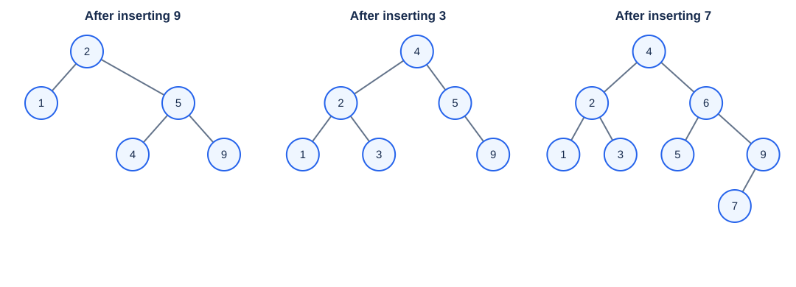

**Answer: B.** Final children: 4 → (2,6), 2 → (1,3), 6 → (5,9), 9 → (7,∅). 3 的父节点是 2，7 的父节点是 9。

### 6.2 Splay accesses（伸展树访问）· Quiz 1.2 Q1 / HW1 MC3

**Access $3,9,1,5$ in order in the following tree. Which final statement is false?**

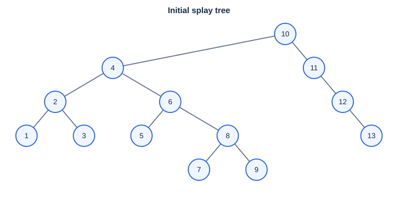

- **A.** 5 is the root.
- **B.** 1 and 9 are siblings.
- **C.** 6 and 10 are siblings.
- **D.** 3 is the parent of 4.

| Access | Steps, from bottom upward |
| --- | --- |
| 3 | Zig-zag (3,2,4); zig (3,10). |
| 9 | Zig-zig (9,8,6); zig-zag (9,4,10); zig (9,3). |
| 1 | Zig-zig (1,2,3); zig (1,9). |
| 5 | Zig-zig (5,6,8); zig-zig (5,4,3); zig-zag (5,2,9); zig (5,1). |

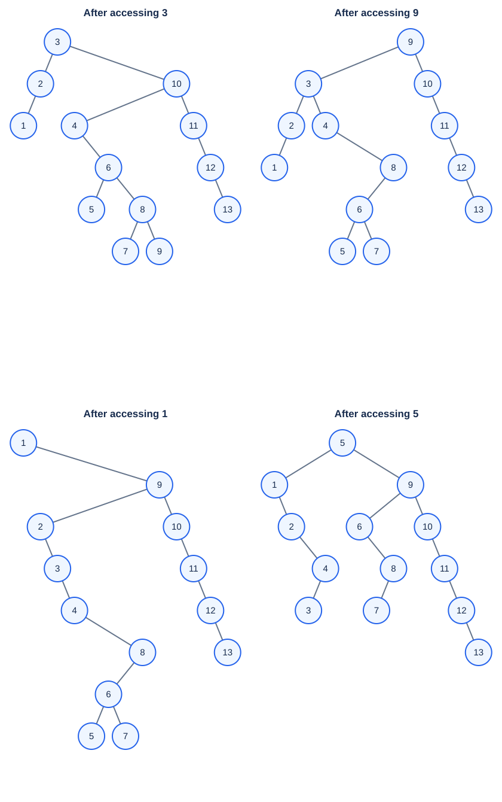

**Answer: D.** Final relationships: 5 → (1,9), 9 → (6,10), **4 has left child 3**. Each accessed key becomes root; the remaining 10 → 11 → 12 → 13 chain shows that splay need not produce AVL balance.

### 6.3 Buffer doubling（缓冲区倍增）· Quiz 1.3 Q1 / HW1 MC5

**Problem:** initially empty, capacity 1. Insertion costs 1 if space exists; otherwise copy $k$ old items into a doubled buffer and insert, costing $k+1$. A single insertion can cost $\Omega(N)$. Assume the buffer is **full after $N$ insertions**. Which potential works?

- **A.** Number of items.
- **B.** Negative number of items.
- **C.** Number of available blocks.
- **D.** Negative number of available blocks.

**Answer: D.** With occupancy（已用数量）$n$ and capacity（容量）$C$, use $\Phi=n-C$:

| Case | State change | $c_i$ | $\Delta\Phi$ | $\widehat c_i$ |
| --- | --- | --- | --- | --- |
| Space available | $(n,C)\to(n+1,C)$ | 1 | 1 | 2 |
| Resize（扩容） | $(k,k)\to(k+1,2k)$ | $k+1$ | $1-k$ | 2 |

Initially $\Phi=-1$; at the full endpoint $\Phi=0$, giving

$$
\sum c_i=2N-(0-(-1))=2N-1.
$$

Check by aggregate analysis: for power-of-two $N$, copied items $1+2+\cdots+N/2=N-1$, plus $N$ writes. A/B/C give resizing charges $k+2,k,2k$, respectively, so none cancels copying to a constant.

**易错：**D 的势能在中途可以低于初值，所以 $2j$ **不保证覆盖任意前缀**；题目的“最终装满”条件不能省略。For all prefixes, choose $\Psi=2n-C+1$: initially 0, nonnegative thereafter, and every insertion has charge 3. Thus arbitrary $N$ insertions cost at most $3N$; geometrically summing copies also gives total cost $<3N$.

### 6.4 HW1 programming（编程题）: Root of AVL Tree

**Task:** read $1\le N\le20$ distinct integer keys, insert in order, print the final root. Cache heights; recursively insert and rebalance; update the demoted node before the promoted node.

- `88 70 61 96 120` → root **70**: LL at 88 after 61; RR at 88 after 120.
- `88 70 61 96 120 90 65` → root **88**: RL at 70 after 90; 65 leaves the root unchanged.
- Total time $O(N\log(N+1))$; node storage $O(N)$; recursion depth $O(\log(N+1))$.
- Test all rotation cases, repairs below root, singleton, sorted/reversed keys, and $N=20$.

[Complete problem, sample I/O and tested C solution（完整题目、样例与 C 实现）](hw1-avl-root.md)

### 6.5 Week 2 review questions（第二周复习题）

以下题目来自第二周小测，只涉及本课知识。

**WK2 MC1: delete 3 from the following splay tree; which statement is impossible?** Input: `7(5(2(1,3(∅,4)),6),9(8,∅))`.

- **A.** 2 is root.
- **B.** 4 is root.
- **C.** 6 and 9 are siblings.
- **D.** 4 is the grandparent of 5.

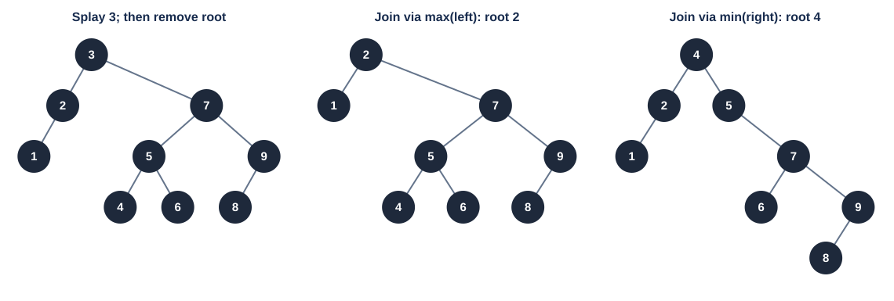

**Answer: D.** Splay 3 by zig-zag `(3,2,5)`, then zig `(3,7)`; remove root 3. Two joins（拼接）are valid:

| Join choice | Result | Options |
| --- | --- | --- |
| Splay max(left) = 2; attach right subtree | `2(1,7(5(4,6),9(8,∅)))` | A possible; 4 is a child of 5. |
| Splay min(right) = 4; attach left subtree | `4(2(1,∅),5(∅,7(6,9(8,∅))))` | B and C possible; 4 is the **parent**, not grandparent, of 5. |

**易错：**先伸展再删除，然后在剩余的一侧伸展极值；不能直接用普通 BST 的替换删除。题目没有指定哪种 join，“impossible”须检查两种合法结果。

**WK2 MC2: in an AVL tree of height 4, what is the maximum difference between left/right subtree sizes?** Choices **A 1 / B 2 / C 3 / D 5**.

**Answer: D, 5**, using this question's **height = number of levels（高度按层数）**: leaf height 1, empty height 0. One root subtree can have height 3 and be full with $2^3-1=7$ nodes; the other can have height 2 with its minimum 2 nodes. Difference $7-2=5$. If both subtrees have height 3, maximum difference is $7-4=3$, so 5 is the overall maximum.

**注意题目换了高度约定：**按本笔记 AVL 的边数高度，这棵树高度为 3。若真的按边数高度 4 计算，答案是 $15-4=11$，不在选项中。AVL 约束的是高度差，不是节点数差。

**WK2 MC3: which amortized-analysis statement is false?**

- **A.** A good potential should always assume its maximum at the start.
- **B.** Accounting saves excess amortized charges as credit for later operations.
- **C.** Aggregate analysis bounds total $T(n)$ for every sequence length $n$, giving $T(n)/n$ per operation.
- **D.** Accounting can assign different amortized costs to different operations, unlike the uniform aggregate average.

**Answer: A.** Same concept as HW1 MC4 in §4.2, with reordered options. Usually normalize the initial potential to a minimum and require $\Phi(D_j)\ge\Phi(D_0)$ to upper-bound actual prefix costs. 不要沿用上一份题目的选项字母。

**WK2 programming fill-in: RR rotation（右右失衡修复）.** Fill the pointer reassignment and new-root height in the given AVL function. The archive mixes `Tree L`, variable `R`, and `return L`: **变量名笔误**; use `R` consistently.

```c
Tree RR_Rotation(Tree T)
{
    Tree R = T->right;
    T->right = R->left;
    R->left = T;  /* blank 1 */
    T->h = maxh(Height(T->left), Height(T->right)) + 1;
    R->h = maxh(Height(R->left), Height(R->right)) + 1; /* blank 2 */
    return R;
}
```

The blanks are **`R->left = T`** and **`maxh(Height(R->left), Height(R->right))`**; the latter can use `T->h` for `Height(R->left)` after updating T. RR needs a **left rotation（左旋）**; update the demoted node before the promoted node. Time and extra space: $O(1)$; requires `T != NULL` and `T->right != NULL`.

## 7. Review and references（复习与来源）

**复习重点：**最低失衡祖先；旋转后中序顺序与子树高度；Fibonacci 下标；zig-zig 顺序；删除时的 join；单次最坏界与摊还界；credit / potential 的非负条件；rank 引理和望远镜求和；缓冲区题的最终装满条件。

These notes retain all 13 MOOC checkpoint/quiz questions and all six HW1 questions; duplicated questions share one solution. They also include the offline Treap, local-repair, implementation, and proof discussions. Sources: supplied lesson exports and merged indices (units 1320673500–1320673518), `course_87216_sub_1967598/course_content.md` and its 169 slide captures, and archived `ZJUADS_cy2026_HW1.md`. Course/project requirements are summarized on the [course page](index.md).

- [ZJU MOOC](https://www.icourse163.org/course/ZJU1-1460402161), supplied term 1488053496.
- Weiss, *Data Structures and Algorithm Analysis in C*, 2nd ed.: Chapter 4 pp. 106–128; Chapter 11 pp. 447–451. Figures 4.42–4.48 for code, 4.52–4.60 for larger splay examples.
- Cormen et al., *Introduction to Algorithms*, 3rd ed.: pp. 451–478. Page ranges follow the supplied slides.
- [Sleator and Tarjan, *Self-Adjusting Binary Search Trees* (1985)](https://www.cs.cmu.edu/~sleator/papers/self-adjusting.pdf), Section 2.

The ten original Lecture 1 figures and the added WK2 deletion figure are editable SVG redrawings; question trees follow the supplied diagrams, with resulting states recomputed. Status remains `draft` pending textbook/instructor review.
