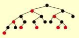
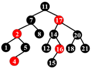
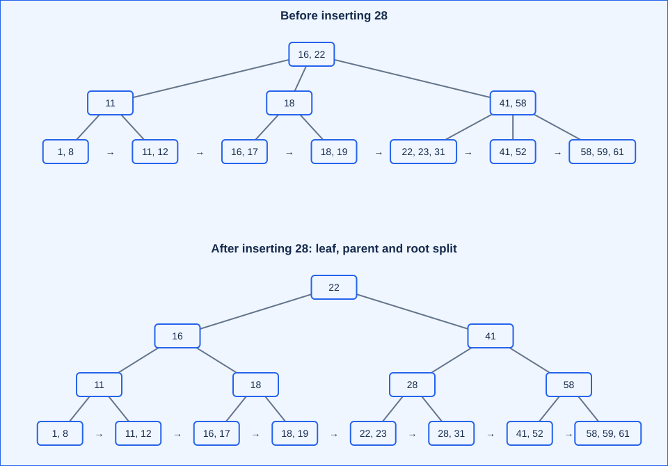
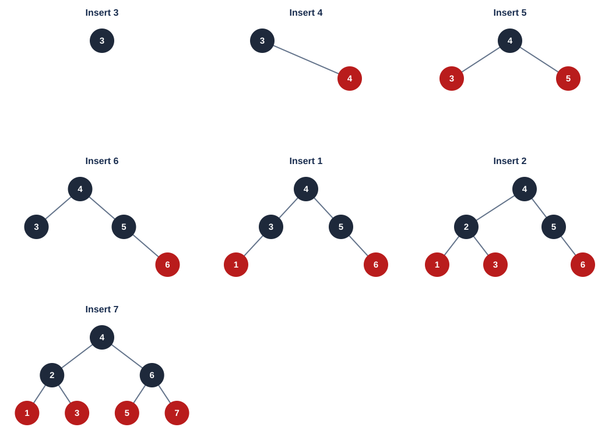
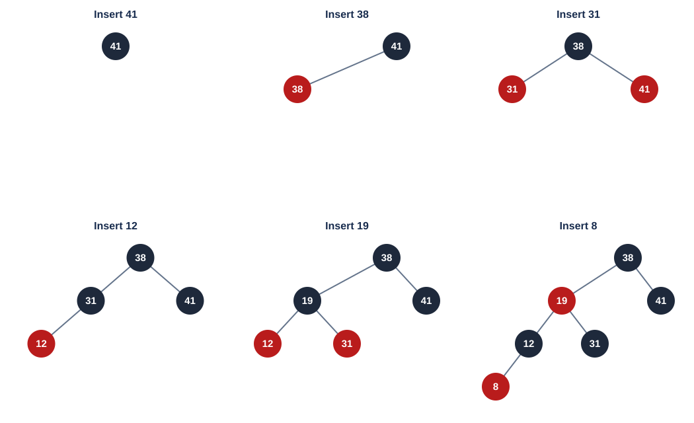
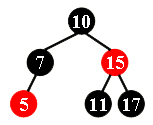
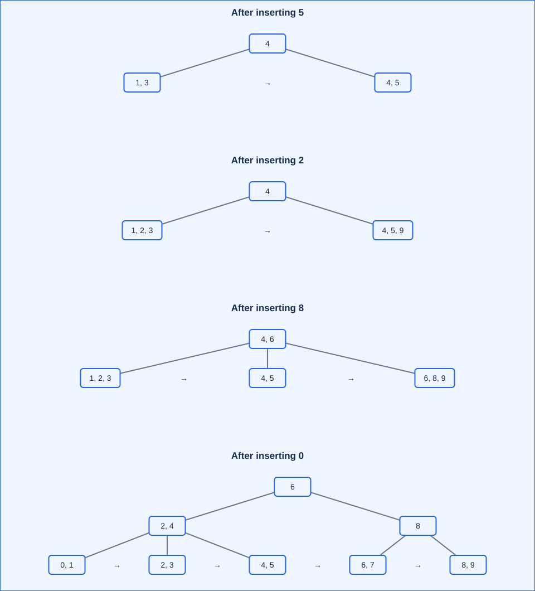
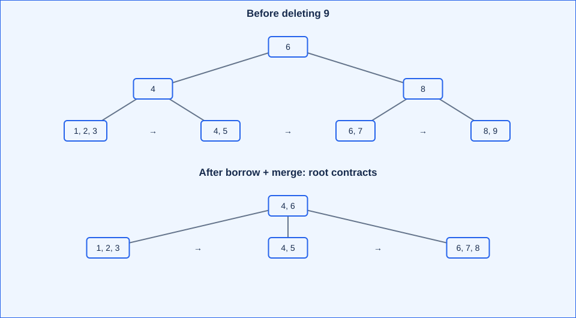

# Lecture 2: Red-Black Trees and B+ Trees

**主线：black-height balance（黑高平衡）减少更新时的旋转；multiway branching（多路分支）减少块存储的访问层数。** Both support dynamic searching（动态查找）, but optimize different costs.

[Course overview（课程信息）](index.md) · [Lecture 1（上一课时）](lecture-01-avl-splay-amortized-analysis.md)

## 1. Red-black trees（红黑树）

### 1.1 Definition and NIL（定义与外部叶子）

A **red-black tree, RBT** is a BST satisfying five properties:

1. Every node is **red or black（红或黑）**.
2. The **root is black（根为黑）**.
3. Every **NIL leaf is black（空叶子为黑）**.
4. A red node has two black children: **no adjacent red nodes（无相邻红节点）**.
5. From **each node**, all simple paths（简单路径）to descendant NIL leaves contain the **same number of black nodes（黑节点数相同）**.

**Internal node（内部节点）** = a real key-bearing node, including an ordinary terminal node. **External node / NIL leaf（外部节点／空叶子）** = a missing child pointer. 红黑树的 leaf 指 NIL，不是普通树中“没有孩子的实节点”。NIL 常被省略，判断黑高时必须补回来。

Typical node fields: `key, left, right, parent, color`. A color needs only one bit conceptually; the parent pointer（父指针）supports iterative upward repair（迭代向上修复）, trading space for convenient traversal. Actual structure size depends on alignment（内存对齐）. These fields are an implementation choice, not extra defining properties.

With $N$ real nodes, $2N-(N-1)=N+1$ child pointers are missing. Use one shared black **sentinel（哨兵）**, rather than allocating $N+1$ NIL objects. It makes color checks uniform; deletion must still track the parent of the particular missing-child position.

### 1.2 Black-height and height bound（黑高与高度界）

**Black-height, $bh(x)$（黑高）：** number of black nodes from $x$ to a NIL leaf, **excluding $x$, including NIL**. Set $bh(\mathrm{NIL})=0$; $bh(T)=bh(\mathrm{root})$.

Here **$h(x)$ counts edges to the farthest NIL**, so $h(\mathrm{NIL})=0$ and a singleton tree has $h=1$. 上一课时 AVL 高度数到实叶子，单节点高度为 0；非空树两种高度相差 1。

For a real node $x$ and its child $y$:

$$
bh(y)=\begin{cases}
bh(x)-1,&y\text{ is black},\\
bh(x),&y\text{ is red}.
\end{cases}
$$

**注意：决定减不减 1 的是 child 的颜色，因为定义排除了当前节点。** MOOC 2.1.2 Q1: possible values are **A and B**, $bh(x)-1$ and $bh(x)$; $h(x)=k+1$ alone does not select one.

**Size lemma（规模引理）：** the subtree rooted at $x$ has at least $2^{bh(x)}-1$ real nodes. Induction on height（按高度归纳）:

- NIL: $0=2^0-1$.
- Both children have smaller height and black-height at least $bh(x)-1$. Hence

$$
\operatorname{size}(x)=1+\operatorname{size}(x_L)+\operatorname{size}(x_R)
\ge1+2\bigl(2^{bh(x)-1}-1\bigr)=2^{bh(x)}-1.
$$

**WK3 T/F10:** “The subtree has no more than $2^{bh(x)}-1$ internal nodes.” **False**: the lemma is a **lower bound（下界）**. A black root with two red terminal children has $bh=1$, but 3 real nodes rather than at most 1.

**MOOC 2.1.2 Q2: prove $bh(T)\ge h(T)/2$.** On a longest root-to-NIL path, exclude the root. Every red node is followed by a black node, and NIL is black; thus at least half the remaining nodes are black. Therefore

$$
N\ge2^{bh(T)}-1\ge2^{h(T)/2}-1
\quad\Longrightarrow\quad
h(T)\le2\log_2(N+1)=O(\log N).
$$

The supplied slide writes $2\ln(N+1)$; the precise bound above uses **base 2（以 2 为底）**. With natural logarithms it is $(2/\ln2)\ln(N+1)$. [Independent lecture reference](https://www.cs.wm.edu/~tadavis/cs303/ch12sf.pdf), pp. 3, 31.

**Path ratio（路径比例）：** every root-to-NIL path has the same $b$ black nodes excluding the root, and length between $b$ and $2b$. Thus longest ≤ twice shortest. 比较的是到 NIL 的路径，不能直接换成到普通实叶子的边数。

### 1.3 Definition checkpoints（定义题）

| Source | Statement / question | Answer and reason |
| --- | --- | --- |
| MOOC Quiz 2.1 Q1; WK2 T/F9 | Farthest-leaf path ≤ twice nearest-leaf path. | **True**, by the path-ratio argument above. |
| MOOC Quiz 2.1 Q2 | If a red node has two children, their colors must agree. | **True**: both are black, including NIL children. |
| WK2 T/F6 | Every two-real-node RBT contains a red node. | **True**: black root + red child. A black child would give unequal black counts against the missing branch. |
| WK3 T/F6 | A black node with two children may have differently colored children. | **True**: root `10B`, left `5R` with children `3B,7B`, right `15B` is valid; black-height balance does not require sibling colors to match. |
| WK2 T/F3 | Every three-real-node RBT contains a red node. | **False**: a black root with two black children is valid. |

**WK3 MC1:** different structure or node colors counts as a different RBT. How many RBTs have **3 internal nodes**? A: 1; B: 2; C: 3; D: more than 3. **Answer: B (2)**, for a fixed ordered key set: the root with two real children, either both black or both red. A three-node chain fails either equal black-height or the no-red-red rule.

**MOOC 2.1.1 Q1: is the pictured tree a red-black tree? — True.** No red-red edge; equal black counts to **all missing-child positions**. It need not satisfy AVL balance.



**WK2 T/F4: is the following BST a valid red-black tree? — False.**



At red node 16, path `16 → NIL` contains one black node; `16 → 15 → NIL` contains two. **黑高失衡，不能只数到实叶子。** More generally, a red node cannot have exactly one real child. A valid one-child black node can have only a red terminal child.

### 1.4 Offline discussion: can we omit NIL?（去掉 NIL 的等价定义）

**Question:** remove “every NIL leaf is black”; how should the remaining definition change?

Keep root black and prohibit red-red edges. For **every node $x$**, require equal black counts on paths from $x$ to every descendant real node of **degree 0 or 1（实孩子数小于 2）**, **including that endpoint**. For $x$ itself of degree < 2, include the zero-edge path as well. Whether $x$ is counted is immaterial to equality if applied consistently.

Each missing-child path ends immediately after such a real node. Removing the final black NIL subtracts exactly 1 from every path, so the conditions are equivalent. **只比较到普通叶子的路径不够**：a black root with a lone black child would incorrectly pass, despite unequal missing-branch black-heights. The shared sentinel keeps both the definition and implementation simpler.

## 2. RBT operations（红黑树操作）

### 2.1 Bottom-up insertion（自底向上插入）

BST insertion → color new node **red** → repair red-red conflict → ensure black root. A red insertion preserves black counts; black insertion would immediately disturb them. **WK2 T/F1 (“insert then color black”): False.** A new root is the final black-root exception.

Let $z$ be the current red node, $p$ its parent, $g$ its grandparent, and $u$ its **uncle（叔节点，父亲的兄弟）**. If $p$ is black, stop. Assume $p=g_L$; mirror left/right for the other side.

| Case | Condition | Action | Next |
| --- | --- | --- | --- |
| 1: red uncle（红叔） | $p,u$ red | Make $p,u$ black and $g$ red. | Set $z=g$; conflict may propagate upward. |
| 2: triangle（折线） | $u$ black, $z=p_R$ | Left-rotate at $p$. | Convert to Case 3; update node roles. |
| 3: line（直线） | $u$ black, $z=p_L$ | Make $p$ black, $g$ red; right-rotate at $g$. | Local conflict resolved. |

NIL counts as a black uncle. Rotations preserve BST order（中序顺序）; recoloring preserves black counts except a possible uniform increase when the root becomes black. Case 1 can repeat $O(\log N)$ times; Cases 2–3 use **at most two single rotations（最多两次单旋）** in total. Worst-case insertion time: $O(\log N)$.

**MOOC example:** insert 5 under black 7 → no repair. Then insert 4 under red 5 → recolor 5/8 black and 7 red (Case 1); 7 conflicts with red 2 under 11, uncle 14 black → left-rotate 2 (Case 2), then recolor and right-rotate 11 (Case 3). New root 7 black.

### 2.2 Top-down insertion（自顶向下插入）· offline discussion

**Question:** can repairs happen while descending, before insertion at the bottom?

A standard approach splits “black parent + two red children” configurations on the search path:

1. At such a node $x$, **color flip（翻色）**: $x$ red, both children black. Paths through this configuration keep the same black count; if $x$ is root, make it black again.
2. If this produces a red-red edge with $x$'s parent, immediately use a line/triangle rotation and recoloring. Earlier splits ensure that the uncle is black in the standard scheme.
3. Continue on the correct search branch in the **updated tree**, maintaining parent/grandparent links. Insert the final red node and perform the local conflict repair if needed; keep root black.

**引导：冲突来自实际翻色，不是“假设新键已经挂在某个红节点下”。** The lecture discussed several student ideas; the description above is the standard color-flip scheme, also covered in this [top-down insertion reference](https://www.cs.wm.edu/~tadavis/cs303/ch12sf.pdf), pp. 5–8.

Both directions take $O(\log N)$ time. Bottom-up repair can stop immediately after a lucky insertion under a black parent; top-down may split configurations unnecessarily for that particular insertion. No universal speed ordering follows from iteration versus recursion（循环与递归）alone. The ≤2 rotation bound above is for the stated **bottom-up** algorithm.

### 2.3 Deletion: where the deficit comes from（删除与黑色亏缺）

First reduce to ordinary BST deletion:

- **0 real children:** remove the node.
- **1 real child:** splice in that child.
- **2 real children:** replace the key with its **predecessor（前驱，左子树最大值）** or **successor（后继，右子树最小值）**, then remove that replacement node, which has at most one child.

When copying a replacement key, **keep the color at the original position（保留原位置的颜色）**. Decide repair from the **original color of the node physically removed**, not the requested key's color. Pointer-transplant implementations must preserve the same distinction.

- Remove a red node → black counts unchanged.
- Remove a black node with a red replacement child → color that child black; deficit absorbed.
- Remove a black node with a black/NIL replacement → its branch lacks one black node. Track the replacement position $x$ with an **extra black / double black（额外黑色／双黑）** marker for analysis, not an additional stored color.

**目标：补回亏缺路径的一个黑节点，或把亏缺上移到根后统一消除。** The slides illustrate repair before cutting a black leaf; the table below describes the equivalent repair after removal.

### 2.4 Four deletion cases（四种删除修复情况）

Assume deficit position $x$ is the **left** child of $p$; $w=p_R$ is its sibling（兄弟）, $w_L$ the **near child（近侄）**, $w_R$ the **far child（远侄）**. For a right-child deficit, swap left/right.

| Case | Condition | Repair | Result |
| --- | --- | --- | --- |
| 1 | $w$ red; $p$ necessarily black | $w$ black, $p$ red; left-rotate $p$; recompute $w$. | New sibling black; deficit remains. |
| 2 | $w$ black; both children black | Make $w$ red; move extra black to $p$. | Red $p$ becomes black and stops; black $p$ propagates upward. |
| 3 | $w$ black; near red, far black | Near child black, $w$ red; right-rotate $w$; recompute sibling. | Converts to Case 4. |
| 4 | $w$ black; far red, near arbitrary | $w$ takes $p$'s color; $p$ and far child become black; left-rotate $p$. | Deficit resolved; stop. |

**MOOC 2.2.3 Q1:** after Case 1, why is the new red parent's right child black? It was the **left child of the originally red sibling $w$**, so property 4 already forced it black before rotation.

**Why at most three rotations?（为何最多三旋？）** Case 2 may repeat up to the root but uses **no rotations**. Once Case 1 occurs, its red parent either absorbs Case 2 or leads to terminating Cases 3–4. Thus at most one each of Cases 1, 3, 4. Recoloring/upward traversal can still take $O(\log N)$ time.

At root, discard the extra-black marker: all surviving paths are balanced with one lower black-height. **WK2 T/F7: DELETE requires $\Omega(\log n)$ rotations in the worst case — False.** Rotation count is $O(1)$ for this algorithm; total time is $O(\log n)$.

**MOOC sequential example:** initial tree is `10B(5B(3B,7R(6B,8B)),15B(11B,17B))`; omitted children are NIL.

| Delete | Case trace | Result summary |
| --- | --- | --- |
| 3 | Red sibling 7: Case 1; then red parent 5 + black sibling 6: Case 2. | Left subtree becomes `7B(5B(∅,6R),8B)`. |
| 17 | Mirrored Case 2 at 15; Case 2 again at 10; deficit reaches root. | 11 red, 7 red; global black-height decreases by 1. |
| 8 | Mirrored Case 3 at sibling 5, then mirrored Case 4 at 7. | Left subtree `6R(5B,7B)`; root remains 10 black. |

Notation: `keyColor(left,right)`; terminal entries have two NIL children.

### 2.5 RBT versus AVL（红黑树与 AVL）

| Property | AVL | RBT, bottom-up algorithm |
| --- | --- | --- |
| Invariant（不变量） | Local height difference ≤1 | Equal black counts + no red-red edges |
| Worst-case Find / Insert / Delete | $O(\log N)$ each | $O(\log N)$ each |
| Single rotations per insertion | ≤2 | ≤2 |
| Single rotations per deletion | $O(\log N)$; can cascade | ≤3; recoloring can cascade |
| Typical tradeoff（取舍） | Tighter height bound benefits search-heavy workloads | Bounded deletion rotations benefit update-heavy workloads |

RBTs are conventional implementations of ordered maps/sets（有序映射／集合）; AVL and RBT constants depend on workload and implementation. **“红黑树总是快 15%”“AVL 实际高度总是红黑树的一半”“迭代必然快于递归”都不能由复杂度推出。** The lecture's timings are illustrative, not universal guarantees.

Hash tables（哈希表）can give expected $O(1)$ point lookup/update under suitable hashing and load control, but collisions（碰撞）affect worst-case behavior; ordinary hashing does not preserve sorted order or support range queries（范围查询）as a search tree does.

## 3. B+ trees（B+ 树）

### 3.1 Block storage and the course convention（块存储与本课约定）

A binary pointer tree may scatter small nodes across memory/disk. **Block-oriented storage（面向块的存储）** groups many sorted keys in each page/block（页／块）; higher **fanout（扇出，孩子数）** lowers the number of page visits. Examples: database indexes（数据库索引）and file systems（文件系统）. The MOOC's track/sector explanation concerns spinning disks; the page-access model is the essential idea.

For order（阶）$M\ge3$, let $q=\lceil M/2\rceil$:

1. The root is a leaf, or has **2 to $M$ children**.
2. Every nonroot internal node has **$q$ to $M$ children**.
3. **All leaves have the same depth（所有叶子同深）**.
4. In the course's simplified model, every nonroot leaf stores **$q$ to $M$ data keys**. Leaf entries are data, not child subtrees.

An internal node with $d$ children has **$d-1$ separators（分隔键）**. Separator $K_i$ is the **minimum key in child $i+1$'s subtree（右侧对应子树的最小键）**; the first child has no stored minimum. Actual data/record references（数据／记录引用）occur only in leaves, sorted within and between blocks. Internal keys duplicate some leaf keys. A leaf may store `(key, record pointer)` rather than the whole record (e.g. movie ID → movie record). **WK3 T/F11:** an internal node with $k$ children stores the smallest keys of all but the first subtree, hence $k-1$ separators — **True**.

**术语约定：**本课称 order-3 B+ 树为“2-3 tree”，order-4 为“2-3-4 tree”，按**内部节点孩子数**命名。其他教材的 classical 2-3/B-tree 可在内部节点存真实数据，不能套用其“分裂时移走中间数据键”规则。本课 B+ 的叶子分裂保留全部数据，仅复制分隔键。

**Root exception（根例外）：** a root-leaf can hold fewer than $q$ keys, including the empty-tree representation; an internal root never has just one child. Engineering implementations may use a separate leaf capacity $L$ determined by record size; $L=M$ is a classroom assumption. [Example with separately sized internal and leaf nodes](https://www.cs.cornell.edu/courses/cs433/2006fa/Assignments/Assignment3.htm).

### 3.2 Find, range scan, insert（查找、范围扫描与插入）

**Find:** binary-search the sorted separator array → follow the appropriate child → binary-search the leaf. Equality follows the child whose minimum equals that separator; finding a separator alone does **not** retrieve the record.

MOOC example: root `[22]`, next node `[41,58]`; Find 52 follows the right root child, then the middle block `[41,52]`.

**Range scan（范围扫描）：** find the first qualifying leaf, then follow **leaf links（叶子链）** in order until the upper bound. Linked leaves need not occupy physically adjacent disk pages; entries within a block are contiguous.

**Insertion with splitting（分裂插入）：**

```text
Find the target leaf and insert the key in sorted order.
While the current node overflows:
    If leaf: split its M+1 data entries into ceil/floor halves;
             copy the minimum of the right half into the parent.
    If internal: split its M+1 child pointers into ceil/floor halves;
                 rebuild separators from subtree minima.
    Add the right node to the parent; update affected separators.
    If the old root split: create a root with two children; stop.
    Otherwise continue at the parent.
```

**易错：**leaf overflow means **$M+1$ data keys**; internal overflow means **$M+1$ children**, hence $M$ separators. The slide's “$M+1$ keys” shorthand must not be used as the internal separator-array threshold. Only a **root split（根分裂）** raises height; adding intermediate nodes preserves equal leaf depths.

### 3.3 Split cascade and redistribution（连锁分裂与重分配）

MOOC initial leaves: `[8,11,12] [16,17] | [22,23,31] [41,52] [58,59,61]`; root `[22]`, first-level nodes `[16]`, `[41,58]`.

| Insert | Change |
| --- | --- |
| 18 | `[16,17] → [16,17,18]`; no split. |
| 1 | Full `[8,11,12] → [1,8] [11,12]`; parent becomes `[11,16]`. |
| 19 | `[16,17,18] → [16,17] [18,19]`; parent has four children and splits; root becomes `[16,22]`. |
| 28 | `[22,23,31] → [22,23] [28,31]`; parent and root also overflow; new root `[22]`. |



**MOOC 2.3.2 Q1: after inserting 28, which is false?**

- **A.** A new root is generated — true.
- **B.** No node is full — **false**: leaf `[58,59,61]` still has three keys.
- **C.** 28 also occurs in an interior node — true.
- **D.** 22 also occurs in the root — true.

Next Insert 70 would overflow `[58,59,61]`. Instead of splitting, redistribute（重分配）with its nonfull sibling: `[41,52]` and `[58,59,61,70]` → `[41,52,58]` and `[59,61,70]`; update separator 58 → 59. Keeps more nodes full and avoids a new leaf. Searching many candidate siblings adds work; the instructor prefers simple splitting for its implementation simplicity. Redistribution within a bounded set of siblings is an alternative, not a required global scan.

### 3.4 Deletion and root contraction（删除与根收缩）

Find and remove the leaf entry; update separators if a subtree minimum changes.

- If occupancy remains ≥ $q$, stop.
- **Borrow / redistribute（借用／重分配）** from an adjacent sibling with > $q$ entries/children; adjust separators.
- Otherwise **merge（合并）** with a sibling and remove one parent child-pointer; an underfull parent propagates repair upward.
- If an internal root has **one surviving child**, promote that child and reduce height. If the root-leaf becomes empty, represent the empty tree.

**课件“root is removed when it loses two children”应理解为根失去分支后只剩一个孩子，不是无条件删除根。** For internal redistribution/merging, move child pointers and rebuild separators; leaf data remain at the leaves.

### 3.5 Complexity and choice of order（复杂度与阶数选择）

Use the course model $L=M$, sorted arrays, binary search inside nodes, and $3\le M\le N$ for the asymptotic expressions below. A root-only tree costs $O(\log(N+1))$ for Find; constants handle small trees.

$$
\operatorname{Depth}(M,N)=O\!\left(\left\lceil\log_q N\right\rceil\right)
=O\!\left(\frac{\log N}{\log M}\right),\qquad q=\lceil M/2\rceil.
$$

Minimum fanout $q$ controls the worst-case height; equal-depth leaves alone do not force logarithmic height if unary internal nodes were allowed. **不要代入 $M=2$ 得到 $\log_1N$。** Order 2 permits nonroot degree 1 under this definition and needs a different constraint for the height argument.

| Cost model（成本模型） | Find | Insert / Delete, worst case |
| --- | --- | --- |
| CPU comparisons / array movement | $O(\log M)$ per level → **$O(\log N)$** | $O(M)$ shifts/split/merge per level → **$O((M/\log M)\log N)$** |
| Page accesses（页访问次数）, each node fits one page | $O(\log_M N)$ | $O(\log_M N)$ pages along the repair path |

**WK2 T/F10; WK3 T/F8: Find takes $O(\log N)$ regardless of degree — True** under the course's valid-order and binary-search model. A linear separator scan would instead cost $O(M)$ per level.

For fixed $M$, all operations are $O(\log N)$. Increasing $M$ reduces depth but increases array movement. The classroom CPU factor $M/\ln M$ has its continuous minimum at $M=e$, motivating **3 or 4** as small-order choices. For disk/page indexes, choose capacities from **page size, key/record size, and I/O cost（页大小、键／记录大小、I/O 成本）**; “3 or 4 is universally best” is not a database design rule.

### 3.6 B-tree versus B+ tree（B 树与 B+ 树）· offline discussion

| Aspect | Classical B-tree（经典 B 树） | B+ tree |
| --- | --- | --- |
| Real records | Internal nodes and leaves | Leaves only; internal keys are an index |
| Point lookup | May finish at an internal node | Always descends to a leaf; more uniform path depth |
| Internal-page space | Also stores record payload/references | More space for separators/pointers; often higher fanout |
| Sorted traversal / range scan | Traversal across internal and leaf records | One descent + sequential leaf-chain scan |
| Maintenance | Internal records participate in deletion/replacement | Separators and leaf records have distinct roles |

**Discussion answer:** dense leaf blocks, linked ordered scans, and compact internal indexes suit large record sets and range queries. B+ can have lower height for a given page size when internal records would otherwise consume space. This depends on layout and payload size; neither “always shorter” nor “all leaves physically contiguous” follows from the definition. 编程难易是工程因素，但不能替代访问成本与工作负载的分析。

### 3.7 Structural checkpoints（结构题）

| Source | Statement / question | Answer / explanation |
| --- | --- | --- |
| MOOC Quiz 2.3 Q2; WK2 T/F2 | Leaves and nonleaf nodes share some key values. | **True**: separators are copied subtree minima. |
| WK2 T/F5 | An order-$m$ root has at most $m$ subtrees. | **True**: a root-leaf has none; otherwise ≤$m$. |
| HW2 MC5 | Which statement about order-$M$ B+ trees is true? | **C**, shared leaf/internal key values. A: root *always* has 2–$M$ children fails for root-leaf. B: leaves at unequal depths is false. D: *all* nonleaf nodes satisfy $q$–$M$ omits the root exception (e.g. $M=5$, root may have 2 children). |

**MOOC Quiz 2.3 Q1:** an order-3 tree with 21 data keys has at most how many **degree-3 internal nodes**? Choices **A 1 / B 2 / C 3 / D 4**. **Answer: D, 4.**

Let $L$ be leaves, $a$ degree-2 internal nodes, $b$ degree-3 internal nodes. Each leaf has ≥2 keys, so $L\le\lfloor21/2\rfloor=10$. Count edges:

$$
2a+3b=a+b+L-1\quad\Longrightarrow\quad L=1+a+2b,
\qquad b\le\left\lfloor\frac{L-1}{2}\right\rfloor\le4.
$$

Attainable: root degree 3, three degree-3 children, nine leaves; six leaves with 2 keys and three with 3 keys store 21. **这里 degree 指内部节点的孩子数，不是把叶子的记录数量也算成树的度。**

**HW2 T/F1:** “A 2-3 tree with 3 nonleaf nodes has at most 18 keys.” **True under this course's B+ convention.** Equal leaf depths force those three internal nodes to be one root with two internal children. Each child has at most three leaf children → at most six leaves → at most $6\times3=18$ data keys. Internal separators duplicate data and do **not** add distinct stored records. 三个内部节点不能任意拼成链，也不能让根的某个孩子提前成为叶子。

**WK3 T/F7:** “A 2-3 tree with 12 leaves may have at most 11 nonleaf nodes.” **Course answer: False**, interpreting 11 as an **attainable maximum（可达到的最大值）**; the exact maximum is **10**. Let $a,b$ count internal nodes with 2 and 3 children. Counting edges gives $L=1+a+2b$, so $I=a+b=L-1-b=11-b$. If $b=0$, equal leaf depth forces a full binary tree, whose leaf count is $2^h$, never 12. Thus $b\ge1$ and $I\le10$; attain it with a 3-child root, three 2-child internal nodes, then six 2-child internal nodes and 12 leaves. **措辞提醒：若 “at most 11” 仅指一个非紧上界，该不等式本身成立；判 False 针对的是最大值为 11。**

**WK2 T/F8:** insert three keys into a nonempty 2-3 tree; if the first insertion increases height, can the next two increase it again? **False** for the stated splitting model. The first root split creates a root with two half-full children. One insertion can cause at most one split at each level; two more insertions cannot generate the two additional root children needed to overflow this new root. For order 3, a newly split child has only two entries/children: at least two subsequent insertions are needed for its next split, so the new root can reach at most three children.

## 4. Integrated exercises（综合题）

### 4.1 RBT insertion（红黑树插入）· MOOC Quiz 2.2

**Insert `3, 4, 5, 6, 1, 2, 7` into an empty RBT; which statement is false?**

- **A.** The resulting tree is full（每个实节点有 0 或 2 个实孩子）.
- **B.** Root 4 has black-height 2.
- **C.** 3 is the red right child of 2.
- **D.** 5 is the black left child of 6.



**Answer: D.** Final tree: root **4B**; children **2B, 6B**; grandchildren **1R, 3R, 5R, 7R**. Repairs: Insert 5 → line rotation at 3; 6 → recolor; 2 → triangle + line at 3; 7 → line at 5. Root $bh=2$ counts one black child + black NIL. **Full（满／严格二叉树）不等同于所有层都填满的 perfect tree；本题恰好两者都满足。**

### 4.2 RBT insertion（红黑树插入）· HW2 MC1

**Insert `41, 38, 31, 12, 19, 8` into an empty RBT; which statement is false?**

- **A.** 38 is root.
- **B.** 19 and 41 are siblings, both red.
- **C.** 12 and 31 are siblings, both black.
- **D.** 8 is red.



**Answer: B.** Final: `38B(19R(12B(8R,∅),31B),41B)`. 19 and 41 are siblings, but **41 is black**. Repairs: 31 → line at 41; 12 → recolor; 19 → triangle + line at 31; 8 → recolor at 19. Always apply the next insertion to the **repaired** tree.

### 4.3 RBT deletion（红黑树删除）· HW2 MC2

**Delete 15; which statement must be false?**



- **A.** 11 is the parent of 17, and 11 is black.
- **B.** 17 is the parent of 11, and 11 is red.
- **C.** 11 is the parent of 17, and 11 is red.
- **D.** 17 is the parent of 11, and 17 is black.

**Answer: C.** Two permitted replacement choices:

| Replacement | Repair | Resulting right subtree of 10 |
| --- | --- | --- |
| Predecessor 11 | Keep 15's original red color at the replaced position; physically remove black 11. Case 2 swaps the red parent / black sibling colors. | `11B(∅,17R)` → A possible. |
| Successor 17 | Physically remove black 17; mirrored Case 2. | `17B(11R,∅)` → B and D possible. |

C would make a red node 11 have exactly one real child, violating black-height balance. **must be false 要排除所有合法前驱／后继选择，不能只检查自己选的一种。**

### 4.4 Order-3 B+ insertion（3 阶 B+ 树插入）· HW2 MC3 / WK3 MC3

**Insert `3, 1, 4, 5, 9, 2, 6, 8, 7, 0` into an empty “2-3 tree” with splitting; which statement is false?**

- **A.** 7 and 8 are in the same node.
- **B.** The parent of the node containing 5 has three children.
- **C.** The first root key is 6.
- **D.** There are five leaves.



**Answer: A.** Final root `[6]`; internal children `[2,4]`, `[8]`; leaves **`[0,1] [2,3] [4,5] | [6,7] [8,9]`**. 7/8 are in different leaves; 5's parent has three children. Splits occur at insertions **5, 6, 7, 0**; insertion 7 also splits the old root.

### 4.5 Order-3 B+ deletion（3 阶 B+ 树删除）· HW2 MC4

**Delete 9 from the pictured tree; which statement is false?**



- **A.** The root is full.
- **B.** The second root key is 6.
- **C.** 6 and 8 are in the same node.
- **D.** 6 and 5 are in the same node.

**Answer: D.** `[8,9] → [8]` underflows. Sibling `[6,7]` is at its minimum, so merge to `[6,7,8]`. Its parent now has one child; the other internal sibling has only two children and cannot lend. Merge the internal nodes and promote the sole child of the old root. Final root **`[4,6]`**, with leaves **`[1,2,3] [4,5] [6,7,8]`**. Root full = three child pointers / two separator slots occupied.

### 4.6 B+ FindKey（查找代码填空）· WK3 programming

**Problem:** return whether `key` occurs in the B+ tree pointed to by `root`. Fill the two blanks in the supplied loop: `while (______)` and `if (______) i++;`. Node fields are `childrens, keys, parent, isLeaf, numKeys`; an internal node has `numKeys + 1` child pointers. `order = DEFAULT_ORDER` controls construction and is not needed by this function.

**Answers: `!node->isLeaf` and `key >= node->keys[i]`.** Complete code, with `ElementType = int`:

```c
#include <stdbool.h>
#include <stddef.h>

typedef int ElementType;
typedef struct BpTreeNode BpTreeNode;
struct BpTreeNode {
    BpTreeNode **childrens;
    ElementType *keys;
    BpTreeNode *parent;
    bool isLeaf;
    int numKeys;
};

bool FindKey(BpTreeNode *const root, ElementType key)
{
    if (root == NULL) return false;
    BpTreeNode *node = root;
    while (!node->isLeaf) {
        int i = 0;
        while (i < node->numKeys) {
            if (key >= node->keys[i]) i++;
            else break;
        }
        node = node->childrens[i];
    }
    for (int i = 0; i < node->numKeys; i++)
        if (node->keys[i] == key) return true;
    return false;
}
```

Separators are **right-subtree minima（右子树最小值）**: equality must go right, and only a leaf confirms membership. Empty root → false; beyond the last separator → last child. This supplied **linear-scan** implementation costs $O(M(h+1))$, with $h$ internal levels; binary-searching separators and leaf keys gives the $O(\log N)$ model in §3.5.

## 5. Review and references（复习与来源）

**复习抓手：**NIL 与实叶子；黑高排除谁／包含谁；规模归纳与路径比例；红叔翻色、黑叔旋转；删除看实际移除节点的颜色；双黑传播与三旋上界；B+ 阶、孩子数、分隔键数和叶子容量；分裂复制与根收缩；CPU 与 I/O 模型；前驱／后继导致结果不唯一。

### 5.1 Sources and coverage（资料与题目覆盖）

All supplied materials in `~/ADS-docs/2` were reviewed: merged/lesson MOOC transcripts and quizzes, manifest (units **1320673519–1320673533**), **124** video captures and three checkpoint images, the 13-page courseware PDF, offline `course_87216_sub_1969904/course_content.md` with 18 captures, and the WK2 quiz / HW2 archives. Repeated exports share one explanation; ASR mistakes and slide shorthand are normalized above.

- **MOOC:** all **10** checkpoint/quiz questions appear in the related sections or §4.1.
- **WK2:** all **10** true/false questions appear here.
- **WK3 supplements:** all **eight** RBT/B+ review questions from `~/ADS-docs/3/[Archive] ZJUADS_cy2026_QuizWK3.md` are integrated here, with duplicate questions sharing the existing explanation.
- **HW2:** all **six** questions appear in §3.7 and §§4.2–4.5. Archive submissions include wrong answers; the notes give recomputed answers rather than copying the student's choices.
- **Offline:** NIL-free definition, top-down insertion, B/B+ comparison, workload selection are retained.

Reading from the supplied slides: Cormen et al., *Introduction to Algorithms*, 3rd ed., **Ch. 13 pp. 308–338** (RBT), **Ch. 18 pp. 484–504** (B-trees; distinguish B+ storage conventions). [ZJU MOOC](https://www.icourse163.org/course/ZJU1-1460402161). Additional references are linked beside the claims they clarify.

Diagrams use locally saved source figures or editable SVG redrawings; resulting insertion trees were independently computed and checked for ordering, colors/black-height, occupancy and equal leaf depth. Status remains `draft` pending instructor/textbook review.
