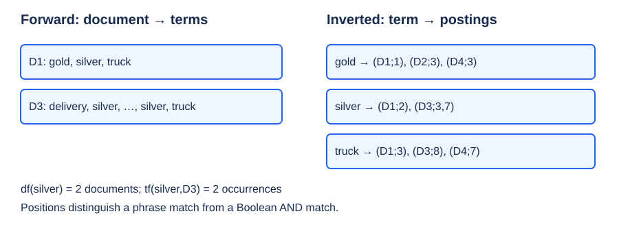
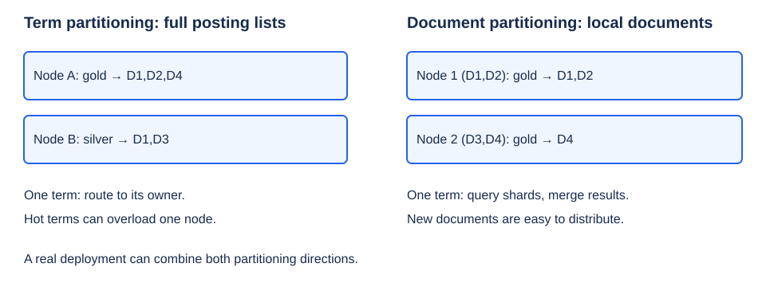
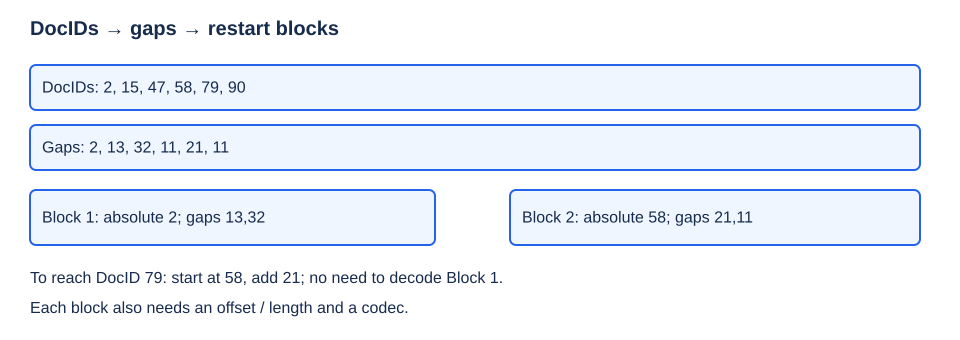
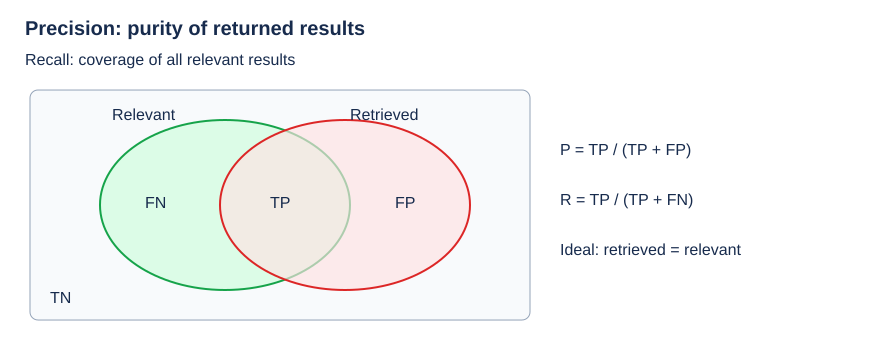

# Lecture 3: Inverted File Index（倒排索引）

**主线：term → documents（词项定位文档）→ scalable indexing（可扩展建索引）→ relevance evaluation（相关性评价）。** Search trees/hash tables locate dictionary entries; posting lists identify matching documents.

[Course overview（课程信息）](index.md) · [HW3: Document Distance（文档距离）](hw3-document-distance.md)

## 1. Structure and Boolean retrieval（结构与布尔检索）

### 1.1 From scanning to an inverted index（从扫描到倒排）

A search engine has three broad stages: **crawl（爬取）→ index（整理并建索引）→ query service（检索服务）**. A **spider / crawler（爬虫）** collects pages; indexing prepares them for repeated queries.

| Approach | Representation | Cost / limitation |
| --- | --- | --- |
| Scan every page（逐页扫描） | Search raw text for each query. | Query work scales with the whole collection's text size. |
| Term-document incidence matrix（词项—文档关联矩阵） | $A[t,d]=1$ iff document $d$ contains term $t$. | Boolean operations are easy, but a dense $V\times N$ matrix wastes space on zeros. |
| Inverted file index（倒排文件索引） | Dictionary entry → list of documents containing the term. | Store nonzero associations; process relevant postings rather than every page. |

$V$ = vocabulary size（词汇表规模）, $N$ = document count（文档数）. Incidence rows can be bitsets（位集）; sparsity motivates postings, but a frequent term can also suit a bitmap representation.

**Index（索引）：** a mechanism for locating a term in text. **Forward index（正排索引）：** document → terms. **Inverted index（倒排索引）：** term → documents/occurrences. **Posting list（倒排列表／出现记录表）：** the records associated with one term; pointers can be document IDs, offsets or positions, not necessarily memory addresses or linked-list nodes.

**WK3 T/F4:** “Inverted file contains a list of pointers to all occurrences of a term in the text.” **True**, by the definition; a document-only index stores document references, and a positional index adds exact occurrence locations.

### 1.2 Course example, positions and frequencies（课件例子、位置与频率）

| Document | Original text |
| --- | --- |
| D1 | Gold silver truck |
| D2 | Shipment of gold damaged in a fire |
| D3 | Delivery of silver arrived in a silver truck |
| D4 | Shipment of gold arrived in a truck |

For this example only: case folding（大小写归一化）, **no stemming or stop filtering**; positions start at 1 in the original token sequence.

| Term（词项） | Incidence D1–D4 | $df$ | Positional postings: `docID: positions` |
| --- | --- | --- | --- |
| a | 0111 | 3 | `2:6; 3:6; 4:6` |
| arrived | 0011 | 2 | `3:4; 4:4` |
| damaged | 0100 | 1 | `2:4` |
| delivery | 0010 | 1 | `3:1` |
| fire | 0100 | 1 | `2:7` |
| gold | 1101 | 3 | `1:1; 2:3; 4:3` |
| of | 0111 | 3 | `2:2; 3:2; 4:2` |
| in | 0111 | 3 | `2:5; 3:5; 4:5` |
| shipment | 0101 | 2 | `2:1; 4:1` |
| silver | 1010 | 2 | `1:2; 3:3,7` |
| truck | 1011 | 3 | `1:3; 3:8; 4:7` |



- **Document frequency, $df(t)$（文档频率）：** number of documents containing $t$; posting-list length when one record is stored per document.
- **Term frequency, $tf(t,d)$（词频）：** occurrence count of $t$ **within document $d$**. For silver, $df=2$, but $tf(\text{silver},D3)=2$ and total occurrences = 3.
- The slide's “Times” uses **$df$**, not total occurrence count. **“低频更重要”和“先处理短列表”中的频率主要指 $df$。**

**Discussion: how to print matching sentences and highlight words?** Keep positions（词位置）and access to original text; character offsets/sentence boundaries（字符偏移／句界）help reconstruct snippets（摘要片段）and highlights（高亮）. A list of document IDs alone cannot locate the matched sentence. Preserve original positions when filtering tokens if phrase/proximity queries（短语／邻近查询）are required.

### 1.3 Query operations and processing order（查询运算与处理顺序）

- **AND（与）：** intersect document sets. `silver AND truck`: `1010 & 1011 = 1010` → **D1, D3**.
- **OR（或）：** union document sets; **NOT（非）** / exclusion: difference against a specified collection or candidate set.
- **Phrase query（短语查询）:** after finding common documents, require compatible positions. “silver truck” needs a truck at position $p+1$ after silver; D3 matches at positions **7,8**, not 3,8. Boolean AND alone does not enforce adjacency.
- Sorted lists of lengths $a,b$ can be intersected by two pointers in **$O(a+b)$** time: advance the smaller docID, emit equal IDs, stop when either list ends. Skip pointers（跳跃指针）can bypass ranges that cannot match. [Intersection reference](https://nlp.stanford.edu/IR-book/html/htmledition/faster-postings-list-intersection-via-skip-pointers-1.html).

**Discussion: why keep frequency?** For a conjunctive query, start with the smallest $df$ to reduce intermediate candidates（中间候选集）. `truck AND silver AND delivery`: lengths **3,2,1**; start with delivery's **[D3]**, then check the other two → **D3**. Frequency also informs ranking; list length and within-document frequency serve different roles.

## 2. Index construction and modules（构建与模块）

### 2.1 Generator pipeline（索引生成流程）

```text
For each document D:
    parse tokens; normalize them into terms
    apply the selected stop filter
    for each retained term T and original position p:
        find T in the dictionary; insert it if absent
        get T's posting list
        create/update D's posting: frequency + positions
write the inverted index to disk
```

Repeated occurrences in a document update that document's posting; do not accidentally increase $df$ on every occurrence. Building an index and scoring a query are different stages.

| Module | Responsibility（职责） |
| --- | --- |
| Token analyzer（分词／词元分析器） + stop filter（停用词过滤器） | Parse text, normalize forms, decide retained terms. |
| Vocabulary scanner（词汇表查找器） | Find the dictionary entry for a term. |
| Vocabulary inserter（词汇表插入器） | Create an entry/posting list for a new term. |
| Memory management（内存管理） | Buffer index data, flush to disk, merge partial indexes. |

**Quiz 3.1 / WK3 MC2: which is NOT an index-building step?**

- **A.** Read strings and parse words.
- **B.** Use stemming and stop filtering to obtain terms.
- **C.** Check the dictionary and insert missing terms.
- **D.** Get each term's posting list and calculate precision.

**Answer: D.** Getting/updating postings is part of construction; **precision requires query results and relevance judgments（相关性标注）**, not just the index.

### 2.2 Tokenization, stemming and stop words（分词、词干提取与停用词）

**Tokenization（分词）：** identify token boundaries. English whitespace/punctuation are useful cues; Chinese needs segmentation（词语切分）because boundaries are not explicit. The offline name-search example illustrates that matching the characters “陈越” inside an unrelated phrase is not equivalent to identifying a person's name.

**Stemming（词干提取）：** map morphological variants（词形变体）to a common stem. `process / processing / processes / processed → process` is the course example. Apply **the same normalization to indexed documents and queries（索引端与查询端规则一致）**.

**词干不一定是字典中的完整词。** The slide's `say / says / said / saying → say` expresses the desired grouping; regular suffix stripping alone need not recognize **said**. Lemmatization（词形还原）uses vocabulary/morphology; Porter stemming is a suffix-based heuristic, not a general irregular-verb dictionary. [Stemming versus lemmatization](https://nlp.stanford.edu/IR-book/html/htmledition/stemming-and-lemmatization-1.html).

**Stop words（停用词）：** very common words, e.g. `a, the, it`, often have little discriminative value（区分能力）and huge postings. Filtering saves space/work; it is a configurable policy, not a claim that those words never matter. In the offline example, a dictionary article specifically explaining “a” should remain retrievable. Context, phrase support and the application determine retention; “remove” here means exclude from indexing, not destroy source documents.

**Quiz 3.2 Q3 / WK3 T/F1:** “Word stemming eliminates commonly used words.” **False**: that describes stop filtering. **HW3 explicitly retains stop words**; do not reuse the lecture's optional filter blindly.

### 2.3 Dictionary access（词典访问）

| Method | Strength | Limitation / qualification |
| --- | --- | --- |
| B/B+ trees（多路搜索树） | Ordered traversal and efficient term ranges; page-oriented layout. | Exact lookup traverses the tree; constants depend on layout. |
| Tries（字典树／前缀树） | Branch on characters; natural prefix access. | Memory/layout and alphabet size matter. |
| Hashing（哈希） | Expected fast exact-word access with suitable hashing/load control. | No lexical order; range scan generally needs examining many entries or an extra ordered index. |

For a large disk-resident dictionary, the course favors page-oriented B/B+ trees over binary AVL/RBT layouts. Its “RBT is 10–20% faster than AVL with many updates” is a workload-dependent observation, not an asymptotic guarantee; layout, caching and scale determine practical speed.

**MOOC 3.2.2 discussion:** hashing versus search trees? **Faster for a single word in the course's expected-cost model, but expensive for range search.** Hash lookup still processes the key and can suffer collisions; “faster” is not a worst-case or universal timing guarantee.

| Source | Statement | Answer |
| --- | --- | --- |
| Quiz 3.2 Q1 / WK3 T/F2 | B+ dictionary range searches are expensive. | **False**: ordered keys/leaf links support efficient range access. |
| Quiz 3.2 Q2 | Hashing is faster than search trees for term access. | **True in the course's ideal/expected exact-lookup model**, with the qualifications above. |
| HW3 T/F4 | Hash-based dictionary range searches are expensive. | **True** without an additional ordered structure. |

Misspelling suggestions（拼写纠错）need candidate generation and similarity checking. Ordered/prefix structures help generate candidates; **字典序相邻不等于编辑距离最小**. Hashing can also be combined with separate correction indexes. The offline narrow-domain example motivates tuning hashing for a small vocabulary, not assuming every dictionary must use a B+ tree.

### 2.4 Memory-limited construction（内存受限构建）

Build an in-memory **block index（分块索引）**; when capacity is near its limit, sort/write it to disk, free buffers, and continue. **Flush the final nonempty block（别漏最后未满的一块）**. Merge sorted blocks by term and docID; combine duplicate document postings, frequencies and positions as appropriate.

```text
blocks = []
for each parsed occurrence:
    if the next update would exceed memory: flush current block
    update the in-memory dictionary/postings
flush the remaining block
merge all sorted blocks into the final index
```

Sorted order permits sequential merging; blocking bounds working memory instead of requiring the whole index in RAM. Terms appearing across blocks must map to the same final term; do not treat unrelated block-local IDs as globally unique.

## 3. Scaling, updates and compression（扩展、更新与压缩）

### 3.1 Distributed indexing（分布式索引）

A cluster node（集群节点）stores an index of part of the collection. Two partition directions:

| Strategy | Local contents | Query / scaling tradeoff |
| --- | --- | --- |
| Term-partitioned（按词项划分） | A subset of dictionary terms, each with its **complete** postings. | Route a single term to its owner; multi-term queries may span nodes. Hot terms/list sizes cause skew（负载倾斜）and difficult rebalancing. |
| Document-partitioned（按文档划分） | A subset of documents and postings restricted to those docIDs. The lecture models a full term dictionary at every node. | Broadcast to document shards（文档分片）, then merge/rank results; add shards for new documents. |



Real systems may combine both. A shard can omit absent terms physically while retaining the logical vocabulary; a “node” here means a machine/service, not a tree node.

**Quiz 3.3 Q1 / WK3 T/F13:** each document-partitioned node contains a subset of documents within a specified index range. **True**: “index” means **document ID range（文档编号区间）** here.

**HW3 T/F1:** document partitioning stores all documents containing terms in a certain **term range** at each node. **False**: this describes term partitioning's allocation by vocabulary, not by docID.

### 3.2 Dynamic indexing（动态索引）

New documents require updates to existing postings and insertion of new terms; documents can also change or be deleted. Rewriting large sorted postings on every arrival is expensive.

Maintain a large **main index（主索引）** and small **auxiliary index（辅助／增量索引）**. Write incoming changes to the auxiliary index; queries consult both, merge results and filter deleted documents. Periodically merge the auxiliary into the main index in the background and publish a consistent new version.

**Offline discussion:** when to re-index and how to delete? Balance auxiliary size/query overhead against merge cost and freshness（新鲜度）. A deletion bitmap/tombstone（删除位图／墓碑标记）can hide obsolete docIDs immediately; later merging physically removes their postings. These are implementation options beyond the slide's open questions.

**辅助索引不是查询缓存。** It contains new index data; a cache stores prior results or frequently used data. Searching only the recent auxiliary can be a deliberate approximation, but complete retrieval must also cover the main index. Distributed arrival order and updates to existing IDs can require insertion in the middle of a posting list even when newly assigned IDs are monotone.

### 3.3 Dictionary and posting compression（词典与倒排列表压缩）

**Dictionary:** fixed-width string slots waste space when term lengths differ. Pack term bytes into one concatenated string and store **start offsets plus lengths/boundaries（起始偏移与长度／边界）**. Filtering optional stop terms reduces entries but is separate from lossless encoding（无损编码）.

**Gap / delta encoding（差分编码）：** for sorted docIDs $d_1<\cdots<d_p$, store

$$
g_1=d_1,\qquad g_i=d_i-d_{i-1}\ (i>1),\qquad d_i=\sum_{j=1}^{i}g_j.
$$

Example: `2,15,47,…,58879,58890,… → 2,13,32,…,11,…`. Small gaps need fewer bits **when combined with variable-length coding（变长编码）**, such as variable-byte or gamma codes; storing every gap in the same fixed-width integer does not by itself save bytes. Rare-term gaps can still be large; “fewer than 20 bits” is an example observation, not a universal bound. Absolute restart IDs must remain representable. [Postings compression](https://nlp.stanford.edu/IR-book/html/htmledition/postings-file-compression-1.html).



### 3.4 Offline discussion: compression tradeoffs（压缩的代价与方案）

**Question:** what serious problems does gap encoding introduce, and how can we mitigate them?

| Problem | Idea / limitation |
| --- | --- |
| Random access（随机访问）needs prefix decoding/accumulation | Store absolute **restart points（重启点）** every block; an offset directory locates the compressed block. With $B$ entries/block, decode at most $O(B)$ entries after choosing the block. |
| A wrong gap shifts later decoded IDs; corrupted variable-length boundaries can desynchronize decoding | Independent blocks/checksums limit error spread. |
| Mid-list insertion/deletion plus packed variable-length storage causes movement | Buffer updates in the auxiliary index; rebuild compressed blocks during merging. |
| Dense skip metadata can erase space savings | Tune block/skip density to query and update patterns. |

**关键区分：数学差值更新 ≠ 整段编码移动。** Insert $x$ between $a<b$: replace gap $b-a$ by **$x-a$ and $b-x$**; all later adjacent-ID gaps are unchanged if IDs are stable. Deleting $x$ merges these two gaps. Packed bytes may shift; fixed “every fourth entry” skip/restart positions may need rebuilding. The instructor clarified this distinction in the post-class discussion. Renumbering IDs is a separate source of widespread changes.

Other class proposals:

- **Block-base offsets（块基值偏移）：** store one absolute base and each entry's offset from it. Direct decoding within a located fixed-width block is easy, but offsets may exceed adjacent gaps; layout/codec determine access cost.
- **Multilevel skips / skip lists（多级跳跃／跳表）：** express lanes reduce traversal. Storing $\log p$ jump fields at **every** posting costs $O(p\log p)$ fields, plus their bit widths; it is not $O(\log p)$ total space. Sparse/randomized levels reduce overhead. Exact fixed-position skips and probabilistic skip lists have different update behavior; expected bounds are not per-operation worst-case guarantees.
- **Hot-term policy（热词策略）：** use smaller blocks, more restart points, or uncompressed/bitmap representations for frequently accessed/updated terms; tune total byte cost as well as operation count.
- **“取对数存大 ID”** cannot be lossless just by storing a rounded exponent: many IDs share that exponent. Preserve all identifying bits or a reversible encoding; compression must reconstruct exact docIDs.

**列表顺序不可混用：**gap compression and merge intersection assume **docID order**; the dictionary is in **term order**; displayed hits are in **score/rank order**. Ranking postings by score may make docID differences negative and invalidate this positive-gap codec. Keep ranked access as a separate representation/processing step when needed.

### 3.5 Thresholding（阈值截断）

| Type | Course strategy | Consequence |
| --- | --- | --- |
| Document thresholding（文档截断） | Rank documents by weight; retain only top $k$. | Can lose relevant results. Truncating individual term lists **before** AND does not preserve exact Boolean results. |
| Query thresholding（查询截断） | Sort query terms by increasing $df$; use only an initial fraction. | Saves work by retaining discriminative terms, but changes the original query. |

Example: ten query terms → try **20%, 40%, 80%**; compare answer sets. Offline incremental example: 10,000 candidates → 5,000 after another term → little change after the next; stop when change is small enough. **结果稳定只是启发式停止条件，不保证完整查询的答案或相关性。** For AND, dropping terms broadens the candidate set; do not confuse this with merely reordering all terms, which preserves the exact answer.

**MOOC 3.3.4 Q1:** given high- and low-frequency words, which is generally more important? Choices **A high / B low / C unrelated / D unknown**. **Answer: B** under the course's discriminativeness heuristic: low **document** frequency distinguishes fewer documents. **WK3 T/F9:** very long posting lists are generally less important than short ones — **True** in this sense; rarity alone does not prove semantic relevance.

**Quiz 3.3 Q2 / WK3 T/F3:** “Thresholding for query retrieves top $k$ documents by weight.” **False**: that is **document** thresholding; query thresholding selects **terms**. 中文是“阈值”，不是“阀值”。

## 4. Evaluation（评价）

### 4.1 System performance versus relevance（系统性能与相关性）

| Measure | Meaning |
| --- | --- |
| Indexing throughput（建索引吞吐量） | Documents/hour. |
| Query latency（查询延迟） | Response time **as a function of index size**, with comparable query/workload conditions. |
| Query-language expressiveness（查询语言表达能力） | Complex needs, e.g. `apple NOT company`, phrases, combinations; also speed on complex queries. |
| User happiness（用户满意度） | In this lecture, efficient correct retrieval plus relevant results. |

**Data retrieval（数据检索）:** establish correctness of exact matching, then measure response time/index space. **Information retrieval, IR（信息检索）:** also evaluate relevance（相关性）to the information need. `red` and `apple` occurring together can mean a red balloon outside Apple Inc., not a red fruit.

**HW3 T/F2:** measuring answer-set relevance is important for **data retrieval** performance — **False in the course's terminology**; that extra criterion distinguishes IR. Do not read this as “relevance is unimportant to search engines.”

**HW3 MC2: which is NOT among the stated search-engine measures?** **A** indexing speed; **B** search speed; **C** interface friendliness; **D** answer relevance. **Answer: C** for this lecture's list. Interface usability can matter in broader product evaluation; the question's scope is the stated technical measures.

### 4.2 Precision and recall（查准率与查全率）

Evaluation needs **a benchmark collection（基准文档集）**, **a query suite（查询集）**, and **binary relevance judgments（相关／不相关标注）for each query–document pair**.

| | Relevant（相关） | Irrelevant（不相关） |
| --- | --- | --- |
| Retrieved（检出） | $TP=RR$ | $FP=IR$ |
| Not retrieved（未检出） | $FN=RN$ | $TN=IN$ |

$$
P=\frac{TP}{TP+FP}\quad\text{(precision, 查准率／精确率)},\qquad
R=\frac{TP}{TP+FN}\quad\text{(recall, 查全率／召回率)}.
$$



**P 问“返回的有多准”，R 问“该找的找全了吗”。** Precision is not accuracy（准确率，分类中通常指 $(TP+TN)/\text{total}$）. Empty denominators need an explicit evaluation convention; do not silently divide by zero.

| Behavior | Precision | Recall |
| --- | --- | --- |
| Return one relevant document while many relevant ones exist | 100% | Low |
| Return the entire collection | Relevant fraction of collection | 100% if relevant documents exist |
| Return exactly the relevant set | 100% | 100% |

The slide's precision–recall curve illustrates a tradeoff, not an identity forcing one metric to decrease whenever the other increases.

**WK3 T/F5:** “Precision measures the quality of all retrieved documents.” **True**: it measures the relevant fraction of that returned set.

**Quiz 3.4 Q2 / WK3 T/F12:** high precision, low recall means most relevant documents are returned but many irrelevant ones are included. **False**: that describes **high recall, low precision**.

**HW3 MC1: high precision and low recall mean which?**

- **A.** Most relevant documents retrieved, but too many irrelevant ones returned.
- **B.** Most retrieved documents relevant, but many relevant documents missed.
- **C.** Most relevant documents retrieved, but benchmark too small.
- **D.** Most retrieved documents relevant, but benchmark too small.

**Answer: B.** These metrics do not establish benchmark adequacy.

### 4.3 Priorities and improving relevance（指标取舍与相关性改进）

**Offline discussion:** when is precision or recall more important? Define the **positive class（正类）** and compare the costs of **false positives（误报）** and **false negatives（漏报）**.

- Prioritize **precision** when unwanted returned/flagged items are costly: avoid blocking legitimate mail; show a small, useful set of recommendations rather than many irrelevant ones.
- Prioritize **recall** when omissions are costly: evidence gathering, exhaustive code/paper search, initial screening of suspicious items. **HW3 T/F3:** precision is more important than recall for airport explosive detection — **False in the question's scenario**; detecting dangerous positives is the priority.
- A two-stage pipeline（两阶段流程）can seek broad recall first, then verify/rank candidates to improve precision. The class's monitoring example distinguishes automatic suspicion alerts from a human's final judgment. The class also contrasts broad initial screening with later confirmation: priority depends on the stage and error costs.

**Shopping/paper-search debate:** information density or corpus size alone does not choose the metric. A comprehensive literature search may emphasize recall; top recommendations may emphasize precision. Personalization（个性化／用户画像）can improve relevance for a particular user, with evaluation tied to that need.

**MOOC 3.4.2 discussion: how to improve relevance?** The course names **PageRank（网页链接重要性排序）** and **Semantic Web（语义网）**. Add context/meaning and user preferences to distinguish senses such as fruit/company. PageRank is an importance signal, not proof of query relevance; keyword overlap alone does not capture meaning. Evaluate improvements against the same relevance benchmark.

## 5. Integrated exercises（综合题）

### 5.1 Spam detection（垃圾邮件检测）· Quiz 3.4 Q1

**Dataset:** 7,981 legitimate and 2,019 spam emails. A flags 200 legitimate + 1,800 spam; B flags 160 legitimate + 1,500 spam. If keeping important legitimate mail safe is the priority, which choice is correct?

**A** precision, A better; **B** recall, B better; **C** precision, B better; **D** recall, A better.

Positive = **spam**, retrieved = **flagged as spam**:

| System | $TP$ | $FP$ | $FN$ | Precision | Recall |
| --- | --- | --- | --- | --- | --- |
| A | 1800 | 200 | 219 | $1800/2000=90\%$ | $1800/2019\approx89.15\%$ |
| B | 1500 | 160 | 519 | $1500/1660\approx90.36\%$ | $1500/2019\approx74.29\%$ |

**Answer: C.** B has higher spam precision and also flags fewer legitimate emails in this dataset. A catches more spam. 若把普通邮件改成正类，指标名称与分母也必须重新解释，不能只凭“保护邮件”猜 recall。

### 5.2 Recall calculation（查全率计算）· HW3 MC3

There are 28,000 documents:

| | Relevant | Irrelevant |
| --- | --- | --- |
| Retrieved | 4000 | 12000 |
| Not retrieved | 8000 | 4000 |

Recall choices: **A 14% / B 25% / C 33% / D 50%**.

**Answer: C**, $R=4000/(4000+8000)=1/3\approx33\%$. Precision is $4000/(4000+12000)=25\%$; $4000/28000\approx14\%$ is neither metric.

### 5.3 Concept grouping（概念辨析）· WK3 MC4

**Which group is not entirely related to the search-engine topics taught here?**

- **A.** Inverted file index, stop words, precision.
- **B.** Word stemming, hashing, compression.
- **C.** Distributed index, backtracking, query.
- **D.** Posting list, thresholding, recall.

**Answer: C.** Backtracking（回溯搜索）is not one of this lesson's indexing/query modules; all other listed concepts are. This does not claim no search-related implementation could ever use backtracking.

## 6. Review and references（复习与来源）

**复习抓手：**正排／倒排方向；$df$ 与 $tf$；位置与短语匹配；短列表优先；stemming 与 stop filtering；分块后最终 flush；词项／文档分片；主索引＋增量索引；差值局部更新与编码移动；docID／词项／排序分数三种顺序；文档／查询截断；P/R 分母、正类和误报／漏报成本。

**Historical context（线下背景）：** the lecture traces early FTP-directory discovery (Archie), Web crawling (Wanderer), manually curated portals (Yahoo/Sohu), Tianwang, and automated engines (Google/Baidu). The technical progression is **collect → organize → serve**, from manual organization to scalable automatic indexing/ranking. Inverted indexing predates Web search, including patent keyword retrieval. Slide traffic rankings, index-size estimates and company anecdotes are historical examples, not current measurements or algorithm guarantees.

Sources: all supplied `~/ADS-docs/3` MOOC merged/lesson exports and manifest (units **1320673534–1320673550**), **111** video captures, the **21-page** courseware PDF, offline `course_87216_sub_1972040/course_content.md` and **24** captures, plus WK3/HW3 archives. This page covers all **11** MOOC questions and all **10** current-topic WK3 questions; duplicated questions share an explanation. HW3's **seven** nonprogramming questions appear here; its programming task has a [separate complete problem and solution](hw3-document-distance.md).

- [ZJU MOOC](https://www.icourse163.org/course/ZJU1-1460402161), supplied term 1488053496.
- [Manning, Raghavan & Schütze, *Introduction to Information Retrieval*](https://nlp.stanford.edu/IR-book/html/htmledition/irbook.html): Boolean/positional indexes, construction, compression and evaluation; supplementary clarification, not an assigned page range.
- The supplied slides name `InvertedFileIndex.zip`: *The Google File System*, *Building an Inverted Index*, *Inverted Index Construction (ppt)*, *Compression*. **That archive and its individual files are not present in the supplied directory**; the notes cover the provided sources and do not imply those additional readings were inspected.

Four editable SVG figures are original diagrams. Status remains `draft` pending instructor/textbook review.
